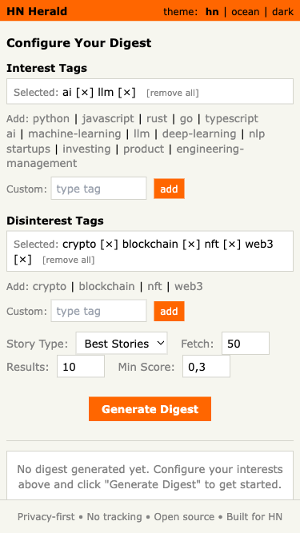
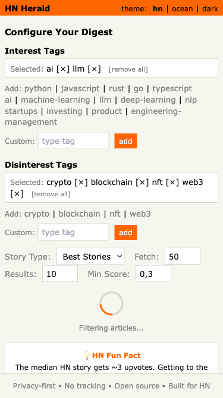
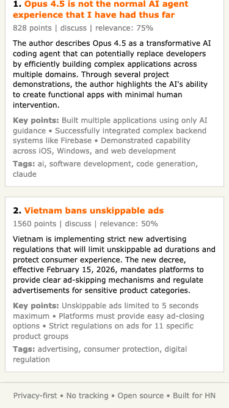
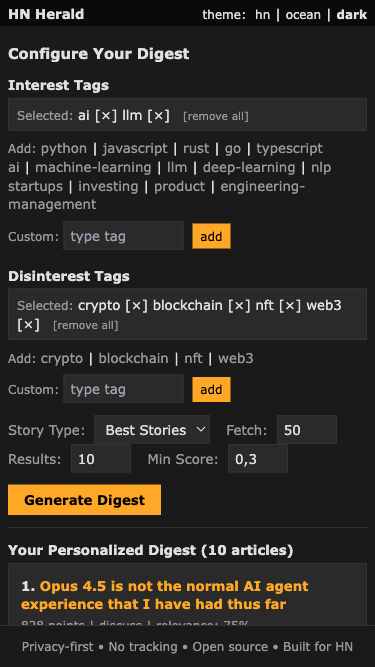
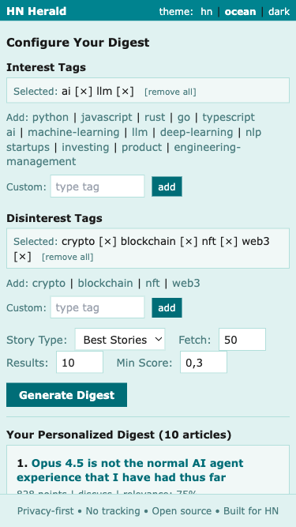

# HN Herald

**Your personalized, privacy-first HackerNews digest with AI-powered summaries.**

Stop drowning in links. Get the stories that matter to you, summarized and scored for relevance.



## Screenshots

<details>
<summary>Click to see more screenshots</summary>

### Loading State with Real-time Progress


### Mobile View


### Dark Theme (Mobile)


### Ocean Theme


</details>

## Why HN Herald?

HackerNews is a firehose of great content, but finding what matters to *you* takes time. HN Herald solves this by:

- **Understanding your interests** through simple tag selection (no account required)
- **Summarizing articles** with AI-generated key points and insights
- **Scoring relevance** based on your profile + community engagement
- **Respecting your privacy** with zero tracking and local-only storage

## Key Features

### Tag-Based Personalization
Select from predefined interest tags or create custom ones:
- **Tech Domains**: AI/ML, Web Development, DevOps, Security, Mobile
- **Topics**: Startups, Career, Open Source, Hardware, Science
- **Languages**: Python, JavaScript, Rust, Go, and more

Your preferences stay in your browser - we never see them.

### AI-Powered Summaries
Each article gets:
- A concise 2-3 sentence summary
- 3-5 key points extracted from the content
- Relevance explanation tailored to your interests

Powered by Claude 3.5 Haiku with efficient batch processing (5 articles per LLM call).

### Smart Ranking
Stories are ranked using a hybrid score:
- **70%** relevance to your selected tags
- **30%** HackerNews community signals (points, comments)

### Mobile-First Design
Built for on-the-go reading with:
- Fast, responsive interface
- Touch-friendly interactions
- Three beautiful themes (HN Orange, Ocean, Dark)
- Real-time loading indicators with pipeline stage updates
- HN fun facts while you wait
- Cancel button to abort long-running requests

## Quick Start

```bash
# Clone and install
git clone https://github.com/darth-dodo/ai-adventures.git
cd ai-adventures/hn-herald
make install

# Set your Anthropic API key
cp .env.example .env
# Edit .env and add your ANTHROPIC_API_KEY

# Run the development server
make dev
```

Open [http://localhost:8000](http://localhost:8000) and start reading.

## How It Works

```
HackerNews API --> LangGraph Pipeline --> Your Browser
                         |
                         v
    ┌─────────────────────────────────────────┐
    │  1. Fetch Stories (HN API)              │
    │  2. Extract Articles (Parallel)         │
    │  3. Filter Content                      │
    │  4. Summarize (Claude AI Batch)         │
    │  5. Score Relevance                     │
    │  6. Rank & Format Digest                │
    └─────────────────────────────────────────┘
```

**LangGraph Orchestration Pipeline**:
1. **Fetch**: Pulls top/new/best stories from HN API based on your profile
2. **Extract**: Parallel article extraction with partial failure tolerance
3. **Filter**: Removes articles without extractable content
4. **Summarize**: Claude 3.5 Haiku generates summaries in chunked batches (5 articles/batch)
5. **Score**: Hybrid scoring (70% relevance + 30% popularity)
6. **Rank**: Sorts by final score and limits to max_articles
7. **Format**: Assembles digest with stats and metadata

**Real-time Progress**: Server-Sent Events (SSE) stream pipeline stages to the UI with animated loading indicators and HN fun facts. Users can cancel in-progress requests using the Cancel button, which gracefully aborts the stream via AbortController.

**Digest Statistics**: Each digest includes metrics showing total time, articles processed, filter pass rates, and summarization success rates.

## Privacy First

- **No accounts**: Use immediately, no sign-up required
- **No tracking**: Zero analytics, no behavior logging
- **Local storage**: Your preferences never leave your browser
- **Ephemeral processing**: Article content processed in real-time, not stored
- **Global rate limiting**: API protection without per-IP tracking (30 requests per 60 seconds)
- **Cancellable requests**: Abort long-running digests anytime with the Cancel button

## Technology

Built with modern, production-ready tools:

| Component | Technology |
|-----------|------------|
| Backend | FastAPI (Python) |
| AI Pipeline | LangGraph + Claude 3.5 Haiku |
| Streaming | Server-Sent Events (SSE) |
| Frontend | Vanilla JS + Jinja2 + Tailwind |
| Package Manager | uv |

## Development

```bash
make install     # Install dependencies
make dev         # Start dev server with hot reload
make test        # Run test suite (469 tests)
make lint        # Run linting
make typecheck   # Run type checking
```

### Project Status

| Component | Status | Tests | Description |
|-----------|--------|-------|-------------|
| HN API Client | ✅ Complete | 48 | Async client with retry logic |
| Article Extraction | ✅ Complete | 66 | ArticleLoader with blocked domains, content extraction |
| LLM Summarization | ✅ Complete | 42 | LangChain-Anthropic with batch support |
| Relevance Scoring | ✅ Complete | 186 | Tag-based personalization engine |
| LangGraph Pipeline | ✅ Complete | 78 | StateGraph orchestration with 7 nodes |
| Digest Models | ✅ Complete | 4 | Pydantic models for digest output |
| API Endpoints | ✅ Complete | 15 | FastAPI REST API with `/api/v1/digest` |
| Web UI | ✅ Complete | 8 | Vanilla JS + Tailwind interface with themes |
| Rate Limiting | ✅ Complete | 30 | Privacy-first global rate limiting (30 req/min) |

**Total Test Coverage**: 469 tests

### Documentation

| Document | Description |
|----------|-------------|
| [Architecture](docs/architecture.md) | Technical architecture and system design |
| [ADRs](docs/adr/README.md) | Architecture Decision Records |
| [Design Specs](docs/design/) | Implementation specifications |
| [Product](docs/product.md) | Product requirements |

### Key Architecture Decisions

| Decision | Rationale |
|----------|-----------|
| [LangGraph Pipeline](docs/adr/001-langgraph-pipeline-architecture.md) | Parallel execution, error handling, LangSmith observability |
| [SSE Streaming](docs/adr/002-sse-streaming-over-htmx.md) | Real-time progress for 15-30s pipeline |
| [Privacy-First](docs/adr/003-privacy-first-architecture.md) | localStorage only, no server-side user data |
| [Tag-Based Scoring](docs/adr/004-tag-based-relevance-scoring.md) | Simple, fast, explainable personalization |
| [Haiku for Summaries](docs/adr/005-claude-haiku-for-summarization.md) | 10x cost savings with batch processing |

## Contributing

Contributions welcome! Please read the architecture docs first and ensure tests pass before submitting PRs.

## License

MIT
