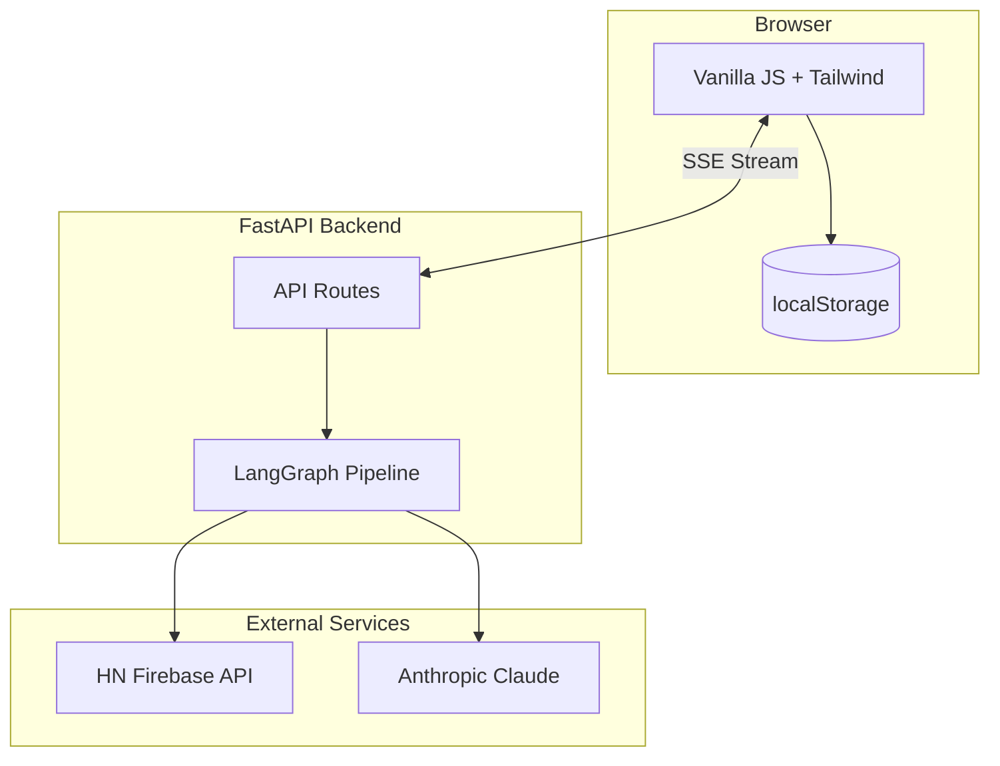
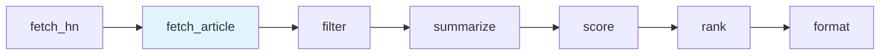

<div align="center">

# HN Herald

**AI-Powered, Privacy-First HackerNews Digest**

[](https://www.python.org/downloads/)
[](https://fastapi.tiangolo.com/)
[](https://github.com/langchain-ai/langgraph)
[](https://opensource.org/licenses/MIT)

*Stop drowning in links. Get the stories that matter to you, summarized and scored for relevance.*

[Features](#features) • [Demo](#demo) • [Quick Start](#quick-start) • [Architecture](#architecture) • [Documentation](#documentation)

</div>

---


## Features

### Personalized Content Discovery
- **Tag-Based Interests** — Select from curated categories (AI/ML, Web Dev, Security, etc.) or create custom tags
- **Smart Scoring** — Hybrid algorithm: 70% relevance to your interests + 30% HN community signals
- **Disinterest Filtering** — Actively exclude topics you don't want to see

### AI-Powered Summaries
- **Concise Summaries** — 2-3 sentence overview of each article
- **Key Points** — 3-5 actionable takeaways extracted from content
- **Auto-Tagging** — Technology tags identified from article content
- **Batch Processing** — Efficient LLM calls (5 articles per request) for cost optimization

### Privacy-First Design
- **Zero Tracking** — No analytics, no cookies, no behavior logging
- **Local Storage Only** — Your preferences never leave your browser
- **No Account Required** — Start using immediately
- **Ephemeral Processing** — Content processed in real-time, never stored

### Real-Time Experience
- **SSE Streaming** — Live pipeline progress updates as your digest generates
- **Cancellable Requests** — Abort long-running operations anytime
- **Fun Facts** — HN trivia while you wait
- **Three Themes** — HN Orange, Ocean Blue, Dark Mode

## Demo

<details>
<summary><b>Screenshots</b></summary>

### Real-Time Loading Progress


### Mobile Experience


### Dark Theme


### Ocean Theme


</details>

## Quick Start

### Prerequisites
- Python 3.12+
- [uv](https://github.com/astral-sh/uv) package manager
- Anthropic API key

### Installation

```bash
# Clone the repository
git clone https://github.com/darth-dodo/hn-herald.git
cd hn-herald

# Install dependencies
make install

# Configure environment
cp .env.example .env
# Add your ANTHROPIC_API_KEY to .env

# Start the server
make dev
```

Open [http://localhost:8000](http://localhost:8000) and generate your first digest.

## Architecture

### System Overview



### LangGraph Pipeline

The digest generation uses a 7-stage [LangGraph](https://github.com/langchain-ai/langgraph) pipeline with parallel execution:



| Stage | Node | Description |
|-------|------|-------------|
| 1 | `fetch_hn` | Fetch stories from HN API (top/new/best/ask/show) |
| 2 | `fetch_article` | **Parallel** content extraction via Send pattern |
| 3 | `filter` | Remove articles without extractable content |
| 4 | `summarize` | Claude 3.5 Haiku batch summarization |
| 5 | `score` | Hybrid relevance + popularity scoring |
| 6 | `rank` | Sort by final score, apply limits |
| 7 | `format` | Assemble digest with statistics |

### Tech Stack

| Layer | Technology | Purpose |
|-------|------------|---------|
| **Backend** | FastAPI | Async REST API with SSE streaming |
| **AI Orchestration** | LangGraph | Pipeline management with parallel execution |
| **LLM** | Claude 3.5 Haiku | Cost-efficient summarization |
| **Frontend** | Vanilla JS + Jinja2 | Lightweight, no build step |
| **Styling** | Tailwind CSS | Utility-first responsive design |
| **Observability** | LangSmith | Pipeline tracing and debugging |

## Documentation

| Document | Description |
|----------|-------------|
| [Architecture](docs/architecture.md) | System design, data models, API contracts |
| [Product Requirements](docs/product.md) | Features, user stories, roadmap |
| [Design Specs](docs/design/) | Implementation details for each component |
| [ADRs](docs/adr/) | Architecture Decision Records |

### Architecture Decision Records

| ADR | Decision | Rationale |
|-----|----------|-----------|
| [001](docs/adr/001-langgraph-pipeline-architecture.md) | LangGraph for orchestration | Parallel execution, error handling, observability |
| [002](docs/adr/002-sse-streaming-over-htmx.md) | SSE over HTMX | Real-time progress for 30-60s operations |
| [003](docs/adr/003-privacy-first-architecture.md) | Privacy-first architecture | localStorage only, no server-side user data |
| [004](docs/adr/004-tag-based-relevance-scoring.md) | Tag-based scoring | Simple, fast, explainable personalization |
| [005](docs/adr/005-claude-haiku-for-summarization.md) | Claude Haiku | 10x cost savings with batch processing |

## Development

```bash
make install     # Install dependencies with uv
make dev         # Start dev server (hot reload)
make test        # Run test suite (469 tests)
make test-cov    # Run with coverage report
make lint        # Code style (ruff)
make typecheck   # Type checking (mypy)
make check       # All quality gates
```

### Project Structure

```
hn-herald/
├── src/hn_herald/
│   ├── api/              # FastAPI routes, rate limiting
│   ├── graph/            # LangGraph pipeline (7 nodes)
│   ├── models/           # Pydantic models
│   ├── services/         # Business logic (HN client, loader, LLM, scoring)
│   ├── templates/        # Jinja2 HTML templates
│   └── static/           # CSS, JS assets
├── tests/                # 469 tests (unit, integration, API)
├── docs/                 # Architecture, design specs, ADRs
└── Makefile              # Development commands
```

### Quality Metrics

| Metric | Value |
|--------|-------|
| Test Count | 469 |
| Coverage | 70%+ |
| Type Coverage | Strict (mypy) |
| Linting | ruff |

## Contributing

Contributions welcome! Please:

1. Read the [Architecture docs](docs/architecture.md)
2. Check existing [ADRs](docs/adr/) for context
3. Ensure `make check` passes
4. Include tests for new functionality

## License

MIT License - see [LICENSE](LICENSE) for details.

---

<div align="center">

**Built with [LangGraph](https://github.com/langchain-ai/langgraph) and [Claude](https://anthropic.com)**

</div>
