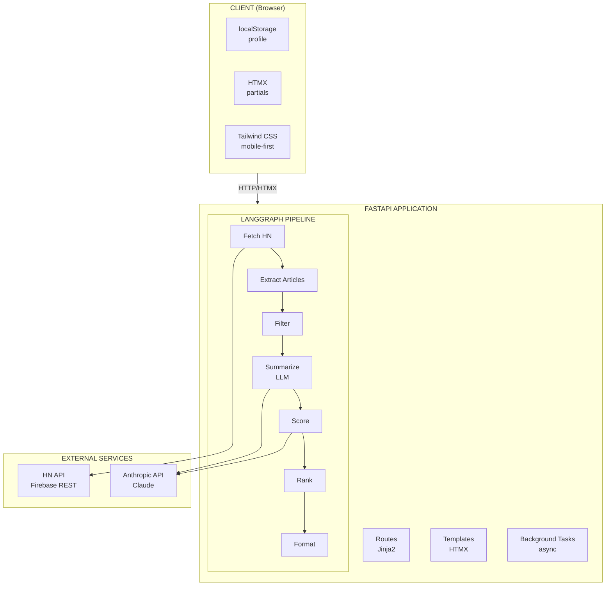
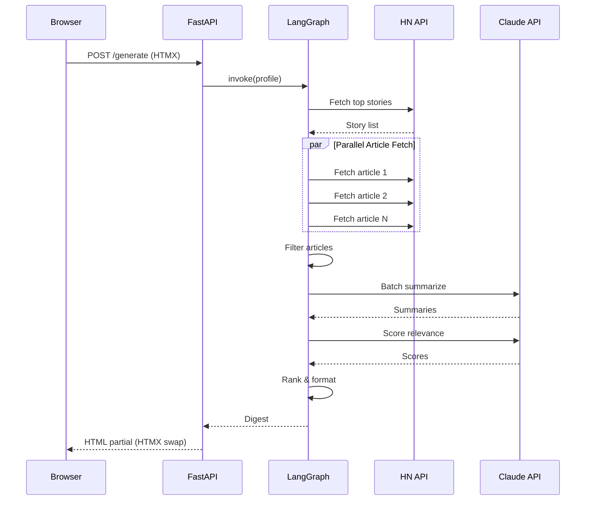
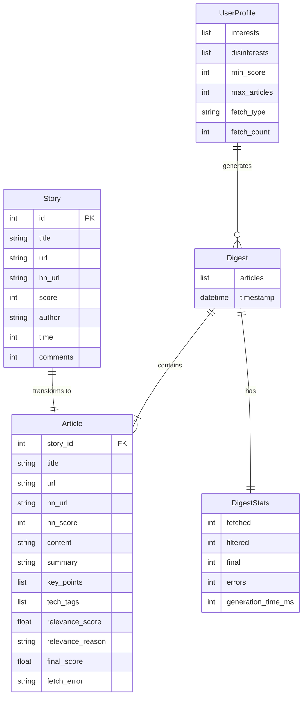
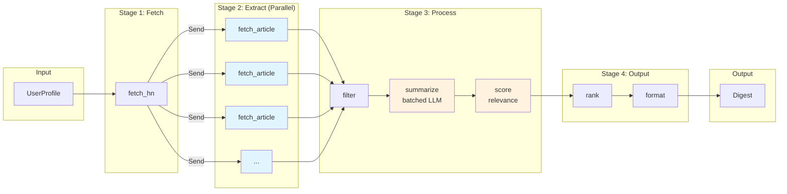

# HN Herald - Technical Architecture

## Overview

A 12-factor application using FastAPI, HTMX, and LangGraph for AI-powered HackerNews digest generation.

---

## 12-Factor Compliance

| Factor               | Implementation                                    |
| -------------------- | ------------------------------------------------- |
| 1. Codebase          | Single git repo, feature branches                 |
| 2. Dependencies      | `pyproject.toml` with pinned versions             |
| 3. Config            | Environment variables via `.env`                  |
| 4. Backing Services  | HN API, Anthropic API as attached resources       |
| 5. Build/Release/Run | Docker multi-stage builds                         |
| 6. Processes         | Stateless FastAPI workers                         |
| 7. Port Binding      | Self-contained via Uvicorn                        |
| 8. Concurrency       | Async + process scaling                           |
| 9. Disposability     | Fast startup/shutdown, graceful termination       |
| 10. Dev/Prod Parity  | Docker for consistency                            |
| 11. Logs             | Structured JSON to stdout                         |
| 12. Admin Processes  | One-off tasks via CLI                             |

---

## System Architecture



### Component Interaction Flow



---

## Project Structure

```
hn-herald/
├── pyproject.toml          # Dependencies, project metadata
├── Makefile                 # Development commands
├── Dockerfile               # Multi-stage production build
├── docker-compose.yml       # Local development
├── .env.example             # Environment template
├── README.md
├── product.md               # Product requirements
├── architecture.md          # This file
│
├── src/
│   └── hn_herald/
│       ├── __init__.py
│       ├── main.py          # FastAPI application entry
│       ├── config.py        # Settings from environment
│       │
│       ├── api/
│       │   ├── __init__.py
│       │   ├── routes.py    # HTTP endpoints
│       │   └── deps.py      # Dependencies (profile from cookie)
│       │
│       ├── templates/
│       │   ├── base.html    # Base layout
│       │   ├── index.html   # Main page
│       │   ├── partials/
│       │   │   ├── digest.html      # Digest results
│       │   │   ├── article.html     # Single article card
│       │   │   ├── settings.html    # Settings form
│       │   │   └── loading.html     # Loading indicator
│       │   └── components/
│       │       ├── header.html
│       │       └── footer.html
│       │
│       ├── static/
│       │   └── css/
│       │       └── styles.css       # Tailwind output
│       │
│       ├── graph/
│       │   ├── __init__.py
│       │   ├── state.py     # TypedDict state definitions
│       │   ├── graph.py     # LangGraph assembly
│       │   └── nodes/
│       │       ├── __init__.py
│       │       ├── fetcher.py       # HN API fetching
│       │       ├── extractor.py     # Article content extraction
│       │       ├── filter.py        # Filtering logic
│       │       ├── summarizer.py    # LLM summarization
│       │       ├── scorer.py        # Relevance scoring
│       │       ├── ranker.py        # Final ranking
│       │       └── formatter.py     # Output formatting
│       │
│       ├── services/
│       │   ├── __init__.py
│       │   ├── hn_client.py         # HackerNews API client
│       │   └── llm.py               # Anthropic Claude wrapper
│       │
│       └── models/
│           ├── __init__.py
│           ├── profile.py   # UserProfile Pydantic model
│           ├── story.py     # Story model
│           └── article.py   # Article model
│
├── tests/
│   ├── __init__.py
│   ├── conftest.py          # Pytest fixtures
│   ├── test_api/
│   │   └── test_routes.py
│   ├── test_graph/
│   │   ├── test_nodes.py
│   │   └── test_pipeline.py
│   └── test_services/
│       └── test_hn_client.py
│
└── scripts/
    ├── dev.sh               # Development startup
    └── generate_css.sh      # Tailwind build
```

---

## Technology Stack

### Backend

| Component    | Technology      | Purpose              |
| ------------ | --------------- | -------------------- |
| Framework    | FastAPI 0.110+  | Async REST API       |
| Templates    | Jinja2          | Server-side rendering|
| Validation   | Pydantic v2     | Data validation      |
| HTTP Client  | httpx           | Async HTTP requests  |
| HTML Parsing | BeautifulSoup4  | Article extraction   |

### AI/ML

| Component     | Technology          | Purpose                |
| ------------- | ------------------- | ---------------------- |
| Orchestration | LangGraph 0.2+      | Pipeline management    |
| LLM Interface | LangChain-Anthropic | Claude integration     |
| Model         | Claude Sonnet 4     | Summarization, scoring |

### Frontend

| Component     | Technology       | Purpose              |
| ------------- | ---------------- | -------------------- |
| Interactivity | HTMX 2.0         | Partial page updates |
| Styling       | Tailwind CSS 3.4 | Utility-first CSS    |
| Icons         | Heroicons        | SVG icons            |

### Infrastructure

| Component | Technology   | Purpose                 |
| --------- | ------------ | ----------------------- |
| Runtime   | Python 3.12+ | Modern Python           |
| Server    | Uvicorn      | ASGI server             |
| Container | Docker       | Deployment              |
| Build     | uv           | Fast package management |

---

## Data Models

### Entity Relationship Diagram



### UserProfile

```python
class UserProfile(BaseModel):
    interests: list[str]           # ["AI", "Python", "startups"]
    disinterests: list[str] = []   # ["crypto", "blockchain"]
    min_score: int = 20            # Minimum HN points
    max_articles: int = 10         # Digest size
    fetch_type: Literal["top", "new", "best", "ask", "show", "job"] = "top"
    fetch_count: int = 30          # Stories to fetch
```

### Story (from HN API)

```python
class Story(BaseModel):
    id: int
    title: str
    url: str | None
    hn_url: str                    # Comments link
    score: int                     # HN points
    author: str
    time: int                      # Unix timestamp
    comments: int                  # descendants
```

### Article (processed)

```python
class Article(BaseModel):
    story_id: int
    title: str
    url: str
    hn_url: str
    hn_score: int
    content: str | None            # Extracted text
    summary: str | None            # AI summary
    key_points: list[str] = []
    tech_tags: list[str] = []
    relevance_score: float = 0     # 0-1
    relevance_reason: str = ""
    final_score: float = 0         # Composite score
    fetch_error: str | None
```

### Digest (output)

```python
class Digest(BaseModel):
    articles: list[Article]
    timestamp: datetime
    stats: DigestStats

class DigestStats(BaseModel):
    fetched: int
    filtered: int
    final: int
    errors: int
    generation_time_ms: int
```

---

## API Endpoints

### Pages (HTML)

| Method | Path     | Description                              |
| ------ | -------- | ---------------------------------------- |
| GET    | `/`      | Main page with settings and generate btn |
| GET    | `/about` | About page                               |

### HTMX Partials

| Method | Path        | Description                        |
| ------ | ----------- | ---------------------------------- |
| POST   | `/generate` | Generate digest, return partial    |
| GET    | `/settings` | Settings form partial              |
| POST   | `/settings` | Save settings, return updated form |

### API (JSON)

| Method | Path            | Description                   |
| ------ | --------------- | ----------------------------- |
| GET    | `/api/health`   | Health check                  |
| POST   | `/api/generate` | Generate digest (JSON)        |

---

## LangGraph Pipeline

### State Definition

```python
class HNState(TypedDict):
    # Input
    profile: UserProfile

    # Pipeline stages
    stories: list[Story]
    articles: Annotated[list[Article], add]  # Parallel append
    filtered_articles: list[Article]
    scored_articles: list[Article]
    ranked_articles: list[Article]

    # Output
    digest: Digest

    # Meta
    timestamp: str
    errors: Annotated[list[str], add]
```

### Pipeline Flow



### Node Specifications

| Node          | Input             | Output                        | Async | Parallel     |
| ------------- | ----------------- | ----------------------------- | ----- | ------------ |
| fetch_hn      | profile           | stories                       | Yes   | No           |
| fetch_article | story             | article                       | Yes   | Yes (Send)   |
| filter        | articles          | filtered_articles             | No    | No           |
| summarize     | filtered_articles | filtered_articles w/summaries | Yes   | Batched      |
| score         | filtered_articles | scored_articles               | Yes   | No           |
| rank          | scored_articles   | ranked_articles               | No    | No           |
| format        | ranked_articles   | digest                        | No    | No           |

---

## Configuration

### Environment Variables

```bash
# Required
ANTHROPIC_API_KEY=sk-ant-...

# Optional with defaults
HN_HERALD_ENV=development         # development|production
HN_HERALD_LOG_LEVEL=INFO
HN_HERALD_HOST=0.0.0.0
HN_HERALD_PORT=8000

# LLM Settings
LLM_MODEL=claude-sonnet-4-20250514
LLM_TEMPERATURE=0
LLM_MAX_TOKENS=4096

# Fetching
HN_API_TIMEOUT=30
ARTICLE_FETCH_TIMEOUT=15
MAX_CONTENT_LENGTH=8000

# Performance
MAX_CONCURRENT_FETCHES=10
SUMMARY_BATCH_SIZE=5
```

### Settings Class

```python
from pydantic_settings import BaseSettings

class Settings(BaseSettings):
    anthropic_api_key: str
    env: Literal["development", "production"] = "development"
    log_level: str = "INFO"
    host: str = "0.0.0.0"
    port: int = 8000

    llm_model: str = "claude-sonnet-4-20250514"
    llm_temperature: float = 0

    hn_api_timeout: int = 30
    article_fetch_timeout: int = 15
    max_content_length: int = 8000

    max_concurrent_fetches: int = 10
    summary_batch_size: int = 5

    class Config:
        env_prefix = "HN_HERALD_"
        env_file = ".env"
```

---

## HTMX Patterns

### Loading States

```html
<button hx-post="/generate"
        hx-target="#digest"
        hx-indicator="#loading">
    Generate Digest
</button>

<div id="loading" class="htmx-indicator">
    <div class="spinner"></div>
    Generating your personalized digest...
</div>
```

### Partial Updates

```html
<!-- Settings form -->
<form hx-post="/settings"
      hx-target="this"
      hx-swap="outerHTML">
    ...
</form>

<!-- Digest container -->
<div id="digest" hx-swap="innerHTML">
    <!-- Digest content rendered here -->
</div>
```

### Mobile-First CSS

```css
/* Base (mobile) */
.article-card {
    padding: 1rem;
    margin-bottom: 1rem;
}

/* Tablet and up */
@media (min-width: 768px) {
    .article-card {
        padding: 1.5rem;
    }
}
```

---

## Error Handling

### Graceful Degradation

1. **Article fetch fails** → Mark as unavailable, continue with others
2. **LLM fails** → Return article without summary, note error
3. **All articles fail** → Show error message with retry option
4. **HN API down** → Show cached results if available, error message

### Retry Strategy

```python
@retry(
    stop=stop_after_attempt(3),
    wait=wait_exponential(multiplier=1, min=1, max=10),
    retry=retry_if_exception_type(httpx.TransientError)
)
async def fetch_with_retry(url: str) -> httpx.Response:
    ...
```

---

## Testing Strategy

### Unit Tests

- LangGraph nodes in isolation
- Service functions
- Model validation

### Integration Tests

- Full pipeline execution
- API endpoint responses
- HTMX partial rendering

### E2E Tests (future)

- Playwright for browser testing
- Mobile viewport testing

### Test Fixtures

```python
@pytest.fixture
def sample_profile():
    return UserProfile(
        interests=["AI", "Python"],
        disinterests=["crypto"],
        min_score=20,
        max_articles=5
    )

@pytest.fixture
def mock_hn_response():
    return [{"id": 1, "title": "Test", "score": 100, ...}]
```

---

## Development Workflow

### Commands (Makefile)

```makefile
dev:        # Start development server with hot reload
build:      # Build production Docker image
test:       # Run pytest
lint:       # Run ruff
format:     # Run ruff format
css:        # Rebuild Tailwind CSS
clean:      # Remove build artifacts
```

### Local Development

```bash
# Setup
make install

# Development
make dev        # Starts Uvicorn with reload

# Testing
make test       # Run all tests
make test-cov   # With coverage
```

---

## Deployment

### Docker Build

```dockerfile
# Multi-stage build
FROM python:3.12-slim AS builder
# Install uv, dependencies

FROM python:3.12-slim AS runtime
# Copy only what's needed
# Run as non-root user
```

### Production Checklist

- [ ] ANTHROPIC_API_KEY set
- [ ] HN_HERALD_ENV=production
- [ ] Logging configured
- [ ] Health checks working
- [ ] Error tracking configured

---

## Implementation Order

### Phase 1: Foundation

1. `pyproject.toml` - Dependencies
2. `Makefile` - Dev commands
3. `.env.example` - Config template
4. `src/hn_herald/config.py` - Settings
5. `src/hn_herald/main.py` - FastAPI app

### Phase 2: Models & Services

6. `src/hn_herald/models/*.py` - Pydantic models
7. `src/hn_herald/services/hn_client.py` - HN API client
8. `src/hn_herald/services/llm.py` - Claude wrapper

### Phase 3: LangGraph Pipeline

9. `src/hn_herald/graph/state.py` - State types
10. `src/hn_herald/graph/nodes/*.py` - Pipeline nodes
11. `src/hn_herald/graph/graph.py` - Graph assembly

### Phase 4: API & Templates

12. `src/hn_herald/api/routes.py` - Endpoints
13. `src/hn_herald/templates/*.html` - HTMX templates
14. `src/hn_herald/static/css/styles.css` - Tailwind

### Phase 5: Testing & Polish

15. `tests/` - Test suite
16. `Dockerfile` - Container
17. `docker-compose.yml` - Local dev
18. Update `README.md`
