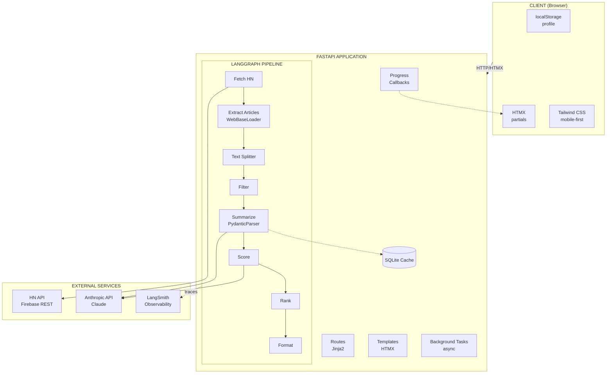

# HN Herald - Technical Architecture

## Overview

A 12-factor application using FastAPI, HTMX, and LangGraph for AI-powered HackerNews digest generation.

---

## 12-Factor Compliance

| Factor               | Implementation                                    |
| -------------------- | ------------------------------------------------- |
| 1. Codebase          | Single git repo, feature branches                 |
| 2. Dependencies      | `pyproject.toml` with pinned versions             |
| 3. Config            | Environment variables via `.env`                  |
| 4. Backing Services  | HN API, Anthropic API as attached resources       |
| 5. Build/Release/Run | Simple Dockerfile with uv                         |
| 6. Processes         | Stateless FastAPI workers                         |
| 7. Port Binding      | Self-contained via Uvicorn                        |
| 8. Concurrency       | Async + process scaling                           |
| 9. Disposability     | Fast startup/shutdown, graceful termination       |
| 10. Dev/Prod Parity  | Same dependencies via uv                          |
| 11. Logs             | Structured JSON to stdout                         |
| 12. Admin Processes  | One-off tasks via CLI                             |

---

## System Architecture



### Component Interaction Flow


---

## Project Structure

```
hn-herald/
├── pyproject.toml          # Dependencies, project metadata
├── Makefile                 # Development commands
├── Dockerfile               # Simple production build
├── .env.example             # Environment template
├── README.md
├── product.md               # Product requirements
├── architecture.md          # This file
│
├── src/
│   └── hn_herald/
│       ├── __init__.py
│       ├── main.py          # FastAPI application entry
│       ├── config.py        # Settings from environment
│       │
│       ├── api/
│       │   ├── __init__.py
│       │   ├── routes.py    # HTTP endpoints
│       │   └── deps.py      # Dependencies (profile from cookie)
│       │
│       ├── templates/
│       │   ├── base.html    # Base layout
│       │   ├── index.html   # Main page
│       │   ├── partials/
│       │   │   ├── digest.html      # Digest results
│       │   │   ├── article.html     # Single article card
│       │   │   ├── settings.html    # Settings form
│       │   │   └── loading.html     # Loading indicator
│       │   └── components/
│       │       ├── header.html
│       │       └── footer.html
│       │
│       ├── static/
│       │   └── css/
│       │       └── styles.css       # Tailwind output
│       │
│       ├── graph/
│       │   ├── __init__.py
│       │   ├── state.py     # TypedDict state definitions
│       │   ├── graph.py     # LangGraph assembly
│       │   └── nodes/
│       │       ├── __init__.py
│       │       ├── fetcher.py       # HN API fetching
│       │       ├── extractor.py     # Article content extraction
│       │       ├── filter.py        # Filtering logic
│       │       ├── summarizer.py    # LLM summarization
│       │       ├── scorer.py        # Relevance scoring
│       │       ├── ranker.py        # Final ranking
│       │       └── formatter.py     # Output formatting
│       │
│       ├── services/
│       │   ├── __init__.py
│       │   ├── hn_client.py         # HackerNews API client ✅
│       │   ├── loader.py            # ArticleLoader service ✅
│       │   ├── llm.py               # LLM summarization service ✅
│       │   └── cache.py             # LangChain caching setup
│       │
│       ├── callbacks/
│       │   ├── __init__.py
│       │   └── progress.py          # HTMX progress callbacks
│       │
│       └── models/
│           ├── __init__.py
│           ├── profile.py   # UserProfile Pydantic model
│           ├── story.py     # Story model ✅
│           ├── article.py   # Article model ✅
│           └── summary.py   # LLM summarization models ✅
│
├── tests/
│   ├── __init__.py
│   ├── conftest.py          # Pytest fixtures
│   ├── unit/
│   │   ├── models/          # Model tests ✅
│   │   └── services/        # Service tests ✅
│   ├── integration/         # Integration tests ✅
│   └── e2e/                 # E2E tests with Playwright ✅
│
└── scripts/
    ├── dev.sh               # Development startup
    └── generate_css.sh      # Tailwind build
```

---

## Technology Stack

### Backend

| Component    | Technology      | Purpose              |
| ------------ | --------------- | -------------------- |
| Framework    | FastAPI 0.110+  | Async REST API       |
| Templates    | Jinja2          | Server-side rendering|
| Validation   | Pydantic v2     | Data validation      |
| HTTP Client  | httpx           | Async HTTP requests  |
| HTML Parsing | BeautifulSoup4  | Article extraction   |

### AI/ML (LangChain Ecosystem)

| Component       | Technology                | Purpose                          |
| --------------- | ------------------------- | -------------------------------- |
| Orchestration   | LangGraph 0.2+            | Pipeline management              |
| LLM Interface   | LangChain-Anthropic       | Claude integration               |
| Model           | Claude Sonnet 4           | Summarization, scoring           |
| Observability   | LangSmith                 | Tracing, debugging, monitoring   |
| Caching         | LangChain Cache           | Response caching for performance |
| Output Parsing  | PydanticOutputParser      | Structured JSON from LLM         |
| Callbacks       | LangChain Callbacks       | Progress streaming to frontend   |
| Document Loading| WebBaseLoader             | Article content extraction       |
| Text Processing | RecursiveCharacterSplitter| Smart chunking for long articles |
| Summarization   | LLMService (MVP-3)        | Batch article summarization ✅   |

### Frontend

| Component     | Technology       | Purpose              |
| ------------- | ---------------- | -------------------- |
| Interactivity | HTMX 2.0         | Partial page updates |
| Styling       | Tailwind CSS 3.4 | Utility-first CSS    |
| Icons         | Heroicons        | SVG icons            |

### Infrastructure

| Component | Technology   | Purpose                 |
| --------- | ------------ | ----------------------- |
| Runtime   | Python 3.12+ | Modern Python           |
| Server    | Uvicorn      | ASGI server             |
| Container | Docker       | Deployment              |
| Build     | uv           | Fast package management |

---

## Data Models

### Entity Relationship Diagram


### Tag

```python
class Tag(BaseModel):
    id: str                        # Slugified tag name
    name: str                      # Display name
    category: str                  # Category (Languages, AI/ML, etc.)
    is_predefined: bool = True     # False for custom tags
```

### UserProfile

```python
class UserProfile(BaseModel):
    interest_tags: list[str] = []      # Tag IDs for interests
    disinterest_tags: list[str] = []   # Tag IDs for disinterests
    custom_tags: list[Tag] = []        # User-created tags
    min_score: int = 20                # Minimum HN points
    max_articles: int = 10             # Digest size
    fetch_type: Literal["top", "new", "best", "ask", "show", "job"] = "top"
    fetch_count: int = 30              # Stories to fetch
```

### Story (from HN API)

```python
class Story(BaseModel):
    id: int
    title: str
    url: str | None
    hn_url: str                    # Comments link
    score: int                     # HN points
    author: str
    time: int                      # Unix timestamp
    comments: int                  # descendants
```

### Article (processed)

```python
class Article(BaseModel):
    story_id: int
    title: str
    url: str
    hn_url: str
    hn_score: int
    content: str | None            # Extracted text
    summary: str | None            # AI summary
    key_points: list[str] = []
    tech_tags: list[str] = []
    relevance_score: float = 0     # 0-1
    relevance_reason: str = ""
    final_score: float = 0         # Composite score
    fetch_error: str | None
```

### Digest (output)

```python
class Digest(BaseModel):
    articles: list[Article]
    timestamp: datetime
    stats: DigestStats

class DigestStats(BaseModel):
    fetched: int
    filtered: int
    final: int
    errors: int
    generation_time_ms: int
```

---

## API Endpoints

### Pages (HTML)

| Method | Path     | Description                              |
| ------ | -------- | ---------------------------------------- |
| GET    | `/`      | Main page with settings and generate btn |
| GET    | `/about` | About page                               |

### HTMX Partials

| Method | Path        | Description                        |
| ------ | ----------- | ---------------------------------- |
| POST   | `/generate` | Generate digest, return partial    |
| GET    | `/settings` | Settings form partial              |
| POST   | `/settings` | Save settings, return updated form |

### API (JSON)

| Method | Path            | Description                   |
| ------ | --------------- | ----------------------------- |
| GET    | `/api/health`   | Health check                  |
| POST   | `/api/generate` | Generate digest (JSON)        |

---

## LangGraph Pipeline

### State Definition

```python
class HNState(TypedDict):
    # Input
    profile: UserProfile

    # Pipeline stages
    stories: list[Story]
    articles: Annotated[list[Article], add]  # Parallel append
    filtered_articles: list[Article]
    scored_articles: list[Article]
    ranked_articles: list[Article]

    # Output
    digest: Digest

    # Meta
    timestamp: str
    errors: Annotated[list[str], add]
```

### Pipeline Flow


### Node Specifications

| Node          | Input             | Output                        | Async | Parallel     |
| ------------- | ----------------- | ----------------------------- | ----- | ------------ |
| fetch_hn      | profile           | stories                       | Yes   | No           |
| fetch_article | story             | article                       | Yes   | Yes (Send)   |
| filter        | articles          | filtered_articles             | No    | No           |
| summarize     | filtered_articles | filtered_articles w/summaries | Yes   | Batched      |
| score         | filtered_articles | scored_articles               | Yes   | No           |
| rank          | scored_articles   | ranked_articles               | No    | No           |
| format        | ranked_articles   | digest                        | No    | No           |

---

## LangChain Ecosystem Integration

### LangSmith (Observability)

Tracing and monitoring for LLM operations.

```python
import os
from langsmith import Client

# Enable tracing
os.environ["LANGCHAIN_TRACING_V2"] = "true"
os.environ["LANGCHAIN_PROJECT"] = "hn-herald"

# Access traces programmatically
client = Client()
```

**Benefits**:
- Trace all LLM calls with latency, tokens, costs
- Debug failed requests with full context
- Replay traces for testing
- Monitor production performance

### LLM Summarization Service (MVP-3 Complete)

The LLM service provides batch article summarization using LangChain-Anthropic.

```python
from langchain_anthropic import ChatAnthropic
from hn_herald.models.summary import (
    ArticleSummary,
    BatchArticleSummary,
    SummarizedArticle,
    SummarizationStatus,
)

class LLMService:
    """LLM service for article summarization."""

    def __init__(self, model: str = "claude-sonnet-4-20250514"):
        self.llm = ChatAnthropic(model=model, temperature=0)

    async def summarize_article(
        self, story_id: int, title: str, url: str, content: str
    ) -> SummarizedArticle:
        """Summarize a single article."""
        # Returns SummarizedArticle with status tracking

    async def summarize_batch(
        self, articles: list[tuple[int, str, str, str]]
    ) -> BatchArticleSummary:
        """Summarize multiple articles in batch."""
        # Processes articles concurrently with error isolation
```

**Key Features**:
- **Batch Processing**: Efficient concurrent summarization of multiple articles
- **Error Isolation**: Individual article failures do not affect batch processing
- **Status Tracking**: Per-article status (success/failed/skipped)
- **Structured Output**: Type-safe Pydantic models for all responses
- **Configurable Model**: Defaults to Claude Sonnet 4

**Integration Points**:
- Called by `summarizer.py` node in LangGraph pipeline
- Uses `ArticleSummary` for individual summaries
- Returns `BatchArticleSummary` with processing statistics

### Caching

Reduce API costs and latency with intelligent caching.

```python
from langchain.cache import SQLiteCache, InMemoryCache
from langchain.globals import set_llm_cache

# In-memory for development (fast, session-scoped)
set_llm_cache(InMemoryCache())

# SQLite for production (persistent across restarts)
set_llm_cache(SQLiteCache(database_path=".cache/llm_cache.db"))
```

**Cache Strategy**:
- Cache summaries by article URL hash
- Cache relevance scores by (article_hash, profile_hash)
- TTL: 24 hours for summaries, 1 hour for scores

### Output Parsers

Structured, validated output from LLM responses. The summarization system uses Pydantic models with LangChain-Anthropic integration for type-safe batch processing.

```python
from pydantic import BaseModel, Field
from enum import Enum

class SummarizationStatus(str, Enum):
    """Status of article summarization."""
    SUCCESS = "success"
    FAILED = "failed"
    SKIPPED = "skipped"

class ArticleSummary(BaseModel):
    """Summary output for a single article."""
    summary: str = Field(description="2-3 sentence summary")
    key_points: list[str] = Field(description="3 key takeaways", default_factory=list)
    tech_tags: list[str] = Field(description="Relevant technology tags", default_factory=list)

class SummarizedArticle(BaseModel):
    """Article with summarization result and status tracking."""
    story_id: int
    title: str
    url: str
    summary: ArticleSummary | None = None
    status: SummarizationStatus = SummarizationStatus.SUCCESS
    error: str | None = None

class BatchArticleSummary(BaseModel):
    """Batch summarization response for multiple articles."""
    articles: list[SummarizedArticle]
    total_processed: int
    successful: int
    failed: int
```

**Implementation Details** (MVP-3 Complete):
- LangChain-Anthropic integration with Claude Sonnet 4
- Batch summarization support for efficient API usage
- Status tracking per article (success/failed/skipped)
- Graceful error handling with individual article failure isolation

**Benefits**:
- Type-safe LLM outputs with comprehensive status tracking
- Automatic validation via Pydantic
- Clear error messages on parse failures
- Consistent JSON structure with batch processing support

### Callbacks (Progress Streaming)

Real-time progress updates to HTMX frontend.

```python
from langchain.callbacks.base import BaseCallbackHandler
from typing import Any

class HTMXProgressCallback(BaseCallbackHandler):
    def __init__(self, send_event):
        self.send_event = send_event

    def on_llm_start(self, serialized: dict, prompts: list, **kwargs):
        self.send_event("llm_start", {"status": "Summarizing..."})

    def on_llm_end(self, response, **kwargs):
        self.send_event("llm_end", {"status": "Complete"})

    def on_chain_start(self, serialized: dict, inputs: dict, **kwargs):
        chain_name = serialized.get("name", "Processing")
        self.send_event("chain_start", {"step": chain_name})
```

**Integration with SSE**:
```python
from fastapi import Response
from sse_starlette.sse import EventSourceResponse

@app.post("/generate")
async def generate_digest(profile: UserProfile):
    async def event_generator():
        callback = HTMXProgressCallback(lambda t, d: yield {"event": t, "data": d})
        result = await graph.ainvoke({"profile": profile}, config={"callbacks": [callback]})
        yield {"event": "complete", "data": result}

    return EventSourceResponse(event_generator())
```

### Document Loaders

Intelligent article content extraction.

```python
from langchain_community.document_loaders import WebBaseLoader
from langchain.text_splitter import RecursiveCharacterTextSplitter

async def extract_article(url: str) -> str:
    loader = WebBaseLoader(url)
    docs = loader.load()

    if not docs:
        return None

    # Smart chunking for long articles
    splitter = RecursiveCharacterTextSplitter(
        chunk_size=8000,
        chunk_overlap=200,
        separators=["\n\n", "\n", ". ", " ", ""]
    )

    chunks = splitter.split_documents(docs)
    # Return first chunk (main content)
    return chunks[0].page_content if chunks else None
```

**Advantages over BeautifulSoup**:
- Built-in handling for common webpage structures
- Automatic metadata extraction
- Consistent output format
- Better handling of dynamic content

### Text Splitters

Smart chunking preserves context better than simple truncation.

```python
from langchain.text_splitter import RecursiveCharacterTextSplitter

splitter = RecursiveCharacterTextSplitter(
    chunk_size=8000,           # Max chars per chunk
    chunk_overlap=200,         # Overlap between chunks
    length_function=len,
    separators=[
        "\n\n",    # Paragraphs first
        "\n",      # Then lines
        ". ",      # Then sentences
        ", ",      # Then clauses
        " ",       # Then words
        ""         # Finally characters
    ]
)

# For very long articles, summarize first chunk
chunks = splitter.split_text(article_content)
main_content = chunks[0]  # Most relevant content
```

### Integration Architecture


### Environment Variables (LangChain)

```bash
# LangSmith (optional but recommended)
LANGCHAIN_TRACING_V2=true
LANGCHAIN_API_KEY=ls-...
LANGCHAIN_PROJECT=hn-herald

# Caching
LLM_CACHE_TYPE=sqlite           # sqlite|memory|none
LLM_CACHE_TTL=86400             # 24 hours in seconds

# Document Loading
LOADER_TIMEOUT=15               # Seconds
LOADER_MAX_CONTENT=50000        # Max chars before splitting
```

---

## Configuration

### Environment Variables

```bash
# Required
ANTHROPIC_API_KEY=sk-ant-...

# Optional with defaults
HN_HERALD_ENV=development         # development|production
HN_HERALD_LOG_LEVEL=INFO
HN_HERALD_HOST=0.0.0.0
HN_HERALD_PORT=8000

# LLM Settings
LLM_MODEL=claude-sonnet-4-20250514
LLM_TEMPERATURE=0
LLM_MAX_TOKENS=4096

# Fetching
HN_API_TIMEOUT=30
ARTICLE_FETCH_TIMEOUT=15
MAX_CONTENT_LENGTH=8000

# Performance
MAX_CONCURRENT_FETCHES=10
SUMMARY_BATCH_SIZE=5
```

### Settings Class

```python
from pydantic_settings import BaseSettings

class Settings(BaseSettings):
    anthropic_api_key: str
    env: Literal["development", "production"] = "development"
    log_level: str = "INFO"
    host: str = "0.0.0.0"
    port: int = 8000

    llm_model: str = "claude-sonnet-4-20250514"
    llm_temperature: float = 0

    hn_api_timeout: int = 30
    article_fetch_timeout: int = 15
    max_content_length: int = 8000

    max_concurrent_fetches: int = 10
    summary_batch_size: int = 5

    class Config:
        env_prefix = "HN_HERALD_"
        env_file = ".env"
```

---

## HTMX Patterns

### Loading States

```html
<button hx-post="/generate"
        hx-target="#digest"
        hx-indicator="#loading">
    Generate Digest
</button>

<div id="loading" class="htmx-indicator">
    <div class="spinner"></div>
    Generating your personalized digest...
</div>
```

### Partial Updates

```html
<!-- Settings form -->
<form hx-post="/settings"
      hx-target="this"
      hx-swap="outerHTML">
    ...
</form>

<!-- Digest container -->
<div id="digest" hx-swap="innerHTML">
    <!-- Digest content rendered here -->
</div>
```

### Mobile-First CSS

```css
/* Base (mobile) */
.article-card {
    padding: 1rem;
    margin-bottom: 1rem;
}

/* Tablet and up */
@media (min-width: 768px) {
    .article-card {
        padding: 1.5rem;
    }
}
```

---

## Error Handling

### Graceful Degradation

1. **Article fetch fails** → Mark as unavailable, continue with others
2. **LLM fails** → Return article without summary, note error
3. **All articles fail** → Show error message with retry option
4. **HN API down** → Show cached results if available, error message

### Retry Strategy

```python
@retry(
    stop=stop_after_attempt(3),
    wait=wait_exponential(multiplier=1, min=1, max=10),
    retry=retry_if_exception_type(httpx.TransientError)
)
async def fetch_with_retry(url: str) -> httpx.Response:
    ...
```

---

## Testing Strategy

### Unit Tests

- LangGraph nodes in isolation
- Service functions
- Model validation

### Integration Tests

- Full pipeline execution
- API endpoint responses
- HTMX partial rendering

### E2E Tests

- Playwright pytest tests (`tests/e2e/test_article_extraction_e2e.py`)
- Manual Playwright MCP tests (`docs/e2e-tests.md`)
- Full pipeline tests: HN API → Article Extraction
- Mobile viewport testing (375x667)

### Test Fixtures

```python
@pytest.fixture
def sample_profile():
    return UserProfile(
        interests=["AI", "Python"],
        disinterests=["crypto"],
        min_score=20,
        max_articles=5
    )

@pytest.fixture
def mock_hn_response():
    return [{"id": 1, "title": "Test", "score": 100, ...}]
```

---

## Development Workflow

### Commands (Makefile)

```makefile
dev:        # Start development server with hot reload
build:      # Build production Docker image
test:       # Run pytest
lint:       # Run ruff
format:     # Run ruff format
css:        # Rebuild Tailwind CSS
clean:      # Remove build artifacts
```

### Local Development

```bash
# Setup
make install

# Development
make dev        # Starts Uvicorn with reload

# Testing
make test       # Run all tests
make test-cov   # With coverage
```

---

## Deployment

### Simple Dockerfile

```dockerfile
FROM python:3.12-slim

# Install uv for fast dependency management
COPY --from=ghcr.io/astral-sh/uv:latest /uv /usr/local/bin/uv

WORKDIR /app
COPY pyproject.toml .
RUN uv sync --frozen

COPY src/ src/
EXPOSE 8000

CMD ["uv", "run", "uvicorn", "hn_herald.main:app", "--host", "0.0.0.0", "--port", "8000"]
```

### Local Development

```bash
# Install dependencies
uv sync

# Run development server
uv run uvicorn hn_herald.main:app --reload

# Or use Makefile
make dev
```

### Production Checklist

- [ ] ANTHROPIC_API_KEY set
- [ ] HN_HERALD_ENV=production
- [ ] Logging configured
- [ ] Health checks working

---

## Implementation Order

### Phase 1: Foundation

1. `pyproject.toml` - Dependencies
2. `Makefile` - Dev commands
3. `.env.example` - Config template
4. `src/hn_herald/config.py` - Settings
5. `src/hn_herald/main.py` - FastAPI app

### Phase 2: Models & Services ✅

6. `src/hn_herald/models/*.py` - Pydantic models ✅
7. `src/hn_herald/services/hn_client.py` - HN API client ✅
8. `src/hn_herald/services/llm.py` - LLM summarization service ✅

### Phase 3: LangGraph Pipeline

9. `src/hn_herald/graph/state.py` - State types
10. `src/hn_herald/graph/nodes/*.py` - Pipeline nodes
11. `src/hn_herald/graph/graph.py` - Graph assembly

### Phase 4: API & Templates

12. `src/hn_herald/api/routes.py` - Endpoints
13. `src/hn_herald/templates/*.html` - HTMX templates
14. `src/hn_herald/static/css/styles.css` - Tailwind

### Phase 5: Testing & Polish

15. `tests/` - Test suite
16. `Dockerfile` - Simple container
17. Update `README.md`
