# HN Herald: Crash Course

**Version**: 1.1 | **Tests**: 406 | **Coverage**: 70%+ | **Date**: January 2026

> 📚 **Enhanced Edition**: Includes Troubleshooting, Extension Guides, Cost Tracking, Operational Runbooks, and ADRs

---

## Executive Summary

This crash course documents everything about **HN Herald** — a privacy-first AI-powered HackerNews digest generator. Get personalized digests based on your interests with real-time progress streaming.

### What We Built

```
┌─────────────────────────────────────────────────────────────────┐
│                        HN HERALD                                │
├─────────────────────────────────────────────────────────────────┤
│  Frontend: Vanilla JS + Jinja2 + Tailwind (3 themes)           │
│  Backend: FastAPI with SSE streaming                            │
│  AI System: LangGraph with 7 nodes, parallel extraction         │
│  LLM: Anthropic Claude 3.5 Haiku (batch summarization)         │
│  Config: Environment-based Pydantic Settings                    │
│  Data: HN Firebase API + 24 blocked domains                     │
│  Deployment: Docker + Render.com                                │
└─────────────────────────────────────────────────────────────────┘
```

### Key Achievements

- ✅ 7-stage LangGraph pipeline with parallel article extraction
- ✅ Send pattern for concurrent HTTP requests (10 max)
- ✅ Batch LLM summarization (5 articles/call, 80% cost reduction)
- ✅ Tag-based relevance scoring (70% relevance + 30% popularity)
- ⚠️ LLM caching: Not implemented (config exists but unused)
- ✅ SSE streaming for real-time progress updates
- ✅ Privacy-first: no tracking, localStorage only
- ✅ 406 tests with 70%+ coverage, strict typing
- ✅ 3 themes: HN Orange, Ocean Blue, Dark Mode

---

## Table of Contents

### Core Documentation
1. [Architecture Overview](#1-architecture-overview)
2. [Technology Stack](#2-technology-stack)
3. [Project Structure](#3-project-structure)
4. [Data Flow Pipeline](#4-data-flow-pipeline)
5. [Data Models](#5-data-models)
6. [Core Services](#6-core-services)
7. [LangGraph Pipeline](#7-langgraph-pipeline)
8. [API Design](#8-api-design)
9. [Frontend Architecture](#9-frontend-architecture)
10. [Configuration](#10-configuration)
11. [Testing Strategy](#11-testing-strategy)
12. [Development Workflow](#12-development-workflow)
13. [Patterns & Best Practices](#13-patterns--best-practices)
14. [Deployment](#14-deployment)
15. [Quick Reference](#15-quick-reference)

### Advanced Topics
16. [Troubleshooting Guide](#16-troubleshooting-guide) 🆕
17. [Extension Guide](#17-extension-guide) 🆕
18. [Cost & Token Tracking](#18-cost--token-tracking) 🆕
19. [Operational Runbook](#19-operational-runbook) 🆕
20. [Architecture Decision Records](#20-architecture-decision-records-adrs) 🆕
21. [Glossary](#21-glossary) 🆕

---

## 1. Architecture Overview

### High-Level Flow


### Multi-Stage Pipeline

```mermaid
flowchart LR
    subgraph Input
        Profile[UserProfile]
    end

    subgraph FetchStage["Fetch Stage"]
        FetchHN[fetch_hn]
        FetchArticle[fetch_article<br/>×N parallel]
    end

    subgraph ProcessStage["Process Stage"]
        Filter[filter]
        Summarize[summarize<br/>batch of 5]
    end

    subgraph RankStage["Rank Stage"]
        Score[score]
        Rank[rank]
        Format[format]
    end

    Profile --> FetchHN
    FetchHN --> FetchArticle
    FetchArticle --> Filter
    Filter --> Summarize
    Summarize --> Score
    Score --> Rank
    Rank --> Format
    Format --> Digest[Digest Output]
```



### Design Decisions

| Decision | Choice | Rationale |
|----------|--------|-----------|
| Pipeline Framework | LangGraph | StateGraph with Send pattern for parallelization |
| LLM Strategy | Haiku + Batch | Fast, cost-effective (5 articles/call) |
| Config System | Pydantic Settings | Environment-based, validated |
| Caching | Not implemented | Config exists but LLMService does not use it |
| Frontend | Vanilla JS + Jinja2 | No build step, server-driven |
| Streaming | SSE | Real-time progress without WebSockets |

---

## 2. Technology Stack

### Backend

| Technology | Version | Purpose |
|------------|---------|---------|
| Python | 3.12 | Runtime |
| FastAPI | ≥0.110 | Web framework |
| LangGraph | ≥0.2 | Pipeline orchestration |
| langchain-anthropic | ≥0.1 | Claude integration |
| Pydantic | ≥2.0 | Data validation |
| httpx | ≥0.27 | Async HTTP client |
| BeautifulSoup4 | ≥4.12 | HTML parsing |

### Frontend

| Technology | Purpose |
|------------|---------|
| Vanilla JS | SSE handling, tag management |
| Jinja2 | Server-side templating |
| Tailwind CSS | Utility-first styling |
| CSS Variables | Theme system |

### DevOps

| Technology | Purpose |
|------------|---------|
| Docker | Containerization |
| uv | Fast package management |
| ruff | Linting + formatting |
| mypy | Type checking |
| pytest | Testing framework |

---

## 3. Project Structure

```
hn-herald/
├── src/hn_herald/
│   ├── main.py                    # FastAPI entry + page routes
│   ├── config.py                  # Pydantic Settings
│   │
│   ├── api/                       # API endpoints
│   │   ├── routes.py              # /digest, /digest/stream, /health
│   │   └── mocks.py               # Mock digest generator
│   │
│   ├── models/                    # Pydantic models
│   │   ├── story.py               # Story, StoryType
│   │   ├── article.py             # Article, ExtractionStatus
│   │   ├── summary.py             # ArticleSummary, SummarizedArticle
│   │   ├── scoring.py             # RelevanceScore, ScoredArticle
│   │   ├── digest.py              # Digest, DigestStats
│   │   └── profile.py             # UserProfile
│   │
│   ├── services/                  # Business logic
│   │   ├── hn_client.py           # HN API with retry
│   │   ├── loader.py              # Article extraction
│   │   ├── llm.py                 # Batch summarization
│   │   └── scoring.py             # Relevance ranking
│   │
│   ├── graph/                     # LangGraph pipeline
│   │   ├── state.py               # HNState TypedDict
│   │   ├── graph.py               # StateGraph compilation
│   │   └── nodes/                 # 7 pipeline nodes
│   │       ├── fetch_hn.py
│   │       ├── fetch_article.py   # Parallel via Send
│   │       ├── filter.py
│   │       ├── summarize.py       # Batch LLM
│   │       ├── score.py
│   │       ├── rank.py
│   │       └── format.py
│   │
│   ├── templates/                 # Jinja2 HTML
│   │   ├── base.html
│   │   ├── index.html
│   │   └── partials/
│   │
│   └── static/
│       ├── css/styles.css         # Tailwind output
│       └── js/app.js              # SSE + tag management
│
├── tests/                         # 406 tests
│   ├── unit/graph/nodes/
│   ├── integration/
│   ├── test_models/
│   └── test_services/
│
├── docs/                          # Architecture docs
│   ├── architecture.md
│   ├── product.md
│   └── design/
│
└── claudedocs/                    # Claude-generated docs
    └── crash-course.md            # This document
```

---

## 4. Data Flow Pipeline

```mermaid
sequenceDiagram
    participant U as User
    participant API as FastAPI
    participant G as LangGraph
    participant HN as HN API
    participant W as Websites
    participant AI as Claude AI

    U->>API: POST /api/v1/digest/stream
    API->>G: Start pipeline with UserProfile

    rect rgb(240, 248, 255)
        Note over G,HN: Stage 1: Fetch Stories
        G->>HN: GET /v0/topstories.json
        HN-->>G: Story IDs [1,2,3...]
        G->>HN: GET /v0/item/{id}.json (×N)
        HN-->>G: Story details
    end

    rect rgb(255, 245, 238)
        Note over G,W: Stage 2: Extract Articles (Parallel)
        par Parallel Extraction
            G->>W: GET article URL 1
            G->>W: GET article URL 2
            G->>W: GET article URL N
        end
        W-->>G: HTML content
        Note over G: Parse with BeautifulSoup
    end

    rect rgb(240, 255, 240)
        Note over G: Stage 3: Filter
        G->>G: Remove failed extractions
    end

    rect rgb(255, 250, 205)
        Note over G,AI: Stage 4: Summarize (Batch)
        G->>AI: Summarize 5 articles
        AI-->>G: Summaries + tags
        G->>AI: Summarize next batch
        AI-->>G: Summaries + tags
    end

    rect rgb(230, 230, 250)
        Note over G: Stage 5-7: Score → Rank → Format
        G->>G: Calculate relevance scores
        G->>G: Sort by final_score
        G->>G: Build Digest response
    end

    G-->>API: Digest result
    API-->>U: SSE events + final data
```



### Pipeline Stage Details

| Stage | Node | Input | Output | Time |
|-------|------|-------|--------|------|
| 1 | `fetch_hn` | UserProfile | list[Story] | 2-3s |
| 2 | `fetch_article` | Story (×N parallel) | list[Article] | 10-20s |
| 3 | `filter` | list[Article] | list[Article] | <1s |
| 4 | `summarize` | list[Article] | list[SummarizedArticle] | 15-30s |
| 5 | `score` | list[SummarizedArticle] | list[ScoredArticle] | <1s |
| 6 | `rank` | list[ScoredArticle] | list[ScoredArticle] | <1s |
| 7 | `format` | list[ScoredArticle] | Digest | <1s |

---

## 5. Data Models


### Status Enums


---

## 6. Core Services

### Service Architecture

```mermaid
flowchart TB
    subgraph HNClient["HNClient Service"]
        HC_FETCH[fetch_stories]
        HC_RETRY[Retry Logic<br/>3 attempts]
        HC_TIMEOUT[30s Timeout]
    end

    subgraph ArticleLoader["ArticleLoader Service"]
        AL_EXTRACT[extract_article]
        AL_FILTER[Domain Filter<br/>24 blocked]
        AL_PARSE[HTML Parser<br/>BeautifulSoup]
        AL_TRUNCATE[Truncate<br/>50KB max]
    end

    subgraph LLMService["LLMService"]
        LLM_BATCH[Batch Summary<br/>5 articles/call]
        LLM_CLAUDE[Claude 3.5 Haiku]
        LLM_PARSE[Pydantic Parser]
    end

    subgraph ScoringService["ScoringService"]
        SC_REL[Relevance Score<br/>70% weight]
        SC_POP[Popularity Score<br/>30% weight]
        SC_FINAL[Final Score<br/>0.7×rel + 0.3×pop]
    end

    HNAPI[(HN Firebase API)] --> HC_FETCH
    HC_FETCH --> HC_RETRY --> HC_TIMEOUT

    Websites[(Websites)] --> AL_EXTRACT
    AL_EXTRACT --> AL_FILTER --> AL_PARSE --> AL_TRUNCATE

    LLM_BATCH --> LLM_CLAUDE
    LLM_CLAUDE --> LLM_PARSE

    SC_REL --> SC_FINAL
    SC_POP --> SC_FINAL
```



### Service Inventory

| Service | Purpose | Key Method |
|---------|---------|------------|
| `HNClient` | Fetch stories from HN API | `fetch_stories(type, limit)` |
| `ArticleLoader` | Extract content from URLs | `extract_article(story)` |
| `LLMService` | Batch summarization | `summarize_articles_batch(articles)` |
| `ScoringService` | Relevance + popularity | `score_articles(articles, profile)` |

### Scoring Algorithm


---

## 7. LangGraph Pipeline

### Graph Assembly

```python
# src/hn_herald/graph/graph.py
from langgraph.graph import StateGraph, START, END

graph = StateGraph(HNState)

# Add nodes
graph.add_node("fetch_hn", fetch_hn)
graph.add_node("fetch_article", fetch_article)
graph.add_node("filter", filter_articles)
graph.add_node("summarize", summarize)
graph.add_node("score", score_articles)
graph.add_node("rank", rank_articles)
graph.add_node("format", format_digest)

# Add edges
graph.add_edge(START, "fetch_hn")
graph.add_conditional_edges("fetch_hn", continue_to_fetch_article)
graph.add_edge("fetch_article", "filter")
graph.add_edge("filter", "summarize")
graph.add_edge("summarize", "score")
graph.add_edge("score", "rank")
graph.add_edge("rank", "format")
graph.add_edge("format", END)

compiled = graph.compile()
```

### Graph Structure


### Parallel Execution (Send Pattern)

```python
# src/hn_herald/graph/nodes/fetch_hn.py
from langgraph.types import Send

def continue_to_fetch_article(state: HNState) -> list[Send]:
    """Route each story to parallel fetch_article execution."""
    stories = state.get("stories", [])
    profile = state["profile"]
    return [
        Send("fetch_article", {"story": story, "profile": profile})
        for story in stories
    ]
```


### State Schema (HNState)

```python
# src/hn_herald/graph/state.py
from typing import Annotated
from langgraph.graph import add

class HNState(TypedDict):
    """Graph state with progressive refinement."""
    # Input
    profile: UserProfile

    # Progressive state
    stories: list[Story]
    articles: Annotated[list[Article], add]  # Accumulated via Send
    filtered_articles: list[Article]
    summarized_articles: list[SummarizedArticle]
    scored_articles: list[ScoredArticle]
    ranked_articles: list[ScoredArticle]

    # Output
    digest: dict

    # Metadata
    errors: Annotated[list[str], add]  # Error accumulation
    start_time: float
```

---

## 8. API Design

### Request Flow


### Endpoints Summary

| Method | Endpoint | Purpose |
|--------|----------|---------|
| GET | `/` | Main page UI |
| GET | `/api/health` | Health check |
| POST | `/api/v1/digest` | Generate digest (JSON) |
| POST | `/api/v1/digest/stream` | Generate digest (SSE) |

### SSE Stream Events


### Request/Response Models

```python
# Request
class GenerateDigestRequest(BaseModel):
    profile: UserProfile
    mock: bool = False

# Response
class GenerateDigestResponse(BaseModel):
    articles: list[ScoredArticle]
    stats: DigestStats
    timestamp: datetime
    profile_summary: dict
```

---

## 9. Frontend Architecture

### Technology Stack

| Component | Technology | Purpose |
|-----------|------------|---------|
| Templating | Jinja2 | Server-side HTML |
| Styling | Tailwind CSS | Utility classes |
| JS | Vanilla | SSE, tags, themes |
| Themes | CSS Variables | 3 color schemes |

### Component Architecture


### Theme System


### SSE Handling

```javascript
// src/hn_herald/static/js/app.js
function generateDigest(profile) {
    const eventSource = new EventSource('/api/v1/digest/stream', {
        method: 'POST',
        body: JSON.stringify({ profile }),
    });

    eventSource.onmessage = (event) => {
        const data = JSON.parse(event.data);
        if (data.stage === 'complete') {
            renderDigest(data.digest);
            eventSource.close();
        } else {
            updateProgress(data.stage, data.message);
        }
    };
}
```

---

## 10. Configuration

### Settings Architecture


### Settings Class

```python
# src/hn_herald/config.py
from pydantic_settings import BaseSettings

class Settings(BaseSettings):
    """Application configuration."""
    # Required
    anthropic_api_key: str

    # Application
    env: str = "development"
    host: str = "0.0.0.0"
    port: int = 8000

    # LLM
    llm_model: str = "claude-3-5-haiku-20241022"
    llm_temperature: float = 0.0
    llm_max_tokens: int = 8192

    # Cache (config exists but not implemented in LLMService)
    # llm_cache_type: str = "sqlite"  # Not used
    # llm_cache_ttl: int = 86400  # Not used

    # Performance
    max_concurrent_fetches: int = 10
    summary_batch_size: int = 5

    class Config:
        env_prefix = "HN_HERALD_"
        env_file = ".env"
```

### Key Environment Variables

| Variable | Default | Description |
|----------|---------|-------------|
| `ANTHROPIC_API_KEY` | *required* | Claude API key |
| `HN_HERALD_ENV` | development | Environment mode |
| `HN_HERALD_LLM_MODEL` | claude-3-5-haiku-20241022 | LLM model |
| `HN_HERALD_LLM_CACHE_TYPE` | sqlite | Cache backend (not implemented) |
| `HN_HERALD_MAX_CONCURRENT_FETCHES` | 10 | Parallel requests |
| `HN_HERALD_SUMMARY_BATCH_SIZE` | 5 | Articles per LLM call |

---

## 11. Testing Strategy

### Test Pyramid


### Test Categories

| Category | Count | Focus |
|----------|-------|-------|
| Models | 200+ | Pydantic validation, serialization |
| Services | 100+ | Business logic, mocked HTTP |
| Nodes | 64 | Pipeline stage behavior |
| API | 14+ | Endpoints, error handling |
| E2E | 10+ | Playwright browser tests |

### Mock LLM Pattern

```python
# tests/conftest.py
import os
os.environ["ANTHROPIC_API_KEY"] = "test-key"  # Before imports!

import pytest
from unittest.mock import patch, MagicMock

@pytest.fixture
def mock_llm_response():
    """Mock LLM summarization response."""
    return ArticleSummary(
        summary="Test summary",
        key_points=["Point 1", "Point 2", "Point 3"],
        tech_tags=["python", "ai"],
    )

# Usage in tests
@patch("src.hn_herald.services.llm.ChatAnthropic")
def test_summarize(mock_llm, mock_llm_response):
    mock_llm.return_value.invoke.return_value = mock_llm_response
    # Test summarization logic, not LLM
```

### Coverage Targets

| Layer | Target | Focus |
|-------|--------|-------|
| Models | 100% | Validation, computed fields |
| Services | 90%+ | Business logic |
| Nodes | 80%+ | Pipeline stages |
| API | 70%+ | Endpoints |
| Overall | **70%+** | Enforced in CI |

---

## 12. Development Workflow

### TDD Cycle

```mermaid
graph LR
    RED["🔴 RED<br/>Write failing test"] --> GREEN["🟢 GREEN<br/>Minimal impl"]
    GREEN --> REFACTOR["🔵 REFACTOR<br/>Clean up"]
    REFACTOR --> RED

    style RED fill:#ffcccc
    style GREEN fill:#ccffcc
    style REFACTOR fill:#ccccff
```



```bash
# 1. RED: Write failing test
make test-fast  # Stop on first failure

# 2. GREEN: Minimal implementation
make test-fast  # Should pass

# 3. REFACTOR: Clean up
make check      # All quality gates
git add . && git commit
```

### Makefile Commands

| Command | Description |
|---------|-------------|
| `make install` | Install Python deps (uv sync) |
| `make dev` | Run dev server with hot reload |
| `make test` | Run all 406 tests |
| `make test-cov` | Run tests with coverage |
| `make lint` | Check code style (ruff) |
| `make format` | Auto-format code |
| `make typecheck` | Type checking (mypy) |
| `make check` | All quality gates |
| `make css` | Build Tailwind CSS |
| `make docker-build` | Build Docker image |

### Development Flow


---

## 13. Patterns & Best Practices

### 1. Async Context Managers

```python
# Proper resource management
async with HNClient() as client:
    stories = await client.fetch_stories(story_type, limit)

async with ArticleLoader() as loader:
    article = await loader.extract_article(story)
```

**Why**: Ensures connections are properly closed, prevents resource leaks.

### 2. Pydantic I/O for Pipeline

```python
class SummarizedArticle(BaseModel):
    article: Article
    status: SummarizationStatus
    summary: ArticleSummary | None = None

    @computed_field
    def has_summary(self) -> bool:
        return self.summary is not None
```

**Why**: Type safety, validation, IDE autocomplete, self-documenting.

### 3. State Accumulation via Reducers

```python
class HNState(TypedDict):
    # Accumulated via add reducer (parallel-safe)
    articles: Annotated[list[Article], add]
    errors: Annotated[list[str], add]
```

**Why**: Enables parallel execution with automatic result merging.

### 4. Batch LLM Processing

```python
# ❌ Don't: One API call per article
for article in articles:
    summary = llm.summarize(article)  # N API calls

# ✅ Do: Batch processing
for batch in chunked(articles, size=5):
    summaries = llm.summarize_batch(batch)  # N/5 API calls
```

**Why**: 80% reduction in API calls and latency.

### 5. Graceful Degradation

```python
async def fetch_article(state: dict) -> dict:
    try:
        article = await loader.extract_article(story)
    except Exception as e:
        logger.warning(f"Extraction failed: {e}")
        article = Article(
            story_id=story.id,
            status=ExtractionStatus.FAILED,
            error_message=str(e),
        )
    return {"articles": [article]}  # Pipeline continues
```

**Why**: Individual failures don't break the entire pipeline.

### 6. Environment-Based Config

```python
# Settings loaded once at startup
settings = get_settings()

# Used throughout application
llm = ChatAnthropic(
    model=settings.llm_model,
    temperature=settings.llm_temperature,
)
```

**Why**: 12-factor app compliance, easy environment switching.

---

## 14. Deployment

### Docker

```dockerfile
# Dockerfile
FROM python:3.12-slim
WORKDIR /app

# Install uv
COPY --from=ghcr.io/astral-sh/uv:latest /uv /bin/uv

# Install dependencies
COPY pyproject.toml uv.lock ./
RUN uv sync --frozen --no-dev

# Copy application
COPY src ./src
COPY data ./data

EXPOSE 8000
CMD ["uv", "run", "uvicorn", "hn_herald.main:app", "--host", "0.0.0.0", "--port", "8000"]
```

### Render.com

```yaml
# render.yaml
services:
  - type: web
    name: hn-herald
    runtime: python
    plan: free
    region: oregon
    buildCommand: pip install uv && uv sync --frozen --no-dev
    startCommand: uv run uvicorn hn_herald.main:app --host 0.0.0.0 --port $PORT
    healthCheckPath: /api/health
    envVars:
      - key: ANTHROPIC_API_KEY
        sync: false
      - key: HN_HERALD_ENV
        value: production
```

### Deployment Flow

```mermaid
flowchart LR
    subgraph Local
        CODE[Source Code]
        GIT[Git Repository]
    end

    subgraph Build
        DOCKER[Dockerfile]
        UV[uv Package Manager]
        IMAGE[Docker Image]
    end

    subgraph Render["Render.com"]
        YAML[render.yaml]
        WEB[Web Service]
        HEALTH[/api/health]
    end

    CODE --> GIT -->|push main| YAML
    YAML --> WEB
    DOCKER --> IMAGE
    UV --> IMAGE
    WEB --> HEALTH
```

---

## 15. Quick Reference

### Commands

```bash
# Development
make dev          # Start server (port 8000)
make test         # Run tests with coverage
make check        # All quality gates (lint + type + test)
make format       # Auto-fix code style

# CSS
npm run build:css # Build Tailwind
npm run watch:css # Watch mode
```

### Key Files

```
src/hn_herald/main.py                    # FastAPI app + page routes
src/hn_herald/config.py                  # Pydantic Settings
src/hn_herald/api/routes.py              # API endpoints
src/hn_herald/graph/graph.py             # LangGraph pipeline
src/hn_herald/graph/nodes/*.py           # 7 pipeline nodes
src/hn_herald/services/llm.py            # Batch summarization
src/hn_herald/services/scoring.py        # Relevance ranking
src/hn_herald/models/*.py                # Pydantic models
```

### API Quick Reference

```bash
# Health check
curl http://localhost:8000/api/health

# Generate digest (JSON)
curl -X POST http://localhost:8000/api/v1/digest \
  -H "Content-Type: application/json" \
  -d '{
    "profile": {
      "interest_tags": ["python", "ai", "rust"],
      "disinterest_tags": ["crypto"],
      "min_score": 0.3,
      "max_articles": 10,
      "fetch_type": "top",
      "fetch_count": 30
    }
  }'

# Generate digest with mock data (no LLM calls)
curl -X POST http://localhost:8000/api/v1/digest \
  -H "Content-Type: application/json" \
  -d '{"profile": {...}, "mock": true}'
```

### Environment

```bash
# Required
ANTHROPIC_API_KEY=sk-ant-...

# Optional (with defaults)
HN_HERALD_ENV=development
HN_HERALD_LLM_MODEL=claude-3-5-haiku-20241022
# HN_HERALD_LLM_CACHE_TYPE=sqlite  # Config exists but caching not implemented
HN_HERALD_MAX_CONCURRENT_FETCHES=10
HN_HERALD_SUMMARY_BATCH_SIZE=5
```

### Performance Characteristics


| Stage | Time | Bottleneck? |
|-------|------|-------------|
| Fetch stories | 2-3s | No |
| Extract articles | 10-20s | I/O bound |
| Filter | <1s | No |
| **Summarize** | **15-30s** | **LLM (primary)** |
| Score/Rank/Format | <1s | No |
| **Total** | **30-60s** | - |

---

## 16. Troubleshooting Guide

### Common Errors & Solutions

```mermaid
flowchart TD
    ERROR[Error Encountered] --> TYPE{Error Type?}

    TYPE -->|API Key| E1["❌ AuthenticationError"]
    TYPE -->|Network| E2["❌ Connection/Timeout"]
    TYPE -->|Pipeline| E3["❌ Pipeline Failure"]
    TYPE -->|LLM| E4["❌ LLM Response Error"]

    E1 --> S1["✅ Check ANTHROPIC_API_KEY in .env<br/>Verify key format: sk-ant-..."]
    E2 --> S2["✅ Check internet connectivity<br/>Verify HN API status<br/>Increase timeout settings"]
    E3 --> S3["✅ Check logs for node failure<br/>Review state at failure point<br/>Enable debug logging"]
    E4 --> S4["✅ Check rate limits<br/>Verify model availability<br/>Check response parsing"]
```



#### Error: `AuthenticationError: Invalid API Key`

```bash
# Problem: Missing or invalid Anthropic API key
# Solution:
export ANTHROPIC_API_KEY="sk-ant-api03-..."

# Or in .env file:
echo 'ANTHROPIC_API_KEY=sk-ant-api03-...' >> .env
```

#### Error: `TimeoutError: Request timed out`

```python
# Problem: External requests taking too long
# Solution: Increase timeout in config.py

class Settings(BaseSettings):
    hn_api_timeout: int = 60  # Increase from default 30s
    loader_timeout: int = 30   # Per-article timeout
```

#### Error: `ValidationError: Invalid profile`

```python
# Problem: Invalid UserProfile data
# Solution: Ensure all required fields with valid values

profile = UserProfile(
    interest_tags=["python", "ai"],   # Non-empty list
    disinterest_tags=["crypto"],       # Can be empty []
    min_score=0.3,                     # 0.0 to 1.0
    max_articles=10,                   # 1 to 50
    fetch_type="top",                  # top | new | best | ask | show
    fetch_count=30,                    # 1 to 100
)
```

#### Error: `Empty digest returned`

```mermaid
flowchart LR
    EMPTY[Empty Digest] --> CHECK1{All articles<br/>filtered?}
    CHECK1 -->|Yes| FIX1["Lower min_score<br/>or change tags"]
    CHECK1 -->|No| CHECK2{All extractions<br/>failed?}
    CHECK2 -->|Yes| FIX2["Check blocked domains<br/>Increase timeout"]
    CHECK2 -->|No| CHECK3{LLM summaries<br/>failed?}
    CHECK3 -->|Yes| FIX3["Check API key<br/>Check rate limits"]
    CHECK3 -->|No| FIX4["Debug state<br/>at each node"]
```

### Debugging Tips

#### 1. Enable Debug Logging

```python
# Set in .env or environment
HN_HERALD_LOG_LEVEL=DEBUG

# Or programmatically
import logging
logging.getLogger("hn_herald").setLevel(logging.DEBUG)
```

#### 2. Inspect Pipeline State

```python
# Run pipeline with streaming to see state at each node
async def debug_pipeline(profile: UserProfile):
    compiled = get_compiled_graph()

    async for event in compiled.astream({"profile": profile}):
        node_name = list(event.keys())[0]
        state = event[node_name]

        print(f"=== After {node_name} ===")
        print(f"Stories: {len(state.get('stories', []))}")
        print(f"Articles: {len(state.get('articles', []))}")
        print(f"Errors: {state.get('errors', [])}")
```

#### 3. Test Individual Nodes

```python
# Test a single node in isolation
from hn_herald.graph.nodes.fetch_hn import fetch_hn

state = {"profile": profile}
result = await fetch_hn(state)
print(f"Fetched {len(result['stories'])} stories")
```

#### 4. Check Service Status

```bash
# Note: LLM caching is not implemented despite config settings
# The LLMService class does not use any caching mechanism
# Each LLM call goes directly to the Anthropic API
```

### FAQ

**Q: Why are some articles showing as "SKIPPED"?**
> A: Articles from blocked domains (86 total) are automatically skipped. Check `loader.py` for `BLOCKED_DOMAINS` list.

**Q: How do I add a custom domain to the blocklist?**
> A: Edit `src/hn_herald/services/loader.py` and add the domain to `BLOCKED_DOMAINS`.

**Q: Why is the digest taking so long?**
> A: The LLM summarization is the bottleneck (~15-30s). Note: Caching is not currently implemented, so each request makes fresh API calls.

**Q: Can I use a different LLM model?**
> A: Yes, set `HN_HERALD_LLM_MODEL` to any Claude model (e.g., `claude-3-opus-20240229`).

**Q: How do I run in mock mode without API calls?**
> A: Send `{"mock": true}` in the request body, or use the frontend checkbox.

---

## 17. Extension Guide

### Adding a New Pipeline Node

```mermaid
flowchart LR
    subgraph Steps
        S1["1. Create node<br/>function"]
        S2["2. Add to<br/>graph.py"]
        S3["3. Connect<br/>edges"]
        S4["4. Write<br/>tests"]
    end

    S1 --> S2 --> S3 --> S4
```

#### Step 1: Create the Node Function

```python
# src/hn_herald/graph/nodes/deduplicate.py
from hn_herald.graph.state import HNState

async def deduplicate(state: HNState) -> dict:
    """Remove duplicate articles by URL."""
    articles = state.get("filtered_articles", [])

    seen_urls = set()
    unique = []

    for article in articles:
        if article.url not in seen_urls:
            seen_urls.add(article.url)
            unique.append(article)

    return {"filtered_articles": unique}
```

#### Step 2: Register in Graph

```python
# src/hn_herald/graph/graph.py
from hn_herald.graph.nodes.deduplicate import deduplicate

# Add the node
graph.add_node("deduplicate", deduplicate)

# Insert in pipeline (between filter and summarize)
graph.add_edge("filter", "deduplicate")  # Changed from filter → summarize
graph.add_edge("deduplicate", "summarize")  # New edge
```

#### Step 3: Write Tests

```python
# tests/unit/graph/nodes/test_deduplicate.py
import pytest
from hn_herald.graph.nodes.deduplicate import deduplicate

@pytest.mark.asyncio
async def test_deduplicate_removes_duplicates():
    article1 = make_article(url="https://example.com/1")
    article2 = make_article(url="https://example.com/1")  # Duplicate
    article3 = make_article(url="https://example.com/2")

    state = {"filtered_articles": [article1, article2, article3]}
    result = await deduplicate(state)

    assert len(result["filtered_articles"]) == 2
```

### Adding a Custom Scorer

```python
# src/hn_herald/services/custom_scoring.py
from hn_herald.models import SummarizedArticle, UserProfile, RelevanceScore

class RecencyScorer:
    """Score articles by freshness."""

    def score(
        self,
        article: SummarizedArticle,
        profile: UserProfile
    ) -> RelevanceScore:
        age_hours = self._get_age_hours(article)

        # Newer = higher score
        if age_hours < 1:
            score = 1.0
        elif age_hours < 6:
            score = 0.8
        elif age_hours < 24:
            score = 0.6
        else:
            score = 0.3

        return RelevanceScore(
            score=score,
            reason=f"Article is {age_hours:.1f} hours old",
            matched_interest_tags=[],
            matched_disinterest_tags=[],
        )
```

### Adding a New Theme

```css
/* src/hn_herald/static/css/input.css */

/* Add new theme: "forest" */
[data-theme="forest"] {
    --primary-color: #2d5a27;      /* Forest green */
    --secondary-color: #8bc34a;     /* Light green */
    --header-bg: #1b3617;           /* Dark forest */
    --header-text: #ffffff;
    --background-color: #f1f8e9;    /* Light mint */
    --border-color: #c5e1a5;
    --text-color: #1b3617;
    --card-bg: #ffffff;
    --card-hover: #f1f8e9;
}
```

```javascript
// src/hn_herald/static/js/app.js
// Add to THEMES array
const THEMES = ['hn', 'ocean', 'dark', 'forest'];

// Theme switcher will automatically include it
```

```html
<!-- src/hn_herald/templates/partials/header.html -->
<!-- Add button in theme selector -->
<button data-theme="forest" class="theme-btn">🌲 Forest</button>
```

### Adding a New Story Type

```python
# src/hn_herald/models/story.py
class StoryType(str, Enum):
    TOP = "top"
    NEW = "new"
    BEST = "best"
    ASK = "ask"
    SHOW = "show"
    JOB = "job"  # Add new type

# src/hn_herald/services/hn_client.py
STORY_ENDPOINTS = {
    StoryType.TOP: "topstories",
    StoryType.NEW: "newstories",
    StoryType.BEST: "beststories",
    StoryType.ASK: "askstories",
    StoryType.SHOW: "showstories",
    StoryType.JOB: "jobstories",  # Add endpoint
}
```

---

## 18. Cost & Token Tracking

### LLM Cost Estimation

```mermaid
flowchart TD
    subgraph Input
        ARTICLES[30 Articles<br/>~500 words each]
    end

    subgraph Batching
        BATCH1[Batch 1: 5 articles]
        BATCH2[Batch 2: 5 articles]
        BATCH3[Batch 3: 5 articles]
        BATCHN[... 6 batches total]
    end

    subgraph Tokens["Token Usage (per batch)"]
        INPUT_T["Input: ~3,000 tokens<br/>(5 articles × 600 tokens)"]
        OUTPUT_T["Output: ~500 tokens<br/>(5 summaries × 100 tokens)"]
    end

    subgraph Cost["Cost Calculation"]
        TOTAL_INPUT["Total Input: 18,000 tokens"]
        TOTAL_OUTPUT["Total Output: 3,000 tokens"]
        COST_CALC["Haiku: $0.25/M in, $1.25/M out<br/>= $0.0045 + $0.00375<br/>= ~$0.008 per digest"]
    end

    ARTICLES --> BATCH1
    ARTICLES --> BATCH2
    ARTICLES --> BATCH3
    ARTICLES --> BATCHN

    BATCH1 --> INPUT_T
    INPUT_T --> OUTPUT_T
    OUTPUT_T --> TOTAL_INPUT
    TOTAL_INPUT --> TOTAL_OUTPUT
    TOTAL_OUTPUT --> COST_CALC
```

### Cost Per Model

| Model | Input Cost | Output Cost | Per Digest (~30 articles) |
|-------|------------|-------------|---------------------------|
| Claude 3.5 Haiku | $0.25/1M | $1.25/1M | **~$0.008** |
| Claude 3.5 Sonnet | $3.00/1M | $15.00/1M | ~$0.10 |
| Claude 3 Opus | $15.00/1M | $75.00/1M | ~$0.50 |

### Monitoring Token Usage

```python
# src/hn_herald/services/llm.py
class LLMService:
    def __init__(self):
        self.total_input_tokens = 0
        self.total_output_tokens = 0
        self.api_calls = 0

    async def summarize_batch(self, articles: list[Article]) -> list[ArticleSummary]:
        response = await self.llm.ainvoke(prompt)

        # Track usage
        self.total_input_tokens += response.usage.input_tokens
        self.total_output_tokens += response.usage.output_tokens
        self.api_calls += 1

        return summaries

    def get_usage_stats(self) -> dict:
        return {
            "api_calls": self.api_calls,
            "input_tokens": self.total_input_tokens,
            "output_tokens": self.total_output_tokens,
            "estimated_cost_usd": self._calculate_cost(),
        }

    def _calculate_cost(self) -> float:
        # Haiku pricing
        input_cost = (self.total_input_tokens / 1_000_000) * 0.25
        output_cost = (self.total_output_tokens / 1_000_000) * 1.25
        return input_cost + output_cost
```

### Caching Status

```python
# Note: LLM caching is NOT currently implemented
# The config.py has cache settings (llm_cache_type, llm_cache_ttl)
# but LLMService does not use them
#
# To implement caching, you would need to:
# 1. Add a caching layer to LLMService.summarize_batch()
# 2. Use content hashing as cache keys
# 3. Implement TTL-based expiration
```

### Cost Optimization Strategies

```mermaid
mindmap
  root((Cost<br/>Optimization))
    Caching
      Not implemented
      Potential future optimization
    Batching
      5 articles per call
      Reduces overhead
      80% cost reduction
    Model Selection
      Haiku for summaries
      Sonnet for complex analysis
      Avoid Opus for bulk
    Content Filtering
      Pre-filter blocked domains
      Skip empty articles
      Limit article length
```

---

## 19. Operational Runbook

### Production Checklist

```
┌─────────────────────────────────────────────────────────────────┐
│                    DEPLOYMENT CHECKLIST                         │
├─────────────────────────────────────────────────────────────────┤
│ □ Environment variables set (ANTHROPIC_API_KEY)                 │
│ □ HN_HERALD_ENV=production                                      │
│ □ Note: LLM caching not implemented (each request calls API)    │
│ □ Health endpoint responding (/api/health)                      │
│ □ SSL/TLS configured (HTTPS only)                              │
│ □ Rate limiting enabled (if high traffic expected)             │
│ □ Logging configured (structured JSON recommended)              │
│ □ Error tracking set up (Sentry/similar)                       │
└─────────────────────────────────────────────────────────────────┘
```

### Health Check Monitoring

```bash
# Simple health check
curl -f http://localhost:8000/api/health || exit 1

# With timeout
timeout 5 curl -sf http://localhost:8000/api/health

# Comprehensive health check script
#!/bin/bash
HEALTH=$(curl -s http://localhost:8000/api/health)
STATUS=$(echo $HEALTH | jq -r '.status')
if [ "$STATUS" != "healthy" ]; then
    echo "ALERT: Health check failed!"
    echo "$HEALTH"
    exit 1
fi
```

### Log Monitoring

```bash
# Watch for errors
tail -f /var/log/hn-herald/app.log | grep -E "(ERROR|CRITICAL)"

# Count errors by type
grep ERROR /var/log/hn-herald/app.log | \
    awk '{print $NF}' | sort | uniq -c | sort -rn

# Monitor LLM latency
grep "LLM call completed" /var/log/hn-herald/app.log | \
    awk '{print $NF}' | \
    awk '{sum+=$1; count++} END {print "Avg:", sum/count, "ms"}'
```

### Incident Response

```mermaid
flowchart TD
    INCIDENT[Incident Detected] --> SEVERITY{Severity?}

    SEVERITY -->|P1: Service Down| P1_ACTIONS
    SEVERITY -->|P2: Degraded| P2_ACTIONS
    SEVERITY -->|P3: Minor Issue| P3_ACTIONS

    subgraph P1_ACTIONS["P1: Critical"]
        P1A[Check health endpoint]
        P1B[Review recent deployments]
        P1C[Check external dependencies]
        P1D[Rollback if needed]
        P1E[Notify stakeholders]
    end

    subgraph P2_ACTIONS["P2: Degraded"]
        P2A[Check LLM API status]
        P2B[Review cache hit rate]
        P2C[Check HN API response]
        P2D[Scale if needed]
    end

    subgraph P3_ACTIONS["P3: Minor"]
        P3A[Log issue]
        P3B[Create ticket]
        P3C[Schedule fix]
    end
```

### Recovery Procedures

#### Scenario: LLM API Down

```bash
# 1. Check Anthropic status
curl https://status.anthropic.com/api/v2/status.json

# 2. Enable mock mode for continued service
export HN_HERALD_MOCK_MODE=true

# 3. Notify users via banner (frontend update)
# 4. Monitor for API recovery
# 5. Disable mock mode when recovered
```

#### Scenario: High Latency

```bash
# Note: LLM caching is not implemented, so each request makes fresh API calls

# 1. Check concurrent requests
netstat -an | grep :8000 | wc -l

# 2. Scale horizontally if needed
docker-compose up --scale web=3

# 3. Consider implementing caching in LLMService for repeated requests
```

#### Scenario: Slow LLM Responses

```bash
# Note: No LLM cache exists to corrupt - caching is not implemented
# Each request goes directly to the Anthropic API

# 1. Check Anthropic API status
curl https://status.anthropic.com/api/v2/status.json

# 2. Reduce batch size if needed (increases API calls but reduces per-call latency)
export HN_HERALD_SUMMARY_BATCH_SIZE=3

# 3. Use mock mode for testing
curl -X POST http://localhost:8000/api/v1/digest -d '{"profile": {...}, "mock": true}'
```

### Performance Baselines

| Metric | Normal | Warning | Critical |
|--------|--------|---------|----------|
| Response time (p50) | <30s | 30-60s | >60s |
| Response time (p99) | <90s | 90-120s | >120s |
| Error rate | <1% | 1-5% | >5% |
| Cache hit rate | N/A | N/A | N/A (not implemented) |
| Memory usage | <500MB | 500-800MB | >800MB |
| LLM latency | <20s | 20-40s | >40s |

---

## 20. Architecture Decision Records (ADRs)

### ADR-001: LangGraph for Pipeline Orchestration

**Status**: Accepted

**Context**: Need to orchestrate a multi-stage data processing pipeline with parallel execution, error handling, and state management.

**Decision**: Use LangGraph's StateGraph with Send pattern.

**Consequences**:
- ✅ Built-in parallel execution via Send pattern
- ✅ Type-safe state with TypedDict
- ✅ Easy testing of individual nodes
- ✅ Streaming support for progress updates
- ⚠️ Learning curve for Send pattern
- ⚠️ Debugging graph execution can be complex

```mermaid
flowchart LR
    subgraph Alternatives
        A1[Celery + Redis]
        A2[asyncio.gather]
        A3[Prefect/Dagster]
        A4[LangGraph]
    end

    A1 -->|"❌ Overkill, needs Redis"| REJECT1[Rejected]
    A2 -->|"❌ No state management"| REJECT2[Rejected]
    A3 -->|"❌ Heavy dependency"| REJECT3[Rejected]
    A4 -->|"✅ Right balance"| ACCEPT[Accepted]
```

### ADR-002: Batch LLM Summarization

**Status**: Accepted

**Context**: Summarizing 30+ articles individually would be slow and expensive.

**Decision**: Batch 5 articles per LLM call.

**Consequences**:
- ✅ 80% reduction in API calls (6 calls vs 30)
- ✅ Better context for comparative summaries
- ✅ Lower latency (parallel batches)
- ⚠️ Single failure affects 5 articles
- ⚠️ Larger prompts increase token usage

### ADR-003: LLM Caching Strategy

**Status**: Not Implemented

**Context**: Caching was planned to avoid redundant LLM calls and reduce costs.

**Decision**: Configuration settings exist (`llm_cache_type`, `llm_cache_ttl`) but caching was never implemented in `LLMService`.

**Current State**:
- Config has cache settings (sqlite type, 24h TTL)
- `LLMService` class does not use these settings
- Every request makes fresh API calls to Anthropic

**Future Implementation Notes**:
- Would need to add caching layer to `LLMService.summarize_batch()`
- Consider content hashing as cache keys
- SQLite or Redis for persistence
- TTL-based expiration for freshness

### ADR-004: Server-Side Rendering with Jinja2

**Status**: Accepted

**Context**: Need simple frontend without build complexity.

**Decision**: Use Jinja2 templates with vanilla JS + Tailwind.

**Consequences**:
- ✅ No Node.js build step for HTML
- ✅ SEO-friendly server-rendered pages
- ✅ Simple deployment (single Python service)
- ⚠️ Limited interactivity compared to SPA
- ⚠️ Still need npm for Tailwind CSS build

### ADR-005: Privacy-First Architecture

**Status**: Accepted

**Context**: Users may not want their reading preferences tracked.

**Decision**: All user data stored in localStorage only.

**Consequences**:
- ✅ No server-side user tracking
- ✅ GDPR/CCPA compliant by design
- ✅ No database for user preferences
- ⚠️ Preferences lost on browser clear
- ⚠️ No cross-device sync

---

## 21. Glossary

| Term | Definition |
|------|------------|
| **Article** | Extracted content from a URL, includes text, word count, status |
| **Batch** | Group of 5 articles sent to LLM for summarization |
| **Digest** | Final output: scored and ranked articles with summaries |
| **Extraction** | Process of fetching and parsing article content from URLs |
| **HN** | HackerNews - source of stories |
| **Node** | Single stage in the LangGraph pipeline |
| **Profile** | User preferences: interest/disinterest tags, thresholds |
| **Reducer** | LangGraph function to merge parallel outputs (e.g., `add`) |
| **Relevance** | Score based on tag matching (0.0-1.0) |
| **Send** | LangGraph pattern for parallel node execution |
| **SSE** | Server-Sent Events for streaming progress updates |
| **State** | HNState TypedDict passed through pipeline |
| **Story** | HackerNews item with metadata (title, URL, score) |
| **TTL** | Time-To-Live for cache entries (24 hours default) |

---

*Crash Course v1.0 — HN Herald (406 tests, 70%+ coverage, LangGraph Pipeline)*
*Enhanced with: Troubleshooting, Extension Guide, Cost Tracking, Operational Runbook, ADRs*
