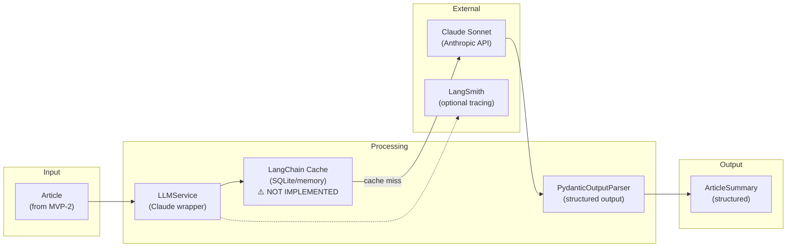
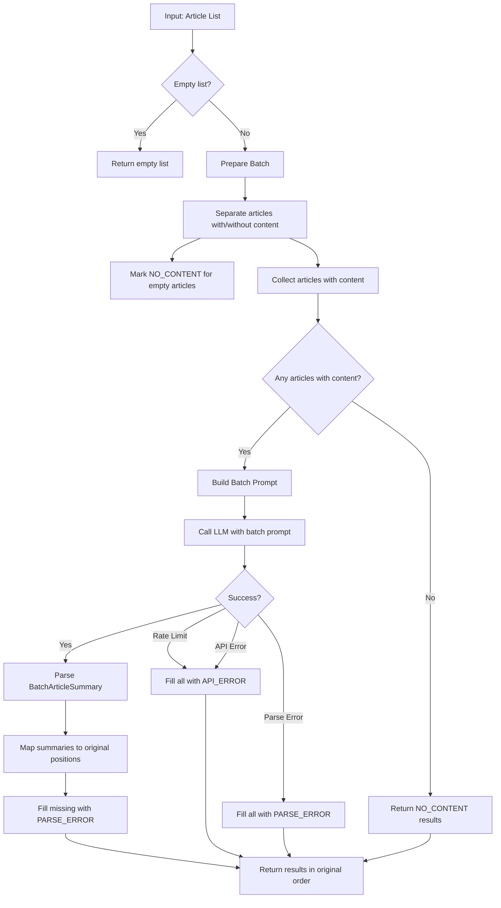

# Feature: LLM Summarization (MVP-3)

## Overview

The LLM Summarization service generates AI-powered summaries of extracted article content using Claude Sonnet. This component takes Article objects from MVP-2 and produces structured summaries with key points and technology tags, ready for relevance scoring and final digest assembly.

**Business Value**: Transforms raw article content into digestible summaries, enabling users to quickly assess article relevance and decide which articles to read in full. The structured output (summary, key points, tags) provides multiple entry points for content understanding.

**Target**: MVP-3 milestone - "Can summarize articles with AI" with real API integration tests passing.

---

## Requirements

### Functional Requirements

| ID | Requirement | Priority |
|----|-------------|----------|
| FR-1 | Generate 2-3 sentence summaries from article content | High |
| FR-2 | Extract 3 key points/takeaways from each article | High |
| FR-3 | Identify relevant technology tags from content | High |
| FR-4 | Handle articles without content gracefully (use title) | Medium |
| FR-5 | Return typed ArticleSummary objects using Pydantic models | High |
| FR-6 | Batch summarization for multiple articles | Medium |
| FR-7 | Skip articles that already have summaries (idempotent) | Low |

### Non-Functional Requirements

| ID | Requirement | Target |
|----|-------------|--------|
| NFR-1 | Real LLM calls using Anthropic API | Required |
| NFR-2 | Response time per article | < 5 seconds |
| NFR-3 | Structured output via PydanticOutputParser | Required |
| NFR-4 | LangSmith tracing support (optional) | Configurable |
| NFR-5 | Caching support (SQLite or in-memory) | **Not Implemented** |
| NFR-6 | Rate limit handling with retry logic | Required |
| NFR-7 | Graceful degradation on API errors | Required |
| NFR-8 | Type safety with full type hints | Required |
| NFR-9 | Integration test coverage with real API | >= 80% |

---

## Architecture

### Component Diagram



### Components

#### ArticleSummary Model (`src/hn_herald/models/summary.py`)

Pydantic model representing structured LLM output for article summaries.

**Responsibilities**:
- Store summary text (2-3 sentences)
- Store key points (3 items)
- Store technology tags (relevant terms)
- Provide validation for LLM output

#### LLMService (`src/hn_herald/services/llm.py`)

Service wrapper for Claude API interactions using langchain-anthropic.

**Responsibilities**:
- Initialize Claude model with configuration
- Execute summarization prompts
- Parse structured output via PydanticOutputParser
- Handle rate limits and API errors
- Support optional caching and tracing
- Batch summarization with concurrency control

---

## Data Models

### ArticleSummary Model

```python
from pydantic import BaseModel, Field


class ArticleSummary(BaseModel):
    """Structured summary output from LLM.

    Generated by Claude from article content, containing a concise summary,
    key takeaways, and relevant technology tags.

    Attributes:
        summary: A 2-3 sentence summary of the article's main points.
        key_points: List of 3 key takeaways from the article.
        tech_tags: List of relevant technology/topic tags.
    """

    summary: str = Field(
        ...,
        description="A concise 2-3 sentence summary of the article",
        min_length=20,
        max_length=500,
    )
    key_points: list[str] = Field(
        ...,
        description="3 key takeaways from the article",
        min_length=1,
        max_length=5,
    )
    tech_tags: list[str] = Field(
        ...,
        description="Relevant technology or topic tags (e.g., 'Python', 'AI', 'Security')",
        max_length=10,
    )

    model_config = {
        "frozen": False,
        "extra": "ignore",
        "str_strip_whitespace": True,
    }
```

### SummarizationStatus Enum

```python
from enum import Enum


class SummarizationStatus(str, Enum):
    """Status of article summarization.

    Tracks the outcome of attempting to summarize article content.
    """

    SUCCESS = "success"           # Summary generated successfully
    NO_CONTENT = "no_content"     # Article has no content to summarize
    API_ERROR = "api_error"       # Claude API error (rate limit, etc.)
    PARSE_ERROR = "parse_error"   # Failed to parse LLM output
    CACHED = "cached"             # Summary retrieved from cache
```

### SummarizedArticle Model

```python
from pydantic import BaseModel, Field

from hn_herald.models.article import Article
from hn_herald.models.summary import ArticleSummary, SummarizationStatus


class SummarizedArticle(BaseModel):
    """Article with LLM-generated summary.

    Extends Article with structured summary data from Claude.

    Attributes:
        article: Original Article from MVP-2.
        summary_data: Structured summary output (None if summarization failed).
        summarization_status: Outcome of summarization attempt.
        error_message: Error details if summarization failed.
    """

    article: Article
    summary_data: ArticleSummary | None = Field(
        default=None,
        description="Structured summary output from LLM",
    )
    summarization_status: SummarizationStatus = Field(
        default=SummarizationStatus.SUCCESS,
        description="Status of summarization attempt",
    )
    error_message: str | None = Field(
        default=None,
        description="Error details if summarization failed",
    )

    @property
    def has_summary(self) -> bool:
        """Check if article has a valid summary."""
        return self.summary_data is not None

    @property
    def display_summary(self) -> str | None:
        """Get summary text for display."""
        return self.summary_data.summary if self.summary_data else None

    @property
    def display_key_points(self) -> list[str]:
        """Get key points for display."""
        return self.summary_data.key_points if self.summary_data else []

    @property
    def display_tags(self) -> list[str]:
        """Get tech tags for display."""
        return self.summary_data.tech_tags if self.summary_data else []
```

### LLMServiceError Exceptions

```python
class LLMServiceError(Exception):
    """Base exception for LLM service errors."""


class LLMRateLimitError(LLMServiceError):
    """Rate limit exceeded on API call."""

    def __init__(self, retry_after: int | None = None) -> None:
        self.retry_after = retry_after
        super().__init__(
            f"Rate limit exceeded{f', retry after {retry_after}s' if retry_after else ''}"
        )


class LLMAPIError(LLMServiceError):
    """Error from Anthropic API."""

    def __init__(self, status_code: int, message: str) -> None:
        self.status_code = status_code
        super().__init__(f"API error {status_code}: {message}")


class LLMParseError(LLMServiceError):
    """Failed to parse LLM output."""

    def __init__(self, raw_output: str, message: str) -> None:
        self.raw_output = raw_output
        super().__init__(f"Parse error: {message}")
```

---

## Implementation Plan

### File Structure

```
src/hn_herald/
├── models/
│   ├── __init__.py          # Export ArticleSummary, SummarizationStatus
│   ├── story.py             # Story model (MVP-1)
│   ├── article.py           # Article model (MVP-2)
│   └── summary.py           # ArticleSummary, SummarizationStatus, SummarizedArticle
│
└── services/
    ├── __init__.py          # Export LLMService
    ├── hn_client.py         # HN API client (MVP-1)
    ├── loader.py            # ArticleLoader service (MVP-2)
    └── llm.py               # LLMService with Claude wrapper

tests/
├── conftest.py              # Shared fixtures (add LLM fixtures)
├── unit/
│   ├── models/
│   │   ├── test_story.py        # Story model tests (MVP-1)
│   │   ├── test_article.py      # Article model tests (MVP-2)
│   │   └── test_summary.py      # ArticleSummary model tests
│   └── services/
│       ├── test_hn_client.py    # HN client tests (MVP-1)
│       ├── test_loader.py       # ArticleLoader tests (MVP-2)
│       └── test_llm.py          # LLMService unit tests (mocked)
└── integration/
    ├── test_hn_client_integration.py   # HN API integration (MVP-1)
    ├── test_loader_integration.py      # ArticleLoader integration (MVP-2)
    └── test_llm_integration.py         # LLMService real API tests
```

### Implementation Tasks

| Task | Estimate | Dependencies |
|------|----------|--------------|
| 1. Create `ArticleSummary` model | 20 min | None |
| 2. Create `SummarizationStatus` enum | 10 min | None |
| 3. Create `SummarizedArticle` model | 20 min | Tasks 1-2 |
| 4. Create exception classes | 15 min | None |
| 5. Implement `LLMService` class structure | 30 min | Tasks 1-4 |
| 6. Implement prompt template | 30 min | Task 5 |
| 7. Implement PydanticOutputParser integration | 30 min | Tasks 5-6 |
| 8. Implement `summarize_article()` single | 45 min | Tasks 5-7 |
| 9. Implement `summarize_articles()` batch | 30 min | Task 8 |
| 10. Implement caching integration | 45 min | Task 8 |
| 11. Implement error handling and retries | 30 min | Task 8 |
| 12. Write unit tests (models) | 30 min | Tasks 1-3 |
| 13. Write unit tests (LLMService with mocks) | 45 min | Tasks 5-11 |
| 14. Write integration tests (real API) | 60 min | Tasks 5-11 |
| 15. Update config.py for new settings | 15 min | None |

**Total Estimate**: ~7.5 hours

---

## LLMService Interface

```python
from __future__ import annotations

import logging
from collections.abc import Sequence
from typing import TYPE_CHECKING

from langchain_anthropic import ChatAnthropic
from langchain.output_parsers import PydanticOutputParser
from langchain.prompts import ChatPromptTemplate

from hn_herald.config import get_settings
from hn_herald.models.article import Article
from hn_herald.models.summary import (
    ArticleSummary,
    SummarizedArticle,
    SummarizationStatus,
)

if TYPE_CHECKING:
    from langchain.cache import BaseCache

logger = logging.getLogger(__name__)


class LLMService:
    """Service for LLM-powered article summarization.

    Wraps Claude Sonnet API with structured output parsing,
    caching, and error handling.

    Usage:
        service = LLMService()
        summarized = await service.summarize_article(article)

    Attributes:
        model: Claude model identifier.
        temperature: LLM temperature setting.
        max_tokens: Maximum tokens per response.
    """

    def __init__(
        self,
        model: str | None = None,
        temperature: float | None = None,
        max_tokens: int | None = None,
        cache: BaseCache | None = None,
    ) -> None:
        """Initialize LLM service.

        Args:
            model: Claude model to use. Defaults to settings value.
            temperature: Temperature for generation. Defaults to settings value.
            max_tokens: Max tokens per response. Defaults to settings value.
            cache: LangChain cache instance. If None, uses settings default.
        """
        ...

    async def summarize_article(self, article: Article) -> SummarizedArticle:
        """Summarize a single article.

        Generates structured summary with key points and tech tags.

        Args:
            article: Article with extracted content.

        Returns:
            SummarizedArticle with summary data or error status.
        """
        ...

    async def summarize_articles(
        self,
        articles: Sequence[Article],
        batch_size: int | None = None,
    ) -> list[SummarizedArticle]:
        """Summarize multiple articles with batching.

        Args:
            articles: Sequence of Articles to summarize.
            batch_size: Number of articles per batch. Defaults to settings value.

        Returns:
            List of SummarizedArticles in same order as input.
        """
        ...

    def _get_content_for_summarization(self, article: Article) -> str | None:
        """Get content to summarize from article.

        Prefers extracted content, falls back to HN text or title.

        Args:
            article: Article to extract content from.

        Returns:
            Content string or None if no content available.
        """
        ...

    def _build_prompt(self, content: str, title: str) -> str:
        """Build summarization prompt with format instructions.

        Args:
            content: Article content to summarize.
            title: Article title for context.

        Returns:
            Formatted prompt string.
        """
        ...
```

---

## Prompt Engineering Strategy

### Summarization Prompt Template

```python
SUMMARIZATION_PROMPT = """You are a technical content summarizer for HackerNews articles.

Given the article title and content below, generate a structured summary.

**Instructions**:
1. Write a concise 2-3 sentence summary capturing the main points
2. Extract exactly 3 key takeaways as bullet points
3. Identify relevant technology/topic tags (e.g., Python, AI, Security, DevOps)

**Article Title**: {title}

**Article Content**:
{content}

{format_instructions}
"""
```

### Prompt Design Principles

1. **Role Setting**: Establish context as "technical content summarizer for HackerNews"
2. **Clear Instructions**: Numbered steps for each output component
3. **Structured Output**: Use PydanticOutputParser format instructions
4. **Content Truncation**: Content is pre-truncated to ~8K characters in MVP-2
5. **Fallback Handling**: If content is minimal, use title for basic summary

### PydanticOutputParser Integration

```python
from langchain.output_parsers import PydanticOutputParser

parser = PydanticOutputParser(pydantic_object=ArticleSummary)
format_instructions = parser.get_format_instructions()

# Format instructions will include JSON schema like:
# The output should be formatted as a JSON instance that conforms to the JSON schema below.
# {
#   "summary": "...",
#   "key_points": ["...", "...", "..."],
#   "tech_tags": ["...", "..."]
# }
```

### Edge Cases

| Case | Handling |
|------|----------|
| Empty content | Use title only, generate brief summary |
| Very short content (<100 chars) | Combine with title for context |
| Non-English content | Summarize in English |
| Code-heavy content | Focus on purpose/functionality |
| Opinion/discussion | Capture main argument/perspective |

---

## Error Handling

### Error Categories

| Error Type | Cause | Handling Strategy |
|------------|-------|-------------------|
| Rate Limit (429) | Too many API requests | Exponential backoff, queue requests |
| API Error (5xx) | Anthropic server issues | Retry with backoff, then fail gracefully |
| API Error (4xx) | Bad request, auth failure | Log error, fail without retry |
| Parse Error | LLM output doesn't match schema | Retry once with explicit format, then fail |
| Timeout | Response took too long | Retry with shorter content, then fail |
| Content Too Long | Exceeds context window | Truncate content further |
| No Content | Article has no extractable text | Return NO_CONTENT status |

### Retry Strategy

```python
from tenacity import (
    retry,
    retry_if_exception_type,
    stop_after_attempt,
    wait_exponential,
)

@retry(
    stop=stop_after_attempt(3),
    wait=wait_exponential(multiplier=2, min=1, max=30),
    retry=retry_if_exception_type(LLMRateLimitError),
    reraise=True,
)
async def _invoke_with_retry(self, prompt: str) -> str:
    """Invoke LLM with retry on rate limits."""
    ...
```

### Graceful Degradation

1. **Summarization fails**: Return article with error status, continue with others
2. **All summarizations fail**: Return articles without summaries, log error
3. **Rate limit exceeded**: Queue remaining requests, process with delays
4. **API unavailable**: Skip summarization entirely, return original articles

---

## Configuration

### Settings Additions (config.py)

```python
# LLM Settings (already present)
llm_model: str = "claude-sonnet-4-20250514"
llm_temperature: float = 0.0
llm_max_tokens: int = 4096

# LangSmith Settings (already present)
langchain_tracing_v2: bool = False
langchain_api_key: str | None = None
langchain_project: str = "hn-herald"

# Caching Settings (already present)
# NOTE: These settings exist in config but are NOT used by LLMService.
# Caching was designed but never implemented.
llm_cache_type: Literal["sqlite", "memory", "none"] = "sqlite"
llm_cache_ttl: int = 86400  # 24 hours
cache_dir: str = ".cache"

# NEW: Summarization-specific settings
summarization_timeout: int = 30  # Seconds per article
summarization_max_retries: int = 3
```

### Environment Variables

```bash
# Required
ANTHROPIC_API_KEY=sk-ant-...

# LLM Configuration
LLM_MODEL=claude-sonnet-4-20250514
LLM_TEMPERATURE=0
LLM_MAX_TOKENS=4096

# LangSmith (optional)
LANGCHAIN_TRACING_V2=true
LANGCHAIN_API_KEY=ls-...
LANGCHAIN_PROJECT=hn-herald

# Caching (NOT IMPLEMENTED - these env vars are defined but not functional)
LLM_CACHE_TYPE=sqlite
LLM_CACHE_TTL=86400

# Summarization (new)
SUMMARIZATION_TIMEOUT=30
SUMMARIZATION_MAX_RETRIES=3
```

---

## Caching Strategy

> **WARNING: NOT IMPLEMENTED**: The following cache implementation was designed but not built. The LLMService currently makes direct API calls without caching.

### Cache Implementation

```python
from langchain.cache import SQLiteCache, InMemoryCache
from langchain.globals import set_llm_cache

from hn_herald.config import get_settings


def setup_llm_cache() -> None:
    """Configure LangChain LLM caching based on settings."""
    settings = get_settings()

    if settings.llm_cache_type == "sqlite":
        # Persistent cache across restarts
        cache = SQLiteCache(database_path=settings.cache_database_path)
        set_llm_cache(cache)
    elif settings.llm_cache_type == "memory":
        # Fast but session-scoped
        cache = InMemoryCache()
        set_llm_cache(cache)
    # else: no caching
```

### Cache Key Strategy (Planned)

> **Note**: The following describes the planned cache key strategy, not current functionality.

- **Key**: Hash of (model, prompt, temperature)
- **TTL**: 24 hours for summaries (content doesn't change)
- **Invalidation**: Manual clear via admin endpoint or cache file deletion

### Cache Benefits (Planned)

> **Note**: The following describes the expected benefits once caching is implemented.

| Metric | Without Cache | With Cache |
|--------|---------------|------------|
| API calls (repeat articles) | 100% | ~10% |
| Response time (cached) | 2-5s | <100ms |
| Cost (repeat summaries) | Full | Zero |

---

## Testing Strategy

### Unit Tests (Mocked)

Test LLMService logic with mocked Claude API responses.

**Test Cases (ArticleSummary Model)**:

| Test | Description | Priority |
|------|-------------|----------|
| `test_summary_model_validation` | Valid summary data creates model | High |
| `test_summary_model_min_length` | Summary below min length fails validation | High |
| `test_summary_model_key_points_required` | At least 1 key point required | High |
| `test_summary_model_empty_tags_allowed` | Empty tech_tags list is valid | Medium |
| `test_summarization_status_values` | All enum values defined | Medium |

**Test Cases (LLMService - Mocked)**:

| Test | Description | Priority |
|------|-------------|----------|
| `test_summarize_article_success` | Generates summary from content | High |
| `test_summarize_article_no_content` | Returns NO_CONTENT status | High |
| `test_summarize_article_parse_error` | Handles malformed LLM output | High |
| `test_summarize_articles_batch` | Batch summarization works | High |
| `test_summarize_articles_preserves_order` | Output order matches input | Medium |
| `test_get_content_prefers_content` | Prefers article content | High |
| `test_get_content_fallback_hn_text` | Falls back to HN text | Medium |
| `test_get_content_fallback_title` | Falls back to title | Medium |
| `test_build_prompt_includes_format` | Prompt includes format instructions | High |

### Integration Tests (Real API)

Mark with `@pytest.mark.slow` and `@pytest.mark.integration`.

**IMPORTANT**: These tests make REAL API calls to Anthropic.

**Test Cases**:

| Test | Description |
|------|-------------|
| `test_summarize_real_article` | Summarize actual article content with real API |
| `test_summarize_minimal_content` | Handle short content with real API |
| `test_output_structure_valid` | Verify PydanticOutputParser works with real output |
| `test_rate_limit_handling` | Verify retry logic works (may require multiple calls) |
| `test_caching_works` | Second call returns cached result |

### Test Fixtures

```python
# tests/conftest.py additions

import pytest

from hn_herald.models.article import Article, ExtractionStatus
from hn_herald.models.summary import ArticleSummary, SummarizedArticle


@pytest.fixture
def sample_summary_data() -> dict:
    """Sample ArticleSummary data."""
    return {
        "summary": "This article discusses the benefits of using Rust for system programming. It highlights memory safety and performance advantages.",
        "key_points": [
            "Rust provides memory safety without garbage collection",
            "Performance is comparable to C/C++",
            "The ecosystem is growing rapidly with strong community support",
        ],
        "tech_tags": ["Rust", "Systems Programming", "Memory Safety"],
    }


@pytest.fixture
def sample_article_with_content(sample_story_data) -> Article:
    """Article with extracted content for summarization."""
    return Article(
        story_id=39856302,
        title="Why Rust is the Future of Systems Programming",
        url="https://example.com/rust-future",
        hn_url="https://news.ycombinator.com/item?id=39856302",
        hn_score=245,
        hn_comments=123,
        author="rustfan",
        content="""
        Rust has emerged as a compelling alternative to C and C++ for systems programming.
        Its ownership model ensures memory safety at compile time without runtime overhead.
        Major companies like Microsoft, Google, and Amazon are increasingly adopting Rust
        for performance-critical infrastructure. The language's ecosystem has matured
        significantly, with tools like Cargo providing excellent package management.
        Error handling with Result types makes code more robust and explicit.
        While the learning curve is steep, developers find the investment worthwhile
        for the safety guarantees and performance benefits Rust provides.
        """,
        word_count=87,
        status=ExtractionStatus.SUCCESS,
        domain="example.com",
    )


@pytest.fixture
def sample_article_no_content() -> Article:
    """Article without extractable content."""
    return Article(
        story_id=39856303,
        title="Ask HN: Best practices for async Python?",
        url=None,
        hn_url="https://news.ycombinator.com/item?id=39856303",
        hn_score=50,
        hn_comments=25,
        author="pythondev",
        status=ExtractionStatus.NO_URL,
        hn_text="I'm looking for advice on structuring async Python applications...",
    )


@pytest.fixture
def mock_llm_response() -> str:
    """Mock LLM response in expected JSON format."""
    return """
    {
        "summary": "This article discusses the benefits of using Rust for system programming. It highlights memory safety and performance advantages.",
        "key_points": [
            "Rust provides memory safety without garbage collection",
            "Performance is comparable to C/C++",
            "The ecosystem is growing rapidly"
        ],
        "tech_tags": ["Rust", "Systems Programming", "Memory Safety"]
    }
    """
```

### Coverage Requirements

- Minimum 80% line coverage for models
- Minimum 80% line coverage for service (excluding actual API calls)
- Integration tests cover happy path and key error scenarios
- All public methods tested

---

## LangSmith Integration

### Tracing Setup

```python
import os

from hn_herald.config import get_settings


def setup_langsmith() -> None:
    """Configure LangSmith tracing if enabled."""
    settings = get_settings()

    if settings.langchain_tracing_v2 and settings.langchain_api_key:
        os.environ["LANGCHAIN_TRACING_V2"] = "true"
        os.environ["LANGCHAIN_API_KEY"] = settings.langchain_api_key
        os.environ["LANGCHAIN_PROJECT"] = settings.langchain_project
```

### Trace Information

LangSmith automatically captures:
- Prompt templates and variables
- LLM responses
- Token usage and latency
- Error traces
- Chain execution flow

### Benefits

- Debug failed summarizations with full context
- Monitor production latency and costs
- Replay traces for testing
- Compare prompt variations

---

## Dependencies

### External Libraries

| Library | Version | Purpose |
|---------|---------|---------|
| langchain-anthropic | >= 0.1.0 | Claude API integration |
| langchain | >= 0.2.0 | Output parsers, caching, prompts |
| pydantic | >= 2.0.0 | Data validation, output parsing |
| tenacity | >= 8.2.0 | Retry logic |

### Internal Dependencies

| Module | Purpose |
|--------|---------|
| `hn_herald.config` | Access LLM settings and API keys |
| `hn_herald.models.article` | Article model from MVP-2 |

---

## Security Considerations

1. **API Key Protection**: Store ANTHROPIC_API_KEY in environment, never in code
2. **Content Sanitization**: LLM output is validated through Pydantic before use
3. **Rate Limiting**: Respect Anthropic rate limits to avoid account issues
4. **Cost Control**: Caching prevents duplicate API calls for same content
5. **Logging**: Never log full prompts or API keys, only summaries of operations

---

## Monitoring and Observability

### Logging

```python
import logging

logger = logging.getLogger(__name__)

# Log levels by event
logger.info("Summarizing %d articles", len(articles))
logger.debug("Building prompt for article %d", article.story_id)
logger.warning("LLM parse error for article %d: %s", article.story_id, error)
logger.error("API error summarizing article %d: %s", article.story_id, error)
logger.info("Summarized %d articles (%d success, %d failed)", total, success, failed)
```

### Metrics (Future)

- Total summarizations per day
- Summarization latency (p50, p95, p99)
- Cache hit rate
- API error rate by type
- Token usage per article

---

## Batch Summarization Algorithm

### Overview

Batch summarization processes multiple articles in a single LLM call for efficiency. This reduces API costs and latency compared to sequential calls.

### Algorithm Flow



### Batch Prompt Structure

```
You are a technical content summarizer for HackerNews articles.

Summarize each of the following articles. For each article, provide:
1. A concise 2-3 sentence summary capturing the main points
2. Exactly 3 key takeaways as bullet points
3. Relevant technology/topic tags (e.g., Python, AI, Security, DevOps)

---
**Article 1**
**Title**: Python 3.13 Performance Improvements
**Content**:
The Python core development team has released...
---

---
**Article 2**
**Title**: Building Production-Ready LLM Applications
**Content**:
Deploying large language models in production...
---

{format_instructions for BatchArticleSummary}
```

### BatchArticleSummary Model

```python
class BatchArticleSummary(BaseModel):
    """Batch of LLM-generated summaries for multiple articles."""

    summaries: list[ArticleSummary] = Field(
        ...,
        description="List of summaries in same order as input articles",
    )
```

### Key Implementation Details

1. **Order Preservation**: Results maintain input order via index tracking
2. **Mixed Content Handling**: Articles without content get NO_CONTENT status before batch call
3. **Partial Failure**: If LLM returns fewer summaries, missing ones get PARSE_ERROR
4. **Error Isolation**: API errors mark all pending articles as failed, but NO_CONTENT results are preserved

### Helper Methods

| Method | Purpose |
|--------|---------|
| `_prepare_batch()` | Separate articles with/without content, initialize results array |
| `_process_batch()` | Execute LLM call and handle success/error cases |
| `_map_batch_results()` | Map parsed summaries back to original positions |
| `_fill_error_results()` | Fill remaining slots with error status |

### Performance Comparison

| Approach | API Calls | Latency (10 articles) | Cost |
|----------|-----------|----------------------|------|
| Sequential | N | ~100-150s | N × base |
| Batch | 1 | ~15-20s | ~1.5 × base |

### Limitations

1. **Context Window**: Batch size limited by model context window
2. **All-or-Nothing Parse**: If batch parse fails, all articles in batch fail
3. **No Partial Retry**: Failed batch doesn't retry individual articles

---

## Future Enhancements

1. **Streaming Responses**: Stream summaries as they generate for faster perceived performance
2. **Multi-Model Support**: Allow switching between Claude models based on content complexity
3. **Custom Summarization Styles**: User-configurable summary length and style
4. **Relevance Pre-filtering**: Use embeddings to filter irrelevant articles before summarization
5. **Summary Quality Scoring**: Evaluate summary quality and regenerate if needed
6. **Fallback Models**: Use cheaper/faster models for retry attempts
7. **Chunked Batching**: Split large article sets into optimal batch sizes

---

## References

- [LangChain-Anthropic Documentation](https://python.langchain.com/docs/integrations/chat/anthropic/)
- [PydanticOutputParser Documentation](https://python.langchain.com/docs/modules/model_io/output_parsers/types/pydantic/)
- [LangChain Caching Documentation](https://python.langchain.com/docs/modules/model_io/llms/llm_caching/)
- [LangSmith Documentation](https://docs.smith.langchain.com/)
- [Anthropic API Documentation](https://docs.anthropic.com/claude/reference/getting-started-with-the-api)
- [Tenacity Documentation](https://tenacity.readthedocs.io/)
