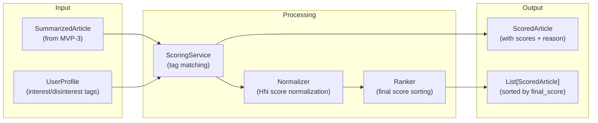
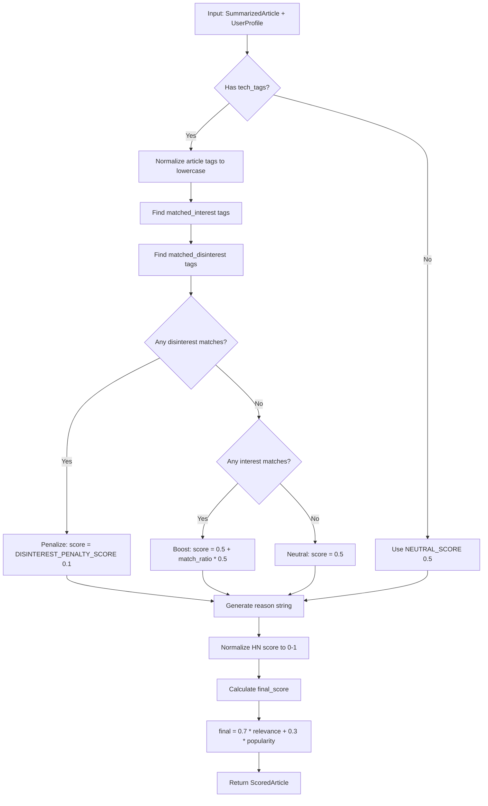

# Feature: Relevance Scoring (MVP-4)

## Overview

The Relevance Scoring service calculates personalized scores for articles based on user interest tags. This component takes SummarizedArticle objects from MVP-3 and produces ranked, scored articles ready for digest display.

**Business Value**: Transforms a generic list of summarized articles into a personalized digest ranked by user interests. Users see the most relevant content first, maximizing the value of their limited reading time.

**Target**: MVP-4 milestone - "Personalized ranking" with scoring accuracy tests passing.

---

## Requirements

### Functional Requirements

| ID | Requirement | Priority |
|----|-------------|----------|
| FR-1 | Score articles 0-1 based on user interest tag matches | High |
| FR-2 | Provide relevance reason explaining why article matched | High |
| FR-3 | Calculate composite final score: 70% relevance + 30% HN popularity | High |
| FR-4 | Rank articles by final score descending | High |
| FR-5 | Support interest tags (topics to see more of) | High |
| FR-6 | Support disinterest tags (topics to filter out) | High |
| FR-7 | Return typed ScoredArticle objects using Pydantic models | High |
| FR-8 | Handle articles without tech_tags gracefully (neutral score) | Medium |

### Non-Functional Requirements

| ID | Requirement | Target |
|----|-------------|--------|
| NFR-1 | Scoring algorithm is deterministic (same input = same output) | Required |
| NFR-2 | Scoring latency per article | < 1 ms |
| NFR-3 | Batch scoring for 50 articles | < 50 ms |
| NFR-4 | No external API calls (pure computation) | Required |
| NFR-5 | Type safety with full type hints | Required |
| NFR-6 | Unit test coverage | >= 70% |

---

## Architecture

### Component Diagram



### Components

#### UserProfile Model (`src/hn_herald/models/profile.py`)

Pydantic model representing user preferences for scoring.

**Responsibilities**:
- Store interest tags (topics to see more of)
- Store disinterest tags (topics to filter out)
- Store minimum relevance score threshold
- Validate tag formats

#### RelevanceScore Model (`src/hn_herald/models/scoring.py`)

Pydantic model representing the relevance calculation result.

**Responsibilities**:
- Store relevance score (0-1)
- Store human-readable reason explaining the score
- Store matched interest/disinterest tags

#### ScoredArticle Model (`src/hn_herald/models/scoring.py`)

Wrapper combining SummarizedArticle with scoring data.

**Responsibilities**:
- Wrap SummarizedArticle from MVP-3
- Store relevance score details
- Store final composite score
- Support ranking operations

#### ScoringService (`src/hn_herald/services/scoring.py`)

Service for calculating relevance scores and ranking articles.

**Responsibilities**:
- Match article tech_tags against user profile
- Calculate relevance score based on tag matches
- Normalize HN popularity score to 0-1 range
- Compute composite final score
- Rank articles by final score
- Generate human-readable relevance reasons

---

## Data Models

### UserProfile Model

```python
from pydantic import BaseModel, Field, field_validator, model_validator

from hn_herald.models.story import StoryType


class UserProfile(BaseModel):
    """User preferences for article relevance scoring and digest generation.

    Stores interest and disinterest tags used to calculate
    personalized relevance scores, along with fetch preferences.

    Attributes:
        interest_tags: Tags for topics user wants to see more of.
        disinterest_tags: Tags for topics user wants to filter out.
        min_score: Minimum final score threshold (0-1).
        max_articles: Maximum number of articles in digest.
        fetch_type: Type of HN stories to fetch (TOP, NEW, BEST, etc.).
        fetch_count: Number of stories to fetch from HN API.

    Example:
        >>> profile = UserProfile(
        ...     interest_tags=["python", "ai", "rust"],
        ...     disinterest_tags=["crypto", "blockchain"],
        ...     min_score=0.3,
        ...     max_articles=10,
        ...     fetch_type=StoryType.TOP,
        ...     fetch_count=30,
        ... )
        >>> "python" in profile.interest_tags
        True
    """

    model_config = {
        "frozen": False,
        "extra": "ignore",
        "str_strip_whitespace": True,
    }

    # Relevance scoring preferences
    interest_tags: list[str] = Field(
        default_factory=list,
        description="Tags for topics to see more of",
        max_length=50,
    )
    disinterest_tags: list[str] = Field(
        default_factory=list,
        description="Tags for topics to filter out",
        max_length=50,
    )
    min_score: float = Field(
        default=0.0,
        ge=0.0,
        le=1.0,
        description="Minimum final score threshold (0-1)",
    )

    # Digest generation preferences
    max_articles: int = Field(
        default=10,
        ge=1,
        le=100,
        description="Maximum number of articles in digest",
    )
    fetch_type: StoryType = Field(
        default=StoryType.TOP,
        description="Type of HN stories to fetch",
    )
    fetch_count: int = Field(
        default=30,
        ge=1,
        le=100,
        description="Number of stories to fetch from HN API",
    )

    @field_validator("interest_tags", "disinterest_tags", mode="before")
    @classmethod
    def normalize_tags(cls, v: list[str]) -> list[str]:
        """Normalize tags to lowercase and remove duplicates.

        Args:
            v: List of tags to normalize.

        Returns:
            Deduplicated list of lowercase tags.
        """
        if not v:
            return []
        # Normalize to lowercase and deduplicate while preserving order
        seen: set[str] = set()
        result: list[str] = []
        for tag in v:
            normalized = tag.strip().lower()
            if normalized and normalized not in seen:
                seen.add(normalized)
                result.append(normalized)
        return result

    @model_validator(mode="after")
    def validate_no_tag_overlap(self) -> "UserProfile":
        """Ensure interest and disinterest tags do not overlap.

        Returns:
            The validated UserProfile instance.

        Raises:
            ValueError: If any tags appear in both interest and disinterest lists.
        """
        if not self.interest_tags or not self.disinterest_tags:
            return self

        overlap = set(self.interest_tags) & set(self.disinterest_tags)
        if overlap:
            raise ValueError(
                f"Tags cannot be in both interest and disinterest lists: {sorted(overlap)}"
            )
        return self

    @property
    def has_preferences(self) -> bool:
        """Check if user has defined any preferences.

        Returns:
            True if user has interest or disinterest tags.
        """
        return bool(self.interest_tags or self.disinterest_tags)
```

### RelevanceScore Model

```python
from pydantic import BaseModel, Field


class RelevanceScore(BaseModel):
    """Relevance score calculation result.

    Contains the computed relevance score and explanation
    of why the article matched (or didn't match) user interests.

    Attributes:
        score: Relevance score from 0 (irrelevant) to 1 (highly relevant).
        reason: Human-readable explanation of the score.
        matched_interest_tags: Interest tags found in article.
        matched_disinterest_tags: Disinterest tags found in article.

    Example:
        >>> relevance = RelevanceScore(
        ...     score=0.8,
        ...     reason="Matches interests: python, ai",
        ...     matched_interest_tags=["python", "ai"],
        ...     matched_disinterest_tags=[],
        ... )
        >>> relevance.score
        0.8
    """

    model_config = {
        "frozen": False,
        "extra": "ignore",
    }

    score: float = Field(
        ...,
        ge=0.0,
        le=1.0,
        description="Relevance score from 0 to 1",
    )
    reason: str = Field(
        ...,
        description="Human-readable explanation of the score",
    )
    matched_interest_tags: list[str] = Field(
        default_factory=list,
        description="Interest tags found in article",
    )
    matched_disinterest_tags: list[str] = Field(
        default_factory=list,
        description="Disinterest tags found in article",
    )

    @property
    def has_interest_matches(self) -> bool:
        """Check if any interest tags matched."""
        return len(self.matched_interest_tags) > 0

    @property
    def has_disinterest_matches(self) -> bool:
        """Check if any disinterest tags matched."""
        return len(self.matched_disinterest_tags) > 0
```

### ScoredArticle Model

```python
from pydantic import BaseModel, Field, computed_field

from hn_herald.models.scoring import RelevanceScore
from hn_herald.models.summary import SummarizedArticle


class ScoredArticle(BaseModel):
    """Article with relevance and final scores.

    Wraps a SummarizedArticle with scoring information for
    personalized ranking in the digest.

    Attributes:
        article: The SummarizedArticle from MVP-3.
        relevance: Relevance score details.
        popularity_score: Normalized HN popularity (0-1).
        final_score: Composite score (70% relevance + 30% popularity).

    Example:
        >>> # Assuming summarized_article and relevance are defined
        >>> scored = ScoredArticle(
        ...     article=summarized_article,
        ...     relevance=relevance,
        ...     popularity_score=0.6,
        ...     final_score=0.74,
        ... )
        >>> scored.final_score
        0.74
        >>> scored.is_filtered(min_score=0.5)
        False
    """

    model_config = {
        "frozen": False,
        "extra": "ignore",
    }

    article: SummarizedArticle = Field(
        ...,
        description="The SummarizedArticle from MVP-3",
    )
    relevance: RelevanceScore = Field(
        ...,
        description="Relevance score details",
    )
    popularity_score: float = Field(
        ...,
        ge=0.0,
        le=1.0,
        description="Normalized HN popularity score (0-1)",
    )
    final_score: float = Field(
        ...,
        ge=0.0,
        le=1.0,
        description="Composite final score (70% relevance + 30% popularity)",
    )

    def is_filtered(self, min_score: float = 0.0) -> bool:
        """Check if article should be filtered based on score threshold.

        Args:
            min_score: Minimum score threshold (0-1). Articles below
                this threshold should be filtered out.

        Returns:
            True if final_score is below the minimum threshold.
        """
        return self.final_score < min_score

    @computed_field  # type: ignore[prop-decorator]
    @property
    def story_id(self) -> int:
        """Get the story ID for convenience."""
        return self.article.article.story_id

    @computed_field  # type: ignore[prop-decorator]
    @property
    def title(self) -> str:
        """Get the article title for convenience."""
        return self.article.article.title

    @computed_field  # type: ignore[prop-decorator]
    @property
    def relevance_score(self) -> float:
        """Get the relevance score for convenience."""
        return self.relevance.score

    @computed_field  # type: ignore[prop-decorator]
    @property
    def relevance_reason(self) -> str:
        """Get the relevance reason for convenience."""
        return self.relevance.reason
```

---

## Implementation Plan

### File Structure

```
src/hn_herald/
├── models/
│   ├── __init__.py          # Export new models
│   ├── story.py             # Story model (MVP-1)
│   ├── article.py           # Article model (MVP-2)
│   ├── summary.py           # ArticleSummary, SummarizedArticle (MVP-3)
│   ├── profile.py           # UserProfile model (NEW)
│   └── scoring.py           # RelevanceScore, ScoredArticle (NEW)
│
└── services/
    ├── __init__.py          # Export ScoringService
    ├── hn_client.py         # HN API client (MVP-1)
    ├── loader.py            # ArticleLoader service (MVP-2)
    ├── llm.py               # LLMService (MVP-3)
    └── scoring.py           # ScoringService (NEW)

tests/
├── conftest.py              # Shared fixtures (add scoring fixtures)
└── unit/
    ├── models/
    │   ├── test_story.py        # Story model tests (MVP-1)
    │   ├── test_article.py      # Article model tests (MVP-2)
    │   ├── test_summary.py      # ArticleSummary tests (MVP-3)
    │   ├── test_profile.py      # UserProfile model tests (NEW)
    │   └── test_scoring.py      # RelevanceScore, ScoredArticle tests (NEW)
    └── services/
        ├── test_hn_client.py    # HN client tests (MVP-1)
        ├── test_loader.py       # ArticleLoader tests (MVP-2)
        ├── test_llm.py          # LLMService tests (MVP-3)
        └── test_scoring.py      # ScoringService tests (NEW)
```

### Implementation Tasks

| Task | Estimate | Dependencies |
|------|----------|--------------|
| 1. Create `UserProfile` model | 20 min | None |
| 2. Create `RelevanceScore` model | 15 min | None |
| 3. Create `ScoredArticle` model | 20 min | Tasks 1-2 |
| 4. Implement `ScoringService` class structure | 20 min | Tasks 1-3 |
| 5. Implement `_calculate_relevance()` tag matching | 30 min | Task 4 |
| 6. Implement `_normalize_popularity()` | 15 min | Task 4 |
| 7. Implement `_generate_reason()` | 20 min | Task 5 |
| 8. Implement `score_article()` single | 20 min | Tasks 5-7 |
| 9. Implement `score_articles()` batch with ranking | 20 min | Task 8 |
| 10. Write unit tests (models) | 30 min | Tasks 1-3 |
| 11. Write unit tests (ScoringService) | 45 min | Tasks 4-9 |
| 12. Update models/__init__.py exports | 5 min | Tasks 1-3 |

**Total Estimate**: ~4.5 hours

---

## ScoringService Interface

```python
from __future__ import annotations

import logging
from collections.abc import Sequence

from hn_herald.models.profile import UserProfile
from hn_herald.models.scoring import RelevanceScore, ScoredArticle
from hn_herald.models.summary import SummarizedArticle

logger = logging.getLogger(__name__)


class ScoringService:
    """Service for calculating article relevance and ranking.

    Scores articles based on user interest/disinterest tags and
    HN popularity, producing a ranked list for digest display.

    Usage:
        service = ScoringService(user_profile)
        scored_articles = service.score_articles(summarized_articles)

    Attributes:
        profile: User preferences for scoring.
        relevance_weight: Weight for relevance in final score (default 0.7).
        popularity_weight: Weight for popularity in final score (default 0.3).
    """

    # Weights for composite score
    RELEVANCE_WEIGHT: float = 0.7
    POPULARITY_WEIGHT: float = 0.3

    # Default score for articles with no tag matches
    NEUTRAL_SCORE: float = 0.5

    # Score for articles matching disinterest tags
    DISINTEREST_PENALTY_SCORE: float = 0.1

    # HN score normalization parameters
    MAX_HN_SCORE: int = 500  # Scores above this are capped at 1.0

    def __init__(
        self,
        profile: UserProfile,
        relevance_weight: float | None = None,
        popularity_weight: float | None = None,
    ) -> None:
        """Initialize scoring service.

        Args:
            profile: User preferences for scoring.
            relevance_weight: Weight for relevance (0-1). Defaults to 0.7.
            popularity_weight: Weight for popularity (0-1). Defaults to 0.3.
        """
        ...

    def score_article(
        self,
        article: SummarizedArticle,
        all_hn_scores: Sequence[int] | None = None,
    ) -> ScoredArticle:
        """Score a single article.

        Calculates relevance based on tag matching and combines with
        normalized HN popularity for a final score.

        Args:
            article: SummarizedArticle to score.
            all_hn_scores: All HN scores in batch for normalization.
                If None, uses article's own score for normalization.

        Returns:
            ScoredArticle with relevance and final scores.
        """
        ...

    def score_articles(
        self,
        articles: Sequence[SummarizedArticle],
        *,
        filter_below_min: bool = True,
    ) -> list[ScoredArticle]:
        """Score and rank multiple articles.

        Scores all articles, optionally filters by min_score,
        and returns sorted by final_score descending.

        Args:
            articles: Sequence of SummarizedArticles to score.
            filter_below_min: If True, exclude articles below profile.min_score.

        Returns:
            List of ScoredArticles sorted by final_score descending.
        """
        ...

    def _calculate_relevance(
        self,
        article_tags: list[str],
    ) -> RelevanceScore:
        """Calculate relevance score from tag matching.

        Args:
            article_tags: Tech tags from article summary.

        Returns:
            RelevanceScore with score, reason, and matched tags.
        """
        ...

    def _normalize_popularity(
        self,
        hn_score: int,
        all_scores: Sequence[int] | None = None,
    ) -> float:
        """Normalize HN score to 0-1 range.

        Args:
            hn_score: Article's HN upvote score.
            all_scores: All HN scores in batch for relative normalization.

        Returns:
            Normalized popularity score (0-1).
        """
        ...

    def _generate_reason(
        self,
        matched_interest: list[str],
        matched_disinterest: list[str],
    ) -> str:
        """Generate human-readable reason for relevance score.

        Args:
            matched_interest: Interest tags that matched.
            matched_disinterest: Disinterest tags that matched.

        Returns:
            Human-readable explanation string.
        """
        ...
```

---

## Scoring Algorithm

### Overview

The scoring algorithm matches article tech_tags against user interest/disinterest tags to calculate a relevance score, then combines it with normalized HN popularity.

### Algorithm Flow



### Relevance Score Calculation

```python
def _calculate_relevance(self, article_tags: list[str]) -> RelevanceScore:
    """Calculate relevance score from tag matching.

    Algorithm:
    - If disinterest tags match: score = 0.1 (penalized)
    - If interest tags match: score = 0.5 + (match_ratio * 0.5), range 0.5-1.0
    - If no matches: score = 0.5 (neutral)
    - If no tags: score = 0.5 (neutral)
    """
    if not article_tags:
        return RelevanceScore(
            score=self.NEUTRAL_SCORE,
            reason="No tags to match",
            matched_interest_tags=[],
            matched_disinterest_tags=[],
        )

    # Handle empty profile
    if not self.profile.has_preferences:
        return RelevanceScore(
            score=self.NEUTRAL_SCORE,
            reason="No preferences configured",
            matched_interest_tags=[],
            matched_disinterest_tags=[],
        )

    # Normalize article tags
    normalized_tags = {tag.lower() for tag in article_tags}

    # Find matches
    matched_interest = [
        tag for tag in self.profile.interest_tags
        if tag in normalized_tags
    ]
    matched_disinterest = [
        tag for tag in self.profile.disinterest_tags
        if tag in normalized_tags
    ]

    # Calculate score
    if matched_disinterest:
        # Penalize articles matching disinterest tags
        score = self.DISINTEREST_PENALTY_SCORE
    elif matched_interest:
        # Boost based on proportion of interest tags matched
        match_ratio = len(matched_interest) / len(self.profile.interest_tags)
        # Scale to 0.5-1.0 range
        score = self.NEUTRAL_SCORE + (match_ratio * 0.5)
    else:
        # Neutral score for no matches
        score = self.NEUTRAL_SCORE

    reason = self._generate_reason(matched_interest, matched_disinterest)

    return RelevanceScore(
        score=score,
        reason=reason,
        matched_interest_tags=matched_interest,
        matched_disinterest_tags=matched_disinterest,
    )
```

### Popularity Normalization

```python
def _normalize_popularity(
    self,
    hn_score: int,
    all_scores: Sequence[int] | None = None,
) -> float:
    """Normalize HN score to 0-1 range."""
    if all_scores and len(all_scores) > 1:
        # Relative normalization within batch
        min_score = min(all_scores)
        max_score = max(all_scores)
        if max_score > min_score:
            return (hn_score - min_score) / (max_score - min_score)
        return 0.5  # All same score

    # Absolute normalization using MAX_HN_SCORE cap
    return min(hn_score / self.MAX_HN_SCORE, 1.0)
```

### Final Score Composition

```python
final_score = (
    self.RELEVANCE_WEIGHT * relevance.score +
    self.POPULARITY_WEIGHT * popularity_score
)
```

### Reason Generation

| Scenario | Example Reason |
|----------|----------------|
| Interest matches | "Matches interests: python, ai" |
| Disinterest matches | "Contains avoided topics: crypto" |
| No matches | "No specific interest match" |
| No tags | "No tags to match" |
| No preferences | "No preferences configured" |

---

## Testing Strategy

### Unit Tests (Models)

**Test Cases (UserProfile)**:

| Test | Description | Priority |
|------|-------------|----------|
| `test_profile_default_values` | Empty profile has empty tag lists | High |
| `test_profile_normalizes_tags` | Tags normalized to lowercase | High |
| `test_profile_deduplicates_tags` | Duplicate tags removed | High |
| `test_profile_has_preferences_true` | Returns True with interest tags | Medium |
| `test_profile_has_preferences_false` | Returns False when empty | Medium |
| `test_profile_min_score_validation` | min_score must be 0-1 | High |

**Test Cases (RelevanceScore)**:

| Test | Description | Priority |
|------|-------------|----------|
| `test_relevance_score_validation` | Score must be 0-1 | High |
| `test_relevance_has_interest_matches` | Property returns True with matches | Medium |
| `test_relevance_has_disinterest_matches` | Property returns True with matches | Medium |

**Test Cases (ScoredArticle)**:

| Test | Description | Priority |
|------|-------------|----------|
| `test_scored_article_computed_fields` | story_id, title properties work | High |
| `test_scored_article_final_score_range` | final_score is 0-1 | High |

### Unit Tests (ScoringService)

| Test | Description | Priority |
|------|-------------|----------|
| `test_score_article_interest_match` | Scores high with interest matches | High |
| `test_score_article_disinterest_match` | Scores low with disinterest matches | High |
| `test_score_article_no_matches` | Returns neutral score | High |
| `test_score_article_no_tags` | Handles missing tech_tags | High |
| `test_score_article_no_preferences` | Handles empty profile | High |
| `test_score_articles_ranking` | Results sorted by final_score desc | High |
| `test_score_articles_filter_min_score` | Filters below min_score | High |
| `test_score_articles_preserves_all` | filter_below_min=False keeps all | Medium |
| `test_normalize_popularity_relative` | Uses batch for normalization | Medium |
| `test_normalize_popularity_absolute` | Uses MAX_HN_SCORE cap | Medium |
| `test_generate_reason_interest` | Reason lists matched interests | High |
| `test_generate_reason_disinterest` | Reason lists avoided topics | High |
| `test_final_score_weights` | 70/30 split correct | High |
| `test_deterministic_scoring` | Same input gives same output | Medium |

### Test Fixtures

```python
# tests/conftest.py additions

import pytest

from hn_herald.models.profile import UserProfile
from hn_herald.models.scoring import RelevanceScore, ScoredArticle


@pytest.fixture
def sample_user_profile() -> UserProfile:
    """User profile with common tech interests."""
    return UserProfile(
        interest_tags=["python", "ai", "rust", "devops"],
        disinterest_tags=["crypto", "blockchain", "nft"],
        min_score=0.3,
    )


@pytest.fixture
def empty_user_profile() -> UserProfile:
    """User profile with no preferences."""
    return UserProfile()


@pytest.fixture
def sample_relevance_score() -> RelevanceScore:
    """Sample relevance score with interest matches."""
    return RelevanceScore(
        score=0.8,
        reason="Matches interests: python, ai",
        matched_interest_tags=["python", "ai"],
        matched_disinterest_tags=[],
    )


@pytest.fixture
def sample_summarized_article_with_tags(sample_article_with_content):
    """SummarizedArticle with tech tags for scoring."""
    from hn_herald.models.summary import (
        ArticleSummary,
        SummarizedArticle,
        SummarizationStatus,
    )

    return SummarizedArticle(
        article=sample_article_with_content,
        summary_data=ArticleSummary(
            summary="An article about Python and AI integration techniques.",
            key_points=[
                "Python is great for AI",
                "Integration is straightforward",
                "Performance is acceptable",
            ],
            tech_tags=["python", "ai", "machine learning"],
        ),
        summarization_status=SummarizationStatus.SUCCESS,
    )


@pytest.fixture
def sample_summarized_article_crypto(sample_article_with_content):
    """SummarizedArticle with crypto tags for scoring."""
    from hn_herald.models.summary import (
        ArticleSummary,
        SummarizedArticle,
        SummarizationStatus,
    )

    # Modify article for this fixture
    article = sample_article_with_content.model_copy()
    article.title = "Crypto Market Analysis"

    return SummarizedArticle(
        article=article,
        summary_data=ArticleSummary(
            summary="Analysis of cryptocurrency market trends and blockchain.",
            key_points=[
                "Bitcoin price analysis",
                "Ethereum updates",
                "Market predictions",
            ],
            tech_tags=["crypto", "blockchain", "bitcoin"],
        ),
        summarization_status=SummarizationStatus.SUCCESS,
    )
```

### Coverage Requirements

- Minimum 70% line coverage for models
- Minimum 70% line coverage for ScoringService
- All public methods tested
- Edge cases covered (empty inputs, no matches, etc.)

---

## Configuration

### Settings (No New Settings Required)

The scoring service uses no external configuration. All parameters are:
- Hardcoded constants (RELEVANCE_WEIGHT, POPULARITY_WEIGHT, MAX_HN_SCORE)
- Passed via UserProfile (interest_tags, disinterest_tags, min_score)

This keeps the implementation simple per YAGNI principles.

### Constants

```python
# In ScoringService class

# Composite score weights
RELEVANCE_WEIGHT: float = 0.7
POPULARITY_WEIGHT: float = 0.3

# Default score when no tag matches
NEUTRAL_SCORE: float = 0.5

# Score for articles matching disinterest tags
DISINTEREST_PENALTY_SCORE: float = 0.1

# HN score normalization cap
MAX_HN_SCORE: int = 500
```

---

## Edge Cases

| Case | Handling |
|------|----------|
| Empty article tech_tags | Return NEUTRAL_SCORE (0.5) |
| Empty user profile | Return NEUTRAL_SCORE for all articles |
| Article matches both interest and disinterest | Disinterest takes precedence (score = 0.1) |
| All articles have same HN score | Popularity normalized to 0.5 |
| Single article in batch | Use absolute normalization |
| HN score exceeds MAX_HN_SCORE | Cap popularity at 1.0 |
| Zero HN score | Popularity = 0.0 |
| No summarized articles | Return empty list |

---

## Future Enhancements

Per YAGNI, these are documented but not implemented:

1. **Weighted Interest Tags**: Allow users to weight certain interests higher
2. **Tag Synonyms**: Map related tags (e.g., "ML" = "machine learning")
3. **Learned Weights**: Adjust weights based on user click behavior
4. **Semantic Matching**: Use embeddings for fuzzy tag matching
5. **Configurable Weights**: Allow users to adjust relevance/popularity ratio

---

## References

- [MVP-3 LLM Summarization Design](./03-llm-summarization.md)
- [Product Requirements - F5 Relevance Scoring](../product.md#f5-relevance-scoring)
- [Pydantic Documentation](https://docs.pydantic.dev/)
