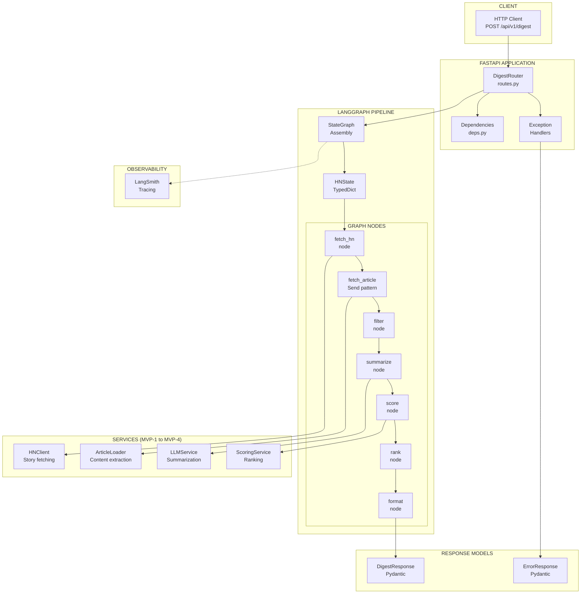
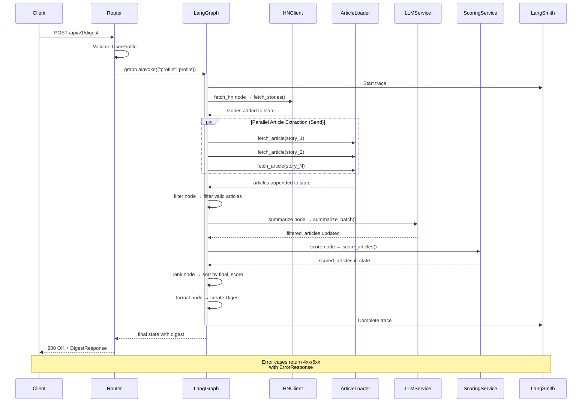
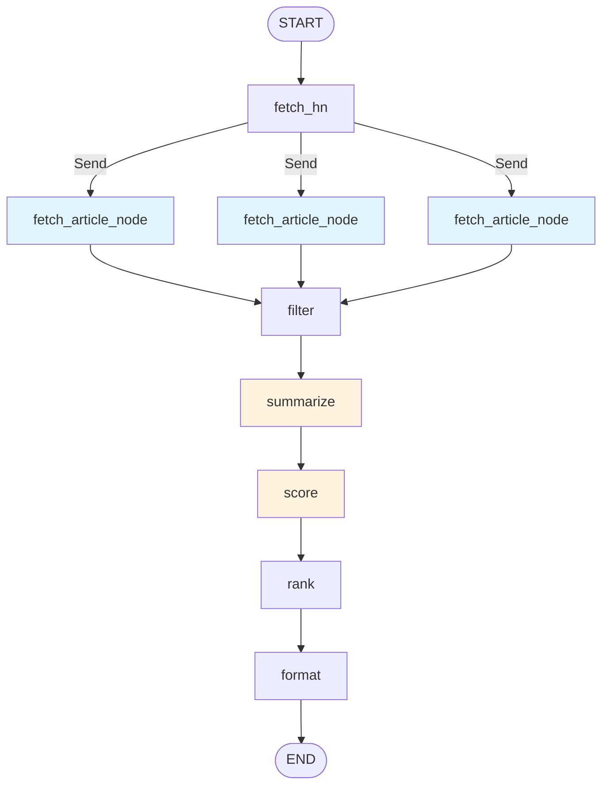

# Feature: FastAPI REST API Layer (MVP-5)

## Overview

The FastAPI REST API layer exposes the digest generation functionality built in MVP-1 through MVP-4 as HTTP endpoints. This component uses LangGraph to orchestrate the complete pipeline: HN story fetching, article extraction, LLM summarization, and relevance scoring to produce personalized digests.

**Business Value**: Transforms backend services into a callable REST API using LangGraph orchestration, enabling web UI (MVP-6+) and external integrations. Users can request personalized HN digests via HTTP with their preference profile, receiving ranked articles optimized for their interests.

**Target**: MVP-5 milestone - "API endpoints" with contract tests passing and OpenAPI documentation.

---

## Requirements

### Functional Requirements

| ID | Requirement | Priority |
|----|-------------|----------|
| FR-1 | Accept UserProfile JSON in request body and generate personalized digest | High |
| FR-2 | Orchestrate pipeline via LangGraph: fetch → extract → filter → summarize → score → rank → format | High |
| FR-3 | Return structured Digest JSON with ranked articles | High |
| FR-4 | Provide health check endpoint for monitoring | High |
| FR-5 | Handle partial failures gracefully (some articles fail to load/summarize) | High |
| FR-6 | Return appropriate HTTP status codes for different error scenarios | High |
| FR-7 | Generate OpenAPI/Swagger documentation automatically | Medium |
| FR-8 | Support CORS for web frontend access | Medium |
| FR-9 | Include processing stats in response (fetched/filtered/errors) | Medium |
| FR-10 | Stream LangGraph execution via LangSmith tracing | Medium |

### Non-Functional Requirements

| ID | Requirement | Target |
|----|-------------|--------|
| NFR-1 | Digest generation latency | < 30s for 30 articles |
| NFR-2 | Concurrent request handling | ≥10 simultaneous digests |
| NFR-3 | Request timeout | 60s max |
| NFR-4 | Graceful error handling | No 500s for user errors |
| NFR-5 | Type safety with full type hints | Required |
| NFR-6 | Unit + integration test coverage | ≥70% |
| NFR-7 | API contract stability | Versioned responses |
| NFR-8 | LangSmith trace coverage | All graph executions |

---

## Architecture

### Component Diagram



### Request/Response Flow



### Components

#### DigestRouter (`src/hn_herald/api/routes.py`)

FastAPI router handling digest endpoints.

**Responsibilities**:
- Define API endpoints with path operations
- Request validation via Pydantic models
- Invoke LangGraph with user profile
- Response formatting and status codes
- Exception handling and error responses
- OpenAPI documentation metadata

#### LangGraph State (`src/hn_herald/graph/state.py`)

TypedDict defining pipeline state.

**Responsibilities**:
- Store user profile input
- Track stories, articles through pipeline stages
- Accumulate errors from parallel operations
- Store final digest output
- Enable state inspection and debugging

#### Graph Nodes (`src/hn_herald/graph/nodes/*.py`)

Individual pipeline stages.

**Responsibilities**:
- `fetch_hn`: Call HNClient to get stories
- `fetch_article`: Call ArticleLoader (Send pattern for parallelism)
- `filter`: Remove invalid articles
- `summarize`: Call LLMService batch summarization
- `score`: Call ScoringService for ranking
- `rank`: Sort by final_score
- `format`: Create Digest from ranked articles

#### Graph Assembly (`src/hn_herald/graph/graph.py`)

StateGraph construction and compilation.

**Responsibilities**:
- Define node connections and edges
- Configure Send pattern for parallel extraction
- Compile to runnable graph
- LangSmith integration
- Timeout handling

#### Dependencies (`src/hn_herald/api/deps.py`)

FastAPI dependency injection for shared resources.

**Responsibilities**:
- Graph instance lifecycle management
- Service instance creation
- Configuration injection
- Async context manager handling

#### Exception Handlers (`src/hn_herald/api/exceptions.py`)

Custom exception types and handlers.

**Responsibilities**:
- Map service exceptions to HTTP status codes
- Map LangGraph errors to user-friendly messages
- Format error responses consistently
- Log errors with trace IDs
- Differentiate user errors (4xx) from server errors (5xx)

---

## Data Models

### Request Models

#### DigestRequest

```python
from pydantic import BaseModel, Field

from hn_herald.models.profile import UserProfile
from hn_herald.models.story import StoryType


class DigestRequest(BaseModel):
    """Request body for digest generation.

    Attributes:
        profile: User preferences for article relevance scoring.
        story_type: Type of HN stories to fetch (top/new/best/ask/show/job).
        story_count: Number of HN stories to fetch (10-100).
        article_limit: Maximum articles to return in digest (1-50).

    Example:
        >>> request = DigestRequest(
        ...     profile=UserProfile(
        ...         interest_tags=["python", "ai"],
        ...         disinterest_tags=["crypto"],
        ...         min_score=0.3,
        ...     ),
        ...     story_type=StoryType.TOP,
        ...     story_count=30,
        ...     article_limit=10,
        ... )
    """

    model_config = {
        "json_schema_extra": {
            "examples": [
                {
                    "profile": {
                        "interest_tags": ["python", "ai", "rust"],
                        "disinterest_tags": ["crypto", "blockchain"],
                        "min_score": 0.3,
                    },
                    "story_type": "top",
                    "story_count": 30,
                    "article_limit": 10,
                }
            ]
        }
    }

    profile: UserProfile = Field(
        ...,
        description="User preferences for scoring",
    )
    story_type: StoryType = Field(
        default=StoryType.TOP,
        description="Type of HN stories to fetch",
    )
    story_count: int = Field(
        default=30,
        ge=10,
        le=100,
        description="Number of HN stories to fetch",
    )
    article_limit: int = Field(
        default=10,
        ge=1,
        le=50,
        description="Maximum articles to return",
    )
```

### Response Models

#### DigestStats

```python
from pydantic import BaseModel, Field


class DigestStats(BaseModel):
    """Statistics about digest generation.

    Attributes:
        stories_fetched: Number of HN stories retrieved.
        articles_extracted: Number of articles successfully extracted.
        articles_summarized: Number of articles successfully summarized.
        articles_scored: Number of articles scored and ranked.
        articles_returned: Number of articles in final digest.
        errors: Number of errors during processing.
        generation_time_ms: Total processing time in milliseconds.
        langsmith_trace_url: LangSmith trace URL for debugging.
    """

    stories_fetched: int = Field(..., ge=0)
    articles_extracted: int = Field(..., ge=0)
    articles_summarized: int = Field(..., ge=0)
    articles_scored: int = Field(..., ge=0)
    articles_returned: int = Field(..., ge=0)
    errors: int = Field(..., ge=0)
    generation_time_ms: int = Field(..., ge=0)
    langsmith_trace_url: str | None = Field(None, description="LangSmith trace URL")
```

#### DigestArticle

```python
from pydantic import BaseModel, Field


class DigestArticle(BaseModel):
    """Article in digest response.

    Simplified view of ScoredArticle for API responses.

    Attributes:
        story_id: HN story ID.
        title: Article title.
        url: Article URL.
        hn_url: HN comments URL.
        hn_score: HN upvote score.
        summary: AI-generated summary (2-3 sentences).
        key_points: 3 key takeaways.
        tech_tags: Technology/topic tags.
        relevance_score: User relevance score (0-1).
        relevance_reason: Explanation of relevance.
        final_score: Composite score (0-1).
    """

    story_id: int = Field(..., description="HN story ID")
    title: str = Field(..., description="Article title")
    url: str = Field(..., description="Article URL")
    hn_url: str = Field(..., description="HN comments URL")
    hn_score: int = Field(..., ge=0, description="HN upvote count")

    summary: str = Field(..., description="AI-generated summary")
    key_points: list[str] = Field(..., description="Key takeaways")
    tech_tags: list[str] = Field(..., description="Technology tags")

    relevance_score: float = Field(..., ge=0.0, le=1.0, description="Relevance (0-1)")
    relevance_reason: str = Field(..., description="Why article is relevant")
    final_score: float = Field(..., ge=0.0, le=1.0, description="Final score (0-1)")
```

#### DigestResponse

```python
from datetime import datetime

from pydantic import BaseModel, Field


class DigestResponse(BaseModel):
    """Response for digest generation.

    Attributes:
        articles: Ranked list of articles.
        stats: Generation statistics.
        timestamp: When digest was generated.
        profile_summary: User profile used for scoring.

    Example:
        >>> # Response with 5 articles
        >>> response = DigestResponse(
        ...     articles=[...],  # DigestArticle objects
        ...     stats=DigestStats(...),
        ...     timestamp=datetime.now(UTC),
        ...     profile_summary={"interests": ["python", "ai"]},
        ... )
    """

    model_config = {
        "json_schema_extra": {
            "examples": [
                {
                    "articles": [
                        {
                            "story_id": 12345,
                            "title": "New Python Features",
                            "url": "https://example.com/python",
                            "hn_url": "https://news.ycombinator.com/item?id=12345",
                            "hn_score": 250,
                            "summary": "Python 3.13 introduces...",
                            "key_points": ["Feature 1", "Feature 2", "Feature 3"],
                            "tech_tags": ["python", "programming"],
                            "relevance_score": 0.85,
                            "relevance_reason": "Matches interests: python",
                            "final_score": 0.78,
                        }
                    ],
                    "stats": {
                        "stories_fetched": 30,
                        "articles_extracted": 25,
                        "articles_summarized": 25,
                        "articles_scored": 25,
                        "articles_returned": 10,
                        "errors": 5,
                        "generation_time_ms": 15000,
                        "langsmith_trace_url": "https://smith.langchain.com/...",
                    },
                    "timestamp": "2025-01-04T12:00:00Z",
                    "profile_summary": {
                        "interests": ["python", "ai"],
                        "disinterests": ["crypto"],
                    },
                }
            ]
        }
    }

    articles: list[DigestArticle] = Field(
        ...,
        description="Ranked articles in digest",
    )
    stats: DigestStats = Field(
        ...,
        description="Generation statistics",
    )
    timestamp: datetime = Field(
        ...,
        description="Digest generation timestamp",
    )
    profile_summary: dict[str, list[str]] = Field(
        ...,
        description="Summary of user profile used",
    )
```

### Error Models

#### ErrorDetail

```python
from pydantic import BaseModel, Field


class ErrorDetail(BaseModel):
    """Detailed error information.

    Attributes:
        field: Field name that caused the error (for validation errors).
        message: Human-readable error message.
        type: Error type code.
    """

    field: str | None = Field(None, description="Field with error")
    message: str = Field(..., description="Error message")
    type: str = Field(..., description="Error type code")
```

#### ErrorResponse

```python
from pydantic import BaseModel, Field


class ErrorResponse(BaseModel):
    """Standard error response format.

    Attributes:
        error: High-level error message.
        details: Detailed error information.
        request_id: Request identifier for tracking.
        trace_url: LangSmith trace URL if available.

    Example:
        >>> error = ErrorResponse(
        ...     error="Invalid user profile",
        ...     details=[
        ...         ErrorDetail(
        ...             field="profile.min_score",
        ...             message="Must be between 0 and 1",
        ...             type="value_error.range",
        ...         )
        ...     ],
        ...     request_id="req_abc123",
        ... )
    """

    model_config = {
        "json_schema_extra": {
            "examples": [
                {
                    "error": "Invalid user profile",
                    "details": [
                        {
                            "field": "profile.min_score",
                            "message": "Must be between 0 and 1",
                            "type": "value_error.range",
                        }
                    ],
                    "request_id": "req_abc123",
                }
            ]
        }
    }

    error: str = Field(..., description="Error summary")
    details: list[ErrorDetail] = Field(
        default_factory=list,
        description="Detailed errors",
    )
    request_id: str | None = Field(
        None,
        description="Request ID for debugging",
    )
    trace_url: str | None = Field(
        None,
        description="LangSmith trace URL for debugging",
    )
```

---

## LangGraph State Definition

### HNState TypedDict

```python
"""LangGraph state definition for HN Herald pipeline."""

from typing import Annotated, TypedDict

from langgraph.graph import add

from hn_herald.models.article import Article
from hn_herald.models.profile import UserProfile
from hn_herald.models.scoring import ScoredArticle
from hn_herald.models.story import Story
from hn_herald.models.summary import SummarizedArticle


class HNState(TypedDict):
    """State for HN Herald digest generation pipeline.

    This state flows through the LangGraph nodes, accumulating data
    at each stage from HN fetching to final digest formatting.

    Attributes:
        # Input
        profile: User preferences for scoring.
        story_type: Type of stories to fetch.
        story_count: Number of stories to fetch.
        article_limit: Maximum articles in final digest.

        # Pipeline stages
        stories: HN stories fetched from API.
        articles: Articles extracted (parallel append via Send).
        filtered_articles: Valid articles with content.
        summarized_articles: Articles with LLM summaries.
        scored_articles: Articles with relevance scores.
        ranked_articles: Articles sorted by final_score.

        # Output
        digest_articles: Final list for response.

        # Metadata
        timestamp: Generation timestamp.
        errors: Accumulated errors (parallel append).
        generation_time_ms: Total processing time.

    Notes:
        - `articles` and `errors` use Annotated with `add` for parallel append
        - State is immutable - nodes return updated copies
    """

    # Input parameters
    profile: UserProfile
    story_type: str
    story_count: int
    article_limit: int

    # Pipeline data (progressive refinement)
    stories: list[Story]
    articles: Annotated[list[Article], add]  # Parallel append via Send
    filtered_articles: list[Article]
    summarized_articles: list[SummarizedArticle]
    scored_articles: list[ScoredArticle]
    ranked_articles: list[ScoredArticle]

    # Output
    digest_articles: list[ScoredArticle]

    # Metadata
    timestamp: str
    errors: Annotated[list[str], add]  # Parallel append
    generation_time_ms: int
```

### State Flow Example

```python
# Initial state from API request
initial_state = {
    "profile": user_profile,
    "story_type": "top",
    "story_count": 30,
    "article_limit": 10,
    "articles": [],
    "errors": [],
    "timestamp": datetime.now(UTC).isoformat(),
}

# After fetch_hn node
{
    ...initial_state,
    "stories": [Story(...), Story(...), ...],  # 30 stories
}

# After fetch_article nodes (Send pattern)
{
    ...prev_state,
    "articles": [Article(...), Article(...), ...],  # 27 articles (3 failed)
    "errors": ["Failed to load article 123", ...],
}

# After filter node
{
    ...prev_state,
    "filtered_articles": [Article(...), ...],  # 25 articles with content
}

# After summarize node
{
    ...prev_state,
    "summarized_articles": [SummarizedArticle(...), ...],  # 25 summaries
}

# After score node
{
    ...prev_state,
    "scored_articles": [ScoredArticle(...), ...],  # 25 scored
}

# After rank node
{
    ...prev_state,
    "ranked_articles": [ScoredArticle(...), ...],  # Sorted by final_score
}

# After format node (final state)
{
    ...prev_state,
    "digest_articles": [ScoredArticle(...), ...],  # Top 10
    "generation_time_ms": 18500,
}
```

---

## Graph Node Specifications

### Node Implementations

#### fetch_hn Node

```python
"""Fetch HN stories node."""

from hn_herald.graph.state import HNState
from hn_herald.models.story import StoryType
from hn_herald.services.hn_client import HNClient, HNClientError


async def fetch_hn(state: HNState) -> dict:
    """Fetch HN stories based on user preferences.

    Args:
        state: Current pipeline state with profile and story_type.

    Returns:
        State update with stories list.

    Raises:
        HNClientError: If HN API is unavailable.
    """
    async with HNClient() as client:
        stories = await client.fetch_stories(
            story_type=StoryType(state["story_type"]),
            limit=state["story_count"],
        )

    return {"stories": stories}
```

#### fetch_article Node (Send Pattern)

```python
"""Fetch article content node with Send pattern for parallelism."""

from langgraph.graph import Send

from hn_herald.graph.state import HNState
from hn_herald.models.article import Article
from hn_herald.models.story import Story
from hn_herald.services.loader import ArticleLoader


def create_fetch_article_sends(state: HNState) -> list[Send]:
    """Create Send objects for parallel article fetching.

    This function runs first, creating Send nodes for each story.
    LangGraph executes them in parallel.

    Args:
        state: State with stories to fetch.

    Returns:
        List of Send objects targeting fetch_article_node.
    """
    return [
        Send("fetch_article_node", {"story": story})
        for story in state["stories"]
    ]


async def fetch_article_node(state: dict) -> dict:
    """Fetch single article content (executed in parallel).

    Args:
        state: Mini-state with single story.

    Returns:
        State update with article or error.
    """
    story: Story = state["story"]

    try:
        async with ArticleLoader() as loader:
            article = await loader.load_article(story)

        # Only return article if content was successfully extracted
        if article.content:
            return {"articles": [article]}
        else:
            return {"errors": [f"No content for story {story.id}"]}

    except Exception as e:
        return {"errors": [f"Failed to load story {story.id}: {e}"]}
```

#### filter Node

```python
"""Filter articles with valid content."""

from hn_herald.graph.state import HNState


def filter_articles(state: HNState) -> dict:
    """Filter articles to only those with content.

    Args:
        state: State with articles list.

    Returns:
        State update with filtered_articles.
    """
    filtered = [
        article
        for article in state["articles"]
        if article.content and len(article.content) > 100
    ]

    return {"filtered_articles": filtered}
```

#### summarize Node

```python
"""Summarize articles using LLM service."""

from hn_herald.graph.state import HNState
from hn_herald.services.llm import LLMService


async def summarize_articles(state: HNState) -> dict:
    """Batch summarize filtered articles.

    Args:
        state: State with filtered_articles.

    Returns:
        State update with summarized_articles and errors.
    """
    service = LLMService()

    # Prepare batch input
    batch_input = [
        (a.story_id, a.title, a.url, a.content)
        for a in state["filtered_articles"]
    ]

    # Batch summarize
    batch_result = await service.summarize_batch(batch_input)

    # Track errors
    errors = []
    if batch_result.failed > 0:
        errors.append(f"{batch_result.failed} articles failed summarization")

    return {
        "summarized_articles": batch_result.articles,
        "errors": errors,
    }
```

#### score Node

```python
"""Score articles based on relevance."""

from hn_herald.graph.state import HNState
from hn_herald.services.scoring import ScoringService


def score_articles(state: HNState) -> dict:
    """Score and filter articles by relevance.

    Args:
        state: State with summarized_articles and profile.

    Returns:
        State update with scored_articles.
    """
    service = ScoringService(state["profile"])

    scored = service.score_articles(
        state["summarized_articles"],
        filter_below_min=True,
    )

    return {"scored_articles": scored}
```

#### rank Node

```python
"""Rank articles by final score."""

from hn_herald.graph.state import HNState


def rank_articles(state: HNState) -> dict:
    """Sort articles by final_score descending.

    Args:
        state: State with scored_articles.

    Returns:
        State update with ranked_articles.
    """
    ranked = sorted(
        state["scored_articles"],
        key=lambda a: a.final_score,
        reverse=True,
    )

    return {"ranked_articles": ranked}
```

#### format Node

```python
"""Format final digest output."""

from hn_herald.graph.state import HNState


def format_digest(state: HNState) -> dict:
    """Format final digest articles.

    Args:
        state: State with ranked_articles and article_limit.

    Returns:
        State update with digest_articles (limited).
    """
    digest_articles = state["ranked_articles"][: state["article_limit"]]

    return {"digest_articles": digest_articles}
```

---

## Graph Assembly

### StateGraph Construction

```python
"""Assemble LangGraph pipeline for HN Herald."""

from langgraph.graph import END, START, StateGraph

from hn_herald.graph.nodes.fetch_hn import fetch_hn
from hn_herald.graph.nodes.fetch_article import (
    create_fetch_article_sends,
    fetch_article_node,
)
from hn_herald.graph.nodes.filter import filter_articles
from hn_herald.graph.nodes.summarize import summarize_articles
from hn_herald.graph.nodes.score import score_articles
from hn_herald.graph.nodes.rank import rank_articles
from hn_herald.graph.nodes.format import format_digest
from hn_herald.graph.state import HNState


def create_digest_graph() -> StateGraph:
    """Create and compile the digest generation graph.

    Returns:
        Compiled StateGraph ready for invocation.
    """
    # Create graph
    graph = StateGraph(HNState)

    # Add nodes
    graph.add_node("fetch_hn", fetch_hn)
    graph.add_node("fetch_article_node", fetch_article_node)
    graph.add_node("filter", filter_articles)
    graph.add_node("summarize", summarize_articles)
    graph.add_node("score", score_articles)
    graph.add_node("rank", rank_articles)
    graph.add_node("format", format_digest)

    # Define edges
    graph.add_edge(START, "fetch_hn")

    # Send pattern for parallel article fetching
    graph.add_conditional_edges(
        "fetch_hn",
        create_fetch_article_sends,
        ["fetch_article_node"],
    )

    # Linear pipeline after parallel fetch
    graph.add_edge("fetch_article_node", "filter")
    graph.add_edge("filter", "summarize")
    graph.add_edge("summarize", "score")
    graph.add_edge("score", "rank")
    graph.add_edge("rank", "format")
    graph.add_edge("format", END)

    # Compile
    return graph.compile()


# Global graph instance
digest_graph = create_digest_graph()
```

### Graph Visualization (Mermaid)



---

## API Endpoints

### POST /api/v1/digest

Generate personalized HN digest using LangGraph pipeline.

**Request**:
- **Method**: POST
- **Content-Type**: application/json
- **Body**: DigestRequest

**Success Response**:
- **Status**: 200 OK
- **Content-Type**: application/json
- **Body**: DigestResponse

**Error Responses**:

| Status | Scenario | Response Body |
|--------|----------|---------------|
| 400 Bad Request | Invalid UserProfile validation | ErrorResponse |
| 408 Request Timeout | Generation exceeded 60s | ErrorResponse |
| 422 Unprocessable Entity | Malformed JSON | ErrorResponse |
| 500 Internal Server Error | Unexpected server error | ErrorResponse |
| 503 Service Unavailable | External service (HN/Anthropic) down | ErrorResponse |

**Example Request**:

```bash
curl -X POST http://localhost:8000/api/v1/digest \
  -H "Content-Type: application/json" \
  -d '{
    "profile": {
      "interest_tags": ["python", "ai", "rust"],
      "disinterest_tags": ["crypto", "blockchain"],
      "min_score": 0.3
    },
    "story_type": "top",
    "story_count": 30,
    "article_limit": 10
  }'
```

**Example Success Response (200)**:

```json
{
  "articles": [
    {
      "story_id": 38824172,
      "title": "Show HN: AI-Powered Python Debugger",
      "url": "https://example.com/ai-debugger",
      "hn_url": "https://news.ycombinator.com/item?id=38824172",
      "hn_score": 320,
      "summary": "A new debugging tool leverages AI to automatically identify and suggest fixes for Python bugs. Uses LLM analysis to understand stack traces and propose solutions.",
      "key_points": [
        "AI analyzes stack traces to suggest fixes",
        "Supports Python 3.8+ with IDE integration",
        "Open source with MIT license"
      ],
      "tech_tags": ["python", "ai", "debugging", "developer-tools"],
      "relevance_score": 0.90,
      "relevance_reason": "Matches interests: python, ai",
      "final_score": 0.82
    }
  ],
  "stats": {
    "stories_fetched": 30,
    "articles_extracted": 27,
    "articles_summarized": 27,
    "articles_scored": 27,
    "articles_returned": 10,
    "errors": 3,
    "generation_time_ms": 18500,
    "langsmith_trace_url": "https://smith.langchain.com/o/abc123/projects/p/def456/r/ghi789"
  },
  "timestamp": "2025-01-04T12:34:56.789Z",
  "profile_summary": {
    "interests": ["python", "ai", "rust"],
    "disinterests": ["crypto", "blockchain"]
  }
}
```

**Example Error Response (400)**:

```json
{
  "error": "Invalid user profile",
  "details": [
    {
      "field": "profile.min_score",
      "message": "Input should be less than or equal to 1",
      "type": "less_than_equal"
    }
  ],
  "request_id": "req_f8a9c3b1"
}
```

---

### GET /api/v1/health

Health check endpoint for monitoring and load balancers.

**Request**:
- **Method**: GET
- **Query Parameters**: None

**Success Response**:
- **Status**: 200 OK
- **Content-Type**: application/json
- **Body**:

```json
{
  "status": "healthy",
  "version": "0.1.0",
  "timestamp": "2025-01-04T12:34:56.789Z",
  "services": {
    "hn_api": "ok",
    "llm": "ok",
    "langsmith": "ok"
  }
}
```

**Degraded Response** (still 200 OK):

```json
{
  "status": "degraded",
  "version": "0.1.0",
  "timestamp": "2025-01-04T12:34:56.789Z",
  "services": {
    "hn_api": "ok",
    "llm": "slow",
    "langsmith": "ok"
  }
}
```

**Unhealthy Response** (503 Service Unavailable):

```json
{
  "status": "unhealthy",
  "version": "0.1.0",
  "timestamp": "2025-01-04T12:34:56.789Z",
  "services": {
    "hn_api": "error",
    "llm": "ok",
    "langsmith": "disabled"
  }
}
```

---

## Implementation Plan

### File Structure

```
src/hn_herald/
├── api/
│   ├── __init__.py          # Export router
│   ├── routes.py            # FastAPI endpoints (NEW)
│   ├── deps.py              # Dependency injection (NEW)
│   ├── exceptions.py        # Custom exceptions (NEW)
│   └── models/
│       ├── __init__.py      # Export request/response models
│       ├── request.py       # DigestRequest (NEW)
│       └── response.py      # DigestResponse, ErrorResponse (NEW)
│
├── graph/
│   ├── __init__.py          # Export graph
│   ├── state.py             # HNState TypedDict (NEW)
│   ├── graph.py             # StateGraph assembly (NEW)
│   └── nodes/
│       ├── __init__.py
│       ├── fetch_hn.py      # HN fetching node (NEW)
│       ├── fetch_article.py # Article extraction node (NEW)
│       ├── filter.py        # Filtering node (NEW)
│       ├── summarize.py     # Summarization node (NEW)
│       ├── score.py         # Scoring node (NEW)
│       ├── rank.py          # Ranking node (NEW)
│       └── format.py        # Formatting node (NEW)
│
├── main.py                  # FastAPI app initialization (UPDATE)
└── config.py                # Settings (already exists)

tests/
├── conftest.py              # Add API and graph fixtures
├── unit/
│   ├── api/
│   │   ├── test_models.py       # Request/response validation (NEW)
│   │   └── test_exceptions.py   # Exception mapping tests (NEW)
│   └── graph/
│       ├── test_state.py        # State validation (NEW)
│       └── test_nodes.py        # Individual node tests (NEW)
└── integration/
    └── api/
        ├── test_digest_endpoint.py  # End-to-end API tests (NEW)
        └── test_graph_pipeline.py   # Full graph execution (NEW)
```

### Implementation Tasks

| Task | Estimate | Dependencies |
|------|----------|--------------|
| 1. Create HNState TypedDict (state.py) | 15 min | None |
| 2. Create API models (request.py, response.py) | 30 min | None |
| 3. Create custom exceptions (exceptions.py) | 20 min | None |
| 4. Implement fetch_hn node | 20 min | Task 1, MVP-1 |
| 5. Implement fetch_article node with Send pattern | 30 min | Task 1, MVP-2 |
| 6. Implement filter node | 15 min | Task 1 |
| 7. Implement summarize node | 20 min | Task 1, MVP-3 |
| 8. Implement score node | 20 min | Task 1, MVP-4 |
| 9. Implement rank node | 10 min | Task 1 |
| 10. Implement format node | 15 min | Task 1 |
| 11. Assemble StateGraph (graph.py) | 30 min | Tasks 4-10 |
| 12. Create dependency injection (deps.py) | 15 min | Task 11 |
| 13. Create router with endpoints (routes.py) | 40 min | Tasks 2-3, 11-12 |
| 14. Wire up FastAPI app (main.py) | 20 min | Task 13 |
| 15. Write unit tests (models, state) | 30 min | Tasks 1-2 |
| 16. Write unit tests (nodes) | 60 min | Tasks 4-10 |
| 17. Write integration tests (graph pipeline) | 45 min | Task 11 |
| 18. Write integration tests (API endpoints) | 60 min | Tasks 13-14 |
| 19. Add OpenAPI metadata | 15 min | Task 13 |
| 20. Update __init__.py exports | 10 min | All above |

**Total Estimate**: ~8 hours

---

## Router Implementation

### FastAPI Router

```python
"""FastAPI routes for digest generation."""

import time
from datetime import UTC, datetime

from fastapi import APIRouter, HTTPException, Request, status
from langsmith import traceable

from hn_herald.api.deps import get_digest_graph
from hn_herald.api.models.request import DigestRequest
from hn_herald.api.models.response import (
    DigestArticle,
    DigestResponse,
    DigestStats,
    ErrorResponse,
)
from hn_herald.graph.graph import digest_graph
from hn_herald.services.hn_client import HNClientError

router = APIRouter(prefix="/api/v1", tags=["digest"])


@router.post(
    "/digest",
    response_model=DigestResponse,
    status_code=status.HTTP_200_OK,
    responses={
        400: {"model": ErrorResponse, "description": "Invalid request"},
        408: {"model": ErrorResponse, "description": "Request timeout"},
        503: {"model": ErrorResponse, "description": "Service unavailable"},
    },
)
@traceable(name="digest_endpoint", run_type="chain")
async def generate_digest(
    request: DigestRequest,
    http_request: Request,
) -> DigestResponse:
    """Generate personalized HN digest using LangGraph.

    Orchestrates the complete pipeline via LangGraph:
    1. Fetch HN stories
    2. Extract article content (parallel)
    3. Filter valid articles
    4. Batch summarize with LLM
    5. Score by relevance
    6. Rank and format

    Args:
        request: Digest generation parameters with user profile.
        http_request: FastAPI request for context.

    Returns:
        DigestResponse with ranked articles and stats.

    Raises:
        HTTPException 400: Invalid user profile.
        HTTPException 408: Generation timeout.
        HTTPException 503: External service unavailable.
    """
    start_time = time.monotonic()

    # Prepare initial state
    initial_state = {
        "profile": request.profile,
        "story_type": request.story_type.value,
        "story_count": request.story_count,
        "article_limit": request.article_limit,
        "articles": [],
        "errors": [],
        "timestamp": datetime.now(UTC).isoformat(),
    }

    try:
        # Invoke LangGraph
        graph = get_digest_graph()
        final_state = await graph.ainvoke(
            initial_state,
            config={"configurable": {"thread_id": http_request.state.request_id}},
        )

        # Calculate generation time
        generation_time_ms = int((time.monotonic() - start_time) * 1000)

        # Format response
        return DigestResponse(
            articles=[
                _to_digest_article(article)
                for article in final_state["digest_articles"]
            ],
            stats=DigestStats(
                stories_fetched=len(final_state.get("stories", [])),
                articles_extracted=len(final_state.get("articles", [])),
                articles_summarized=len(final_state.get("summarized_articles", [])),
                articles_scored=len(final_state.get("scored_articles", [])),
                articles_returned=len(final_state["digest_articles"]),
                errors=len(final_state.get("errors", [])),
                generation_time_ms=generation_time_ms,
                langsmith_trace_url=_get_trace_url(http_request.state.request_id),
            ),
            timestamp=datetime.fromisoformat(final_state["timestamp"]),
            profile_summary={
                "interests": request.profile.interest_tags,
                "disinterests": request.profile.disinterest_tags,
            },
        )

    except HNClientError as e:
        raise HTTPException(
            status_code=status.HTTP_503_SERVICE_UNAVAILABLE,
            detail="HackerNews API is currently unavailable",
        ) from e

    except asyncio.TimeoutError as e:
        raise HTTPException(
            status_code=status.HTTP_408_REQUEST_TIMEOUT,
            detail="Digest generation exceeded timeout",
        ) from e


def _to_digest_article(scored_article) -> DigestArticle:
    """Convert ScoredArticle to DigestArticle."""
    return DigestArticle(
        story_id=scored_article.story_id,
        title=scored_article.title,
        url=scored_article.summarized_article.article.url,
        hn_url=scored_article.summarized_article.article.hn_url,
        hn_score=scored_article.summarized_article.article.hn_score,
        summary=scored_article.summarized_article.summary_data.summary,
        key_points=scored_article.summarized_article.summary_data.key_points,
        tech_tags=scored_article.summarized_article.summary_data.tech_tags,
        relevance_score=scored_article.relevance_score,
        relevance_reason=scored_article.relevance_reason,
        final_score=scored_article.final_score,
    )


def _get_trace_url(request_id: str) -> str | None:
    """Get LangSmith trace URL if tracing enabled."""
    from hn_herald.config import get_settings

    settings = get_settings()
    if settings.langchain_tracing_v2:
        # Construct trace URL (simplified - actual URL from LangSmith)
        return f"https://smith.langchain.com/trace/{request_id}"
    return None


@router.get("/health")
async def health_check():
    """Health check endpoint."""
    # TODO: Implement service health checks
    return {
        "status": "healthy",
        "version": "0.1.0",
        "timestamp": datetime.now(UTC).isoformat(),
        "services": {
            "hn_api": "ok",
            "llm": "ok",
            "langsmith": "ok",
        },
    }
```

---

## Testing Strategy

### Unit Tests (Graph Nodes)

**Test Cases**:

| Test | Description | Priority |
|------|-------------|----------|
| `test_fetch_hn_node` | Fetch stories from HN | High |
| `test_fetch_article_node_success` | Article loaded successfully | High |
| `test_fetch_article_node_failure` | Article load failure isolated | High |
| `test_filter_node` | Filters articles without content | High |
| `test_summarize_node` | Batch summarization | High |
| `test_score_node` | Relevance scoring | High |
| `test_rank_node` | Sorting by final_score | High |
| `test_format_node` | Limits to article_limit | High |

### Integration Tests (Graph Pipeline)

**Test Cases**:

| Test | Description | Priority |
|------|-------------|----------|
| `test_full_pipeline_execution` | Complete graph invocation | High |
| `test_pipeline_with_failures` | Handles partial article failures | High |
| `test_pipeline_empty_results` | No articles pass filtering | Medium |
| `test_pipeline_state_progression` | State updated correctly at each stage | High |
| `test_send_pattern_parallelism` | Articles fetched in parallel | High |

### Integration Tests (API Endpoints)

**Test Cases**:

| Test | Description | Priority |
|------|-------------|----------|
| `test_post_digest_success` | 200 OK with valid request | High |
| `test_post_digest_invalid_profile` | 400 Bad Request | High |
| `test_post_digest_malformed_json` | 422 Unprocessable Entity | High |
| `test_health_check_ok` | 200 OK health status | High |
| `test_langsmith_trace_url` | Trace URL included when enabled | Medium |
| `test_cors_headers` | CORS headers present | Medium |
| `test_openapi_schema` | OpenAPI docs accessible | Medium |

### Test Fixtures

```python
# tests/conftest.py additions

import pytest
from fastapi.testclient import TestClient

from hn_herald.api.models.request import DigestRequest
from hn_herald.graph.state import HNState
from hn_herald.models.profile import UserProfile
from hn_herald.models.story import StoryType


@pytest.fixture
def sample_digest_request() -> DigestRequest:
    """Sample digest request for testing."""
    return DigestRequest(
        profile=UserProfile(
            interest_tags=["python", "ai"],
            disinterest_tags=["crypto"],
            min_score=0.3,
        ),
        story_type=StoryType.TOP,
        story_count=30,
        article_limit=10,
    )


@pytest.fixture
def initial_state(sample_digest_request) -> HNState:
    """Initial graph state."""
    return {
        "profile": sample_digest_request.profile,
        "story_type": sample_digest_request.story_type.value,
        "story_count": sample_digest_request.story_count,
        "article_limit": sample_digest_request.article_limit,
        "articles": [],
        "errors": [],
        "timestamp": "2025-01-04T12:00:00Z",
    }


@pytest.fixture
def api_client() -> TestClient:
    """FastAPI test client."""
    from hn_herald.main import app

    return TestClient(app)
```

### Coverage Requirements

- Minimum 70% line coverage for api/ and graph/ modules
- All endpoints tested (200, 4xx, 5xx paths)
- All graph nodes tested individually
- Full pipeline integration test
- Send pattern parallelism verified

---

## Configuration

### Environment Variables

Uses existing settings from `config.py` plus LangSmith:

```bash
# Required
ANTHROPIC_API_KEY=sk-ant-...

# Application
HN_HERALD_ENV=development
HN_HERALD_HOST=0.0.0.0
HN_HERALD_PORT=8000
HN_HERALD_LOG_LEVEL=INFO

# LLM
LLM_MODEL=claude-sonnet-4-20250514
LLM_TEMPERATURE=0.0

# LangSmith (optional but recommended)
LANGCHAIN_TRACING_V2=true
LANGCHAIN_API_KEY=ls-...
LANGCHAIN_PROJECT=hn-herald

# Performance
MAX_CONCURRENT_FETCHES=10
SUMMARY_BATCH_SIZE=5
```

### FastAPI Configuration

```python
# src/hn_herald/main.py

from contextlib import asynccontextmanager

from fastapi import FastAPI
from fastapi.middleware.cors import CORSMiddleware

from hn_herald.api.routes import router as api_router
from hn_herald.config import get_settings


@asynccontextmanager
async def lifespan(app: FastAPI):
    """Lifespan context for startup/shutdown."""
    logger.info("HN Herald API starting...")
    yield
    logger.info("HN Herald API shutting down...")


def create_app() -> FastAPI:
    """Create and configure FastAPI application."""
    settings = get_settings()

    app = FastAPI(
        title="HN Herald API",
        description="AI-powered personalized HackerNews digest generator with LangGraph",
        version="0.1.0",
        lifespan=lifespan,
        docs_url="/docs" if settings.is_development else None,
        redoc_url="/redoc" if settings.is_development else None,
    )

    # CORS middleware
    app.add_middleware(
        CORSMiddleware,
        allow_origins=["http://localhost:5173"],
        allow_credentials=True,
        allow_methods=["*"],
        allow_headers=["*"],
    )

    # Register routers
    app.include_router(api_router)

    return app


app = create_app()
```

---

## Error Handling

### HTTP Status Code Mapping

| Exception Type | HTTP Status | Description |
|----------------|-------------|-------------|
| Pydantic ValidationError | 400 Bad Request | Invalid request body |
| GraphInterrupt | 408 Request Timeout | LangGraph execution timeout |
| json.JSONDecodeError | 422 Unprocessable Entity | Malformed JSON |
| HNClientError | 503 Service Unavailable | HN API unavailable |
| LLMAPIError (rate limit) | 429 Too Many Requests | Anthropic rate limit |
| LLMAPIError (other) | 503 Service Unavailable | LLM service error |
| GraphExecutionError | 500 Internal Server Error | LangGraph execution failed |
| Exception (unexpected) | 500 Internal Server Error | Unexpected error |

### Exception Handler Implementation

```python
# src/hn_herald/api/exceptions.py

from fastapi import Request, status
from fastapi.responses import JSONResponse
from langgraph.errors import GraphInterrupt
from pydantic import ValidationError

from hn_herald.api.models.response import ErrorDetail, ErrorResponse
from hn_herald.services.hn_client import HNClientError
from hn_herald.services.llm import LLMAPIError, LLMRateLimitError


async def validation_exception_handler(
    request: Request,
    exc: ValidationError,
) -> JSONResponse:
    """Handle Pydantic validation errors (400)."""
    details = [
        ErrorDetail(
            field=".".join(str(loc) for loc in err["loc"]),
            message=err["msg"],
            type=err["type"],
        )
        for err in exc.errors()
    ]

    return JSONResponse(
        status_code=status.HTTP_400_BAD_REQUEST,
        content=ErrorResponse(
            error="Invalid request",
            details=details,
            request_id=request.state.request_id,
        ).model_dump(),
    )


async def graph_interrupt_handler(
    request: Request,
    exc: GraphInterrupt,
) -> JSONResponse:
    """Handle LangGraph timeout (408)."""
    return JSONResponse(
        status_code=status.HTTP_408_REQUEST_TIMEOUT,
        content=ErrorResponse(
            error="Request timeout",
            details=[
                ErrorDetail(
                    message="Digest generation exceeded timeout",
                    type="timeout",
                )
            ],
            request_id=request.state.request_id,
        ).model_dump(),
    )
```

---

## Future Enhancements

Per YAGNI, these are documented but not implemented:

1. **Streaming Responses**: SSE for real-time LangGraph progress updates
2. **Human-in-the-Loop**: LangGraph checkpoints for user review before LLM calls
3. **Caching Layer**: Redis cache for digest responses by profile hash
4. **Rate Limiting**: Per-IP or per-user rate limits
5. **Authentication**: API key or OAuth for production use
6. **Webhooks**: Notify external services when digest is ready
7. **Batch Requests**: Generate multiple digests in one API call
8. **Persistent Graphs**: Store graph state in database for resume
9. **GraphQL API**: Alternative to REST for flexible querying
10. **Custom Graph Routing**: Conditional edges based on article quality

---

## References

- [MVP-1 HN API Client Design](./01-hn-api-client.md)
- [MVP-2 Article Extraction Design](./02-article-extraction.md)
- [MVP-3 LLM Summarization Design](./03-llm-summarization.md)
- [MVP-4 Relevance Scoring Design](./04-relevance-scoring.md)
- [Product Requirements](../product.md)
- [System Architecture](../architecture.md)
- [LangGraph Documentation](https://langchain-ai.github.io/langgraph/)
- [FastAPI Documentation](https://fastapi.tiangolo.com/)
- [Pydantic V2 Documentation](https://docs.pydantic.dev/)
- [LangSmith Documentation](https://docs.smith.langchain.com/)
