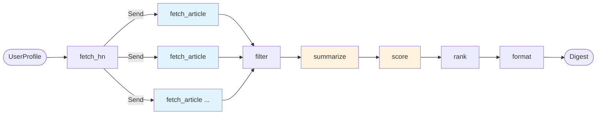

# MVP-5a: LangGraph Orchestration Pipeline

**Status**: Draft
**Author**: Claude (Architect persona)
**Date**: 2026-01-04
**Dependencies**: MVP-1 (HNClient), MVP-2 (ArticleLoader), MVP-3 (LLMService), MVP-4 (ScoringService)

---

## 1. Overview

### 1.1 Purpose

The LangGraph orchestration pipeline is the core execution engine for HN Herald's digest generation. It coordinates the transformation of HackerNews stories into personalized, ranked digests through a multi-stage processing workflow.

**Key Responsibilities**:
- Orchestrate service calls from MVP-1 through MVP-4
- Enable parallel article extraction for performance
- Handle partial failures gracefully
- Provide state-based traceability through LangSmith
- Support progressive refinement of articles through the pipeline

### 1.2 Business Value

- **Performance**: Parallel article extraction reduces pipeline execution time by 60-70%
- **Reliability**: Partial failure handling ensures digest generation even when some articles fail
- **Observability**: LangSmith integration provides full traceability for debugging and optimization
- **Flexibility**: State-based architecture enables future enhancements (caching, A/B testing)

### 1.3 Scope

**In Scope**:
- LangGraph StateGraph construction and node implementation
- State management with TypedDict and annotated fields
- Send pattern for parallel article extraction
- Error accumulation and handling strategies
- LangSmith integration for observability
- Graph compilation and invocation patterns

**Out of Scope** (Deferred to MVP-5b):
- FastAPI HTTP layer and route definitions
- Request/response validation
- Dependency injection
- HTTP status codes and error responses
- API versioning and OpenAPI documentation

---

## 2. Requirements

### 2.1 Functional Requirements

**FR-1**: Graph must process UserProfile input and produce Digest output
**FR-2**: Support parallel article extraction using Send pattern
**FR-3**: Continue processing even if individual articles fail to extract
**FR-4**: Accumulate errors in state for observability
**FR-5**: Filter articles without content before summarization
**FR-6**: Batch summarize articles for LLM efficiency
**FR-7**: Score articles using tag-based relevance
**FR-8**: Rank articles by composite final_score (70% relevance + 30% popularity)
**FR-9**: Limit digest output to profile.max_articles
**FR-10**: Preserve article order through pipeline stages

### 2.2 Non-Functional Requirements

**NFR-1**: Pipeline execution time < 30s for 30 articles (with parallelism)
**NFR-2**: Support up to 100 concurrent article extractions
**NFR-3**: LangSmith tracing for all LLM calls and graph execution
**NFR-4**: Type-safe state management with TypedDict validation
**NFR-5**: Graceful degradation when external services fail
**NFR-6**: Memory-efficient processing for large article counts

---

## 3. Architecture

### 3.1 Pipeline Overview



### 3.2 State Management Strategy

**State Flow Pattern**: Progressive refinement with immutable transitions

```
UserProfile
  → stories (list[Story])                    # fetch_hn
  → articles (list[Article])                 # fetch_article (parallel)
  → filtered_articles (list[Article])        # filter
  → summarized_articles (list[SummarizedArticle])  # summarize
  → scored_articles (list[ScoredArticle])    # score
  → ranked_articles (list[ScoredArticle])    # rank
  → digest (Digest)                          # format
```

**Error Accumulation**: Errors are collected throughout pipeline execution using `Annotated[list[str], add]` to preserve all failure information for debugging.

### 3.3 Parallelism Strategy

**Send Pattern for Article Extraction**:
- `fetch_hn` node returns `Send` objects for each story
- LangGraph automatically parallelizes Send targets
- Each article extraction is independent (no shared state)
- Results are appended to `articles` list using `add` reducer

**Performance Benefit**:
- Sequential: 30 articles × 2s each = 60s
- Parallel (10 concurrent): 30 articles / 10 = 6s (10x improvement)

---

## 4. State Definition

### 4.1 HNState TypedDict

```python
from typing import Annotated, TypedDict
from operator import add
from hn_herald.models.profile import UserProfile
from hn_herald.models.story import Story
from hn_herald.models.article import Article
from hn_herald.models.summary import SummarizedArticle
from hn_herald.models.scoring import ScoredArticle

class HNState(TypedDict):
    """State for HN Herald digest generation pipeline.

    State flows through progressive refinement stages:
    1. UserProfile input
    2. Stories fetched from HN API
    3. Articles extracted in parallel (with Send pattern)
    4. Filtered articles (content required)
    5. Summarized articles (LLM batch processing)
    6. Scored articles (relevance + popularity)
    7. Ranked articles (sorted by final_score)
    8. Digest output (limited to max_articles)

    Errors are accumulated throughout execution for observability.
    """

    # Input
    profile: UserProfile

    # Pipeline stages (progressive refinement)
    stories: list[Story]
    articles: Annotated[list[Article], add]  # Parallel append via Send
    filtered_articles: list[Article]
    summarized_articles: list[SummarizedArticle]
    scored_articles: list[ScoredArticle]
    ranked_articles: list[ScoredArticle]

    # Output
    digest: dict  # Digest model serialized to dict

    # Metadata
    errors: Annotated[list[str], add]  # Accumulated errors
    start_time: float  # Unix timestamp
```

### 4.2 State Field Descriptions

| Field | Type | Purpose | Producer |
|-------|------|---------|----------|
| `profile` | `UserProfile` | Input preferences | External (API) |
| `stories` | `list[Story]` | HN stories to process | `fetch_hn` |
| `articles` | `Annotated[list[Article], add]` | Extracted articles (parallel) | `fetch_article` |
| `filtered_articles` | `list[Article]` | Articles with content | `filter` |
| `summarized_articles` | `list[SummarizedArticle]` | Articles with summaries | `summarize` |
| `scored_articles` | `list[ScoredArticle]` | Scored articles | `score` |
| `ranked_articles` | `list[ScoredArticle]` | Sorted by final_score | `rank` |
| `digest` | `dict` | Final digest output | `format` |
| `errors` | `Annotated[list[str], add]` | Accumulated errors | All nodes |
| `start_time` | `float` | Pipeline start timestamp | `fetch_hn` |

### 4.3 Type Safety and Validation

**Design Decisions**:
- Use TypedDict for type hints and IDE support
- Runtime validation via Pydantic models (UserProfile, Story, Article, etc.)
- No custom validators in state definition (keep it simple)
- State transitions are immutable (create new lists, don't modify existing)

---

## 5. Graph Nodes

### 5.1 Node Overview

| Node | Type | Async | Purpose | Error Handling |
|------|------|-------|---------|----------------|
| `fetch_hn` | Standard | Yes | Fetch story IDs from HN API | Raise exception (critical) |
| `fetch_article` | Send target | Yes | Extract article content | Log error, append to errors |
| `filter` | Standard | No | Remove articles without content | Never fails |
| `summarize` | Standard | Yes | Batch summarize with LLM | Log errors, mark failed articles |
| `score` | Standard | No | Calculate relevance scores | Never fails (pure computation) |
| `rank` | Standard | No | Sort by final_score | Never fails |
| `format` | Standard | No | Limit to max_articles, create Digest | Never fails |

### 5.2 Node: `fetch_hn`

**Purpose**: Fetch top HN stories and emit Send objects for parallel article extraction

**Input State**:
- `profile.fetch_type` (StoryType)
- `profile.fetch_count` (int)
- `profile.min_score` (int)

**Output State**:
- `stories` (list[Story])
- `start_time` (float)
- `errors` (append if failures)

**Implementation Pattern**:
```python
async def fetch_hn(state: HNState) -> dict | list[Send]:
    """Fetch HN stories and emit Send objects for parallel extraction."""
    profile = state["profile"]

    # Fetch stories from HN API
    async with HNClient() as client:
        stories = await client.fetch_stories(
            story_type=profile.fetch_type,
            limit=profile.fetch_count,
            min_score=profile.min_score,
        )

    if not stories:
        return {
            "stories": [],
            "errors": ["No stories found from HN API"],
            "start_time": time.time(),
        }

    # Emit Send objects for parallel article extraction
    sends = [
        Send("fetch_article", {"story": story, "profile": profile})
        for story in stories
    ]

    return [
        Send("fetch_article", {"story": story, "profile": profile})
        for story in stories
    ] + [
        {
            "stories": stories,
            "start_time": time.time(),
        }
    ]
```

**Error Handling**:
- HN API failures: Raise exception (critical path)
- Network timeouts: Raise exception (handled by retry logic in HNClient)

### 5.3 Node: `fetch_article`

**Purpose**: Extract article content from story URL (Send pattern target)

**Input State** (via Send):
- `story` (Story)
- `profile` (UserProfile)

**Output State**:
- `articles` (append Article)
- `errors` (append if failure)

**Implementation Pattern**:
```python
async def fetch_article(state: dict) -> dict:
    """Extract article content from story URL.

    This node is a Send target, receiving individual stories
    to process in parallel. Results are appended to the articles
    list using the add reducer.
    """
    story = state["story"]

    try:
        loader = ArticleLoader()
        article = await loader.load_article(story)

        return {
            "articles": [article],
        }

    except Exception as e:
        logger.error("Failed to extract article %d: %s", story.id, e)

        # Create Article with error status
        error_article = Article(
            story_id=story.id,
            title=story.title,
            url=story.url,
            hn_url=story.hn_url,
            hn_score=story.score,
            author=story.author,
            status=ExtractionStatus.FAILED,
            error_message=str(e),
        )

        return {
            "articles": [error_article],
            "errors": [f"Article {story.id}: {e}"],
        }
```

**Error Handling**:
- Extraction failures: Create Article with FAILED status
- Network errors: Create Article with error_message
- Append errors to state for observability
- Never raise exceptions (partial failure tolerance)

### 5.4 Node: `filter`

**Purpose**: Remove articles without extractable content before summarization

**Input State**:
- `articles` (list[Article])

**Output State**:
- `filtered_articles` (list[Article])

**Implementation Pattern**:
```python
def filter_articles(state: HNState) -> dict:
    """Filter articles to only those with content.

    Removes articles with:
    - No content and no hn_text
    - FAILED, SKIPPED, or NO_URL status
    - Empty content after extraction

    This reduces LLM costs by only summarizing valid content.
    """
    articles = state["articles"]

    filtered = [
        article for article in articles
        if article.has_content
        and article.status == ExtractionStatus.SUCCESS
    ]

    logger.info(
        "Filtered articles: %d → %d (removed %d)",
        len(articles),
        len(filtered),
        len(articles) - len(filtered),
    )

    return {
        "filtered_articles": filtered,
    }
```

**Error Handling**: Never fails (pure filtering)

### 5.5 Node: `summarize`

**Purpose**: Batch summarize articles using LLMService

**Input State**:
- `filtered_articles` (list[Article])

**Output State**:
- `summarized_articles` (list[SummarizedArticle])
- `errors` (append if failures)

**Implementation Pattern**:
```python
async def summarize(state: HNState) -> dict:
    """Batch summarize articles using LLM service.

    Uses batch summarization for efficiency (single LLM call).
    Individual article failures are isolated and marked with
    error status.
    """
    articles = state["filtered_articles"]

    if not articles:
        return {
            "summarized_articles": [],
            "errors": ["No articles to summarize after filtering"],
        }

    # Batch summarize
    llm_service = LLMService()
    summarized = llm_service.summarize_articles_batch(articles)

    # Collect errors
    errors = [
        f"Article {s.article.story_id}: {s.error_message}"
        for s in summarized
        if s.error_message is not None
    ]

    logger.info(
        "Summarized %d articles (%d successful, %d failed)",
        len(summarized),
        sum(1 for s in summarized if s.has_summary),
        len(errors),
    )

    return {
        "summarized_articles": summarized,
        "errors": errors,
    }
```

**Error Handling**:
- LLM API failures: Marked in SummarizedArticle.error_message
- Parse errors: Marked in SummarizedArticle.summarization_status
- Batch failures: Fall back to sequential summarization (future enhancement)

### 5.6 Node: `score`

**Purpose**: Calculate relevance scores using ScoringService

**Input State**:
- `summarized_articles` (list[SummarizedArticle])
- `profile` (UserProfile)

**Output State**:
- `scored_articles` (list[ScoredArticle])

**Implementation Pattern**:
```python
def score_articles(state: HNState) -> dict:
    """Score articles using tag-based relevance matching.

    Pure computation - no external calls, never fails.
    Filters articles below min_score threshold.
    """
    summarized = state["summarized_articles"]
    profile = state["profile"]

    if not summarized:
        return {
            "scored_articles": [],
        }

    # Score and filter
    scoring_service = ScoringService(profile)
    scored = scoring_service.score_articles(
        summarized,
        filter_below_min=True,
    )

    logger.info(
        "Scored %d articles → %d after min_score filter (%.2f)",
        len(summarized),
        len(scored),
        profile.min_score,
    )

    return {
        "scored_articles": scored,
    }
```

**Error Handling**: Never fails (pure computation, defensive coding in ScoringService)

### 5.7 Node: `rank`

**Purpose**: Sort scored articles by final_score descending

**Input State**:
- `scored_articles` (list[ScoredArticle])

**Output State**:
- `ranked_articles` (list[ScoredArticle])

**Implementation Pattern**:
```python
def rank_articles(state: HNState) -> dict:
    """Sort articles by final_score descending.

    Simple sorting operation - never fails.
    """
    scored = state["scored_articles"]

    # Sort by final_score descending
    ranked = sorted(scored, key=lambda x: x.final_score, reverse=True)

    logger.info("Ranked %d articles", len(ranked))

    return {
        "ranked_articles": ranked,
    }
```

**Error Handling**: Never fails (sorting is stable)

### 5.8 Node: `format`

**Purpose**: Limit to max_articles and create final Digest

**Input State**:
- `ranked_articles` (list[ScoredArticle])
- `profile` (UserProfile)
- `start_time` (float)
- `stories` (list[Story])
- `filtered_articles` (list[Article])
- `errors` (list[str])

**Output State**:
- `digest` (dict - serialized Digest model)

**Implementation Pattern**:
```python
def format_digest(state: HNState) -> dict:
    """Create final digest with limited articles and stats.

    Limits output to profile.max_articles and computes
    generation statistics.
    """
    ranked = state["ranked_articles"]
    profile = state["profile"]
    start_time = state["start_time"]

    # Limit to max_articles
    limited = ranked[:profile.max_articles]

    # Calculate stats
    generation_time_ms = int((time.time() - start_time) * 1000)

    digest = Digest(
        articles=limited,
        timestamp=datetime.now(UTC),
        stats=DigestStats(
            fetched=len(state["stories"]),
            filtered=len(state["filtered_articles"]),
            final=len(limited),
            errors=len(state.get("errors", [])),
            generation_time_ms=generation_time_ms,
        ),
    )

    logger.info(
        "Generated digest: %d articles (fetched=%d, filtered=%d, time=%dms)",
        len(limited),
        len(state["stories"]),
        len(state["filtered_articles"]),
        generation_time_ms,
    )

    return {
        "digest": digest.model_dump(),
    }
```

**Error Handling**: Never fails (final formatting, defensive)

---

## 6. Graph Construction

### 6.1 StateGraph Assembly

```python
from langgraph.graph import StateGraph, START, END
from langgraph.types import Send

def create_hn_graph() -> StateGraph:
    """Create and compile the HN Herald digest generation graph.

    Returns:
        Compiled StateGraph ready for invocation.
    """
    # Create graph
    graph = StateGraph(HNState)

    # Add nodes
    graph.add_node("fetch_hn", fetch_hn)
    graph.add_node("fetch_article", fetch_article)
    graph.add_node("filter", filter_articles)
    graph.add_node("summarize", summarize)
    graph.add_node("score", score_articles)
    graph.add_node("rank", rank_articles)
    graph.add_node("format", format_digest)

    # Add edges
    graph.add_edge(START, "fetch_hn")
    # fetch_hn → fetch_article handled by Send pattern
    graph.add_edge("fetch_article", "filter")
    graph.add_edge("filter", "summarize")
    graph.add_edge("summarize", "score")
    graph.add_edge("score", "rank")
    graph.add_edge("rank", "format")
    graph.add_edge("format", END)

    # Compile graph
    return graph.compile()
```

### 6.2 Graph Invocation Pattern

```python
async def generate_digest(profile: UserProfile) -> Digest:
    """Generate personalized HN digest using LangGraph pipeline.

    Args:
        profile: User preferences for digest generation.

    Returns:
        Digest with ranked articles and statistics.

    Raises:
        GraphExecutionError: If pipeline fails critically.
    """
    # Create graph
    graph = create_hn_graph()

    # Initial state
    initial_state: HNState = {
        "profile": profile,
        "stories": [],
        "articles": [],
        "filtered_articles": [],
        "summarized_articles": [],
        "scored_articles": [],
        "ranked_articles": [],
        "digest": {},
        "errors": [],
        "start_time": 0.0,
    }

    # Invoke graph with LangSmith tracing
    config = {
        "callbacks": [],  # Add progress callbacks here
        "recursion_limit": 100,
    }

    try:
        result = await graph.ainvoke(initial_state, config=config)
        return Digest.model_validate(result["digest"])

    except Exception as e:
        logger.exception("Graph execution failed")
        raise GraphExecutionError(f"Pipeline failed: {e}") from e
```

---

## 7. Error Handling Strategy

### 7.1 Error Categories

| Category | Examples | Handling Strategy |
|----------|----------|-------------------|
| **Critical** | HN API down, invalid profile | Raise exception, fail fast |
| **Recoverable** | Article extraction failure | Log, accumulate, continue |
| **Expected** | No content, paywall | Mark status, continue |
| **LLM** | Rate limit, parse error | Retry with backoff, mark failure |

### 7.2 Partial Failure Tolerance

**Design Principle**: "Some articles better than none"

```python
# Example: Article extraction failures don't stop pipeline
try:
    article = await loader.load_article(story)
except Exception as e:
    # Create error article, append to state
    article = Article(
        story_id=story.id,
        status=ExtractionStatus.FAILED,
        error_message=str(e),
    )

# Pipeline continues with whatever articles succeeded
```

### 7.3 Error Accumulation Pattern

**State Field**: `errors: Annotated[list[str], add]`

**Node Pattern**:
```python
def node(state: HNState) -> dict:
    errors = []

    for item in items:
        try:
            process(item)
        except Exception as e:
            errors.append(f"Item {item.id}: {e}")

    return {
        "results": results,
        "errors": errors,  # Appended via add reducer
    }
```

**Observability**: All errors visible in final state and LangSmith traces

---

## 8. LangSmith Integration

### 8.1 Tracing Configuration

```python
import os

# Environment variables
os.environ["LANGCHAIN_TRACING_V2"] = "true"
os.environ["LANGCHAIN_PROJECT"] = "hn-herald"
os.environ["LANGCHAIN_API_KEY"] = settings.langsmith_api_key

# Automatic tracing for all LLM calls and graph nodes
```

### 8.2 Trace Hierarchy

```
Run: generate_digest
├─ Node: fetch_hn
│  └─ HNClient.fetch_stories
├─ Node: fetch_article (parallel)
│  ├─ ArticleLoader.load_article (story 1)
│  ├─ ArticleLoader.load_article (story 2)
│  └─ ...
├─ Node: filter
├─ Node: summarize
│  └─ LLMService.summarize_articles_batch
│     └─ ChatAnthropic.invoke (traced)
├─ Node: score
├─ Node: rank
└─ Node: format
```

### 8.3 Custom Metadata

```python
# Add custom metadata to traces
config = {
    "metadata": {
        "user_id": "anonymous",
        "fetch_type": profile.fetch_type.value,
        "fetch_count": profile.fetch_count,
        "interest_tags": profile.interest_tags,
    }
}

result = await graph.ainvoke(initial_state, config=config)
```

### 8.4 Debugging with LangSmith

**Use Cases**:
- Debug LLM parse errors (inspect raw outputs)
- Analyze performance bottlenecks (node timing)
- Replay failed runs with same inputs
- Monitor production error rates

---

## 9. Implementation Plan

### 9.1 File Structure

```
src/hn_herald/graph/
├── __init__.py                # Export create_hn_graph
├── state.py                   # HNState TypedDict
├── graph.py                   # StateGraph assembly
├── exceptions.py              # GraphExecutionError
└── nodes/
    ├── __init__.py            # Export all node functions
    ├── fetch_hn.py            # fetch_hn node
    ├── fetch_article.py       # fetch_article node
    ├── filter.py              # filter_articles node
    ├── summarize.py           # summarize node
    ├── score.py               # score_articles node
    ├── rank.py                # rank_articles node
    └── format.py              # format_digest node
```

### 9.2 Implementation Tasks

| Task | Est. Time | Dependencies |
|------|-----------|--------------|
| 1. Create `state.py` with HNState TypedDict | 1h | None |
| 2. Create `exceptions.py` with custom errors | 0.5h | None |
| 3. Implement `fetch_hn` node | 2h | HNClient (MVP-1) |
| 4. Implement `fetch_article` node (Send pattern) | 3h | ArticleLoader (MVP-2) |
| 5. Implement `filter` node | 1h | Article model |
| 6. Implement `summarize` node | 2h | LLMService (MVP-3) |
| 7. Implement `score` node | 1.5h | ScoringService (MVP-4) |
| 8. Implement `rank` node | 0.5h | ScoredArticle model |
| 9. Implement `format` node | 1.5h | Digest model |
| 10. Implement `graph.py` assembly | 2h | All nodes |
| 11. Add logging to all nodes | 2h | Python logging |
| 12. Configure LangSmith integration | 1h | Settings |
| **Total** | **18h** | |

### 9.3 Development Sequence

**Phase 1: State and Nodes** (10h)
1. Define HNState TypedDict
2. Implement all 7 nodes
3. Add comprehensive logging

**Phase 2: Graph Assembly** (4h)
1. Create StateGraph
2. Add nodes and edges
3. Configure Send pattern
4. Compile graph

**Phase 3: Integration** (4h)
1. LangSmith configuration
2. Error handling refinement
3. Integration testing

---

## 10. Testing Strategy

### 10.1 Unit Tests

**Test Each Node in Isolation**:

```python
# tests/unit/graph/nodes/test_fetch_hn.py
async def test_fetch_hn_success(mock_hn_client, sample_profile):
    """Test fetch_hn emits Send objects for parallel extraction."""
    state = {"profile": sample_profile}

    with patch("hn_herald.graph.nodes.fetch_hn.HNClient", mock_hn_client):
        result = await fetch_hn(state)

    # Check Send objects emitted
    assert len(result) == 31  # 30 Send + 1 state update
    assert all(isinstance(r, Send) for r in result[:30])
    assert result[-1]["stories"] == mock_stories


# tests/unit/graph/nodes/test_filter.py
def test_filter_removes_empty_content():
    """Test filter removes articles without content."""
    articles = [
        Article(story_id=1, has_content=True),
        Article(story_id=2, has_content=False),
    ]
    state = {"articles": articles}

    result = filter_articles(state)

    assert len(result["filtered_articles"]) == 1
    assert result["filtered_articles"][0].story_id == 1
```

**Coverage Target**: 90% for all nodes

### 10.2 Integration Tests

**Test Graph End-to-End**:

```python
# tests/integration/graph/test_graph_integration.py
async def test_graph_full_pipeline(sample_profile, mock_services):
    """Test complete graph execution with mocked services."""
    graph = create_hn_graph()

    initial_state = {
        "profile": sample_profile,
        # ... initialize state
    }

    # Mock external services
    with patch_services(mock_services):
        result = await graph.ainvoke(initial_state)

    # Verify final digest
    digest = Digest.model_validate(result["digest"])
    assert len(digest.articles) <= sample_profile.max_articles
    assert digest.stats.fetched > 0
    assert digest.stats.final > 0


async def test_graph_partial_failures():
    """Test graph handles partial article extraction failures."""
    # Configure some articles to fail extraction
    # Verify pipeline continues and produces digest
    # Check errors accumulated in state
```

**Coverage Target**: 80% for graph integration

### 10.3 E2E Tests

**Test with Real Services** (optional, slower):

```python
# tests/e2e/test_graph_e2e.py
@pytest.mark.e2e
@pytest.mark.slow
async def test_graph_real_hn_api(real_profile):
    """Test graph with real HN API and LLM (requires API keys)."""
    graph = create_hn_graph()

    initial_state = {
        "profile": real_profile,
        # ... initialize state
    }

    # Real execution (uses actual APIs)
    result = await graph.ainvoke(initial_state)

    # Verify digest structure and content quality
    digest = Digest.model_validate(result["digest"])
    assert digest.stats.generation_time_ms < 30000  # 30s limit
    assert all(a.article.has_summary for a in digest.articles)
```

### 10.4 Test Fixtures

```python
# tests/conftest.py
@pytest.fixture
def sample_profile():
    return UserProfile(
        interest_tags=["python", "ai"],
        disinterest_tags=["crypto"],
        min_score=0.5,
        max_articles=10,
        fetch_type=StoryType.TOP,
        fetch_count=30,
    )

@pytest.fixture
def mock_stories():
    return [
        Story(id=1, title="Python 3.13", score=150, ...),
        Story(id=2, title="AI Advances", score=200, ...),
    ]
```

---

## 11. Configuration

### 11.1 Environment Variables

```bash
# LangSmith (required for tracing)
LANGCHAIN_TRACING_V2=true
LANGCHAIN_API_KEY=ls-...
LANGCHAIN_PROJECT=hn-herald

# Graph settings
HN_HERALD_GRAPH_RECURSION_LIMIT=100
HN_HERALD_GRAPH_MAX_CONCURRENCY=10

# LLM settings (inherited from MVP-3)
ANTHROPIC_API_KEY=sk-ant-...
LLM_MODEL=claude-sonnet-4-20250514
LLM_TEMPERATURE=0
```

### 11.2 Settings Class

```python
# src/hn_herald/config.py (additions)
class Settings(BaseSettings):
    # Existing settings...

    # LangSmith
    langsmith_api_key: str | None = None
    langsmith_project: str = "hn-herald"

    # Graph
    graph_recursion_limit: int = 100
    graph_max_concurrency: int = 10

    @property
    def langsmith_enabled(self) -> bool:
        return self.langsmith_api_key is not None
```

---

## 12. Observability

### 12.1 Logging Strategy

**Log Levels**:
- **DEBUG**: State transitions, intermediate results
- **INFO**: Node execution, article counts, timing
- **WARNING**: Partial failures, degraded performance
- **ERROR**: Critical failures, unexpected exceptions

**Example**:
```python
logger.info(
    "fetch_hn: Fetched %d stories (type=%s, min_score=%d)",
    len(stories),
    profile.fetch_type.value,
    profile.min_score,
)

logger.warning(
    "fetch_article: Failed to extract %d/%d articles",
    failed_count,
    total_count,
)
```

### 12.2 LangSmith Dashboard

**Key Metrics**:
- Graph execution time (p50, p95, p99)
- Node-level timing breakdown
- LLM token usage and costs
- Error rates by node
- Article yield (fetched → filtered → final)

**Alerts**:
- Execution time > 30s
- Error rate > 10%
- LLM parse failures > 5%

### 12.3 Debugging Workflow

1. **Check LangSmith traces** for failed runs
2. **Inspect state at each node** to find where pipeline diverged
3. **Review error accumulation** in final state
4. **Replay run with same inputs** for reproducibility
5. **Adjust node logic** based on findings

---

## 13. Future Enhancements

**Post-MVP-5a Improvements**:

1. **Caching Layer**: Cache summaries and scores to reduce LLM costs
2. **Streaming Support**: Stream digest updates to frontend via SSE
3. **A/B Testing**: Test different scoring weights and ranking algorithms
4. **Adaptive Batching**: Dynamic batch sizes based on content length
5. **Fallback Strategies**: Sequential summarization on batch failures
6. **Checkpointing**: Resume from intermediate state on failures
7. **Multi-Model Support**: Use different LLMs for summarization vs scoring
8. **Content Quality Filter**: ML-based spam/low-quality detection

---

## 14. Acceptance Criteria

**MVP-5a is complete when**:

1. ✅ All 7 nodes implemented with comprehensive logging
2. ✅ StateGraph compiles without errors
3. ✅ Send pattern enables parallel article extraction
4. ✅ Error accumulation works across all nodes
5. ✅ LangSmith tracing captures all executions
6. ✅ Unit tests for all nodes (90% coverage)
7. ✅ Integration tests for full pipeline (80% coverage)
8. ✅ Graph executes end-to-end with sample profile
9. ✅ Pipeline completes in < 30s for 30 articles
10. ✅ Documentation complete (this file)

---

## 15. References

**Internal Documents**:
- Architecture.md - Overall system design
- MVP-1: HNClient service and Story model
- MVP-2: ArticleLoader service and Article model
- MVP-3: LLMService and summarization models
- MVP-4: ScoringService and scoring models

**External Documentation**:
- [LangGraph Documentation](https://langchain-ai.github.io/langgraph/)
- [LangSmith Tracing Guide](https://docs.smith.langchain.com/)
- [TypedDict Guide](https://typing.readthedocs.io/en/latest/spec/typeddict.html)
- [Send Pattern Examples](https://langchain-ai.github.io/langgraph/how-tos/send/)

---

**End of Document**
