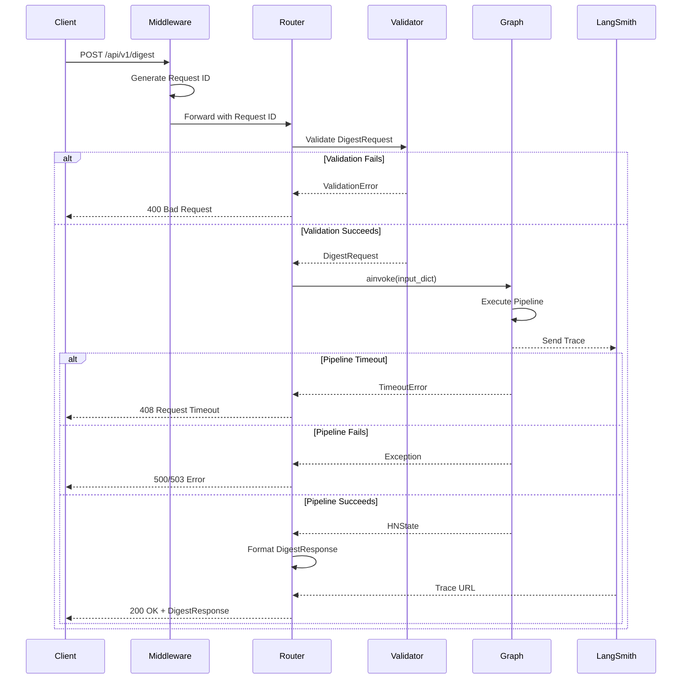
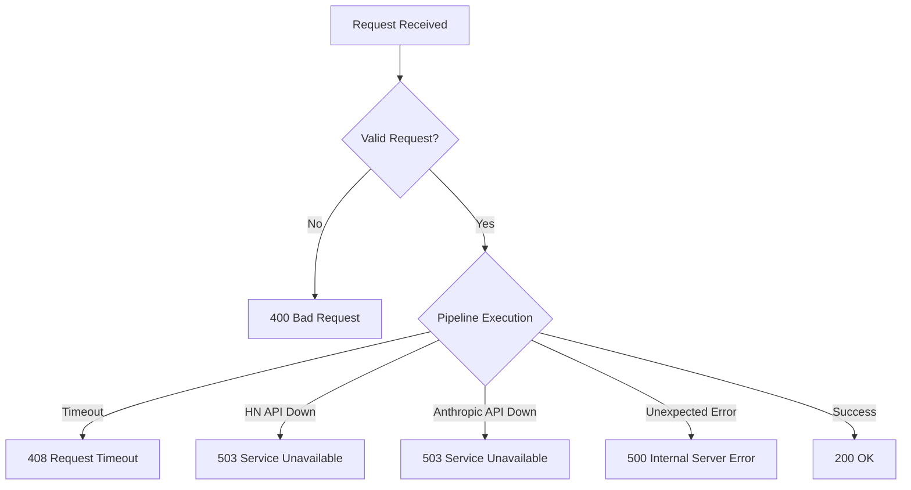

# Feature: FastAPI HTTP Layer (MVP-5b)

## Overview

The FastAPI HTTP Layer provides a RESTful API interface that exposes the LangGraph digest generation pipeline to clients. This component handles HTTP requests, validates input, orchestrates the graph execution, and formats responses in a type-safe, well-documented manner.

**Business Value**: Enables programmatic access to the digest generation service through a clean REST API with automatic OpenAPI documentation, request validation, and comprehensive error handling. This API serves as the foundation for both the HTMX frontend and potential future client integrations.

**Target**: MVP-5b milestone - "REST API operational" with integration tests passing.

---

## Requirements

### Functional Requirements

| ID | Requirement | Priority |
|----|-------------|----------|
| FR-1 | Accept digest generation requests via POST /api/v1/digest | High |
| FR-2 | Validate request payload using Pydantic models | High |
| FR-3 | Invoke LangGraph pipeline and return results | High |
| FR-4 | Provide health check endpoint GET /api/v1/health | High |
| FR-5 | Return structured error responses with appropriate status codes | High |
| FR-6 | Include LangSmith trace URLs in successful responses | Medium |
| FR-7 | Generate OpenAPI 3.0 specification automatically | High |
| FR-8 | Support CORS for browser-based clients | Medium |

### Non-Functional Requirements

| ID | Requirement | Target |
|----|-------------|--------|
| NFR-1 | Request timeout handling | 120 seconds default |
| NFR-2 | Request ID tracking for observability | All requests |
| NFR-3 | Structured JSON error responses | All error scenarios |
| NFR-4 | Type safety with full type hints | Required |
| NFR-5 | OpenAPI documentation accuracy | 100% |
| NFR-6 | API versioning support | /api/v1/ prefix |
| NFR-7 | Test coverage | >= 80% |

---

## Architecture

### Component Diagram

```
┌─────────────────┐     ┌─────────────────┐     ┌─────────────────┐
│                 │     │                 │     │                 │
│  HTTP Client    │────▶│  FastAPI Router │────▶│  LangGraph      │
│  (Browser/API)  │     │  + Middleware   │     │  Pipeline       │
│                 │     │                 │     │                 │
└─────────────────┘     └─────────────────┘     └─────────────────┘
                               │                         │
                               │                         │
                               ▼                         ▼
                        ┌─────────────────┐     ┌─────────────────┐
                        │                 │     │                 │
                        │  Pydantic       │     │  LangSmith      │
                        │  Validation     │     │  Tracing        │
                        │                 │     │                 │
                        └─────────────────┘     └─────────────────┘
```

### Request Flow



### Components

#### APIRouter (`src/hn_herald/api/routes.py`)

FastAPI router defining all HTTP endpoints.

**Responsibilities**:
- Define endpoint routes and HTTP methods
- Validate request payloads via Pydantic
- Invoke dependency injection for graph instance
- Handle successful responses and error cases
- Format responses using Pydantic models

#### Request/Response Models (`src/hn_herald/api/models/`)

Pydantic models for API contract definition.

**Responsibilities**:
- Validate incoming request payloads
- Define response schemas
- Provide type safety
- Generate OpenAPI schemas automatically

#### Dependency Injection (`src/hn_herald/api/deps.py`)

Dependency providers for FastAPI endpoints.

**Responsibilities**:
- Provide graph instance to routes
- Inject settings and configuration
- Manage request-scoped resources
- Enable testing with mock dependencies

#### Exception Handlers (`src/hn_herald/api/exceptions.py`)

Custom exception handlers for FastAPI.

**Responsibilities**:
- Convert Python exceptions to HTTP responses
- Format error responses consistently
- Map exception types to status codes
- Include request IDs in error responses

#### Middleware (`src/hn_herald/api/middleware.py`)

Request/response processing middleware.

**Responsibilities**:
- Generate unique request IDs
- Log request/response details
- Add CORS headers
- Handle request timeouts

---

## API Endpoints

### POST /api/v1/digest

Generate a personalized HackerNews digest.

**Request**:
```http
POST /api/v1/digest HTTP/1.1
Content-Type: application/json

{
  "profile": {
    "interest_tags": ["python", "ai", "rust"],
    "disinterest_tags": ["crypto", "blockchain"],
    "min_score": 0.3
  },
  "story_type": "top",
  "story_count": 30,
  "article_limit": 10
}
```

**Success Response (200 OK)**:
```http
HTTP/1.1 200 OK
Content-Type: application/json
X-Request-ID: 550e8400-e29b-41d4-a716-446655440000

{
  "articles": [
    {
      "summarized_article": {
        "article": {
          "story_id": 39856302,
          "title": "Python 3.13 Performance Improvements",
          "url": "https://example.com/article",
          "hn_url": "https://news.ycombinator.com/item?id=39856302",
          "hn_score": 256,
          "content": "...",
          "fetch_status": "success"
        },
        "summary_data": {
          "summary": "Python 3.13 brings major performance improvements...",
          "key_points": [
            "15% faster than 3.12",
            "Improved JIT compilation",
            "Better memory management"
          ],
          "tech_tags": ["python", "performance", "compiler"]
        },
        "summarization_status": "success"
      },
      "relevance": {
        "score": 0.825,
        "reason": "Matches interests: python",
        "matched_interest_tags": ["python"],
        "matched_disinterest_tags": []
      },
      "popularity_score": 0.512,
      "final_score": 0.731
    }
  ],
  "stats": {
    "stories_fetched": 30,
    "articles_extracted": 28,
    "articles_summarized": 25,
    "articles_scored": 25,
    "final_count": 10,
    "errors": 2,
    "generation_time_ms": 8542
  },
  "trace_url": "https://smith.langchain.com/public/abcd-1234-efgh-5678"
}
```

**Error Response (400 Bad Request)**:
```http
HTTP/1.1 400 Bad Request
Content-Type: application/json
X-Request-ID: 550e8400-e29b-41d4-a716-446655440000

{
  "error": {
    "type": "validation_error",
    "message": "Request validation failed",
    "details": [
      {
        "loc": ["body", "story_count"],
        "msg": "ensure this value is less than or equal to 50",
        "type": "value_error.number.not_le"
      }
    ],
    "request_id": "550e8400-e29b-41d4-a716-446655440000"
  }
}
```

**Error Response (408 Request Timeout)**:
```http
HTTP/1.1 408 Request Timeout
Content-Type: application/json
X-Request-ID: 550e8400-e29b-41d4-a716-446655440000

{
  "error": {
    "type": "timeout_error",
    "message": "Digest generation exceeded maximum time limit",
    "details": {
      "timeout_seconds": 120,
      "suggestion": "Try reducing story_count or article_limit"
    },
    "request_id": "550e8400-e29b-41d4-a716-446655440000"
  }
}
```

**Error Response (500 Internal Server Error)**:
```http
HTTP/1.1 500 Internal Server Error
Content-Type: application/json
X-Request-ID: 550e8400-e29b-41d4-a716-446655440000

{
  "error": {
    "type": "internal_error",
    "message": "An unexpected error occurred during digest generation",
    "details": null,
    "request_id": "550e8400-e29b-41d4-a716-446655440000"
  }
}
```

**Error Response (503 Service Unavailable)**:
```http
HTTP/1.1 503 Service Unavailable
Content-Type: application/json
X-Request-ID: 550e8400-e29b-41d4-a716-446655440000
Retry-After: 60

{
  "error": {
    "type": "service_unavailable",
    "message": "External service temporarily unavailable",
    "details": {
      "service": "HackerNews API",
      "retry_after_seconds": 60
    },
    "request_id": "550e8400-e29b-41d4-a716-446655440000"
  }
}
```

### GET /api/v1/health

Health check endpoint for monitoring and orchestration.

**Request**:
```http
GET /api/v1/health HTTP/1.1
```

**Success Response (200 OK)**:
```http
HTTP/1.1 200 OK
Content-Type: application/json

{
  "status": "healthy",
  "version": "0.1.0",
  "timestamp": "2025-01-04T19:45:30.123456Z",
  "services": {
    "hn_api": "operational",
    "anthropic_api": "operational",
    "langsmith": "operational"
  }
}
```

**Degraded Response (200 OK)**:
```http
HTTP/1.1 200 OK
Content-Type: application/json

{
  "status": "degraded",
  "version": "0.1.0",
  "timestamp": "2025-01-04T19:45:30.123456Z",
  "services": {
    "hn_api": "operational",
    "anthropic_api": "operational",
    "langsmith": "unavailable"
  },
  "warnings": [
    "LangSmith tracing unavailable - traces will not be recorded"
  ]
}
```

**Unhealthy Response (503 Service Unavailable)**:
```http
HTTP/1.1 503 Service Unavailable
Content-Type: application/json

{
  "status": "unhealthy",
  "version": "0.1.0",
  "timestamp": "2025-01-04T19:45:30.123456Z",
  "services": {
    "hn_api": "unavailable",
    "anthropic_api": "operational",
    "langsmith": "operational"
  },
  "errors": [
    "HackerNews API connection failed"
  ]
}
```

---

## Data Models

### Request Models

#### DigestRequest

```python
from pydantic import BaseModel, Field

from hn_herald.models.profile import UserProfile
from hn_herald.models.story import StoryType


class DigestRequest(BaseModel):
    """Request payload for digest generation.

    Attributes:
        profile: User preferences for personalization.
        story_type: Type of HN stories to fetch (top/new/best/ask/show/job).
        story_count: Number of stories to fetch (10-50).
        article_limit: Maximum articles in final digest (5-20).

    Example:
        >>> request = DigestRequest(
        ...     profile=UserProfile(
        ...         interest_tags=["python", "ai"],
        ...         disinterest_tags=["crypto"],
        ...         min_score=0.3,
        ...     ),
        ...     story_type="top",
        ...     story_count=30,
        ...     article_limit=10,
        ... )
    """

    model_config = {
        "json_schema_extra": {
            "example": {
                "profile": {
                    "interest_tags": ["python", "ai", "rust"],
                    "disinterest_tags": ["crypto", "blockchain"],
                    "min_score": 0.3,
                },
                "story_type": "top",
                "story_count": 30,
                "article_limit": 10,
            }
        }
    }

    profile: UserProfile = Field(
        ...,
        description="User preferences for personalization",
    )
    story_type: StoryType = Field(
        default=StoryType.TOP,
        description="Type of HN stories to fetch",
    )
    story_count: int = Field(
        default=30,
        ge=10,
        le=50,
        description="Number of stories to fetch",
    )
    article_limit: int = Field(
        default=10,
        ge=5,
        le=20,
        description="Maximum articles in final digest",
    )
```

### Response Models

#### DigestStats

```python
from pydantic import BaseModel, Field


class DigestStats(BaseModel):
    """Statistics about digest generation process.

    Attributes:
        stories_fetched: Number of story IDs fetched from HN.
        articles_extracted: Number of articles with content extracted.
        articles_summarized: Number of articles successfully summarized.
        articles_scored: Number of articles scored for relevance.
        final_count: Number of articles in final digest.
        errors: Number of errors encountered during processing.
        generation_time_ms: Total time for digest generation in milliseconds.
    """

    stories_fetched: int = Field(
        ...,
        ge=0,
        description="Number of story IDs fetched from HN",
    )
    articles_extracted: int = Field(
        ...,
        ge=0,
        description="Number of articles with content extracted",
    )
    articles_summarized: int = Field(
        ...,
        ge=0,
        description="Number of articles successfully summarized",
    )
    articles_scored: int = Field(
        ...,
        ge=0,
        description="Number of articles scored for relevance",
    )
    final_count: int = Field(
        ...,
        ge=0,
        description="Number of articles in final digest",
    )
    errors: int = Field(
        default=0,
        ge=0,
        description="Number of errors encountered",
    )
    generation_time_ms: int = Field(
        ...,
        ge=0,
        description="Total generation time in milliseconds",
    )
```

#### DigestResponse

```python
from pydantic import BaseModel, Field

from hn_herald.models.scoring import ScoredArticle


class DigestResponse(BaseModel):
    """Successful digest generation response.

    Attributes:
        articles: Ranked list of scored articles.
        stats: Generation process statistics.
        trace_url: LangSmith trace URL for debugging (optional).

    Example:
        >>> response = DigestResponse(
        ...     articles=[scored_article1, scored_article2],
        ...     stats=DigestStats(...),
        ...     trace_url="https://smith.langchain.com/...",
        ... )
    """

    model_config = {
        "json_schema_extra": {
            "example": {
                "articles": [
                    {
                        "summarized_article": {"article": {...}, "summary_data": {...}},
                        "relevance": {"score": 0.8, "reason": "..."},
                        "popularity_score": 0.5,
                        "final_score": 0.71,
                    }
                ],
                "stats": {
                    "stories_fetched": 30,
                    "articles_extracted": 28,
                    "articles_summarized": 25,
                    "articles_scored": 25,
                    "final_count": 10,
                    "errors": 2,
                    "generation_time_ms": 8542,
                },
                "trace_url": "https://smith.langchain.com/public/abcd-1234",
            }
        }
    }

    articles: list[ScoredArticle] = Field(
        ...,
        description="Ranked list of scored articles",
    )
    stats: DigestStats = Field(
        ...,
        description="Generation process statistics",
    )
    trace_url: str | None = Field(
        default=None,
        description="LangSmith trace URL for debugging",
    )
```

### Error Models

#### ErrorDetail

```python
from typing import Any

from pydantic import BaseModel, Field


class ErrorDetail(BaseModel):
    """Validation error detail.

    Follows Pydantic ValidationError format for consistency.

    Attributes:
        loc: Location of error in request (e.g., ["body", "profile", "min_score"]).
        msg: Human-readable error message.
        type: Error type identifier.
    """

    loc: list[str] = Field(
        ...,
        description="Location of error in request",
    )
    msg: str = Field(
        ...,
        description="Human-readable error message",
    )
    type: str = Field(
        ...,
        description="Error type identifier",
    )
```

#### ErrorResponse

```python
from typing import Any

from pydantic import BaseModel, Field


class ErrorResponse(BaseModel):
    """Standard error response format.

    Provides consistent error structure across all API errors.

    Attributes:
        error: Error information object.

    Example:
        >>> error = ErrorResponse(
        ...     error={
        ...         "type": "validation_error",
        ...         "message": "Invalid request",
        ...         "details": [...],
        ...         "request_id": "550e8400-...",
        ...     }
        ... )
    """

    model_config = {
        "json_schema_extra": {
            "example": {
                "error": {
                    "type": "validation_error",
                    "message": "Request validation failed",
                    "details": [
                        {
                            "loc": ["body", "story_count"],
                            "msg": "ensure this value is less than or equal to 50",
                            "type": "value_error.number.not_le",
                        }
                    ],
                    "request_id": "550e8400-e29b-41d4-a716-446655440000",
                }
            }
        }
    }

    error: dict[str, Any] = Field(
        ...,
        description="Error information",
    )
```

#### HealthResponse

```python
from typing import Literal

from pydantic import BaseModel, Field


class HealthResponse(BaseModel):
    """Health check response.

    Attributes:
        status: Overall health status (healthy/degraded/unhealthy).
        version: API version string.
        timestamp: ISO 8601 timestamp of health check.
        services: Status of external service dependencies.
        warnings: Non-critical issues (optional).
        errors: Critical errors (optional).
    """

    model_config = {
        "json_schema_extra": {
            "example": {
                "status": "healthy",
                "version": "0.1.0",
                "timestamp": "2025-01-04T19:45:30.123456Z",
                "services": {
                    "hn_api": "operational",
                    "anthropic_api": "operational",
                    "langsmith": "operational",
                },
            }
        }
    }

    status: Literal["healthy", "degraded", "unhealthy"] = Field(
        ...,
        description="Overall health status",
    )
    version: str = Field(
        ...,
        description="API version string",
    )
    timestamp: str = Field(
        ...,
        description="ISO 8601 timestamp",
    )
    services: dict[str, str] = Field(
        ...,
        description="External service status",
    )
    warnings: list[str] = Field(
        default_factory=list,
        description="Non-critical issues",
    )
    errors: list[str] = Field(
        default_factory=list,
        description="Critical errors",
    )
```

---

## HTTP Status Codes

### Success Codes

| Code | Status | Usage |
|------|--------|-------|
| 200 | OK | Digest generated successfully, health check passed |

### Client Error Codes

| Code | Status | Usage | Example |
|------|--------|-------|---------|
| 400 | Bad Request | Request validation failed | Invalid story_count (>50) |
| 408 | Request Timeout | Pipeline exceeded timeout limit | Digest generation took >120s |

### Server Error Codes

| Code | Status | Usage | Example |
|------|--------|-------|---------|
| 500 | Internal Server Error | Unexpected internal error | Unhandled Python exception |
| 503 | Service Unavailable | External service unavailable | HN API down, Anthropic API down |

### Status Code Decision Tree



---

## Implementation Plan

### File Structure

```
src/hn_herald/api/
├── __init__.py              # Export router, models
├── routes.py                # FastAPI router with endpoints
├── deps.py                  # Dependency injection providers
├── exceptions.py            # Custom exception handlers
├── middleware.py            # Request ID, CORS middleware
└── models/
    ├── __init__.py          # Export request/response models
    ├── request.py           # DigestRequest
    └── response.py          # DigestResponse, ErrorResponse, HealthResponse

src/hn_herald/
├── main.py                  # FastAPI app with middleware setup
└── config.py                # Settings (add API-specific settings)

tests/
└── integration/
    └── api/
        ├── __init__.py
        ├── test_digest_endpoint.py
        ├── test_health_endpoint.py
        └── test_error_handling.py
```

### Implementation Tasks

| Task | Estimate | Dependencies |
|------|----------|--------------|
| 1. Create request/response models | 45 min | MVP-4 models |
| 2. Create error models | 20 min | None |
| 3. Implement dependency injection | 30 min | Task 1 |
| 4. Implement request ID middleware | 20 min | None |
| 5. Implement CORS middleware | 15 min | None |
| 6. Implement exception handlers | 40 min | Task 2 |
| 7. Implement POST /api/v1/digest route | 60 min | Tasks 1-6 |
| 8. Implement GET /api/v1/health route | 30 min | Task 3 |
| 9. Update main.py with middleware | 20 min | Tasks 4-6 |
| 10. Configure OpenAPI documentation | 30 min | Tasks 7-8 |
| 11. Write integration tests | 90 min | Tasks 1-10 |
| 12. Update config.py with API settings | 15 min | None |

**Total Estimate**: ~7 hours

---

## Router Implementation

### routes.py

```python
"""FastAPI routes for HN Herald API."""

from __future__ import annotations

import logging
import time
from typing import Annotated

from fastapi import APIRouter, Depends, HTTPException, status
from fastapi.responses import JSONResponse

from hn_herald.api.deps import get_graph_instance, get_settings
from hn_herald.api.models.request import DigestRequest
from hn_herald.api.models.response import DigestResponse, DigestStats, HealthResponse
from hn_herald.config import Settings

logger = logging.getLogger(__name__)

router = APIRouter(prefix="/api/v1", tags=["api"])


@router.post(
    "/digest",
    response_model=DigestResponse,
    status_code=status.HTTP_200_OK,
    summary="Generate personalized digest",
    description="Generate a personalized HackerNews digest based on user preferences",
    responses={
        200: {
            "description": "Digest generated successfully",
            "model": DigestResponse,
        },
        400: {
            "description": "Invalid request parameters",
            "content": {
                "application/json": {
                    "example": {
                        "error": {
                            "type": "validation_error",
                            "message": "Request validation failed",
                            "details": [],
                            "request_id": "...",
                        }
                    }
                }
            },
        },
        408: {
            "description": "Request timeout",
            "content": {
                "application/json": {
                    "example": {
                        "error": {
                            "type": "timeout_error",
                            "message": "Digest generation exceeded timeout",
                            "details": {"timeout_seconds": 120},
                            "request_id": "...",
                        }
                    }
                }
            },
        },
        500: {
            "description": "Internal server error",
            "content": {
                "application/json": {
                    "example": {
                        "error": {
                            "type": "internal_error",
                            "message": "Unexpected error",
                            "details": null,
                            "request_id": "...",
                        }
                    }
                }
            },
        },
        503: {
            "description": "Service unavailable",
            "content": {
                "application/json": {
                    "example": {
                        "error": {
                            "type": "service_unavailable",
                            "message": "External service unavailable",
                            "details": {"service": "HackerNews API"},
                            "request_id": "...",
                        }
                    }
                }
            },
        },
    },
)
async def generate_digest(
    request: DigestRequest,
    graph: Annotated[object, Depends(get_graph_instance)],
    settings: Annotated[Settings, Depends(get_settings)],
) -> DigestResponse:
    """Generate a personalized HackerNews digest.

    Args:
        request: Digest generation request with user preferences.
        graph: LangGraph pipeline instance (injected).
        settings: Application settings (injected).

    Returns:
        DigestResponse with ranked articles and generation statistics.

    Raises:
        HTTPException: On validation, timeout, or service errors.
    """
    start_time = time.time()

    # Convert request to graph input format
    graph_input = {
        "profile": request.profile,
        "story_type": request.story_type,
        "story_count": request.story_count,
        "article_limit": request.article_limit,
    }

    logger.info(
        "Generating digest: story_type=%s, count=%d, limit=%d",
        request.story_type,
        request.story_count,
        request.article_limit,
    )

    try:
        # Invoke graph with timeout
        result = await asyncio.wait_for(
            graph.ainvoke(graph_input),
            timeout=settings.digest_timeout_seconds,
        )

        # Extract results from graph state
        articles = result.get("scored_articles", [])
        errors = result.get("errors", [])
        trace_url = result.get("trace_url")

        # Calculate generation time
        generation_time_ms = int((time.time() - start_time) * 1000)

        # Build statistics
        stats = DigestStats(
            stories_fetched=result.get("stories_fetched", 0),
            articles_extracted=result.get("articles_extracted", 0),
            articles_summarized=result.get("articles_summarized", 0),
            articles_scored=result.get("articles_scored", 0),
            final_count=len(articles),
            errors=len(errors),
            generation_time_ms=generation_time_ms,
        )

        logger.info(
            "Digest generated: %d articles in %dms",
            stats.final_count,
            stats.generation_time_ms,
        )

        return DigestResponse(
            articles=articles[:request.article_limit],
            stats=stats,
            trace_url=trace_url,
        )

    except asyncio.TimeoutError:
        logger.warning("Digest generation timeout after %ds", settings.digest_timeout_seconds)
        raise HTTPException(
            status_code=status.HTTP_408_REQUEST_TIMEOUT,
            detail={
                "type": "timeout_error",
                "message": "Digest generation exceeded maximum time limit",
                "details": {
                    "timeout_seconds": settings.digest_timeout_seconds,
                    "suggestion": "Try reducing story_count or article_limit",
                },
            },
        )

    except Exception as exc:
        logger.exception("Unexpected error during digest generation")
        # Exception handler middleware will convert this to proper error response
        raise


@router.get(
    "/health",
    response_model=HealthResponse,
    status_code=status.HTTP_200_OK,
    summary="Health check",
    description="Check API and external service health status",
    responses={
        200: {
            "description": "Service health status",
            "model": HealthResponse,
        },
        503: {
            "description": "Service unhealthy",
            "model": HealthResponse,
        },
    },
)
async def health_check(
    settings: Annotated[Settings, Depends(get_settings)],
) -> HealthResponse | JSONResponse:
    """Check service health status.

    Args:
        settings: Application settings (injected).

    Returns:
        HealthResponse with service status details.
    """
    import httpx
    from datetime import datetime, timezone

    services: dict[str, str] = {}
    warnings: list[str] = []
    errors: list[str] = []

    # Check HN API
    try:
        async with httpx.AsyncClient(timeout=5.0) as client:
            response = await client.get("https://hacker-news.firebaseio.com/v0/topstories.json")
            services["hn_api"] = "operational" if response.status_code == 200 else "degraded"
    except Exception as exc:
        services["hn_api"] = "unavailable"
        errors.append(f"HackerNews API connection failed: {exc}")

    # Check Anthropic API (just test API key presence)
    if settings.anthropic_api_key:
        services["anthropic_api"] = "operational"
    else:
        services["anthropic_api"] = "unavailable"
        errors.append("Anthropic API key not configured")

    # Check LangSmith (optional service)
    if settings.langsmith_api_key:
        services["langsmith"] = "operational"
    else:
        services["langsmith"] = "unavailable"
        warnings.append("LangSmith tracing unavailable - traces will not be recorded")

    # Determine overall status
    if errors:
        overall_status = "unhealthy"
        status_code = status.HTTP_503_SERVICE_UNAVAILABLE
    elif warnings:
        overall_status = "degraded"
        status_code = status.HTTP_200_OK
    else:
        overall_status = "healthy"
        status_code = status.HTTP_200_OK

    response_data = HealthResponse(
        status=overall_status,
        version=settings.version,
        timestamp=datetime.now(timezone.utc).isoformat(),
        services=services,
        warnings=warnings,
        errors=errors,
    )

    return JSONResponse(
        status_code=status_code,
        content=response_data.model_dump(),
    )
```

---

## Dependency Injection

### deps.py

```python
"""FastAPI dependency providers."""

from __future__ import annotations

import logging
from typing import Annotated

from fastapi import Depends

from hn_herald.config import Settings, get_settings

logger = logging.getLogger(__name__)

# Global graph instance (initialized at app startup)
_graph_instance: object | None = None


def set_graph_instance(graph: object) -> None:
    """Set the global graph instance.

    Called during app startup to inject the compiled LangGraph.

    Args:
        graph: Compiled LangGraph StateGraph instance.
    """
    global _graph_instance
    _graph_instance = graph
    logger.info("Graph instance configured for dependency injection")


def get_graph_instance() -> object:
    """Get the LangGraph instance for request handling.

    Returns:
        Compiled LangGraph StateGraph instance.

    Raises:
        RuntimeError: If graph not initialized.
    """
    if _graph_instance is None:
        raise RuntimeError(
            "Graph instance not initialized. "
            "Call set_graph_instance() during app startup."
        )
    return _graph_instance


# Re-export settings dependency
__all__ = ["get_graph_instance", "get_settings", "set_graph_instance"]
```

---

## Exception Handlers

### exceptions.py

```python
"""FastAPI exception handlers."""

from __future__ import annotations

import logging
import uuid
from typing import Any

from fastapi import Request, status
from fastapi.exceptions import RequestValidationError
from fastapi.responses import JSONResponse
from pydantic import ValidationError

logger = logging.getLogger(__name__)


async def validation_exception_handler(
    request: Request,
    exc: RequestValidationError | ValidationError,
) -> JSONResponse:
    """Handle Pydantic validation errors.

    Converts Pydantic validation errors to structured JSON responses.

    Args:
        request: FastAPI request object.
        exc: Validation error exception.

    Returns:
        JSONResponse with 400 status and error details.
    """
    request_id = request.state.request_id if hasattr(request.state, "request_id") else str(uuid.uuid4())

    # Extract validation error details
    errors = []
    for error in exc.errors():
        errors.append({
            "loc": list(error["loc"]),
            "msg": error["msg"],
            "type": error["type"],
        })

    logger.warning(
        "Validation error for request %s: %d errors",
        request_id,
        len(errors),
    )

    return JSONResponse(
        status_code=status.HTTP_400_BAD_REQUEST,
        content={
            "error": {
                "type": "validation_error",
                "message": "Request validation failed",
                "details": errors,
                "request_id": request_id,
            }
        },
    )


async def timeout_exception_handler(
    request: Request,
    exc: Exception,
) -> JSONResponse:
    """Handle asyncio timeout errors.

    Args:
        request: FastAPI request object.
        exc: Timeout exception.

    Returns:
        JSONResponse with 408 status.
    """
    request_id = request.state.request_id if hasattr(request.state, "request_id") else str(uuid.uuid4())

    logger.warning("Request timeout: %s", request_id)

    return JSONResponse(
        status_code=status.HTTP_408_REQUEST_TIMEOUT,
        content={
            "error": {
                "type": "timeout_error",
                "message": "Request processing exceeded timeout limit",
                "details": None,
                "request_id": request_id,
            }
        },
    )


async def service_unavailable_handler(
    request: Request,
    exc: Exception,
) -> JSONResponse:
    """Handle external service unavailability.

    Args:
        request: FastAPI request object.
        exc: Service error exception.

    Returns:
        JSONResponse with 503 status.
    """
    request_id = request.state.request_id if hasattr(request.state, "request_id") else str(uuid.uuid4())

    logger.error("Service unavailable: %s - %s", request_id, str(exc))

    return JSONResponse(
        status_code=status.HTTP_503_SERVICE_UNAVAILABLE,
        content={
            "error": {
                "type": "service_unavailable",
                "message": "External service temporarily unavailable",
                "details": {
                    "service": getattr(exc, "service_name", "Unknown"),
                    "retry_after_seconds": 60,
                },
                "request_id": request_id,
            }
        },
        headers={"Retry-After": "60"},
    )


async def internal_error_handler(
    request: Request,
    exc: Exception,
) -> JSONResponse:
    """Handle unexpected internal errors.

    Args:
        request: FastAPI request object.
        exc: Unhandled exception.

    Returns:
        JSONResponse with 500 status.
    """
    request_id = request.state.request_id if hasattr(request.state, "request_id") else str(uuid.uuid4())

    logger.exception("Internal error for request %s", request_id)

    return JSONResponse(
        status_code=status.HTTP_500_INTERNAL_SERVER_ERROR,
        content={
            "error": {
                "type": "internal_error",
                "message": "An unexpected error occurred during request processing",
                "details": None,  # Don't leak internal error details
                "request_id": request_id,
            }
        },
    )
```

---

## Middleware

### middleware.py

```python
"""FastAPI middleware for request processing."""

from __future__ import annotations

import logging
import time
import uuid
from typing import Callable

from fastapi import Request, Response
from starlette.middleware.base import BaseHTTPMiddleware
from starlette.middleware.cors import CORSMiddleware

logger = logging.getLogger(__name__)


class RequestIDMiddleware(BaseHTTPMiddleware):
    """Middleware to add unique request ID to all requests.

    Generates a UUID for each request and adds it to:
    - Request state for access in routes and exception handlers
    - Response headers (X-Request-ID) for client correlation
    - Logs for request tracing
    """

    async def dispatch(
        self,
        request: Request,
        call_next: Callable,
    ) -> Response:
        """Process request with unique ID.

        Args:
            request: Incoming HTTP request.
            call_next: Next middleware/route handler.

        Returns:
            Response with X-Request-ID header.
        """
        # Generate or extract request ID
        request_id = request.headers.get("X-Request-ID", str(uuid.uuid4()))
        request.state.request_id = request_id

        # Log request start
        start_time = time.time()
        logger.info(
            "Request started: %s %s [%s]",
            request.method,
            request.url.path,
            request_id,
        )

        # Process request
        response = await call_next(request)

        # Log request completion
        duration_ms = int((time.time() - start_time) * 1000)
        logger.info(
            "Request completed: %s %s [%s] - %d in %dms",
            request.method,
            request.url.path,
            request_id,
            response.status_code,
            duration_ms,
        )

        # Add request ID to response headers
        response.headers["X-Request-ID"] = request_id

        return response


def configure_cors(app) -> None:
    """Configure CORS middleware for browser clients.

    Args:
        app: FastAPI application instance.
    """
    app.add_middleware(
        CORSMiddleware,
        allow_origins=[
            "http://localhost:3000",
            "http://localhost:8000",
            "http://127.0.0.1:3000",
            "http://127.0.0.1:8000",
        ],
        allow_credentials=True,
        allow_methods=["GET", "POST", "OPTIONS"],
        allow_headers=["Content-Type", "X-Request-ID"],
        expose_headers=["X-Request-ID"],
    )
    logger.info("CORS middleware configured")
```

---

## Testing Strategy

### Integration Tests

Test the complete HTTP layer with mocked graph responses.

**Test Cases**:

| Test | Description | Priority |
|------|-------------|----------|
| `test_digest_endpoint_success` | POST /digest returns 200 with valid request | High |
| `test_digest_endpoint_validation_error` | POST /digest returns 400 with invalid payload | High |
| `test_digest_endpoint_timeout` | POST /digest returns 408 on graph timeout | High |
| `test_digest_endpoint_service_error` | POST /digest returns 503 on HN API failure | High |
| `test_digest_endpoint_internal_error` | POST /digest returns 500 on unexpected error | High |
| `test_health_endpoint_healthy` | GET /health returns 200 when all services OK | High |
| `test_health_endpoint_degraded` | GET /health returns 200 with warnings | Medium |
| `test_health_endpoint_unhealthy` | GET /health returns 503 when services down | High |
| `test_request_id_middleware` | X-Request-ID header added to responses | Medium |
| `test_cors_headers` | CORS headers present in responses | Medium |
| `test_openapi_spec_generated` | GET /docs returns OpenAPI documentation | Medium |

### Test Fixtures

```python
# tests/integration/api/conftest.py

import pytest
from fastapi.testclient import TestClient
from unittest.mock import AsyncMock, Mock

from hn_herald.main import create_app
from hn_herald.api.deps import set_graph_instance
from hn_herald.models.scoring import ScoredArticle


@pytest.fixture
def mock_graph():
    """Mock LangGraph instance for testing."""
    graph = AsyncMock()

    # Default successful response
    graph.ainvoke.return_value = {
        "scored_articles": [],
        "stories_fetched": 30,
        "articles_extracted": 28,
        "articles_summarized": 25,
        "articles_scored": 25,
        "errors": [],
        "trace_url": "https://smith.langchain.com/public/test-trace",
    }

    return graph


@pytest.fixture
def test_client(mock_graph):
    """Test client with mocked graph."""
    app = create_app()
    set_graph_instance(mock_graph)
    return TestClient(app)


@pytest.fixture
def sample_digest_request():
    """Valid digest request payload."""
    return {
        "profile": {
            "interest_tags": ["python", "ai"],
            "disinterest_tags": ["crypto"],
            "min_score": 0.3,
        },
        "story_type": "top",
        "story_count": 30,
        "article_limit": 10,
    }
```

### Example Test

```python
# tests/integration/api/test_digest_endpoint.py

import pytest
from fastapi import status


def test_digest_endpoint_success(test_client, sample_digest_request, mock_graph):
    """Test successful digest generation."""
    response = test_client.post("/api/v1/digest", json=sample_digest_request)

    assert response.status_code == status.HTTP_200_OK
    data = response.json()

    # Verify response structure
    assert "articles" in data
    assert "stats" in data
    assert "trace_url" in data

    # Verify stats
    assert data["stats"]["stories_fetched"] == 30
    assert data["stats"]["final_count"] >= 0

    # Verify request ID header
    assert "X-Request-ID" in response.headers

    # Verify graph was called
    mock_graph.ainvoke.assert_called_once()


def test_digest_endpoint_validation_error(test_client):
    """Test validation error handling."""
    invalid_request = {
        "profile": {"interest_tags": ["python"]},
        "story_count": 100,  # Exceeds max of 50
    }

    response = test_client.post("/api/v1/digest", json=invalid_request)

    assert response.status_code == status.HTTP_400_BAD_REQUEST
    data = response.json()

    # Verify error structure
    assert "error" in data
    assert data["error"]["type"] == "validation_error"
    assert "details" in data["error"]
    assert len(data["error"]["details"]) > 0

    # Verify request ID in error
    assert "request_id" in data["error"]
```

### Coverage Requirements

- Minimum 80% line coverage for API routes
- All endpoints tested (success + error paths)
- All exception handlers tested
- Middleware functionality verified

---

## Configuration

### Settings Updates (config.py)

```python
from pydantic_settings import BaseSettings


class Settings(BaseSettings):
    # ... existing settings ...

    # API-specific settings
    api_version: str = "0.1.0"
    digest_timeout_seconds: int = 120
    enable_cors: bool = True
    cors_origins: list[str] = [
        "http://localhost:3000",
        "http://localhost:8000",
    ]

    # Health check settings
    health_check_timeout_seconds: int = 5

    class Config:
        env_prefix = "HN_HERALD_"
        env_file = ".env"
```

---

## OpenAPI Documentation

### Configuration

FastAPI auto-generates OpenAPI 3.0 documentation with:
- Schema from Pydantic models
- Endpoint descriptions from docstrings
- Response examples from `json_schema_extra`
- Status code mappings from `responses` parameter

### Accessing Documentation

- **Swagger UI**: `http://localhost:8000/docs`
- **ReDoc**: `http://localhost:8000/redoc`
- **OpenAPI JSON**: `http://localhost:8000/openapi.json`

### Customization

```python
# In main.py

from fastapi import FastAPI

app = FastAPI(
    title="HN Herald API",
    description="AI-powered personalized HackerNews digest generation",
    version="0.1.0",
    docs_url="/docs",
    redoc_url="/redoc",
    openapi_url="/openapi.json",
    openapi_tags=[
        {
            "name": "api",
            "description": "Digest generation and health check endpoints",
        },
    ],
)
```

---

## Integration with LangGraph

### Graph Input Format

Convert `DigestRequest` to graph input dictionary:

```python
graph_input = {
    "profile": request.profile,           # UserProfile model
    "story_type": request.story_type,     # StoryType enum
    "story_count": request.story_count,   # int
    "article_limit": request.article_limit,  # int
}
```

### Graph Output Format

Expected `HNState` output from graph:

```python
{
    "scored_articles": list[ScoredArticle],  # Ranked articles
    "stories_fetched": int,                  # Stats
    "articles_extracted": int,
    "articles_summarized": int,
    "articles_scored": int,
    "errors": list[str],                     # Error messages
    "trace_url": str | None,                 # LangSmith trace
}
```

### Error Mapping

| Graph Error | HTTP Status | Error Type |
|-------------|-------------|------------|
| `asyncio.TimeoutError` | 408 | timeout_error |
| `HNAPIError` | 503 | service_unavailable |
| `AnthropicAPIError` | 503 | service_unavailable |
| Any other exception | 500 | internal_error |

---

## Security Considerations

1. **Input Validation**: All requests validated via Pydantic before processing
2. **No Sensitive Data**: No API keys or secrets in responses
3. **Request Limits**: story_count capped at 50, article_limit at 20
4. **Timeout Protection**: 120s timeout prevents resource exhaustion
5. **Error Hiding**: Internal error details not exposed to clients
6. **CORS Restrictions**: Only allowed origins can access API
7. **Request ID Tracking**: All requests traceable for security auditing

---

## Monitoring and Observability

### Logging

```python
import logging

logger = logging.getLogger(__name__)

# Request lifecycle
logger.info("Request started: %s %s [%s]", method, path, request_id)
logger.info("Request completed: %s in %dms", request_id, duration_ms)

# Business events
logger.info("Generating digest: story_type=%s, count=%d", story_type, count)
logger.info("Digest generated: %d articles in %dms", count, duration_ms)

# Errors
logger.warning("Validation error for request %s", request_id)
logger.error("Service unavailable: %s", request_id)
logger.exception("Internal error for request %s", request_id)
```

### Metrics (Future)

- Request count by endpoint
- Response time percentiles (p50, p95, p99)
- Error rate by status code
- Digest generation time
- Articles per digest distribution

---

## Future Enhancements

Per YAGNI, documented but not implemented:

1. **Rate Limiting**: Per-IP request throttling
2. **Authentication**: API key or OAuth2 support
3. **Caching**: Response caching for identical requests
4. **Batch Endpoints**: Generate multiple digests in one request
5. **Streaming Responses**: Server-sent events for progress updates
6. **Webhook Support**: Async digest generation with callback
7. **GraphQL Endpoint**: Alternative to REST API

---

## References

- [FastAPI Documentation](https://fastapi.tiangolo.com/)
- [Pydantic V2 Documentation](https://docs.pydantic.dev/latest/)
- [OpenAPI 3.0 Specification](https://swagger.io/specification/)
- [HTTP Status Code Definitions](https://httpstatuses.com/)
- [12-Factor App Config](https://12factor.net/config)
- [MVP-4 Scoring Implementation](./04-relevance-scoring.md)
- [Architecture Document](../ARCHITECTURE.md)
