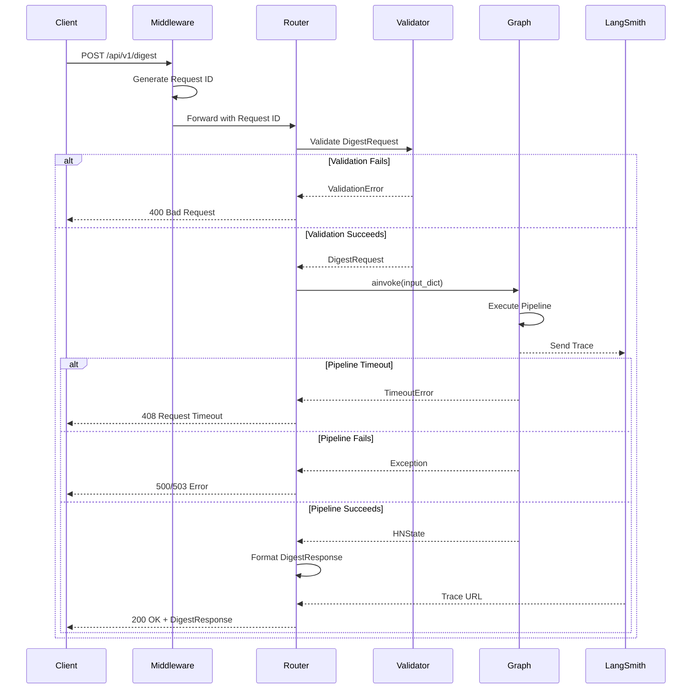
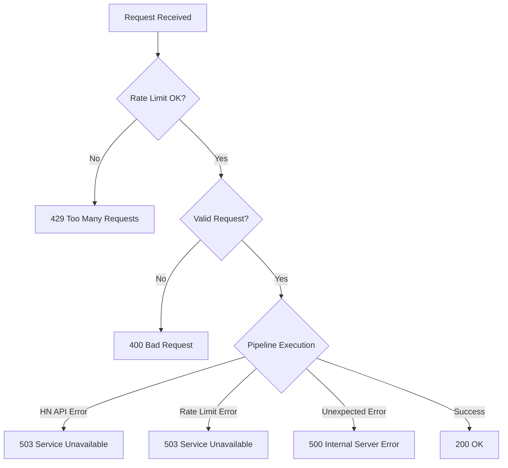

# Feature: FastAPI HTTP Layer (MVP-5b)

## Overview

The FastAPI HTTP Layer provides a RESTful API interface that exposes the LangGraph digest generation pipeline to clients. This component handles HTTP requests, validates input, orchestrates the graph execution, and formats responses in a type-safe, well-documented manner.

**Business Value**: Enables programmatic access to the digest generation service through a clean REST API with automatic OpenAPI documentation, request validation, and comprehensive error handling. This API serves as the foundation for both the HTMX frontend and potential future client integrations.

**Target**: MVP-5b milestone - "REST API operational" with integration tests passing.

> **Implementation Status**: This document has been updated (January 2025) to reflect the actual implementation. The implementation uses a simplified architecture with all models defined inline in `routes.py`. Key differences from the original design are noted in the "Differences from Original Design" section at the end.

---

## Requirements

### Functional Requirements

| ID | Requirement | Priority |
|----|-------------|----------|
| FR-1 | Accept digest generation requests via POST /api/v1/digest | High |
| FR-2 | Validate request payload using Pydantic models | High |
| FR-3 | Invoke LangGraph pipeline and return results | High |
| FR-4 | Provide health check endpoint GET /api/v1/health | High |
| FR-5 | Return structured error responses with appropriate status codes | High |
| FR-6 | Stream digest generation progress via SSE (POST /api/v1/digest/stream) | High |
| FR-7 | Generate OpenAPI 3.0 specification automatically | High |
| FR-8 | Support CORS for browser-based clients | Medium |
| FR-9 | Apply global rate limiting to protect upstream API quotas | High |

### Non-Functional Requirements

| ID | Requirement | Target |
|----|-------------|--------|
| NFR-1 | Request timeout handling | 120 seconds default |
| NFR-2 | Request ID tracking for observability | All requests |
| NFR-3 | Structured JSON error responses | All error scenarios |
| NFR-4 | Type safety with full type hints | Required |
| NFR-5 | OpenAPI documentation accuracy | 100% |
| NFR-6 | API versioning support | /api/v1/ prefix |
| NFR-7 | Test coverage | >= 80% |

---

## Architecture

### Component Diagram

```
┌─────────────────┐     ┌─────────────────┐     ┌─────────────────┐
│                 │     │                 │     │                 │
│  HTTP Client    │────▶│  FastAPI Router │────▶│  LangGraph      │
│  (Browser/API)  │     │  + Middleware   │     │  Pipeline       │
│                 │     │                 │     │                 │
└─────────────────┘     └─────────────────┘     └─────────────────┘
                               │                         │
                               │                         │
                               ▼                         ▼
                        ┌─────────────────┐     ┌─────────────────┐
                        │                 │     │                 │
                        │  Pydantic       │     │  LangSmith      │
                        │  Validation     │     │  Tracing        │
                        │                 │     │                 │
                        └─────────────────┘     └─────────────────┘
```

### Request Flow



### Components

#### APIRouter (`src/hn_herald/api/routes.py`)

FastAPI router defining all HTTP endpoints.

**Responsibilities**:
- Define endpoint routes and HTTP methods
- Validate request payloads via Pydantic
- Invoke dependency injection for graph instance
- Handle successful responses and error cases
- Format responses using Pydantic models

#### Request/Response Models (inline in `routes.py`)

Pydantic models for API contract definition, defined inline in routes.py.

**Responsibilities**:
- Validate incoming request payloads
- Define response schemas
- Provide type safety
- Generate OpenAPI schemas automatically

#### Mock Data Generator (`src/hn_herald/api/mocks.py`)

Mock data generator for development and testing.

**Responsibilities**:
- Generate realistic mock digest streams
- Support `mock: true` parameter in requests
- Enable frontend development without API costs

#### Rate Limiting (`src/hn_herald/rate_limit.py`)

Global rate limiting decorator.

**Responsibilities**:
- Protect upstream API quotas (Anthropic)
- Privacy-first approach (global, not per-IP)
- Returns 429 when limits exceeded

---

## API Endpoints

### POST /api/v1/digest

Generate a personalized HackerNews digest.

**Request**:
```http
POST /api/v1/digest HTTP/1.1
Content-Type: application/json

{
  "profile": {
    "interest_tags": ["python", "ai", "rust"],
    "disinterest_tags": ["crypto", "blockchain"],
    "min_score": 0.3,
    "max_articles": 10
  },
  "mock": false
}
```

**Success Response (200 OK)**:
```http
HTTP/1.1 200 OK
Content-Type: application/json

{
  "articles": [
    {
      "story_id": 39856302,
      "title": "Python 3.13 Performance Improvements",
      "url": "https://example.com/article",
      "hn_url": "https://news.ycombinator.com/item?id=39856302",
      "hn_score": 256,
      "summary": "Python 3.13 brings major performance improvements...",
      "key_points": [
        "15% faster than 3.12",
        "Improved JIT compilation",
        "Better memory management"
      ],
      "tech_tags": ["python", "performance", "compiler"],
      "relevance_score": 0.825,
      "relevance_reason": "Matches interests: python",
      "final_score": 0.731
    }
  ],
  "stats": {
    "stories_fetched": 30,
    "articles_extracted": 28,
    "articles_summarized": 25,
    "articles_scored": 25,
    "articles_returned": 10,
    "errors": 2,
    "generation_time_ms": 8542
  },
  "timestamp": "2025-01-04T19:45:30.123456Z",
  "profile_summary": {
    "interests": ["python", "ai", "rust"],
    "disinterests": ["crypto", "blockchain"],
    "min_score": 0.3,
    "max_articles": 10
  }
}
```

**Error Response (400 Bad Request)**:
```http
HTTP/1.1 400 Bad Request
Content-Type: application/json

{
  "error": "Invalid request",
  "detail": "Invalid request: validation error details..."
}
```

**Error Response (429 Too Many Requests)**:
```http
HTTP/1.1 429 Too Many Requests
Content-Type: application/json

{
  "error": "Rate limit exceeded",
  "detail": "Rate limit exceeded: 30 calls per 60 seconds"
}
```

**Error Response (500 Internal Server Error)**:
```http
HTTP/1.1 500 Internal Server Error
Content-Type: application/json

{
  "error": "Internal server error",
  "detail": "Digest generation failed: error details..."
}
```

**Error Response (503 Service Unavailable)**:
```http
HTTP/1.1 503 Service Unavailable
Content-Type: application/json

{
  "error": "Service unavailable",
  "detail": "External service error: HackerNews API rate limit..."
}
```

### GET /api/v1/health

Health check endpoint for monitoring and orchestration.

**Request**:
```http
GET /api/v1/health HTTP/1.1
```

**Success Response (200 OK)**:
```http
HTTP/1.1 200 OK
Content-Type: application/json

{
  "status": "healthy",
  "version": "0.1.0",
  "environment": "development"
}
```

---

### POST /api/v1/digest/stream

Generate a personalized HackerNews digest with real-time progress updates via Server-Sent Events (SSE).

**Request**:
```http
POST /api/v1/digest/stream HTTP/1.1
Content-Type: application/json

{
  "profile": {
    "interest_tags": ["python", "ai", "rust"],
    "disinterest_tags": ["crypto", "blockchain"],
    "min_score": 0.3,
    "max_articles": 10
  },
  "mock": false
}
```

**SSE Response Stream**:
```http
HTTP/1.1 200 OK
Content-Type: text/event-stream
Cache-Control: no-cache
Connection: keep-alive
X-Accel-Buffering: no

data: {"stage": "starting", "message": "Initializing pipeline..."}

data: {"stage": "fetch", "message": "Fetching HN stories..."}

data: {"stage": "extract", "message": "Extracting article content..."}

data: {"stage": "filter", "message": "Filtering articles..."}

data: {"stage": "summarize", "message": "Summarizing with AI..."}

data: {"stage": "score", "message": "Scoring relevance..."}

data: {"stage": "rank", "message": "Ranking articles..."}

data: {"stage": "format", "message": "Formatting digest..."}

data: {"stage": "complete", "digest": {...}}
```

**SSE Stage Types**:

| Stage | Description |
|-------|-------------|
| `starting` | Pipeline initialization |
| `fetch` | Fetching story IDs from HN API |
| `extract` | Extracting article content from URLs |
| `filter` | Filtering valid articles |
| `summarize` | AI summarization of articles |
| `score` | Relevance scoring based on user profile |
| `rank` | Ranking articles by final score |
| `format` | Formatting final digest |
| `complete` | Pipeline finished, includes full digest response |
| `error` | Pipeline error occurred |

**Completion Event**:
The `complete` stage includes the full digest response in the `digest` field, matching the structure of the `/api/v1/digest` response.

**Error Event**:
```
data: {"stage": "error", "message": "ErrorType: error description..."}
```

---

## Data Models

### Request Models

#### GenerateDigestRequest

```python
from pydantic import BaseModel, Field

from hn_herald.models.profile import UserProfile


class GenerateDigestRequest(BaseModel):
    """Request body for digest generation endpoint.

    Attributes:
        profile: User preferences for personalization.
        mock: Whether to use mock data instead of real API calls.

    Example:
        >>> request = GenerateDigestRequest(
        ...     profile=UserProfile(
        ...         interest_tags=["python", "ai"],
        ...         disinterest_tags=["crypto"],
        ...         min_score=0.3,
        ...         max_articles=10,
        ...     ),
        ...     mock=False,
        ... )
    """

    profile: UserProfile = Field(
        ...,
        description="User preferences for article relevance scoring",
    )
    mock: bool = Field(
        default=False,
        description="Use mock data for development/testing",
    )
```

### Response Models

#### DigestArticleResponse

```python
from pydantic import BaseModel


class DigestArticleResponse(BaseModel):
    """Simplified article representation for API response.

    Attributes:
        story_id: HN story ID.
        title: Article title.
        url: Article URL.
        hn_url: HN comments URL.
        hn_score: HN upvote score.
        summary: AI-generated summary.
        key_points: List of key takeaways.
        tech_tags: Technology/topic tags.
        relevance_score: User relevance score (0-1).
        relevance_reason: Explanation of relevance.
        final_score: Composite score (0-1).
    """

    story_id: int
    title: str
    url: str
    hn_url: str
    hn_score: int
    summary: str
    key_points: list[str]
    tech_tags: list[str]
    relevance_score: float
    relevance_reason: str
    final_score: float
```

#### DigestStatsResponse

```python
from pydantic import BaseModel


class DigestStatsResponse(BaseModel):
    """Statistics about digest generation.

    Attributes:
        stories_fetched: Number of HN stories retrieved.
        articles_extracted: Number of articles successfully extracted.
        articles_summarized: Number of articles successfully summarized.
        articles_scored: Number of articles scored and ranked.
        articles_returned: Number of articles in final digest.
        errors: Number of errors during processing.
        generation_time_ms: Total processing time in milliseconds.
    """

    stories_fetched: int
    articles_extracted: int
    articles_summarized: int
    articles_scored: int
    articles_returned: int
    errors: int
    generation_time_ms: int
```

#### GenerateDigestResponse

```python
from datetime import datetime
from typing import Any

from pydantic import BaseModel


class GenerateDigestResponse(BaseModel):
    """Response for digest generation endpoint.

    Attributes:
        articles: Ranked list of articles.
        stats: Generation statistics.
        timestamp: When digest was generated.
        profile_summary: Summary of user profile used.
    """

    articles: list[DigestArticleResponse]
    stats: DigestStatsResponse
    timestamp: datetime
    profile_summary: dict[str, Any]
```

### Error Models

#### ErrorResponse

```python
from pydantic import BaseModel


class ErrorResponse(BaseModel):
    """Standard error response format.

    Provides consistent error structure across all API errors.

    Attributes:
        error: High-level error message.
        detail: Detailed error information (optional).
    """

    error: str
    detail: str | None = None
```

---

## HTTP Status Codes

### Success Codes

| Code | Status | Usage |
|------|--------|-------|
| 200 | OK | Digest generated successfully, health check passed, SSE stream started |

### Client Error Codes

| Code | Status | Usage | Example |
|------|--------|-------|---------|
| 400 | Bad Request | Request validation failed | Invalid profile format |
| 429 | Too Many Requests | Rate limit exceeded | More than 30 requests per 60 seconds |

### Server Error Codes

| Code | Status | Usage | Example |
|------|--------|-------|---------|
| 500 | Internal Server Error | Unexpected internal error | Unhandled Python exception |
| 503 | Service Unavailable | External service unavailable | HN API down, Anthropic API rate limit |

### Status Code Decision Tree



---

## Implementation Plan

### File Structure (Actual)

```
src/hn_herald/
├── api/
│   ├── __init__.py              # Export router
│   ├── routes.py                # FastAPI router with all endpoints and models
│   └── mocks.py                 # Mock data generation for testing
├── main.py                      # FastAPI app with CORS, static files, templates
├── config.py                    # Settings
└── rate_limit.py                # Rate limiting decorator

tests/
├── unit/
│   └── api/
│       └── test_routes.py       # Route unit tests
└── integration/
    └── api/
        └── test_api.py          # API integration tests
```

**Note**: The implementation uses a simpler structure than originally planned:
- Request/response models are defined directly in `routes.py` (not in separate files)
- No custom middleware for request IDs (using standard FastAPI logging)
- Rate limiting implemented in dedicated module `rate_limit.py`
- Mock data support built into the streaming endpoint

---

## Router Implementation

The actual implementation in `src/hn_herald/api/routes.py` differs from the original design. Key differences:

1. **No dependency injection for graph**: Graph is created per-request via `create_hn_graph()`
2. **Rate limiting decorator**: Applied via `@rate_limit` from `hn_herald.rate_limit`
3. **Inline models**: All Pydantic models defined in the same file
4. **Simpler request model**: Only `profile` and `mock` fields

### Actual Route Structure

```python
from hn_herald.graph.graph import create_hn_graph
from hn_herald.rate_limit import rate_limit

router = APIRouter(prefix="/api/v1", tags=["digest"])


@router.post("/digest", response_model=GenerateDigestResponse, ...)
@rate_limit
async def generate_digest(request: GenerateDigestRequest) -> GenerateDigestResponse:
    graph = create_hn_graph()  # Graph created per-request
    initial_state = {"profile": request.profile, "articles": [], "errors": [], ...}
    final_state = await graph.ainvoke(initial_state)
    # Build and return response...


@router.post("/digest/stream", ...)
@rate_limit
async def generate_digest_stream(request: GenerateDigestRequest) -> StreamingResponse:
    # SSE streaming with LangGraph astream()...


@router.get("/health", ...)
async def health_check() -> dict[str, Any]:
    return {"status": "healthy", "version": __version__, "environment": settings.env}
```

For the complete implementation, see `src/hn_herald/api/routes.py`.

---

## Error Handling

Error handling is implemented inline in route functions rather than via custom exception handlers.

```python
except ValidationError as e:
    raise HTTPException(status_code=400, detail=f"Invalid request: {e!s}")
except Exception as e:
    if "HNClientError" in str(type(e).__name__) or "rate limit" in str(e).lower():
        raise HTTPException(status_code=503, detail=f"External service error: {e!s}")
    raise HTTPException(status_code=500, detail=f"Digest generation failed: {e!s}")
```

**Note**: The original design specified custom exception handlers in `exceptions.py` and request ID middleware in `middleware.py`. These were not implemented. Error responses use a simpler format: `{"error": "...", "detail": "..."}`.

---

## Testing Strategy

### Test Cases

| Test | Description | Priority |
|------|-------------|----------|
| `test_digest_endpoint_success` | POST /digest returns 200 with valid request | High |
| `test_digest_endpoint_validation_error` | POST /digest returns 400 with invalid payload | High |
| `test_digest_endpoint_service_error` | POST /digest returns 503 on HN API failure | High |
| `test_digest_endpoint_internal_error` | POST /digest returns 500 on unexpected error | High |
| `test_digest_stream_endpoint` | POST /digest/stream returns SSE events | High |
| `test_health_endpoint` | GET /health returns 200 with status | High |
| `test_rate_limit` | Rate limiting returns 429 when exceeded | High |

### Sample Test Request

```python
sample_digest_request = {
    "profile": {
        "interest_tags": ["python", "ai"],
        "disinterest_tags": ["crypto"],
        "min_score": 0.3,
        "max_articles": 10,
    },
    "mock": False,
}
```

### Coverage Requirements

- Minimum 80% line coverage for API routes
- All endpoints tested (success + error paths)
- SSE streaming tested

---

## OpenAPI Documentation

FastAPI auto-generates OpenAPI 3.0 documentation.

### Accessing Documentation (Development Only)

- **Swagger UI**: `http://localhost:8000/api/docs`
- **ReDoc**: `http://localhost:8000/api/redoc`

Configured in `main.py`:
```python
app = FastAPI(
    title="HN Herald",
    description="AI-powered HackerNews digest generator",
    version=__version__,
    docs_url="/api/docs" if settings.is_development else None,
    redoc_url="/api/redoc" if settings.is_development else None,
)
```

---

## Integration with LangGraph

### Graph Input Format

```python
initial_state = {
    "profile": request.profile,      # UserProfile model
    "articles": [],                   # Empty list for accumulation
    "errors": [],                     # Empty list for error tracking
    "start_time": time.monotonic(),   # For timing
}
```

### Graph Output Format

Final state from `graph.ainvoke()`:

```python
{
    "digest": {...},                  # Digest model with articles and stats
    "articles": [...],                # All extracted articles
    "summarized_articles": [...],     # Summarized articles
    "scored_articles": [...],         # Scored articles
    "errors": [...],                  # Error messages
}
```

### Error Mapping

| Graph Error | HTTP Status |
|-------------|-------------|
| `ValidationError` | 400 |
| `HNClientError` | 503 |
| Rate limit errors | 503 |
| Other exceptions | 500 |

---

## Security Considerations

1. **Input Validation**: All requests validated via Pydantic before processing
2. **No Sensitive Data**: No API keys or secrets in responses
3. **Rate Limiting**: Global rate limits protect upstream API quotas
4. **Error Hiding**: Internal error details included in dev mode only
5. **CORS**: All origins allowed in dev, none in production
6. **Docs Disabled in Production**: OpenAPI UI only available in development

---

## Rate Limiting

The API implements global rate limiting to protect upstream API quotas (particularly the Anthropic API).

### Configuration

| Setting | Value | Description |
|---------|-------|-------------|
| `CALLS` | 30 | Maximum requests per period |
| `PERIOD` | 60 | Period duration in seconds |

### Privacy-First Design

Rate limiting follows a privacy-first approach (per ADR-003):
- **Global limits**: Applied across all requests, not per-IP or per-user
- **No tracking**: No request logging, storage of client identifiers, or analytics
- **In-memory state**: Resets on application restart
- **No persistence**: Single-instance only (Redis-backed for horizontal scaling would be a future enhancement)

### Behavior

When rate limits are reached, the decorator uses sleep-and-retry behavior for graceful degradation. If retries are exhausted, a `RateLimitExceededError` is raised and converted to HTTP 429.

### Applied Endpoints

Rate limiting is applied to:
- `POST /api/v1/digest`
- `POST /api/v1/digest/stream`

---

## Differences from Original Design (05-fastapi-endpoints.md)

| Aspect | Original Design | Actual Implementation |
|--------|-----------------|----------------------|
| Request model | `DigestRequest` with story_type, story_count, article_limit | `GenerateDigestRequest` with profile and mock only |
| Response model | Includes `langsmith_trace_url` field | No trace URL field in response |
| Stats field | `final_count` | `articles_returned` |
| Health check | Detailed service health checks (HN API, Anthropic, LangSmith) | Simplified (status, version, environment only) |
| Streaming endpoint | Listed as "Future Enhancement" | Fully implemented at `/api/v1/digest/stream` |
| Rate limiting | Listed as "Future Enhancement" | Implemented via `@rate_limit` decorator |
| File structure | Separate models/, deps.py, exceptions.py, middleware.py | All inline in routes.py + mocks.py |
| CORS | Specific localhost origins | All origins in dev (`["*"]`), none in prod |
| Dependency injection | Global graph instance via deps.py | Graph created per-request via `create_hn_graph()` |
| Request ID middleware | Custom RequestIDMiddleware | Not implemented (uses standard logging) |
| Error response format | Nested `{"error": {"type": ..., "details": ...}}` | Simple `{"error": "...", "detail": "..."}` |

---

## Future Enhancements

Per YAGNI, documented but not implemented:

1. **Authentication**: API key or OAuth2 support
2. **Caching**: Response caching for identical requests
3. **Batch Endpoints**: Generate multiple digests in one request
4. **Webhook Support**: Async digest generation with callback
5. **GraphQL Endpoint**: Alternative to REST API
6. **Redis-backed Rate Limiting**: For horizontal scaling
7. **Detailed Health Checks**: Service-level health monitoring

---

## References

- [FastAPI Documentation](https://fastapi.tiangolo.com/)
- [Pydantic V2 Documentation](https://docs.pydantic.dev/latest/)
- [OpenAPI 3.0 Specification](https://swagger.io/specification/)
- [HTTP Status Code Definitions](https://httpstatuses.com/)
- [12-Factor App Config](https://12factor.net/config)
- [MVP-4 Scoring Implementation](./04-relevance-scoring.md)
- [Architecture Document](../ARCHITECTURE.md)
