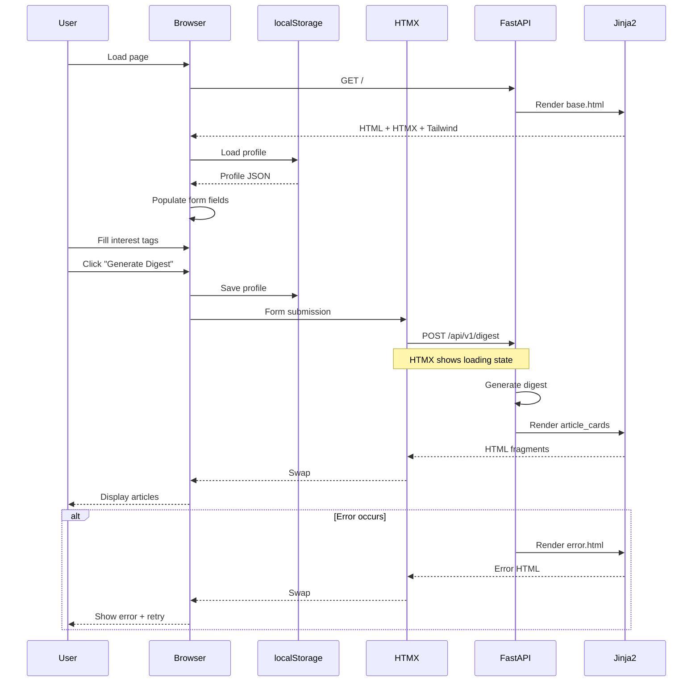

# Feature: HTMX Templates & Mobile-First UI (MVP-6)

## Overview

The HTMX Templates layer provides a mobile-first, responsive web interface for HN Herald. This component uses server-rendered HTML with HTMX for dynamic interactions, delivering a fast, accessible user experience without heavy JavaScript frameworks. Users can configure their interest profile, generate personalized digests, and browse articles in a clean, touch-optimized interface.

**Business Value**: Transforms the FastAPI backend into a usable web application with privacy-first local storage, mobile-optimized design, and progressive enhancement. Users can immediately start using HN Herald without installation or signup.

**Target**: MVP-6 milestone - "Usable web UI" with E2E smoke tests passing and Lighthouse scores >90.

---

## Requirements

### Functional Requirements

| ID | Requirement | Priority |
|----|-------------|----------|
| FR-1 | Display digest form with interest/disinterest tag selection | High |
| FR-2 | Generate digest via HTMX POST to /api/v1/digest endpoint | High |
| FR-3 | Display articles in responsive cards with summaries and scores | High |
| FR-4 | Store user profile in localStorage with persistence | High |
| FR-5 | Load profile from localStorage on page load | High |
| FR-6 | Provide tag selector with predefined and custom tags | High |
| FR-7 | Show loading states during digest generation | Medium |
| FR-8 | Display errors gracefully with retry options | Medium |
| FR-9 | Link to original articles and HN comments | High |
| FR-10 | Show generation stats (fetched/scored/time) | Low |

### Non-Functional Requirements

| ID | Requirement | Target |
|----|-------------|--------|
| NFR-1 | Mobile-first responsive design | Works on 320px+ screens |
| NFR-2 | WCAG 2.1 AA accessibility compliance | Required |
| NFR-3 | Lighthouse Performance score | ≥90 |
| NFR-4 | Lighthouse Accessibility score | ≥95 |
| NFR-5 | First Contentful Paint (FCP) | <1.5s |
| NFR-6 | Time to Interactive (TTI) | <3.0s |
| NFR-7 | No external CDN dependencies | Self-hosted assets only |
| NFR-8 | Progressive enhancement | Works without JavaScript |

---

## Architecture

### Component Diagram

```mermaid
flowchart TB
    subgraph Browser["BROWSER"]
        HTML[HTML Page<br/>index.html]
        HTMX[HTMX.js<br/>1.9.x]
        LS[localStorage<br/>Profile data]
        JS[Vanilla JS<br/>app.js]
    end

    subgraph Templates["JINJA2 TEMPLATES"]
        Base[base.html<br/>Layout]
        Index[index.html<br/>Home page]
        Form[digest_form.html<br/>Form partial]
        Card[article_card.html<br/>Article partial]
        Loading[loading.html<br/>Loading state]
        Error[error.html<br/>Error state]
    end

    subgraph Static["STATIC ASSETS"]
        CSS[styles.css<br/>Tailwind]
        JSFile[app.js<br/>Profile mgmt]
        Favicon[favicon.ico]
    end

    subgraph FastAPI["FASTAPI BACKEND"]
        Routes[/api/v1/digest<br/>POST endpoint]
        TemplateRoute[/<br/>GET page]
    end

    Browser --> HTML
    HTML --> Base
    Base --> Index
    Index --> Form
    Index --> HTMX
    Index --> JS

    HTMX --> Routes
    Routes --> Card

    JS <--> LS

    HTML --> CSS
    HTML --> JSFile

    TemplateRoute --> Base

    style HTMX fill:#e1f5fe
    style LS fill:#fff3e0
    style Routes fill:#f3e5f5
```

### Request Flow



### File Structure

```
src/hn_herald/
├── templates/
│   ├── base.html              # Base layout with HN-style theming
│   ├── index.html             # Home page with form and results
│   ├── partials/
│   │   ├── digest_form.html   # Profile form partial with SSE submission
│   │   ├── article_card.html  # Single article card (Tailwind-styled)
│   │   ├── digest_results.html # Digest results container with stats
│   │   ├── tag_selector.html  # Tag selection component (DaisyUI-styled)
│   │   ├── loading.html       # Loading spinner (HTMX-style overlay)
│   │   └── error.html         # Error display with troubleshooting
│
├── static/
│   ├── css/
│   │   ├── input.css          # Tailwind input configuration
│   │   └── styles.css         # Compiled Tailwind + HN theme CSS
│   ├── js/
│   │   └── app.js             # Profile management + SSE digest generation
│   └── favicon.svg            # App favicon (SVG format)
│
├── api/
│   ├── routes.py              # Template routes and API endpoints
│   └── templates.py           # Template helpers (if exists)
│
└── main.py                    # Mount static files
```

---

## HTMX Integration Patterns

### Form Submission Pattern

**Note**: The actual implementation uses JavaScript with Server-Sent Events (SSE) instead of pure HTMX form submission to support real-time pipeline progress updates.

```html
<!-- digest_form.html (actual implementation) -->
<form id="digest-form" onsubmit="return false;">
  <!-- Form fields with HN-style classes -->
  <button type="button" class="hn-button" onclick="generateDigest()">
    Generate Digest
  </button>
</form>

<!-- Loading Indicator with Fun Facts -->
<div id="loading" style="display: none;">
  <div class="hn-loading"></div>
  <div id="pipeline-stage">Generating your personalized digest...</div>
  <button type="button" class="hn-button-small" onclick="abortDigest()">Cancel</button>
  <div id="fun-fact"><!-- Rotating HN fun facts --></div>
</div>
```

**Key Features**:
- JavaScript `generateDigest()` function handles form submission
- SSE streaming via `fetch()` to `/api/v1/digest/stream` endpoint
- Real-time pipeline stage updates via `updatePipelineStage()`
- Cancel button with `abortDigest()` function
- Fun facts rotation during loading

### Partial Swap Pattern

**Note**: The actual implementation uses `digest_results.html` and JavaScript-based content rendering via `displayDigestResults()`.

```html
<!-- digest_results.html (server-rendered for HTMX fallback) -->
<div id="results" class="space-y-6">
  
  <div class="bg-white rounded-lg shadow-md p-4 sm:p-6">
    <h2 class="text-lg font-semibold text-gray-900 mb-3">Digest Statistics</h2>
    <!-- Statistics grid with fetched, filtered, final, errors, time -->
  </div>
  

  
  <div class="space-y-4" role="list" aria-label="Personalized articles">
    
    <div role="listitem">
      
    </div>
    
  </div>
  
  <!-- Empty state with suggestions -->
  
</div>
```

**Key Features**:
- SSE responses trigger JavaScript `displayDigestResults()` function
- Results rendered client-side with HN-style formatting
- Includes pipeline statistics (stories fetched, extracted, summarized, scored)
- Fallback to server-rendered templates for non-JS scenarios

### Loading State Pattern

**Note**: The actual implementation uses two loading approaches:
1. **digest_form.html**: Inline loading with HN-style spinner, pipeline stages, and fun facts
2. **loading.html**: HTMX-style overlay for fallback scenarios

```html
<!-- digest_form.html (actual inline loading) -->
<div id="loading" style="display: none;">
  <div class="hn-loading"></div>
  <div id="pipeline-stage">Generating your personalized digest...</div>
  <button type="button" class="hn-button-small" onclick="abortDigest()">Cancel</button>
  <div id="fun-fact">
    <div style="font-weight: bold;">HN Fun Fact</div>
    <div><!-- Rotating fun facts about Hacker News --></div>
  </div>
</div>

<!-- loading.html (HTMX overlay fallback) -->
<div id="loading" class="htmx-indicator fixed inset-0 bg-gray-900 bg-opacity-50 flex items-center justify-center z-50"
     role="status" aria-live="polite" aria-label="Generating personalized digest">
  <div class="bg-white rounded-lg p-6 sm:p-8 max-w-sm w-full mx-auto shadow-xl">
    <svg class="animate-spin h-10 w-10 text-blue-600" ...></svg>
    <h3>Generating Your Digest</h3>
    <p>Fetching stories, summarizing articles, and scoring relevance...</p>
  </div>
</div>
```

**Key Features**:
- HN-style spinner with CSS animation (`hn-loading` class)
- Real-time pipeline stage updates via JavaScript
- Cancel button to abort long-running requests
- Rotating fun facts about Hacker News (15 facts, 5-second intervals)
- ARIA `role="status"` for screen readers in HTMX fallback

### Error Handling Pattern

**Note**: The actual implementation includes error type-specific guidance and troubleshooting tips.

```html
<!-- error.html (actual implementation) -->
<div id="results" class="space-y-4">
  <div class="bg-red-50 border-l-4 border-red-500 rounded-lg p-4 sm:p-6 shadow-md"
       role="alert" aria-live="assertive">
    <div class="flex items-start gap-3">
      <svg class="h-5 w-5 text-red-500" fill="currentColor" viewBox="0 0 20 20">...</svg>
      <div class="flex-1 min-w-0">
        <h3 class="text-sm font-medium text-red-800 mb-2">Error Generating Digest</h3>
        <div class="text-sm text-red-700 mb-4">{{ error_message }}</div>

        <!-- Error type-specific guidance -->
        
        <div class="bg-red-100 rounded p-3">
          <p>Please check: interest tags, story count (10-100), article limit (1-50), min score (0.0-1.0)</p>
        </div>
        
        <div class="bg-red-100 rounded p-3">
          <p>Request took too long. Try reducing stories to fetch.</p>
        </div>
        
        <div class="bg-red-100 rounded p-3">
          <p>Too many requests. Please wait before trying again.</p>
        </div>
        

        <!-- Action buttons -->
        <div class="flex flex-col sm:flex-row gap-2">
          <button onclick="window.location.reload()" class="...">Try Again</button>
          <button onclick="window.scrollTo({top: 0, behavior: 'smooth'})" class="...">Adjust Settings</button>
        </div>
      </div>
    </div>
  </div>

  <!-- Troubleshooting Tips -->
  <div class="bg-blue-50 border border-blue-200 rounded-lg p-4">
    <h4>Troubleshooting Tips</h4>
    <ul>
      <li>Start with fewer stories (10-30) for faster results</li>
      <li>Ensure at least one interest tag is selected</li>
      <li>Lower the minimum relevance score</li>
      <li>Check your internet connection</li>
    </ul>
  </div>
</div>
```

**Key Features**:
- ARIA `role="alert"` with `aria-live="assertive"` for screen readers
- Error type-specific guidance (validation, timeout, rate_limit, api_error)
- Troubleshooting tips section
- JavaScript-based retry/adjust buttons (not HTMX)
- Responsive mobile-friendly layout

---

## Component Specifications

### Base Layout (base.html)

**Purpose**: Master template with HN-style theming, Tailwind CSS, HTMX, and theme switching.

**Structure**:
```html
<!DOCTYPE html>
<html lang="en">
<head>
  <meta charset="UTF-8">
  <meta name="viewport" content="width=device-width, initial-scale=1.0">
  <meta name="description" content="Privacy-first personalized HackerNews digest with AI summaries">

  <!-- Tailwind CSS (compiled with HN themes) -->
  <link rel="stylesheet" href="{{ url_for('static', path='/css/styles.css') }}">

  <!-- HTMX -->
  <script src="https://unpkg.com/htmx.org@1.9.10"></script>

  <title>HN Herald - AI-Powered HackerNews Digest</title>

  <link rel="icon" type="image/svg+xml" href="{{ url_for('static', path='/favicon.svg') }}">
</head>
<body>
  <!-- HN-style themed header -->
  <header class="hn-header">
    <div style="display: flex; align-items: center; justify-content: space-between;">
      <div style="display: flex; align-items: center; gap: 8px;">
        <span style="color: var(--header-text); font-weight: bold;">HN Herald</span>
      </div>
      <div style="display: flex; align-items: center; gap: 12px;">
        <div>
          <span style="color: var(--header-text); font-size: 9pt;">theme:</span>
          <span id="theme-switcher" style="margin-left: 4px;"></span>
        </div>
      </div>
    </div>
  </header>

  <!-- Main Content -->
  <main class="hn-container">
    
  </main>

  <!-- Footer -->
  <footer class="hn-footer">
    Privacy-first • No tracking • Open source • Built for HN
  </footer>

  <!-- Custom JS -->
  <script src="{{ url_for('static', path='/js/app.js') }}"></script>
</body>
</html>
```

**Theme System**:
The implementation includes three themes controlled via `data-theme` attribute:
- `hn` (default): Classic HN orange (#ff6600)
- `ocean`: Blue-green theme (#006d77)
- `dark`: Dark mode with amber accents (#ffa726)

**CSS Custom Properties**:
```css
:root {
  --primary-color: #ff6600;
  --bg-color: #f6f6ef;
  --text-color: #000000;
  --secondary-color: #828282;
  --border-color: #d4d4cc;
  --header-bg: #ff6600;
  --header-text: #000000;
  --input-bg: #ffffff;
  --selected-bg: #ffffff;
  --button-bg: #ff6600;
  --button-text: #ffffff;
}
```

**Accessibility**:
- Semantic HTML5 elements
- `lang` attribute for screen readers
- Viewport meta for mobile
- Descriptive title and meta description

**Performance**:
- Compiled Tailwind CSS (self-hosted)
- HTMX from CDN (small, cacheable)
- SVG favicon for crisp rendering
- Theme loaded before DOMContentLoaded to prevent flash

---

### Digest Form (digest_form.html)

**Purpose**: User input form for profile configuration and SSE-based digest generation.

**Structure**:
```html
<form id="digest-form" onsubmit="return false;">

  <!-- Interest Tags -->
  <div class="hn-section-title">Interest Tags</div>
  <div class="hn-selected-tags" id="interest-tags-selected">
    <span style="color: var(--secondary-color); font-size: 9pt;">Selected: (none) </span>
    <a href="#" onclick="removeAllTags('interest-tags'); return false;">[remove all]</a>
  </div>
  <div style="margin-bottom: 8px;">
    <span style="color: var(--secondary-color); font-size: 9pt;">Add: </span>
    
      
        <a href="#" class="hn-tag-link" onclick="addTag('interest-tags', '{{ tag }}'); return false;">{{ tag }}</a>
         | 
      
    
  </div>
  <div style="margin-bottom: 12px;">
    <span style="color: var(--secondary-color); font-size: 9pt;">Custom: </span>
    <input type="text" id="custom-interest-tag" placeholder="type tag" class="hn-input"
           onkeypress="if(event.key==='Enter'){addTag('interest-tags', this.value); this.value=''; return false;}">
    <button type="button" class="hn-button-small"
            onclick="addTag('interest-tags', document.getElementById('custom-interest-tag').value);">add</button>
  </div>
  <input type="hidden" name="interest_tags" id="interest-tags-hidden" value="">

  <!-- Disinterest Tags (similar structure with predefined: crypto, blockchain, nft, web3) -->
  <div class="hn-section-title">Disinterest Tags</div>
  <!-- ... similar tag selection structure ... -->
  <input type="hidden" name="disinterest_tags" id="disinterest-tags-hidden" value="">

  <!-- Options (inline layout) -->
  <div class="hn-options">
    <label for="story-type">Story Type:</label>
    <select id="story-type" name="story_type" class="hn-select">
      <option value="top" selected>Top Stories</option>
      <option value="new">New Stories</option>
      <option value="best">Best Stories</option>
      <option value="ask">Ask HN</option>
      <option value="show">Show HN</option>
    </select>

    <label for="story-count">Fetch:</label>
    <input type="number" id="story-count" name="story_count" min="10" max="100" value="30" class="hn-input">

    <label for="article-limit">Results:</label>
    <input type="number" id="article-limit" name="article_limit" min="1" max="50" value="10" class="hn-input">

    <label for="min-score">Min Score:</label>
    <input type="number" id="min-score" name="min_score" min="0" max="1" step="0.1" value="0.3" class="hn-input">
  </div>

  <!-- Submit Button -->
  <div style="text-align: center;">
    <button type="button" class="hn-button" onclick="generateDigest()">Generate Digest</button>
    <div style="color: var(--secondary-color); font-size: 8pt; margin-top: 8px;">
      Digest generation takes 1-2 minutes
    </div>
  </div>
</form>

<!-- Loading Indicator with Fun Facts -->
<div id="loading" style="display: none;">
  <div class="hn-loading"></div>
  <div id="pipeline-stage">Generating your personalized digest...</div>
  <button type="button" class="hn-button-small" onclick="abortDigest()">Cancel</button>
  <div id="fun-fact">
    <div>HN Fun Fact</div>
    <div><!-- Rotating fun facts --></div>
  </div>
</div>
```

**Key CSS Classes**:
- `hn-section-title`: Bold section headers
- `hn-tag-link`: Clickable tag links with pipe separators
- `hn-selected-tags`: Background container for selected tags
- `hn-input`: HN-style text inputs
- `hn-select`: HN-style select dropdowns
- `hn-button`: Primary action button (orange)
- `hn-button-small`: Secondary buttons
- `hn-options`: Inline options layout
- `hn-loading`: Spinning loader animation

**Form Submission Flow**:
1. User clicks "Generate Digest" button
2. `generateDigest()` saves profile to localStorage
3. SSE request sent to `/api/v1/digest/stream`
4. Pipeline stage updates shown in real-time
5. Fun facts rotate every 5 seconds during loading
6. Cancel button allows aborting long requests
7. Results rendered via `displayDigestResults()`

**Validation**:
- HTML5 input constraints (min, max, step)
- Tag deduplication (case-insensitive)
- Minimum tag length of 2 characters
- Server-side Pydantic validation

---

### Tag Selector (tag_selector.html)

**Purpose**: Reusable multi-select tag input component with DaisyUI styling.

**Note**: The main form uses inline HN-style tag selection in `digest_form.html`. This component (`tag_selector.html`) provides a DaisyUI-styled alternative for other contexts.

**Structure**:
```html
<div class="tag-selector" data-tag-field="{{ field_name }}">
  <!-- Selected Tags Display -->
  <div id="{{ field_id }}-selected"
       class="flex flex-wrap gap-2 mb-3 min-h-[2rem]"
       role="region"
       aria-label="Selected {{ field_name }} tags"
       aria-live="polite">
    <span class="text-sm text-secondary">No tags selected</span>
  </div>

  <!-- Tag Input with Button -->
  <div class="join w-full">
    <input type="text" id="{{ field_id }}-input"
           placeholder="{{ placeholder }}"
           autocomplete="off"
           class="input input-bordered join-item flex-1"
           aria-label="{{ placeholder }}"
           aria-describedby="{{ field_id }}-help">
    <button type="button" onclick="addTagFromInput('{{ field_id }}')"
            class="btn btn-secondary join-item" aria-label="Add custom tag">
      Add
    </button>
  </div>

  <p id="{{ field_id }}-help" class="text-xs text-secondary mt-1">
    Type to add custom tags (press Enter or comma) or select from suggestions below
  </p>

  <!-- Predefined Tags (Categories) -->
  
  <div class="mt-4 space-y-3" role="region" aria-label="Predefined tag categories">
    
    <div>
      <h4 class="text-xs font-bold text-neutral uppercase mb-2">{{ category_name }}</h4>
      <div class="flex flex-wrap gap-2">
        
        <button type="button" data-tag="{{ tag }}"
                class="badge badge-lg badge-outline badge-primary tag-chip-suggestion"
                onclick="addTag('{{ field_id }}', '{{ tag }}')"
                aria-label="Add {{ tag }} tag">
          {{ tag }}
        </button>
        
      </div>
    </div>
    
  </div>
  

  <!-- Hidden Input for Form Submission -->
  <input type="hidden" name="{{ field_name }}" id="{{ field_id }}-hidden" value="">
</div>
```

**JavaScript Functions** (in app.js):
```javascript
// Add tag with case-insensitive deduplication
function addTag(fieldId, tag) {
  tag = tag.trim();
  if (!tag || tag.length < 2) return;

  const tags = selectedTags[fieldId] || [];
  if (tags.some(t => t.toLowerCase() === tag.toLowerCase())) return;

  tags.push(tag);
  selectedTags[fieldId] = tags;

  updateTagDisplay(fieldId);
  updateHiddenInput(fieldId, tags);
}

// Remove specific tag
function removeTag(fieldId, tag) {
  const tags = selectedTags[fieldId] || [];
  selectedTags[fieldId] = tags.filter(t => t !== tag);
  updateTagDisplay(fieldId);
  updateHiddenInput(fieldId, selectedTags[fieldId]);
}

// Remove all tags
function removeAllTags(fieldId) {
  selectedTags[fieldId] = [];
  updateTagDisplay(fieldId);
  updateHiddenInput(fieldId, []);
}

// Update visible tag display (HN-style)
function updateTagDisplay(fieldId) {
  const selectedDiv = document.getElementById(`${fieldId}-selected`);
  const tags = selectedTags[fieldId] || [];

  if (tags.length === 0) {
    selectedDiv.innerHTML = '<span>Selected: (none)</span> <a href="#">[remove all]</a>';
    return;
  }

  const tagList = tags.map(tag =>
    `<span class="hn-tag-selected">${tag} <a href="#" onclick="removeTag('${fieldId}', '${tag}')">[x]</a></span>`
  ).join(' ');
  selectedDiv.innerHTML = '<span>Selected: </span>' + tagList + ' <a href="#">[remove all]</a>';
}
```

**Accessibility**:
- `role="region"` with `aria-label` for screen readers
- `aria-live="polite"` announces tag changes
- `aria-describedby` links to helper text
- Individual `aria-label` on remove buttons

---

### Article Card (article_card.html)

**Purpose**: Display single article with summary, scores, and links using Tailwind CSS.

**Note**: This template expects a `ScoredArticle` object with nested structure: `article.article.article` for base article data, `article.article` for display fields, and direct properties for scores.

**Structure**:
```html
<article class="bg-white rounded-lg shadow-md p-4 sm:p-6 hover:shadow-lg transition-shadow duration-200">
  <!-- Header -->
  <header class="mb-4">
    <h2 class="text-lg sm:text-xl font-semibold text-gray-900 mb-2 leading-tight">
      <a href="{{ article.article.article.url or article.article.article.hn_url }}"
         target="_blank" rel="noopener noreferrer"
         class="hover:text-blue-600 transition-colors focus:outline-none focus:ring-2 focus:ring-blue-500 focus:ring-offset-2 rounded">
        {{ article.title }}
      </a>
    </h2>

    <!-- Metadata -->
    <div class="flex flex-wrap items-center gap-3 text-sm text-gray-600">
      <span class="flex items-center gap-1">
        <svg class="w-4 h-4 flex-shrink-0" fill="currentColor" viewBox="0 0 20 20" aria-hidden="true">
          <!-- Star icon path -->
        </svg>
        <span>{{ article.article.article.hn_score }} points</span>
      </span>
      <a href="{{ article.article.article.hn_url }}" target="_blank" rel="noopener noreferrer"
         class="hover:text-blue-600 transition-colors min-h-[44px] flex items-center">
        HN Discussion
      </a>
    </div>
  </header>

  <!-- Summary (conditional) -->
  
  <div class="mb-4">
    <p class="text-gray-700 leading-relaxed text-base">{{ article.article.display_summary }}</p>
  </div>
  

  <!-- Key Points (conditional) -->
  
  <div class="mb-4">
    <h3 class="text-sm font-semibold text-gray-900 mb-2">Key Points</h3>
    <ul class="list-disc list-inside space-y-1 text-sm text-gray-700">
      
      <li class="leading-relaxed">{{ point }}</li>
      
    </ul>
  </div>
  

  <!-- Tech Tags (conditional) -->
  
  <div class="mb-4">
    <div class="flex flex-wrap gap-2" role="list" aria-label="Technology tags">
      
      <span class="px-2 py-1 bg-gray-100 text-gray-700 rounded text-xs" role="listitem">{{ tag }}</span>
      
    </div>
  </div>
  

  <!-- Scores with color coding -->
  <div class="flex flex-col sm:flex-row sm:items-center sm:justify-between pt-4 border-t border-gray-200 gap-3">
    <div class="flex flex-wrap items-center gap-3 sm:gap-4 text-sm">
      <div class="flex items-center gap-1">
        <span class="font-medium text-gray-700">Relevance:</span>
        <span class="font-semibold text-green-600text-blue-600text-yellow-600">
          {{ "%.0f"|format(article.relevance_score * 100) }}%
        </span>
      </div>
      <div class="flex items-center gap-1">
        <span class="font-medium text-gray-700">Final Score:</span>
        <span class="font-semibold text-green-600text-blue-600text-yellow-600">
          {{ "%.0f"|format(article.final_score * 100) }}%
        </span>
      </div>
    </div>

    <button type="button" onclick="toggleReason({{ article.story_id }})"
            class="text-sm text-gray-600 hover:text-gray-900 min-h-[44px] sm:min-h-0"
            aria-expanded="false" aria-controls="reason-{{ article.story_id }}">
      Why relevant?
    </button>
  </div>

  <!-- Collapsible Relevance Reason -->
  <div id="reason-{{ article.story_id }}"
       class="hidden mt-3 p-3 bg-blue-50 rounded text-sm text-gray-700 leading-relaxed"
       aria-hidden="true">
    {{ article.relevance_reason }}
  </div>
</article>
```

**Score Color Coding**:
- >= 70%: `text-green-600` (high relevance)
- >= 50%: `text-blue-600` (moderate relevance)
- < 50%: `text-yellow-600` (low relevance)

**Accessibility**:
- Semantic `<article>` element
- `aria-hidden="true"` on decorative icons
- `role="list"` and `role="listitem"` for tag lists
- Touch targets minimum 44px height on mobile
- External link indicators and `rel="noopener noreferrer"`
- Collapsible reason with `aria-expanded` and `aria-controls`

**Mobile Optimization**:
- Responsive padding: `p-4 sm:p-6`
- Responsive text sizes: `text-lg sm:text-xl`
- Flex column on mobile, row on desktop for scores
- Minimum touch targets: `min-h-[44px]`

---

### Loading Indicator (loading.html)

**Purpose**: HTMX-style loading overlay for fallback scenarios (not used in primary SSE flow).

**Note**: The primary loading experience is inline in `digest_form.html` with HN-style spinner, pipeline stages, and fun facts. This template provides a Tailwind-styled overlay fallback.

**Structure**:
```html
<div id="loading"
     class="htmx-indicator fixed inset-0 bg-gray-900 bg-opacity-50 flex items-center justify-center z-50 p-4"
     role="status" aria-live="polite" aria-label="Generating personalized digest">

  <div class="bg-white rounded-lg p-6 sm:p-8 max-w-sm w-full mx-auto shadow-xl">
    <div class="flex flex-col items-center gap-4">
      <!-- Animated Spinner -->
      <svg class="animate-spin h-10 w-10 sm:h-12 sm:w-12 text-blue-600"
           xmlns="http://www.w3.org/2000/svg" fill="none" viewBox="0 0 24 24" aria-hidden="true">
        <circle class="opacity-25" cx="12" cy="12" r="10" stroke="currentColor" stroke-width="4"></circle>
        <path class="opacity-75" fill="currentColor"
              d="M4 12a8 8 0 018-8V0C5.373 0 0 5.373 0 12h4zm2 5.291A7.962 7.962 0 014 12H0c0 3.042 1.135 5.824 3 7.938l3-2.647z"></path>
      </svg>

      <!-- Loading Message -->
      <div class="text-center">
        <h3 class="text-base sm:text-lg font-semibold text-gray-900 mb-2">Generating Your Digest</h3>
        <p class="text-sm text-gray-600 mb-3">Fetching stories, summarizing articles, and scoring relevance...</p>
        <p class="text-xs text-gray-500">This usually takes 15-30 seconds</p>
      </div>

      <!-- Progress Indicator -->
      <div class="w-full">
        <div class="h-1 bg-gray-200 rounded-full overflow-hidden">
          <div class="h-full bg-blue-600 animate-pulse" style="width: 100%;"></div>
        </div>
      </div>
    </div>
  </div>
</div>

<style>
  .htmx-indicator { display: none; }
  .htmx-request .htmx-indicator, .htmx-request.htmx-indicator { display: flex; }
  body:has(.htmx-indicator[style*="display: flex"]) { overflow: hidden; }
</style>
```

**Accessibility**:
- `role="status"` for screen reader announcement
- `aria-live="polite"` for updates
- `aria-hidden="true"` on decorative spinner SVG
- Responsive sizing for mobile

**CSS Features**:
- HTMX indicator classes for auto-show/hide
- Body scroll prevention when visible
- Animated progress bar with pulse effect

---

## JavaScript Requirements

### app.js Overview

**Purpose**: Manage profile persistence, theme switching, SSE digest generation, and UI interactions.

**Key Components**:
1. **Theme Management**: Theme switching with localStorage persistence
2. **Tag Management**: Add/remove tags with case-insensitive deduplication
3. **Profile Persistence**: Save/load user preferences
4. **SSE Digest Generation**: Stream-based digest generation with progress updates
5. **Fun Facts**: Rotating HN facts during loading
6. **Results Display**: Client-side rendering of digest results

### Theme Management

```javascript
const THEME_KEY = 'hn_herald_theme';

function setTheme(theme) {
  document.documentElement.setAttribute('data-theme', theme);
  localStorage.setItem(THEME_KEY, theme);
  updateThemeSwitcher(theme);
}

function loadTheme() {
  const savedTheme = localStorage.getItem(THEME_KEY) || 'hn';
  setTheme(savedTheme);
}

function updateThemeSwitcher(currentTheme) {
  const switcher = document.getElementById('theme-switcher');
  if (!switcher) return;

  const themes = ['hn', 'ocean', 'dark'];
  switcher.innerHTML = themes.map(theme => {
    if (theme === currentTheme) {
      return `<span style="font-weight: bold;">${theme}</span>`;
    }
    return `<a href="#" onclick="setTheme('${theme}'); return false;">${theme}</a>`;
  }).join(' | ');
}

// Load theme immediately (before DOMContentLoaded)
loadTheme();
```

### Profile Management

```javascript
const PROFILE_KEY = 'hn_herald_profile';
const selectedTags = {
  'interest-tags': [],
  'disinterest-tags': []
};

function saveProfile() {
  try {
    const profile = {
      interest_tags: selectedTags['interest-tags'],
      disinterest_tags: selectedTags['disinterest-tags'],
      story_type: document.getElementById('story-type').value,
      story_count: parseInt(document.getElementById('story-count').value),
      article_limit: parseInt(document.getElementById('article-limit').value),
      min_score: parseFloat(document.getElementById('min-score').value),
      last_updated: new Date().toISOString()
    };
    localStorage.setItem(PROFILE_KEY, JSON.stringify(profile));
    return profile;
  } catch (error) {
    console.error('Failed to save profile:', error);
    return null;
  }
}

function loadProfile() {
  try {
    const profileJSON = localStorage.getItem(PROFILE_KEY);
    if (!profileJSON) return null;

    const profile = JSON.parse(profileJSON);

    // Restore tags
    if (profile.interest_tags) {
      selectedTags['interest-tags'] = profile.interest_tags;
      updateTagDisplay('interest-tags');
      updateHiddenInput('interest-tags', profile.interest_tags);
    }
    if (profile.disinterest_tags) {
      selectedTags['disinterest-tags'] = profile.disinterest_tags;
      updateTagDisplay('disinterest-tags');
      updateHiddenInput('disinterest-tags', profile.disinterest_tags);
    }

    // Restore form fields
    if (profile.story_type) document.getElementById('story-type').value = profile.story_type;
    if (profile.story_count) document.getElementById('story-count').value = profile.story_count;
    if (profile.article_limit) document.getElementById('article-limit').value = profile.article_limit;
    if (profile.min_score) document.getElementById('min-score').value = profile.min_score;

    return profile;
  } catch (error) {
    console.error('Failed to load profile:', error);
    return null;
  }
}

// Initialize on page load
document.addEventListener('DOMContentLoaded', function() {
  loadProfile();
});
```

### Tag Selection Logic

```javascript
// Add tag with case-insensitive deduplication
function addTag(fieldId, tag) {
  tag = tag.trim();
  if (!tag || tag.length < 2) return;

  const tags = selectedTags[fieldId] || [];
  if (tags.some(t => t.toLowerCase() === tag.toLowerCase())) return;

  tags.push(tag);
  selectedTags[fieldId] = tags;

  updateTagDisplay(fieldId);
  updateHiddenInput(fieldId, tags);
}

// Remove specific tag
function removeTag(fieldId, tag) {
  const tags = selectedTags[fieldId] || [];
  selectedTags[fieldId] = tags.filter(t => t !== tag);

  updateTagDisplay(fieldId);
  updateHiddenInput(fieldId, selectedTags[fieldId]);
}

// Remove all tags
function removeAllTags(fieldId) {
  selectedTags[fieldId] = [];
  updateTagDisplay(fieldId);
  updateHiddenInput(fieldId, []);
}

// Update visible tag display (HN-style)
function updateTagDisplay(fieldId) {
  const selectedDiv = document.getElementById(`${fieldId}-selected`);
  if (!selectedDiv) return;

  const tags = selectedTags[fieldId] || [];

  if (tags.length === 0) {
    selectedDiv.innerHTML = '<span>Selected: (none)</span> <a href="#" onclick="removeAllTags(\'' + fieldId + '\'); return false;">[remove all]</a>';
    return;
  }

  const tagList = tags.map(tag =>
    `<span class="hn-tag-selected">${tag} <a href="#" class="hn-tag-remove" onclick="removeTag('${fieldId}', '${tag}'); return false;">[x]</a></span>`
  ).join(' ');

  selectedDiv.innerHTML = '<span>Selected: </span>' + tagList + ' <a href="#" onclick="removeAllTags(\'' + fieldId + '\'); return false;">[remove all]</a>';
}

// Update hidden input for form submission
function updateHiddenInput(fieldId, tags) {
  const hiddenInput = document.getElementById(`${fieldId}-hidden`);
  if (!hiddenInput) return;
  hiddenInput.value = tags.join(',');
}
```

### SSE Digest Generation

```javascript
const MOCK_MODE = window.location.search.includes('mock=true');
let currentAbortController = null;
let currentFunFactInterval = null;

// HN Fun Facts for loading screen (15 facts)
const HN_FUN_FACTS = [
  "Hacker News was created by Paul Graham in 2007 and is powered by Arc, a Lisp dialect.",
  "The orange color (#ff6600) used on HN is the same as the Y Combinator logo.",
  "HN's algorithm favors newer stories - upvotes from the first few hours count more than later ones.",
  // ... 12 more facts
];

function abortDigest() {
  if (currentAbortController) {
    currentAbortController.abort();
    currentAbortController = null;
  }
  if (currentFunFactInterval) {
    clearInterval(currentFunFactInterval);
    currentFunFactInterval = null;
  }
  // Reset UI
  const loadingDiv = document.getElementById('loading');
  const buttonDiv = document.querySelector('.hn-button');
  if (loadingDiv) loadingDiv.style.display = 'none';
  if (buttonDiv) buttonDiv.style.display = 'block';
}

async function generateDigest() {
  currentAbortController = new AbortController();

  try {
    saveProfile();

    // Show loading, hide button
    const buttonDiv = document.querySelector('.hn-button');
    const loadingDiv = document.getElementById('loading');
    const resultsDiv = document.getElementById('results');

    if (buttonDiv) buttonDiv.style.display = 'none';
    if (loadingDiv) {
      loadingDiv.style.display = 'block';
      currentFunFactInterval = startFunFacts();
      updatePipelineStage('Initializing pipeline...');
    }

    // Create JSON payload
    const payload = {
      profile: {
        interest_tags: selectedTags['interest-tags'] || [],
        disinterest_tags: selectedTags['disinterest-tags'] || [],
        min_score: parseFloat(document.getElementById('min-score').value),
        max_articles: parseInt(document.getElementById('article-limit').value),
        fetch_type: document.getElementById('story-type').value,
        fetch_count: parseInt(document.getElementById('story-count').value)
      },
      mock: MOCK_MODE
    };

    // SSE request
    const response = await fetch('/api/v1/digest/stream', {
      method: 'POST',
      headers: { 'Content-Type': 'application/json' },
      body: JSON.stringify(payload),
      signal: currentAbortController.signal
    });

    // Process SSE stream
    const reader = response.body.getReader();
    const decoder = new TextDecoder();
    let buffer = '';

    while (true) {
      const { done, value } = await reader.read();
      if (done) break;

      buffer += decoder.decode(value, { stream: true });
      const lines = buffer.split('\n\n');
      buffer = lines.pop() || '';

      for (const line of lines) {
        if (line.startsWith('data: ')) {
          const data = JSON.parse(line.substring(6));

          if (data.stage === 'error') {
            throw new Error(data.message);
          } else if (data.stage === 'complete') {
            // Hide loading, show results
            if (currentFunFactInterval) clearInterval(currentFunFactInterval);
            if (loadingDiv) loadingDiv.style.display = 'none';
            if (buttonDiv) buttonDiv.style.display = 'block';
            if (resultsDiv && data.digest.articles) {
              displayDigestResults(data.digest);
            }
          } else if (data.message) {
            updatePipelineStage(data.message);
          }
        }
      }
    }
  } catch (error) {
    if (error.name === 'AbortError') return; // User cancelled
    // Handle error...
  }
}
```

### Results Display

```javascript
function displayDigestResults(data) {
  const resultsDiv = document.getElementById('results');
  if (!resultsDiv) return;

  let html = '<div class="hn-digest">';
  html += `<div class="hn-section-title">Your Personalized Digest (${data.articles.length} articles)</div>`;

  data.articles.forEach((article, index) => {
    html += `
      <div class="hn-article">
        <div style="font-weight: bold; margin-bottom: 4px;">
          ${index + 1}. <a href="${article.url}" target="_blank">${article.title}</a>
        </div>
        <div style="font-size: 9pt; color: var(--secondary-color); margin-bottom: 8px;">
          ${article.hn_score} points |
          <a href="${article.hn_url}" target="_blank">discuss</a> |
          relevance: ${(article.relevance_score * 100).toFixed(0)}%
        </div>
        <div style="font-size: 9pt; margin-bottom: 8px;">${article.summary}</div>
        <div style="font-size: 9pt; color: var(--secondary-color);">
          <strong>Key points:</strong> ${article.key_points.join(' - ')}
        </div>
        <div style="font-size: 9pt; color: var(--secondary-color); margin-top: 4px;">
          <strong>Tags:</strong> ${article.tech_tags.join(', ')}
        </div>
      </div>
    `;
  });

  // Add pipeline statistics if available
  if (data.stats) {
    html += '<div class="hn-separator"></div>';
    html += '<div class="hn-section-title">Pipeline Statistics</div>';
    html += `<div>Fetched: ${data.stats.stories_fetched} | `;
    html += `Extracted: ${data.stats.articles_extracted} | `;
    html += `Summarized: ${data.stats.articles_summarized} | `;
    html += `Scored: ${data.stats.articles_scored} | `;
    html += `Returned: ${data.stats.articles_returned}</div>`;
    html += `<div>Time: ${(data.stats.generation_time_ms / 1000).toFixed(1)}s</div>`;
  }

  html += '</div>';
  resultsDiv.innerHTML = html;
}
```

---

## Styling Strategy

### Tailwind CSS with HN Theme

**Input File**: `src/hn_herald/static/css/input.css`
**Output File**: `src/hn_herald/static/css/styles.css` (compiled)

The styling uses a combination of:
1. **Compiled Tailwind CSS** for utility classes
2. **HN-style custom CSS classes** for form elements and layout
3. **CSS Custom Properties** for theming
4. **DaisyUI components** for enhanced UI elements

### Theme System (CSS Custom Properties)

```css
/* Default HN Theme */
:root {
  --primary-color: #ff6600;
  --bg-color: #f6f6ef;
  --text-color: #000000;
  --secondary-color: #828282;
  --border-color: #d4d4cc;
  --header-bg: #ff6600;
  --header-text: #000000;
  --input-bg: #ffffff;
  --selected-bg: #ffffff;
  --button-bg: #ff6600;
  --button-text: #ffffff;
  --button-hover: #ea580c;
  --loading-border: #ff6600;
}

/* Ocean Theme */
[data-theme="ocean"] {
  --primary-color: #006d77;
  --bg-color: #e0f2f1;
  --header-bg: #00838f;
  --header-text: #ffffff;
  --button-bg: #006d77;
  --button-hover: #00555d;
  /* ... other overrides */
}

/* Dark Theme */
[data-theme="dark"] {
  --primary-color: #ffa726;
  --bg-color: #1a1a1a;
  --text-color: #e0e0e0;
  --header-bg: #0a0a0a;
  --header-text: #e0e0e0;
  --input-bg: #2a2a2a;
  --button-bg: #ffa726;
  --button-text: #000000;
  /* ... other overrides */
}
```

### HN-Style Custom Classes

```css
/* Base styles */
body {
  font-family: Verdana, Geneva, sans-serif;
  font-size: 10pt;
  line-height: 1.4;
  background-color: var(--bg-color);
  color: var(--text-color);
}

/* Header */
.hn-header {
  background-color: var(--header-bg);
  padding: 4px 8px;
  font-size: 10pt;
}

/* Container */
.hn-container {
  max-width: 900px;
  margin: 0 auto;
  padding: 8px;
  background-color: var(--bg-color);
}

/* Section Title */
.hn-section-title {
  font-weight: bold;
  margin-top: 12px;
  margin-bottom: 4px;
  font-size: 10pt;
  color: var(--text-color);
}

/* Tag Links */
.hn-tag-link {
  color: var(--secondary-color);
  text-decoration: none;
  cursor: pointer;
  font-size: 10pt;
}
.hn-tag-link:hover {
  color: var(--primary-color);
  text-decoration: underline;
}

/* Selected Tags Container */
.hn-selected-tags {
  border: 1px solid var(--border-color);
  background-color: var(--selected-bg);
  padding: 6px 8px;
  margin: 4px 0 8px 0;
  min-height: 24px;
  font-size: 10pt;
}

/* Inputs */
.hn-input {
  border: 1px solid var(--border-color);
  padding: 4px 6px;
  background-color: var(--input-bg);
  color: var(--text-color);
  font-size: 10pt;
  font-family: Verdana, Geneva, sans-serif;
}
.hn-input:focus {
  outline: none;
  border-color: var(--primary-color);
}

/* Selects */
.hn-select {
  border: 1px solid var(--border-color);
  padding: 4px 6px;
  background-color: var(--input-bg);
  color: var(--text-color);
  font-size: 10pt;
  font-family: Verdana, Geneva, sans-serif;
}

/* Primary Button */
.hn-button {
  background-color: var(--button-bg);
  color: var(--button-text);
  border: none;
  padding: 6px 16px;
  font-family: Verdana, Geneva, sans-serif;
  font-size: 10pt;
  font-weight: bold;
  cursor: pointer;
  margin: 12px 0;
}
.hn-button:hover {
  background-color: var(--button-hover);
}

/* Small Button */
.hn-button-small {
  background-color: var(--button-bg);
  color: var(--button-text);
  border: none;
  padding: 4px 8px;
  font-family: Verdana, Geneva, sans-serif;
  font-size: 9pt;
  cursor: pointer;
}

/* Loading Spinner */
.hn-loading {
  display: inline-block;
  width: 40px;
  height: 40px;
  border: 3px solid var(--border-color);
  border-radius: 50%;
  border-top-color: var(--loading-border);
  animation: spinner 1s ease-in-out infinite;
}

@keyframes spinner {
  to { transform: rotate(360deg); }
}

/* Options Layout */
.hn-options {
  margin: 12px 0;
  font-size: 10pt;
}
.hn-options label {
  color: var(--secondary-color);
  margin-right: 4px;
}
.hn-options input,
.hn-options select {
  margin-right: 12px;
}

/* Separators */
.hn-separator {
  border-top: 1px solid var(--border-color);
  margin: 12px 0;
}

/* Footer */
.hn-footer {
  font-size: 9pt;
  color: var(--secondary-color);
  text-align: center;
  padding: 12px;
  border-top: 1px solid var(--border-color);
  margin-top: 16px;
  position: fixed;
  bottom: 0;
  left: 0;
  right: 0;
  background-color: var(--bg-color);
}
```

### HTMX Loading Indicator (Fallback)

```css
.htmx-indicator {
  display: none;
}

.htmx-request .htmx-indicator,
.htmx-request.htmx-indicator {
  display: flex;
}
```

### Mobile-First Breakpoints

Following Tailwind defaults:

| Breakpoint | Min Width | Target Device |
|------------|-----------|---------------|
| `sm:` | 640px | Large phones (landscape) |
| `md:` | 768px | Tablets |
| `lg:` | 1024px | Small laptops |
| `xl:` | 1280px | Desktops |
| `2xl:` | 1536px | Large screens |

**Design Approach**:
- Base styles for mobile (320px+)
- Progressive enhancement with breakpoints
- Touch-friendly interactions (48px min)
- Readable font sizes (16px+ body text)

### Component Classes

**Cards**:
```css
.article-card {
  @apply bg-white rounded-lg shadow-md p-6;
  @apply hover:shadow-lg transition-shadow duration-200;
}

@media (max-width: 640px) {
  .article-card {
    @apply p-4; /* Reduce padding on mobile */
  }
}
```

**Typography**:
```css
h1 { @apply text-2xl md:text-3xl font-bold; }
h2 { @apply text-xl md:text-2xl font-semibold; }
h3 { @apply text-lg md:text-xl font-medium; }
body { @apply text-base leading-relaxed; }
```

**Spacing**:
```css
.container { @apply max-w-4xl mx-auto px-4 sm:px-6 lg:px-8; }
.section { @apply py-8 md:py-12; }
.gap-standard { @apply gap-4 md:gap-6; }
```

---

## Testing Strategy

### End-to-End Tests (Playwright)

**Test File**: `tests/e2e/test_web_interface.py`

**Note**: Tests should account for the SSE-based implementation using `generateDigest()` instead of form submission.

**Test Cases**:

```python
"""E2E tests for HN Herald web interface."""

import pytest
from playwright.sync_api import Page, expect


class TestWebInterface:
    """Test suite for web UI functionality."""

    def test_page_loads_successfully(self, page: Page):
        """Test that the home page loads with all elements."""
        page.goto("http://localhost:8000/")

        # Check title
        expect(page).to_have_title("HN Herald - AI-Powered HackerNews Digest")

        # Check header (HN-style)
        expect(page.locator(".hn-header")).to_be_visible()

        # Check form exists
        expect(page.locator("#digest-form")).to_be_visible()

        # Check generate button (onclick, not submit)
        expect(page.locator("button.hn-button")).to_be_visible()

        # Check theme switcher
        expect(page.locator("#theme-switcher")).to_be_visible()

    def test_form_fields_present(self, page: Page):
        """Test that all form fields are present and functional."""
        page.goto("http://localhost:8000/")

        # Story type select
        expect(page.locator("#story-type")).to_be_visible()

        # Story count input
        expect(page.locator("#story-count")).to_have_value("30")

        # Article limit input
        expect(page.locator("#article-limit")).to_have_value("10")

        # Min score input
        expect(page.locator("#min-score")).to_have_value("0.3")

        # Interest tags selected container
        expect(page.locator("#interest-tags-selected")).to_be_visible()

    def test_add_interest_tag_via_link(self, page: Page):
        """Test adding an interest tag by clicking predefined link."""
        page.goto("http://localhost:8000/")

        # Click predefined tag link (HN-style anchor)
        page.locator("a.hn-tag-link", has_text="Python").first.click()

        # Verify tag appears in selected area
        expect(page.locator("#interest-tags-selected")).to_contain_text("Python")

        # Verify hidden input updated
        expect(page.locator("#interest-tags-hidden")).to_have_value("Python")

    def test_add_custom_tag(self, page: Page):
        """Test adding a custom interest tag."""
        page.goto("http://localhost:8000/")

        # Type custom tag in input
        page.locator("#custom-interest-tag").fill("rust")
        page.locator("#custom-interest-tag").press("Enter")

        # Verify tag appears
        expect(page.locator("#interest-tags-selected")).to_contain_text("rust")

    def test_remove_all_tags(self, page: Page):
        """Test removing all tags with [remove all] link."""
        page.goto("http://localhost:8000/")

        # Add a tag first
        page.locator("a.hn-tag-link", has_text="Python").first.click()

        # Click [remove all]
        page.locator("#interest-tags-selected a", has_text="remove all").click()

        # Verify tags cleared
        expect(page.locator("#interest-tags-selected")).to_contain_text("(none)")

    def test_theme_switching(self, page: Page):
        """Test theme switching functionality."""
        page.goto("http://localhost:8000/")

        # Click ocean theme
        page.locator("#theme-switcher a", has_text="ocean").click()

        # Verify data-theme attribute
        expect(page.locator("html")).to_have_attribute("data-theme", "ocean")

        # Click dark theme
        page.locator("#theme-switcher a", has_text="dark").click()
        expect(page.locator("html")).to_have_attribute("data-theme", "dark")

    def test_profile_persistence(self, page: Page):
        """Test that profile is saved to localStorage."""
        page.goto("http://localhost:8000/")

        # Add interest tag
        page.locator("a.hn-tag-link", has_text="Python").first.click()

        # Change story count
        page.locator("#story-count").fill("50")

        # Trigger save
        page.evaluate("saveProfile()")

        # Reload page
        page.reload()

        # Verify persistence
        expect(page.locator("#interest-tags-selected")).to_contain_text("Python")
        expect(page.locator("#story-count")).to_have_value("50")

    @pytest.mark.slow
    def test_digest_generation_with_mock(self, page: Page):
        """Test complete digest generation flow with mock mode."""
        page.goto("http://localhost:8000/?mock=true")

        # Add interest tag
        page.locator("a.hn-tag-link", has_text="Python").first.click()

        page.locator("#story-count").fill("10")
        page.locator("#article-limit").fill("5")

        # Click generate button (calls generateDigest())
        page.locator("button.hn-button", has_text="Generate Digest").click()

        # Wait for loading indicator
        expect(page.locator("#loading")).to_be_visible()

        # Wait for results (mock mode is faster)
        expect(page.locator("#results .hn-digest")).to_be_visible(timeout=30000)

        # Verify articles displayed
        expect(page.locator("#results .hn-article").first).to_be_visible()

    def test_cancel_digest_generation(self, page: Page):
        """Test canceling digest generation."""
        page.goto("http://localhost:8000/")

        page.locator("a.hn-tag-link", has_text="Python").first.click()

        # Start generation
        page.locator("button.hn-button", has_text="Generate Digest").click()

        # Wait for loading
        expect(page.locator("#loading")).to_be_visible()

        # Click cancel button
        page.locator("button.hn-button-small", has_text="Cancel").click()

        # Verify loading hidden and button restored
        expect(page.locator("#loading")).to_be_hidden()
        expect(page.locator("button.hn-button", has_text="Generate Digest")).to_be_visible()

    def test_error_display(self, page: Page):
        """Test error handling when API fails."""
        # Mock API error
        page.route("**/api/v1/digest/stream", lambda route: route.fulfill(
            status=500,
            body='<div class="error-state">Server error</div>'
        ))

        page.goto("http://localhost:8000/")

        # Fill minimal form
        page.locator("#interest-tags-input").fill("python")
        page.locator("#interest-tags-input").press("Enter")

        # Submit
        page.locator("button[type='submit']").click()

        # Verify error displayed
        expect(page.locator(".error-state")).to_be_visible()

    def test_article_link_opens_new_tab(self, page: Page):
        """Test that article links open in new tabs."""
        page.goto("http://localhost:8000/")

        # Generate digest (with mocked response for speed)
        # ... setup mock ...

        # Check article link
        article_link = page.locator(".article-card a[target='_blank']").first
        expect(article_link).to_have_attribute("rel", "noopener noreferrer")

    def test_collapsible_relevance_reason(self, page: Page):
        """Test toggling relevance reason visibility."""
        # ... generate digest with mocked response ...

        page.goto("http://localhost:8000/")

        # Find toggle button
        toggle_btn = page.locator("button[aria-controls*='reason-']").first

        # Verify initially hidden
        reason_id = toggle_btn.get_attribute("aria-controls")
        reason_div = page.locator(f"#{reason_id}")
        expect(reason_div).to_be_hidden()

        # Click to show
        toggle_btn.click()
        expect(reason_div).to_be_visible()

        # Click to hide
        toggle_btn.click()
        expect(reason_div).to_be_hidden()
```

### Accessibility Tests

**Test File**: `tests/e2e/test_accessibility.py`

```python
"""Accessibility compliance tests."""

import pytest
from playwright.sync_api import Page


class TestAccessibility:
    """WCAG 2.1 AA compliance tests."""

    def test_page_has_lang_attribute(self, page: Page):
        """Test that HTML has lang attribute for screen readers."""
        page.goto("http://localhost:8000/")
        assert page.locator("html").get_attribute("lang") == "en"

    def test_all_inputs_have_labels(self, page: Page):
        """Test that all form inputs have associated labels."""
        page.goto("http://localhost:8000/")

        inputs = page.locator("input, select, textarea")
        count = inputs.count()

        for i in range(count):
            input_elem = inputs.nth(i)
            input_id = input_elem.get_attribute("id")

            # Check for label or aria-label
            if input_id:
                label = page.locator(f"label[for='{input_id}']")
                aria_label = input_elem.get_attribute("aria-label")

                assert label.count() > 0 or aria_label, \
                    f"Input {input_id} has no label"

    def test_buttons_have_accessible_names(self, page: Page):
        """Test that all buttons have accessible names."""
        page.goto("http://localhost:8000/")

        buttons = page.locator("button")
        count = buttons.count()

        for i in range(count):
            button = buttons.nth(i)
            text = button.inner_text()
            aria_label = button.get_attribute("aria-label")

            assert text or aria_label, "Button has no accessible name"

    def test_images_have_alt_text(self, page: Page):
        """Test that all images have alt text."""
        page.goto("http://localhost:8000/")

        images = page.locator("img")
        count = images.count()

        for i in range(count):
            img = images.nth(i)
            alt = img.get_attribute("alt")
            assert alt is not None, "Image missing alt attribute"

    def test_links_have_discernible_text(self, page: Page):
        """Test that all links have text or aria-label."""
        page.goto("http://localhost:8000/")

        links = page.locator("a")
        count = links.count()

        for i in range(count):
            link = links.nth(i)
            text = link.inner_text()
            aria_label = link.get_attribute("aria-label")

            assert text or aria_label, "Link has no discernible text"

    def test_color_contrast(self, page: Page):
        """Test color contrast meets WCAG AA (manual check guide)."""
        page.goto("http://localhost:8000/")

        # This is a placeholder - actual contrast testing requires
        # specialized tools like axe-core
        # For now, we ensure we're using Tailwind's accessible colors

        # Check primary text is dark enough
        body = page.locator("body")
        bg_color = body.evaluate("el => getComputedStyle(el).backgroundColor")
        color = body.evaluate("el => getComputedStyle(el).color")

        # Basic check that we have contrast (not comprehensive)
        assert bg_color != color

    def test_keyboard_navigation(self, page: Page):
        """Test that form can be navigated with keyboard."""
        page.goto("http://localhost:8000/")

        # Tab through form elements
        page.keyboard.press("Tab")  # First input
        expect(page.locator("#interest-tags-input")).to_be_focused()

        page.keyboard.press("Tab")  # Next element
        # Continue tabbing and verify focus order...

    def test_focus_indicators_visible(self, page: Page):
        """Test that focused elements have visible indicators."""
        page.goto("http://localhost:8000/")

        # Focus first input
        page.locator("#interest-tags-input").focus()

        # Check for focus ring (Tailwind's focus:ring-2)
        focused = page.locator("#interest-tags-input")
        # Verify focus styles applied (implementation-specific)
```

### Mobile Viewport Tests

**Test File**: `tests/e2e/test_mobile.py`

```python
"""Mobile viewport and responsive design tests."""

import pytest
from playwright.sync_api import Page


@pytest.fixture
def mobile_page(page: Page):
    """Configure page for mobile viewport."""
    page.set_viewport_size({"width": 375, "height": 667})  # iPhone SE
    return page


@pytest.fixture
def tablet_page(page: Page):
    """Configure page for tablet viewport."""
    page.set_viewport_size({"width": 768, "height": 1024})  # iPad
    return page


class TestMobileViewport:
    """Tests for mobile responsiveness."""

    def test_page_renders_on_mobile(self, mobile_page: Page):
        """Test that page renders correctly on mobile."""
        mobile_page.goto("http://localhost:8000/")

        # Check no horizontal scroll
        scroll_width = mobile_page.evaluate("document.body.scrollWidth")
        viewport_width = 375
        assert scroll_width <= viewport_width, "Horizontal scroll detected"

        # Check key elements visible
        expect(mobile_page.locator("h1")).to_be_visible()
        expect(mobile_page.locator("#digest-form")).to_be_visible()

    def test_touch_targets_adequate_size(self, mobile_page: Page):
        """Test that interactive elements meet 48x48px touch target."""
        mobile_page.goto("http://localhost:8000/")

        # Check submit button
        button = mobile_page.locator("button[type='submit']")
        box = button.bounding_box()

        assert box["height"] >= 48, f"Button height {box['height']}px < 48px"

    def test_text_readable_without_zoom(self, mobile_page: Page):
        """Test that text is at least 16px on mobile."""
        mobile_page.goto("http://localhost:8000/")

        # Check body text size
        body = mobile_page.locator("body")
        font_size = body.evaluate("el => getComputedStyle(el).fontSize")

        # Extract numeric value
        size_px = int(font_size.replace("px", ""))
        assert size_px >= 16, f"Body text {size_px}px < 16px"

    def test_form_usable_on_tablet(self, tablet_page: Page):
        """Test that form works well on tablet."""
        tablet_page.goto("http://localhost:8000/")

        # Fill form
        tablet_page.locator("#interest-tags-input").fill("python")
        tablet_page.locator("#interest-tags-input").press("Enter")

        # Verify tag visible
        expect(tablet_page.locator("#interest-tags-selected")).to_contain_text("python")
```

### Performance Tests (Lighthouse CI)

**Configuration**: `.lighthouserc.json`

```json
{
  "ci": {
    "collect": {
      "url": ["http://localhost:8000/"],
      "numberOfRuns": 3,
      "settings": {
        "preset": "desktop",
        "throttling": {
          "rttMs": 40,
          "throughputKbps": 10240,
          "cpuSlowdownMultiplier": 1
        }
      }
    },
    "assert": {
      "assertions": {
        "categories:performance": ["error", {"minScore": 0.9}],
        "categories:accessibility": ["error", {"minScore": 0.95}],
        "categories:best-practices": ["error", {"minScore": 0.9}],
        "categories:seo": ["error", {"minScore": 0.9}],

        "first-contentful-paint": ["error", {"maxNumericValue": 1500}],
        "largest-contentful-paint": ["error", {"maxNumericValue": 2500}],
        "cumulative-layout-shift": ["error", {"maxNumericValue": 0.1}],
        "total-blocking-time": ["error", {"maxNumericValue": 300}]
      }
    },
    "upload": {
      "target": "temporary-public-storage"
    }
  }
}
```

### Coverage Requirements

- E2E test coverage: All user flows (form → submit → results)
- Accessibility: WCAG 2.1 AA compliance checks
- Mobile: 320px, 375px, 768px viewports
- Performance: Lighthouse scores ≥90

---

## Implementation Tasks

### Phase 1: Template Infrastructure (2 hours)

| Task | Estimate | Priority |
|------|----------|----------|
| 1.1. Create base.html with Tailwind CDN | 20 min | High |
| 1.2. Create index.html with layout structure | 30 min | High |
| 1.3. Set up static file serving in main.py | 15 min | High |
| 1.4. Create custom Tailwind styles.css | 30 min | High |
| 1.5. Add favicon and basic assets | 10 min | Low |
| 1.6. Create template helper functions | 15 min | Medium |

### Phase 2: Form Components (3 hours)

| Task | Estimate | Priority |
|------|----------|----------|
| 2.1. Create digest_form.html partial | 45 min | High |
| 2.2. Create tag_selector.html component | 60 min | High |
| 2.3. Implement tag selection JavaScript | 45 min | High |
| 2.4. Add form validation JavaScript | 30 min | High |

### Phase 3: Display Components (2.5 hours)

| Task | Estimate | Priority |
|------|----------|----------|
| 3.1. Create article_card.html partial | 45 min | High |
| 3.2. Create article_list.html partial | 30 min | High |
| 3.3. Create loading.html indicator | 20 min | High |
| 3.4. Create error.html display | 25 min | High |
| 3.5. Add collapsible reason JavaScript | 20 min | Medium |

### Phase 4: Profile Management (2 hours)

| Task | Estimate | Priority |
|------|----------|----------|
| 4.1. Implement saveProfile() function | 30 min | High |
| 4.2. Implement loadProfile() function | 30 min | High |
| 4.3. Implement populateForm() function | 30 min | High |
| 4.4. Add export/clear profile functions | 30 min | Low |

### Phase 5: API Integration (2 hours)

| Task | Estimate | Priority |
|------|----------|----------|
| 5.1. Add template routes to routes.py | 30 min | High |
| 5.2. Update digest endpoint to return HTML | 45 min | High |
| 5.3. Configure HTMX response handling | 30 min | High |
| 5.4. Test HTMX form submission flow | 15 min | High |

### Phase 6: Testing (4 hours)

| Task | Estimate | Priority |
|------|----------|----------|
| 6.1. Write E2E smoke tests (page load, form) | 60 min | High |
| 6.2. Write E2E digest generation test | 45 min | High |
| 6.3. Write accessibility compliance tests | 60 min | High |
| 6.4. Write mobile viewport tests | 45 min | High |
| 6.5. Configure Lighthouse CI | 30 min | Medium |

### Phase 7: Polish & Documentation (1.5 hours)

| Task | Estimate | Priority |
|------|----------|----------|
| 7.1. Mobile responsiveness refinement | 30 min | High |
| 7.2. Accessibility audit and fixes | 30 min | High |
| 7.3. Performance optimization | 20 min | Medium |
| 7.4. Update README with UI instructions | 10 min | Low |

**Total Estimate**: ~17 hours

---

## Deployment Considerations

### Static Asset Handling

```python
# main.py
from fastapi.staticfiles import StaticFiles

app.mount("/static", StaticFiles(directory="src/hn_herald/static"), name="static")
```

### Template Configuration

```python
# main.py
from fastapi.templating import Jinja2Templates

templates = Jinja2Templates(directory="src/hn_herald/templates")

@app.get("/")
async def index(request: Request):
    """Serve home page."""
    return templates.TemplateResponse(
        "index.html",
        {
            "request": request,
            "predefined_tags": get_predefined_tags(),
        }
    )
```

### CORS Configuration

Already configured in main.py:
```python
app.add_middleware(
    CORSMiddleware,
    allow_origins=["http://localhost:5173"],  # Add production domain
    allow_credentials=True,
    allow_methods=["*"],
    allow_headers=["*"],
)
```

### Production Checklist

- [ ] Replace Tailwind CDN with self-hosted build
- [ ] Minify JavaScript and CSS
- [ ] Configure CSP headers
- [ ] Add cache headers for static assets
- [ ] Enable HTTPS
- [ ] Add production error tracking
- [ ] Configure production CORS origins

---

## Future Enhancements

Per YAGNI, documented but not implemented:

1. **Dark Mode**: Toggle between light/dark themes with localStorage persistence
2. **PWA Support**: Add service worker for offline capability and install prompt
3. **Keyboard Shortcuts**: Quick actions for power users (Ctrl+G for generate)
4. **Saved Profiles**: Multiple profiles with quick switching
5. **Export/Import**: JSON export/import for profile backup
6. **Shareable Digests**: Generate shareable links to digest results
7. **WebSocket Updates**: Real-time progress during generation
8. **Advanced Filtering**: Filter articles by score, tags, date
9. **Reading Mode**: Distraction-free article reading view
10. **Tag Analytics**: Show trending tags and recommendations

---

## References

- [MVP-5 FastAPI Endpoints Design](./05-fastapi-endpoints.md)
- [Product Requirements](../product.md)
- [System Architecture](../architecture.md)
- [HTMX Documentation](https://htmx.org/docs/)
- [Tailwind CSS Documentation](https://tailwindcss.com/docs)
- [Jinja2 Documentation](https://jinja.palletsprojects.com/)
- [Playwright Testing](https://playwright.dev/python/)
- [WCAG 2.1 Guidelines](https://www.w3.org/WAI/WCAG21/quickref/)
- [Web Content Accessibility Guidelines](https://www.w3.org/WAI/standards-guidelines/wcag/)
