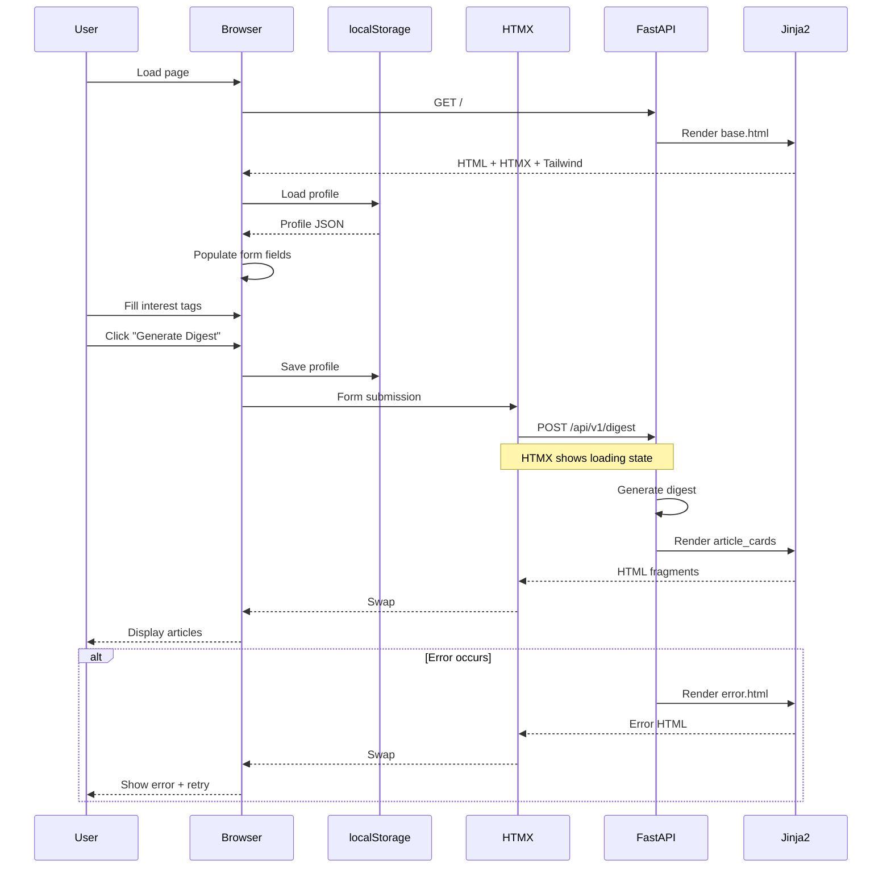

# Feature: HTMX Templates & Mobile-First UI (MVP-6)

## Overview

The HTMX Templates layer provides a mobile-first, responsive web interface for HN Herald. This component uses server-rendered HTML with HTMX for dynamic interactions, delivering a fast, accessible user experience without heavy JavaScript frameworks. Users can configure their interest profile, generate personalized digests, and browse articles in a clean, touch-optimized interface.

**Business Value**: Transforms the FastAPI backend into a usable web application with privacy-first local storage, mobile-optimized design, and progressive enhancement. Users can immediately start using HN Herald without installation or signup.

**Target**: MVP-6 milestone - "Usable web UI" with E2E smoke tests passing and Lighthouse scores >90.

---

## Requirements

### Functional Requirements

| ID | Requirement | Priority |
|----|-------------|----------|
| FR-1 | Display digest form with interest/disinterest tag selection | High |
| FR-2 | Generate digest via HTMX POST to /api/v1/digest endpoint | High |
| FR-3 | Display articles in responsive cards with summaries and scores | High |
| FR-4 | Store user profile in localStorage with persistence | High |
| FR-5 | Load profile from localStorage on page load | High |
| FR-6 | Provide tag selector with predefined and custom tags | High |
| FR-7 | Show loading states during digest generation | Medium |
| FR-8 | Display errors gracefully with retry options | Medium |
| FR-9 | Link to original articles and HN comments | High |
| FR-10 | Show generation stats (fetched/scored/time) | Low |

### Non-Functional Requirements

| ID | Requirement | Target |
|----|-------------|--------|
| NFR-1 | Mobile-first responsive design | Works on 320px+ screens |
| NFR-2 | WCAG 2.1 AA accessibility compliance | Required |
| NFR-3 | Lighthouse Performance score | ≥90 |
| NFR-4 | Lighthouse Accessibility score | ≥95 |
| NFR-5 | First Contentful Paint (FCP) | <1.5s |
| NFR-6 | Time to Interactive (TTI) | <3.0s |
| NFR-7 | No external CDN dependencies | Self-hosted assets only |
| NFR-8 | Progressive enhancement | Works without JavaScript |

---

## Architecture

### Component Diagram

```mermaid
flowchart TB
    subgraph Browser["BROWSER"]
        HTML[HTML Page<br/>index.html]
        HTMX[HTMX.js<br/>1.9.x]
        LS[localStorage<br/>Profile data]
        JS[Vanilla JS<br/>app.js]
    end

    subgraph Templates["JINJA2 TEMPLATES"]
        Base[base.html<br/>Layout]
        Index[index.html<br/>Home page]
        Form[digest_form.html<br/>Form partial]
        Card[article_card.html<br/>Article partial]
        Loading[loading.html<br/>Loading state]
        Error[error.html<br/>Error state]
    end

    subgraph Static["STATIC ASSETS"]
        CSS[styles.css<br/>Tailwind]
        JSFile[app.js<br/>Profile mgmt]
        Favicon[favicon.ico]
    end

    subgraph FastAPI["FASTAPI BACKEND"]
        Routes[/api/v1/digest<br/>POST endpoint]
        TemplateRoute[/<br/>GET page]
    end

    Browser --> HTML
    HTML --> Base
    Base --> Index
    Index --> Form
    Index --> HTMX
    Index --> JS

    HTMX --> Routes
    Routes --> Card

    JS <--> LS

    HTML --> CSS
    HTML --> JSFile

    TemplateRoute --> Base

    style HTMX fill:#e1f5fe
    style LS fill:#fff3e0
    style Routes fill:#f3e5f5
```

### Request Flow



### File Structure

```
src/hn_herald/
├── templates/
│   ├── base.html              # Base layout with Tailwind CDN (NEW)
│   ├── index.html             # Home page with form and results (NEW)
│   ├── partials/
│   │   ├── digest_form.html   # Profile form partial (NEW)
│   │   ├── article_card.html  # Single article card (NEW)
│   │   ├── article_list.html  # Article list container (NEW)
│   │   ├── tag_selector.html  # Tag selection component (NEW)
│   │   ├── loading.html       # Loading spinner (NEW)
│   │   └── error.html         # Error display (NEW)
│
├── static/
│   ├── css/
│   │   └── styles.css         # Custom Tailwind extensions (NEW)
│   ├── js/
│   │   └── app.js             # Profile management + HTMX helpers (NEW)
│   └── favicon.ico            # App favicon (NEW)
│
├── api/
│   ├── routes.py              # Add template routes (UPDATE)
│   └── templates.py           # Template helpers (NEW)
│
└── main.py                    # Mount static files (UPDATE)
```

---

## HTMX Integration Patterns

### Form Submission Pattern

```html
<!-- digest_form.html -->
<form
  hx-post="/api/v1/digest"
  hx-target="#results"
  hx-swap="innerHTML"
  hx-indicator="#loading"
  hx-on::before-request="saveProfile()"
  hx-on::after-request="hideLoading()"
  class="space-y-6">

  <!-- Form fields -->
  <button type="submit" class="btn-primary">
    Generate Digest
  </button>
</form>
```

**Key Features**:
- `hx-post`: POST to digest endpoint
- `hx-target`: Replace #results div content
- `hx-swap="innerHTML"`: Replace inner content
- `hx-indicator`: Show loading spinner
- `hx-on::before-request`: Save profile to localStorage
- `hx-on::after-request`: Hide loading state

### Partial Swap Pattern

```html
<!-- article_list.html (returned from API) -->
<div id="results" class="space-y-4">
  
    
      
    
  
    <div class="empty-state">
      No articles found matching your interests.
    </div>
  
</div>
```

**Key Features**:
- Server returns HTML fragments
- HTMX swaps content client-side
- No JSON parsing needed
- Progressive enhancement

### Loading State Pattern

```html
<!-- index.html -->
<div id="loading" class="htmx-indicator">
  
</div>

<!-- loading.html -->
<div role="status" class="flex items-center justify-center p-8">
  <svg class="animate-spin h-8 w-8 text-blue-600"
       xmlns="http://www.w3.org/2000/svg"
       fill="none"
       viewBox="0 0 24 24">
    <circle class="opacity-25" cx="12" cy="12" r="10"
            stroke="currentColor" stroke-width="4"></circle>
    <path class="opacity-75" fill="currentColor"
          d="M4 12a8 8 0 018-8V0C5.373 0 0 5.373 0 12h4zm2 5.291A7.962 7.962 0 014 12H0c0 3.042 1.135 5.824 3 7.938l3-2.647z"></path>
  </svg>
  <span class="ml-3 text-gray-600">Generating your digest...</span>
</div>
```

**Key Features**:
- `htmx-indicator` class auto-shows on request
- ARIA `role="status"` for screen readers
- Tailwind animation utilities
- Accessible loading message

### Error Handling Pattern

```html
<!-- error.html (returned on error) -->
<div id="results" class="error-state">
  <div class="bg-red-50 border-l-4 border-red-500 p-4 rounded"
       role="alert">
    <div class="flex">
      <div class="flex-shrink-0">
        <svg class="h-5 w-5 text-red-500" fill="currentColor" viewBox="0 0 20 20">
          <path fill-rule="evenodd" d="M10 18a8 8 0 100-16 8 8 0 000 16zM8.707 7.293a1 1 0 00-1.414 1.414L8.586 10l-1.293 1.293a1 1 0 101.414 1.414L10 11.414l1.293 1.293a1 1 0 001.414-1.414L11.414 10l1.293-1.293a1 1 0 00-1.414-1.414L10 8.586 8.707 7.293z" clip-rule="evenodd"/>
        </svg>
      </div>
      <div class="ml-3">
        <h3 class="text-sm font-medium text-red-800">
          Error generating digest
        </h3>
        <p class="mt-2 text-sm text-red-700">
          {{ error_message }}
        </p>
        <button
          hx-get="/"
          hx-target="body"
          hx-swap="outerHTML"
          class="mt-3 text-sm font-medium text-red-800 hover:text-red-900">
          Try again →
        </button>
      </div>
    </div>
  </div>
</div>
```

**Key Features**:
- ARIA `role="alert"` for screen readers
- Accessible error icons
- Retry button with HTMX
- Tailwind error styling

---

## Component Specifications

### Base Layout (base.html)

**Purpose**: Master template with HTML structure, Tailwind CSS, HTMX, and meta tags.

**Structure**:
```html
<!DOCTYPE html>
<html lang="en" class="h-full">
<head>
  <meta charset="UTF-8">
  <meta name="viewport" content="width=device-width, initial-scale=1.0">
  <meta name="description" content="Privacy-first personalized HackerNews digest with AI summaries">

  <!-- Tailwind CSS -->
  <link rel="stylesheet" href="{{ url_for('static', path='/css/styles.css') }}">

  <!-- HTMX -->
  <script src="https://unpkg.com/htmx.org@1.9.10"></script>

  <title>HN Herald - AI-Powered HackerNews Digest</title>

  <link rel="icon" type="image/x-icon" href="{{ url_for('static', path='/favicon.ico') }}">
</head>
<body class="h-full bg-gray-50">
  <!-- Header -->
  <header class="bg-white shadow-sm">
    <div class="max-w-4xl mx-auto px-4 py-4">
      <h1 class="text-2xl font-bold text-gray-900">
        📰 HN Herald
      </h1>
      <p class="text-sm text-gray-600">
        Your personalized HackerNews digest
      </p>
    </div>
  </header>

  <!-- Main Content -->
  <main class="max-w-4xl mx-auto px-4 py-8">
    
  </main>

  <!-- Footer -->
  <footer class="mt-16 border-t border-gray-200">
    <div class="max-w-4xl mx-auto px-4 py-6 text-center text-sm text-gray-500">
      <p>Privacy-first • No tracking • Open source</p>
    </div>
  </footer>

  <!-- Custom JS -->
  <script src="{{ url_for('static', path='/js/app.js') }}"></script>
</body>
</html>
```

**Accessibility**:
- Semantic HTML5 elements
- `lang` attribute for screen readers
- Viewport meta for mobile
- Descriptive title and meta description

**Performance**:
- Minimal external dependencies
- Tailwind CSS self-hosted
- HTMX from CDN (small, cacheable)
- No heavy JavaScript frameworks

---

### Digest Form (digest_form.html)

**Purpose**: User input form for profile configuration and digest generation.

**Structure**:
```html
<form
  id="digest-form"
  hx-post="/api/v1/digest"
  hx-target="#results"
  hx-swap="innerHTML"
  hx-indicator="#loading"
  hx-on::before-request="saveProfile()"
  class="bg-white rounded-lg shadow-md p-6 space-y-6">

  <!-- Interest Tags -->
  <div>
    <label for="interest-tags" class="block text-sm font-medium text-gray-700 mb-2">
      Interest Tags
      <span class="text-xs text-gray-500 ml-2">(Topics you want to see)</span>
    </label>
    
  </div>

  <!-- Disinterest Tags -->
  <div>
    <label for="disinterest-tags" class="block text-sm font-medium text-gray-700 mb-2">
      Disinterest Tags
      <span class="text-xs text-gray-500 ml-2">(Topics to filter out)</span>
    </label>
    
  </div>

  <!-- Story Type -->
  <div>
    <label for="story-type" class="block text-sm font-medium text-gray-700 mb-2">
      Story Type
    </label>
    <select
      id="story-type"
      name="story_type"
      class="w-full px-4 py-2 border border-gray-300 rounded-lg focus:ring-2 focus:ring-blue-500 focus:border-transparent">
      <option value="top" selected>Top Stories</option>
      <option value="new">New Stories</option>
      <option value="best">Best Stories</option>
      <option value="ask">Ask HN</option>
      <option value="show">Show HN</option>
    </select>
  </div>

  <!-- Story Count -->
  <div>
    <label for="story-count" class="block text-sm font-medium text-gray-700 mb-2">
      Stories to Fetch
      <span class="text-xs text-gray-500 ml-2">(10-100)</span>
    </label>
    <input
      type="number"
      id="story-count"
      name="story_count"
      min="10"
      max="100"
      value="30"
      class="w-full px-4 py-2 border border-gray-300 rounded-lg focus:ring-2 focus:ring-blue-500 focus:border-transparent">
  </div>

  <!-- Article Limit -->
  <div>
    <label for="article-limit" class="block text-sm font-medium text-gray-700 mb-2">
      Max Articles in Digest
      <span class="text-xs text-gray-500 ml-2">(1-50)</span>
    </label>
    <input
      type="number"
      id="article-limit"
      name="article_limit"
      min="1"
      max="50"
      value="10"
      class="w-full px-4 py-2 border border-gray-300 rounded-lg focus:ring-2 focus:ring-blue-500 focus:border-transparent">
  </div>

  <!-- Minimum Score -->
  <div>
    <label for="min-score" class="block text-sm font-medium text-gray-700 mb-2">
      Minimum Relevance Score
      <span class="text-xs text-gray-500 ml-2">(0.0-1.0)</span>
    </label>
    <input
      type="number"
      id="min-score"
      name="min_score"
      min="0"
      max="1"
      step="0.1"
      value="0.3"
      class="w-full px-4 py-2 border border-gray-300 rounded-lg focus:ring-2 focus:ring-blue-500 focus:border-transparent">
  </div>

  <!-- Submit Button -->
  <button
    type="submit"
    class="w-full bg-blue-600 text-white font-semibold py-3 px-6 rounded-lg hover:bg-blue-700 focus:outline-none focus:ring-2 focus:ring-blue-500 focus:ring-offset-2 transition-colors duration-200">
    Generate Digest
  </button>
</form>
```

**Accessibility**:
- All inputs have `<label>` with `for` attributes
- Helper text for ranges and requirements
- Focus states with Tailwind ring utilities
- Touch-friendly button size (min 48px height)

**Validation**:
- HTML5 input constraints (min, max, step)
- JavaScript validation before submission
- Server-side Pydantic validation

---

### Tag Selector (tag_selector.html)

**Purpose**: Multi-select tag input with predefined categories and custom tag creation.

**Structure**:
```html
<div class="tag-selector" data-field="{{ field_name }}">
  <!-- Selected Tags Display -->
  <div id="{{ field_id }}-selected" class="flex flex-wrap gap-2 mb-3 min-h-[2rem]">
    <!-- Populated by JavaScript -->
  </div>

  <!-- Tag Input -->
  <input
    type="text"
    id="{{ field_id }}-input"
    placeholder="{{ placeholder }}"
    autocomplete="off"
    class="w-full px-4 py-2 border border-gray-300 rounded-lg focus:ring-2 focus:ring-blue-500 focus:border-transparent"
    aria-label="{{ placeholder }}"
    aria-describedby="{{ field_id }}-help">

  <p id="{{ field_id }}-help" class="text-xs text-gray-500 mt-1">
    Type to add custom tags or select from suggestions below
  </p>

  <!-- Predefined Tags (Categories) -->
  
  <div class="mt-4 space-y-3">
    
    <div>
      <h4 class="text-xs font-semibold text-gray-600 uppercase mb-2">
        {{ category_name }}
      </h4>
      <div class="flex flex-wrap gap-2">
        
        <button
          type="button"
          data-tag="{{ tag }}"
          class="tag-suggestion px-3 py-1 text-sm border border-gray-300 rounded-full hover:bg-blue-50 hover:border-blue-500 transition-colors"
          onclick="addTag('{{ field_id }}', '{{ tag }}')">
          {{ tag }}
        </button>
        
      </div>
    </div>
    
  </div>
  

  <!-- Hidden Input for Form Submission -->
  <input
    type="hidden"
    name="{{ field_name }}"
    id="{{ field_id }}-hidden"
    value="">
</div>
```

**JavaScript Interaction**:
```javascript
// app.js
function addTag(fieldId, tag) {
  const selectedDiv = document.getElementById(`${fieldId}-selected`);
  const hiddenInput = document.getElementById(`${fieldId}-hidden`);

  // Get current tags
  const currentTags = hiddenInput.value ? hiddenInput.value.split(',') : [];

  // Avoid duplicates
  if (currentTags.includes(tag)) return;

  // Add tag
  currentTags.push(tag);
  hiddenInput.value = currentTags.join(',');

  // Create tag element
  const tagEl = document.createElement('span');
  tagEl.className = 'inline-flex items-center gap-1 px-3 py-1 bg-blue-100 text-blue-800 rounded-full text-sm';
  tagEl.innerHTML = `
    ${tag}
    <button type="button"
            onclick="removeTag('${fieldId}', '${tag}')"
            class="hover:text-blue-900"
            aria-label="Remove ${tag}">
      ×
    </button>
  `;

  selectedDiv.appendChild(tagEl);
}

function removeTag(fieldId, tag) {
  const hiddenInput = document.getElementById(`${fieldId}-hidden`);
  const currentTags = hiddenInput.value.split(',');

  // Remove tag
  const newTags = currentTags.filter(t => t !== tag);
  hiddenInput.value = newTags.join(',');

  // Re-render selected tags
  renderSelectedTags(fieldId);
}
```

**Accessibility**:
- `aria-label` for input purpose
- `aria-describedby` for helper text
- Keyboard navigation support
- Remove button with `aria-label`

---

### Article Card (article_card.html)

**Purpose**: Display single article with summary, scores, and links.

**Structure**:
```html
<article class="article-card bg-white rounded-lg shadow-md p-6 hover:shadow-lg transition-shadow">
  <!-- Header -->
  <header class="mb-4">
    <h2 class="text-xl font-semibold text-gray-900 mb-2">
      <a href="{{ article.url }}"
         target="_blank"
         rel="noopener noreferrer"
         class="hover:text-blue-600 transition-colors">
        {{ article.title }}
      </a>
    </h2>

    <!-- Metadata -->
    <div class="flex flex-wrap items-center gap-3 text-sm text-gray-600">
      <span class="flex items-center gap-1">
        <svg class="w-4 h-4" fill="currentColor" viewBox="0 0 20 20">
          <path d="M9.049 2.927c.3-.921 1.603-.921 1.902 0l1.07 3.292a1 1 0 00.95.69h3.462c.969 0 1.371 1.24.588 1.81l-2.8 2.034a1 1 0 00-.364 1.118l1.07 3.292c.3.921-.755 1.688-1.54 1.118l-2.8-2.034a1 1 0 00-1.175 0l-2.8 2.034c-.784.57-1.838-.197-1.539-1.118l1.07-3.292a1 1 0 00-.364-1.118L2.98 8.72c-.783-.57-.38-1.81.588-1.81h3.461a1 1 0 00.951-.69l1.07-3.292z"/>
        </svg>
        {{ article.hn_score }} points
      </span>

      <a href="{{ article.hn_url }}"
         target="_blank"
         rel="noopener noreferrer"
         class="hover:text-blue-600 transition-colors">
        HN Discussion →
      </a>
    </div>
  </header>

  <!-- Summary -->
  <div class="mb-4">
    <p class="text-gray-700 leading-relaxed">
      {{ article.summary }}
    </p>
  </div>

  <!-- Key Points -->
  <div class="mb-4">
    <h3 class="text-sm font-semibold text-gray-900 mb-2">Key Points</h3>
    <ul class="list-disc list-inside space-y-1 text-sm text-gray-700">
      
      <li>{{ point }}</li>
      
    </ul>
  </div>

  <!-- Tags -->
  <div class="mb-4">
    <div class="flex flex-wrap gap-2">
      
      <span class="px-2 py-1 bg-gray-100 text-gray-700 rounded text-xs">
        {{ tag }}
      </span>
      
    </div>
  </div>

  <!-- Scores -->
  <div class="flex items-center justify-between pt-4 border-t border-gray-200">
    <div class="flex items-center gap-4 text-sm">
      <div class="flex items-center gap-1">
        <span class="font-medium text-gray-700">Relevance:</span>
        <span class="text-blue-600 font-semibold">
          {{ "%.0f"|format(article.relevance_score * 100) }}%
        </span>
      </div>

      <div class="flex items-center gap-1">
        <span class="font-medium text-gray-700">Final:</span>
        <span class="text-green-600 font-semibold">
          {{ "%.0f"|format(article.final_score * 100) }}%
        </span>
      </div>
    </div>

    <button
      type="button"
      onclick="toggleReason({{ article.story_id }})"
      class="text-sm text-gray-600 hover:text-gray-900"
      aria-expanded="false"
      aria-controls="reason-{{ article.story_id }}">
      Why relevant? ↓
    </button>
  </div>

  <!-- Relevance Reason (Collapsible) -->
  <div
    id="reason-{{ article.story_id }}"
    class="hidden mt-3 p-3 bg-blue-50 rounded text-sm text-gray-700"
    aria-hidden="true">
    {{ article.relevance_reason }}
  </div>
</article>
```

**Accessibility**:
- Semantic `<article>` element
- External link indicators (→)
- `rel="noopener noreferrer"` for security
- Collapsible reason with ARIA attributes
- Color contrast meeting WCAG AA

**Mobile Optimization**:
- Touch-friendly links (min 48px)
- Readable font sizes (16px+)
- Adequate spacing between elements
- Responsive flex layout

---

### Loading Indicator (loading.html)

**Purpose**: Show progress during digest generation.

**Structure**:
```html
<div
  id="loading"
  class="htmx-indicator fixed inset-0 bg-gray-900 bg-opacity-50 flex items-center justify-center z-50"
  role="status"
  aria-live="polite"
  aria-label="Generating digest">

  <div class="bg-white rounded-lg p-8 max-w-sm mx-4">
    <div class="flex flex-col items-center gap-4">
      <!-- Spinner -->
      <svg class="animate-spin h-12 w-12 text-blue-600"
           xmlns="http://www.w3.org/2000/svg"
           fill="none"
           viewBox="0 0 24 24">
        <circle class="opacity-25" cx="12" cy="12" r="10"
                stroke="currentColor" stroke-width="4"></circle>
        <path class="opacity-75" fill="currentColor"
              d="M4 12a8 8 0 018-8V0C5.373 0 0 5.373 0 12h4zm2 5.291A7.962 7.962 0 014 12H0c0 3.042 1.135 5.824 3 7.938l3-2.647z"></path>
      </svg>

      <!-- Message -->
      <div class="text-center">
        <h3 class="text-lg font-semibold text-gray-900 mb-2">
          Generating Your Digest
        </h3>
        <p class="text-sm text-gray-600">
          Fetching stories, summarizing articles, and scoring relevance...
        </p>
        <p class="text-xs text-gray-500 mt-2">
          This usually takes 15-30 seconds
        </p>
      </div>
    </div>
  </div>
</div>
```

**Accessibility**:
- `role="status"` for screen reader announcement
- `aria-live="polite"` for updates
- `aria-label` describing action
- Semantic HTML structure

**UX**:
- Full-screen overlay to prevent interaction
- Semi-transparent background
- Centered modal with padding
- Time expectation management

---

## JavaScript Requirements

### Profile Management (app.js)

**Purpose**: Manage localStorage persistence and form population.

**Core Functions**:

```javascript
// Profile storage key
const PROFILE_KEY = 'hn_herald_profile';

/**
 * Load user profile from localStorage
 */
function loadProfile() {
  try {
    const profileJSON = localStorage.getItem(PROFILE_KEY);
    if (!profileJSON) return null;

    return JSON.parse(profileJSON);
  } catch (error) {
    console.error('Failed to load profile:', error);
    return null;
  }
}

/**
 * Save user profile to localStorage
 */
function saveProfile() {
  try {
    const profile = {
      interest_tags: getTagsFromField('interest-tags'),
      disinterest_tags: getTagsFromField('disinterest-tags'),
      story_type: document.getElementById('story-type').value,
      story_count: parseInt(document.getElementById('story-count').value),
      article_limit: parseInt(document.getElementById('article-limit').value),
      min_score: parseFloat(document.getElementById('min-score').value),
      last_updated: new Date().toISOString()
    };

    localStorage.setItem(PROFILE_KEY, JSON.stringify(profile));
    return profile;
  } catch (error) {
    console.error('Failed to save profile:', error);
    return null;
  }
}

/**
 * Populate form fields from profile
 */
function populateForm() {
  const profile = loadProfile();
  if (!profile) return;

  // Populate select and input fields
  document.getElementById('story-type').value = profile.story_type || 'top';
  document.getElementById('story-count').value = profile.story_count || 30;
  document.getElementById('article-limit').value = profile.article_limit || 10;
  document.getElementById('min-score').value = profile.min_score || 0.3;

  // Populate tags
  if (profile.interest_tags) {
    profile.interest_tags.forEach(tag => addTag('interest-tags', tag));
  }

  if (profile.disinterest_tags) {
    profile.disinterest_tags.forEach(tag => addTag('disinterest-tags', tag));
  }
}

/**
 * Get tags from tag selector field
 */
function getTagsFromField(fieldId) {
  const hiddenInput = document.getElementById(`${fieldId}-hidden`);
  const value = hiddenInput.value.trim();
  return value ? value.split(',').filter(Boolean) : [];
}

/**
 * Export profile as JSON
 */
function exportProfile() {
  const profile = loadProfile();
  if (!profile) {
    alert('No profile to export');
    return;
  }

  const blob = new Blob([JSON.stringify(profile, null, 2)], {
    type: 'application/json'
  });

  const url = URL.createObjectURL(blob);
  const a = document.createElement('a');
  a.href = url;
  a.download = 'hn-herald-profile.json';
  a.click();
  URL.revokeObjectURL(url);
}

/**
 * Clear profile from localStorage
 */
function clearProfile() {
  if (confirm('Are you sure you want to delete your profile?')) {
    localStorage.removeItem(PROFILE_KEY);
    location.reload();
  }
}

// Initialize on page load
document.addEventListener('DOMContentLoaded', () => {
  populateForm();
});
```

### Tag Selection Logic

```javascript
/**
 * Add tag to selector
 */
function addTag(fieldId, tag) {
  tag = tag.trim();
  if (!tag || tag.length < 2 || tag.length > 30) return;

  const selectedDiv = document.getElementById(`${fieldId}-selected`);
  const hiddenInput = document.getElementById(`${fieldId}-hidden`);

  // Get current tags
  const currentTags = getTagsFromField(fieldId);

  // Avoid duplicates
  if (currentTags.includes(tag)) return;

  // Add tag
  currentTags.push(tag);
  hiddenInput.value = currentTags.join(',');

  // Render tag element
  renderSelectedTags(fieldId);
}

/**
 * Remove tag from selector
 */
function removeTag(fieldId, tag) {
  const hiddenInput = document.getElementById(`${fieldId}-hidden`);
  const currentTags = getTagsFromField(fieldId);

  // Remove tag
  const newTags = currentTags.filter(t => t !== tag);
  hiddenInput.value = newTags.join(',');

  // Re-render
  renderSelectedTags(fieldId);
}

/**
 * Render selected tags display
 */
function renderSelectedTags(fieldId) {
  const selectedDiv = document.getElementById(`${fieldId}-selected`);
  const tags = getTagsFromField(fieldId);

  // Clear existing
  selectedDiv.innerHTML = '';

  // Render each tag
  tags.forEach(tag => {
    const tagEl = document.createElement('span');
    tagEl.className = 'inline-flex items-center gap-1 px-3 py-1 bg-blue-100 text-blue-800 rounded-full text-sm';
    tagEl.innerHTML = `
      ${tag}
      <button type="button"
              onclick="removeTag('${fieldId}', '${tag}')"
              class="hover:text-blue-900 focus:outline-none focus:ring-2 focus:ring-blue-500 rounded"
              aria-label="Remove ${tag}">
        <svg class="w-4 h-4" fill="currentColor" viewBox="0 0 20 20">
          <path fill-rule="evenodd" d="M4.293 4.293a1 1 0 011.414 0L10 8.586l4.293-4.293a1 1 0 111.414 1.414L11.414 10l4.293 4.293a1 1 0 01-1.414 1.414L10 11.414l-4.293 4.293a1 1 0 01-1.414-1.414L8.586 10 4.293 5.707a1 1 0 010-1.414z" clip-rule="evenodd"/>
        </svg>
      </button>
    `;
    selectedDiv.appendChild(tagEl);
  });

  // Show empty state if no tags
  if (tags.length === 0) {
    selectedDiv.innerHTML = '<span class="text-sm text-gray-400">No tags selected</span>';
  }
}

/**
 * Handle tag input keyboard events
 */
function setupTagInput(fieldId) {
  const input = document.getElementById(`${fieldId}-input`);

  input.addEventListener('keydown', (e) => {
    if (e.key === 'Enter' || e.key === ',') {
      e.preventDefault();
      const tag = input.value.trim();
      if (tag) {
        addTag(fieldId, tag);
        input.value = '';
      }
    }
  });
}

// Initialize tag inputs
document.addEventListener('DOMContentLoaded', () => {
  setupTagInput('interest-tags');
  setupTagInput('disinterest-tags');
});
```

### Form Validation

```javascript
/**
 * Validate form before submission
 */
function validateForm() {
  const interestTags = getTagsFromField('interest-tags');
  const storyCount = parseInt(document.getElementById('story-count').value);
  const articleLimit = parseInt(document.getElementById('article-limit').value);
  const minScore = parseFloat(document.getElementById('min-score').value);

  // Validation rules
  const errors = [];

  if (interestTags.length === 0) {
    errors.push('Please select at least one interest tag');
  }

  if (storyCount < 10 || storyCount > 100) {
    errors.push('Story count must be between 10 and 100');
  }

  if (articleLimit < 1 || articleLimit > 50) {
    errors.push('Article limit must be between 1 and 50');
  }

  if (minScore < 0 || minScore > 1) {
    errors.push('Minimum score must be between 0.0 and 1.0');
  }

  // Display errors
  if (errors.length > 0) {
    alert('Please fix the following errors:\n\n' + errors.join('\n'));
    return false;
  }

  return true;
}

// Attach to form
document.getElementById('digest-form').addEventListener('submit', (e) => {
  if (!validateForm()) {
    e.preventDefault();
  }
});
```

### Collapsible Relevance Reason

```javascript
/**
 * Toggle relevance reason visibility
 */
function toggleReason(storyId) {
  const reasonDiv = document.getElementById(`reason-${storyId}`);
  const button = event.currentTarget;

  const isHidden = reasonDiv.classList.contains('hidden');

  if (isHidden) {
    reasonDiv.classList.remove('hidden');
    reasonDiv.setAttribute('aria-hidden', 'false');
    button.setAttribute('aria-expanded', 'true');
    button.textContent = 'Hide reason ↑';
  } else {
    reasonDiv.classList.add('hidden');
    reasonDiv.setAttribute('aria-hidden', 'true');
    button.setAttribute('aria-expanded', 'false');
    button.textContent = 'Why relevant? ↓';
  }
}
```

---

## Styling Strategy

### Tailwind CSS Configuration

**File**: `src/hn_herald/static/css/styles.css`

```css
@tailwind base;
@tailwind components;
@tailwind utilities;

/* Custom Components */
@layer components {
  /* Button Styles */
  .btn-primary {
    @apply w-full bg-blue-600 text-white font-semibold py-3 px-6 rounded-lg;
    @apply hover:bg-blue-700 focus:outline-none focus:ring-2 focus:ring-blue-500 focus:ring-offset-2;
    @apply transition-colors duration-200;
    @apply disabled:opacity-50 disabled:cursor-not-allowed;
  }

  .btn-secondary {
    @apply px-4 py-2 border border-gray-300 rounded-lg text-gray-700;
    @apply hover:bg-gray-50 focus:outline-none focus:ring-2 focus:ring-gray-500;
    @apply transition-colors duration-200;
  }

  /* Input Styles */
  .input-field {
    @apply w-full px-4 py-2 border border-gray-300 rounded-lg;
    @apply focus:ring-2 focus:ring-blue-500 focus:border-transparent;
    @apply disabled:bg-gray-100 disabled:cursor-not-allowed;
  }

  /* Card Styles */
  .card {
    @apply bg-white rounded-lg shadow-md p-6;
    @apply hover:shadow-lg transition-shadow duration-200;
  }

  /* Tag Styles */
  .tag {
    @apply inline-flex items-center gap-1 px-3 py-1 rounded-full text-sm;
  }

  .tag-selected {
    @apply tag bg-blue-100 text-blue-800;
  }

  .tag-suggestion {
    @apply tag border border-gray-300 text-gray-700;
    @apply hover:bg-blue-50 hover:border-blue-500 transition-colors;
  }
}

/* HTMX Loading Indicator */
.htmx-indicator {
  display: none;
}

.htmx-request .htmx-indicator,
.htmx-request.htmx-indicator {
  display: flex;
}

/* Custom Utilities */
@layer utilities {
  /* Touch targets (min 48px) */
  .touch-target {
    @apply min-h-[48px] min-w-[48px];
  }

  /* Safe area insets for mobile */
  .safe-area-inset-bottom {
    padding-bottom: env(safe-area-inset-bottom);
  }

  /* Focus visible (keyboard only) */
  .focus-visible-only:focus:not(:focus-visible) {
    outline: none;
  }
}

/* Accessibility */
@media (prefers-reduced-motion: reduce) {
  * {
    animation-duration: 0.01ms !important;
    animation-iteration-count: 1 !important;
    transition-duration: 0.01ms !important;
  }
}

/* Print styles */
@media print {
  .no-print {
    display: none !important;
  }

  .article-card {
    break-inside: avoid;
    page-break-inside: avoid;
  }
}
```

### Mobile-First Breakpoints

Following Tailwind defaults:

| Breakpoint | Min Width | Target Device |
|------------|-----------|---------------|
| `sm:` | 640px | Large phones (landscape) |
| `md:` | 768px | Tablets |
| `lg:` | 1024px | Small laptops |
| `xl:` | 1280px | Desktops |
| `2xl:` | 1536px | Large screens |

**Design Approach**:
- Base styles for mobile (320px+)
- Progressive enhancement with breakpoints
- Touch-friendly interactions (48px min)
- Readable font sizes (16px+ body text)

### Component Classes

**Cards**:
```css
.article-card {
  @apply bg-white rounded-lg shadow-md p-6;
  @apply hover:shadow-lg transition-shadow duration-200;
}

@media (max-width: 640px) {
  .article-card {
    @apply p-4; /* Reduce padding on mobile */
  }
}
```

**Typography**:
```css
h1 { @apply text-2xl md:text-3xl font-bold; }
h2 { @apply text-xl md:text-2xl font-semibold; }
h3 { @apply text-lg md:text-xl font-medium; }
body { @apply text-base leading-relaxed; }
```

**Spacing**:
```css
.container { @apply max-w-4xl mx-auto px-4 sm:px-6 lg:px-8; }
.section { @apply py-8 md:py-12; }
.gap-standard { @apply gap-4 md:gap-6; }
```

---

## Testing Strategy

### End-to-End Tests (Playwright)

**Test File**: `tests/e2e/test_web_interface.py`

**Test Cases**:

```python
"""E2E tests for HTMX web interface."""

import pytest
from playwright.sync_api import Page, expect


class TestWebInterface:
    """Test suite for web UI functionality."""

    def test_page_loads_successfully(self, page: Page):
        """Test that the home page loads with all elements."""
        page.goto("http://localhost:8000/")

        # Check title
        expect(page).to_have_title("HN Herald - AI-Powered HackerNews Digest")

        # Check header
        expect(page.locator("h1")).to_contain_text("HN Herald")

        # Check form exists
        expect(page.locator("#digest-form")).to_be_visible()

        # Check submit button
        expect(page.locator("button[type='submit']")).to_be_visible()

    def test_form_fields_present(self, page: Page):
        """Test that all form fields are present and functional."""
        page.goto("http://localhost:8000/")

        # Interest tags input
        expect(page.locator("#interest-tags-input")).to_be_visible()

        # Disinterest tags input
        expect(page.locator("#disinterest-tags-input")).to_be_visible()

        # Story type select
        expect(page.locator("#story-type")).to_be_visible()

        # Story count input
        expect(page.locator("#story-count")).to_have_value("30")

        # Article limit input
        expect(page.locator("#article-limit")).to_have_value("10")

        # Min score input
        expect(page.locator("#min-score")).to_have_value("0.3")

    def test_add_interest_tag(self, page: Page):
        """Test adding an interest tag."""
        page.goto("http://localhost:8000/")

        # Type and add tag
        page.locator("#interest-tags-input").fill("python")
        page.locator("#interest-tags-input").press("Enter")

        # Verify tag appears
        expect(page.locator("#interest-tags-selected")).to_contain_text("python")

        # Verify hidden input updated
        expect(page.locator("#interest-tags-hidden")).to_have_value("python")

    def test_remove_interest_tag(self, page: Page):
        """Test removing an interest tag."""
        page.goto("http://localhost:8000/")

        # Add tag
        page.locator("#interest-tags-input").fill("python")
        page.locator("#interest-tags-input").press("Enter")

        # Remove tag
        page.locator("button[aria-label='Remove python']").click()

        # Verify tag removed
        expect(page.locator("#interest-tags-selected")).not_to_contain_text("python")

    def test_predefined_tag_click(self, page: Page):
        """Test clicking a predefined tag suggestion."""
        page.goto("http://localhost:8000/")

        # Click predefined tag
        page.locator("button[data-tag='Python']").click()

        # Verify tag added
        expect(page.locator("#interest-tags-selected")).to_contain_text("Python")

    def test_profile_persistence(self, page: Page):
        """Test that profile is saved to localStorage."""
        page.goto("http://localhost:8000/")

        # Add interest tag
        page.locator("#interest-tags-input").fill("ai")
        page.locator("#interest-tags-input").press("Enter")

        # Change story count
        page.locator("#story-count").fill("50")

        # Trigger save (before form submission)
        page.evaluate("saveProfile()")

        # Reload page
        page.reload()

        # Verify persistence
        expect(page.locator("#interest-tags-selected")).to_contain_text("ai")
        expect(page.locator("#story-count")).to_have_value("50")

    @pytest.mark.slow
    def test_digest_generation_flow(self, page: Page):
        """Test complete digest generation flow."""
        page.goto("http://localhost:8000/")

        # Fill form
        page.locator("#interest-tags-input").fill("python")
        page.locator("#interest-tags-input").press("Enter")

        page.locator("#story-count").fill("10")  # Small count for speed
        page.locator("#article-limit").fill("5")

        # Submit form
        page.locator("button[type='submit']").click()

        # Wait for loading indicator
        expect(page.locator("#loading")).to_be_visible()

        # Wait for results (timeout 60s for API call)
        expect(page.locator("#results")).to_be_visible(timeout=60000)

        # Verify articles displayed
        expect(page.locator(".article-card").first).to_be_visible()

        # Verify article has required elements
        first_card = page.locator(".article-card").first
        expect(first_card.locator("h2")).to_be_visible()  # Title
        expect(first_card.locator("a[href*='news.ycombinator.com']")).to_be_visible()  # HN link

    def test_error_display(self, page: Page):
        """Test error handling when API fails."""
        # Mock API error
        page.route("**/api/v1/digest", lambda route: route.fulfill(
            status=500,
            body='<div class="error-state">Server error</div>'
        ))

        page.goto("http://localhost:8000/")

        # Fill minimal form
        page.locator("#interest-tags-input").fill("python")
        page.locator("#interest-tags-input").press("Enter")

        # Submit
        page.locator("button[type='submit']").click()

        # Verify error displayed
        expect(page.locator(".error-state")).to_be_visible()

    def test_article_link_opens_new_tab(self, page: Page):
        """Test that article links open in new tabs."""
        page.goto("http://localhost:8000/")

        # Generate digest (with mocked response for speed)
        # ... setup mock ...

        # Check article link
        article_link = page.locator(".article-card a[target='_blank']").first
        expect(article_link).to_have_attribute("rel", "noopener noreferrer")

    def test_collapsible_relevance_reason(self, page: Page):
        """Test toggling relevance reason visibility."""
        # ... generate digest with mocked response ...

        page.goto("http://localhost:8000/")

        # Find toggle button
        toggle_btn = page.locator("button[aria-controls*='reason-']").first

        # Verify initially hidden
        reason_id = toggle_btn.get_attribute("aria-controls")
        reason_div = page.locator(f"#{reason_id}")
        expect(reason_div).to_be_hidden()

        # Click to show
        toggle_btn.click()
        expect(reason_div).to_be_visible()

        # Click to hide
        toggle_btn.click()
        expect(reason_div).to_be_hidden()
```

### Accessibility Tests

**Test File**: `tests/e2e/test_accessibility.py`

```python
"""Accessibility compliance tests."""

import pytest
from playwright.sync_api import Page


class TestAccessibility:
    """WCAG 2.1 AA compliance tests."""

    def test_page_has_lang_attribute(self, page: Page):
        """Test that HTML has lang attribute for screen readers."""
        page.goto("http://localhost:8000/")
        assert page.locator("html").get_attribute("lang") == "en"

    def test_all_inputs_have_labels(self, page: Page):
        """Test that all form inputs have associated labels."""
        page.goto("http://localhost:8000/")

        inputs = page.locator("input, select, textarea")
        count = inputs.count()

        for i in range(count):
            input_elem = inputs.nth(i)
            input_id = input_elem.get_attribute("id")

            # Check for label or aria-label
            if input_id:
                label = page.locator(f"label[for='{input_id}']")
                aria_label = input_elem.get_attribute("aria-label")

                assert label.count() > 0 or aria_label, \
                    f"Input {input_id} has no label"

    def test_buttons_have_accessible_names(self, page: Page):
        """Test that all buttons have accessible names."""
        page.goto("http://localhost:8000/")

        buttons = page.locator("button")
        count = buttons.count()

        for i in range(count):
            button = buttons.nth(i)
            text = button.inner_text()
            aria_label = button.get_attribute("aria-label")

            assert text or aria_label, "Button has no accessible name"

    def test_images_have_alt_text(self, page: Page):
        """Test that all images have alt text."""
        page.goto("http://localhost:8000/")

        images = page.locator("img")
        count = images.count()

        for i in range(count):
            img = images.nth(i)
            alt = img.get_attribute("alt")
            assert alt is not None, "Image missing alt attribute"

    def test_links_have_discernible_text(self, page: Page):
        """Test that all links have text or aria-label."""
        page.goto("http://localhost:8000/")

        links = page.locator("a")
        count = links.count()

        for i in range(count):
            link = links.nth(i)
            text = link.inner_text()
            aria_label = link.get_attribute("aria-label")

            assert text or aria_label, "Link has no discernible text"

    def test_color_contrast(self, page: Page):
        """Test color contrast meets WCAG AA (manual check guide)."""
        page.goto("http://localhost:8000/")

        # This is a placeholder - actual contrast testing requires
        # specialized tools like axe-core
        # For now, we ensure we're using Tailwind's accessible colors

        # Check primary text is dark enough
        body = page.locator("body")
        bg_color = body.evaluate("el => getComputedStyle(el).backgroundColor")
        color = body.evaluate("el => getComputedStyle(el).color")

        # Basic check that we have contrast (not comprehensive)
        assert bg_color != color

    def test_keyboard_navigation(self, page: Page):
        """Test that form can be navigated with keyboard."""
        page.goto("http://localhost:8000/")

        # Tab through form elements
        page.keyboard.press("Tab")  # First input
        expect(page.locator("#interest-tags-input")).to_be_focused()

        page.keyboard.press("Tab")  # Next element
        # Continue tabbing and verify focus order...

    def test_focus_indicators_visible(self, page: Page):
        """Test that focused elements have visible indicators."""
        page.goto("http://localhost:8000/")

        # Focus first input
        page.locator("#interest-tags-input").focus()

        # Check for focus ring (Tailwind's focus:ring-2)
        focused = page.locator("#interest-tags-input")
        # Verify focus styles applied (implementation-specific)
```

### Mobile Viewport Tests

**Test File**: `tests/e2e/test_mobile.py`

```python
"""Mobile viewport and responsive design tests."""

import pytest
from playwright.sync_api import Page


@pytest.fixture
def mobile_page(page: Page):
    """Configure page for mobile viewport."""
    page.set_viewport_size({"width": 375, "height": 667})  # iPhone SE
    return page


@pytest.fixture
def tablet_page(page: Page):
    """Configure page for tablet viewport."""
    page.set_viewport_size({"width": 768, "height": 1024})  # iPad
    return page


class TestMobileViewport:
    """Tests for mobile responsiveness."""

    def test_page_renders_on_mobile(self, mobile_page: Page):
        """Test that page renders correctly on mobile."""
        mobile_page.goto("http://localhost:8000/")

        # Check no horizontal scroll
        scroll_width = mobile_page.evaluate("document.body.scrollWidth")
        viewport_width = 375
        assert scroll_width <= viewport_width, "Horizontal scroll detected"

        # Check key elements visible
        expect(mobile_page.locator("h1")).to_be_visible()
        expect(mobile_page.locator("#digest-form")).to_be_visible()

    def test_touch_targets_adequate_size(self, mobile_page: Page):
        """Test that interactive elements meet 48x48px touch target."""
        mobile_page.goto("http://localhost:8000/")

        # Check submit button
        button = mobile_page.locator("button[type='submit']")
        box = button.bounding_box()

        assert box["height"] >= 48, f"Button height {box['height']}px < 48px"

    def test_text_readable_without_zoom(self, mobile_page: Page):
        """Test that text is at least 16px on mobile."""
        mobile_page.goto("http://localhost:8000/")

        # Check body text size
        body = mobile_page.locator("body")
        font_size = body.evaluate("el => getComputedStyle(el).fontSize")

        # Extract numeric value
        size_px = int(font_size.replace("px", ""))
        assert size_px >= 16, f"Body text {size_px}px < 16px"

    def test_form_usable_on_tablet(self, tablet_page: Page):
        """Test that form works well on tablet."""
        tablet_page.goto("http://localhost:8000/")

        # Fill form
        tablet_page.locator("#interest-tags-input").fill("python")
        tablet_page.locator("#interest-tags-input").press("Enter")

        # Verify tag visible
        expect(tablet_page.locator("#interest-tags-selected")).to_contain_text("python")
```

### Performance Tests (Lighthouse CI)

**Configuration**: `.lighthouserc.json`

```json
{
  "ci": {
    "collect": {
      "url": ["http://localhost:8000/"],
      "numberOfRuns": 3,
      "settings": {
        "preset": "desktop",
        "throttling": {
          "rttMs": 40,
          "throughputKbps": 10240,
          "cpuSlowdownMultiplier": 1
        }
      }
    },
    "assert": {
      "assertions": {
        "categories:performance": ["error", {"minScore": 0.9}],
        "categories:accessibility": ["error", {"minScore": 0.95}],
        "categories:best-practices": ["error", {"minScore": 0.9}],
        "categories:seo": ["error", {"minScore": 0.9}],

        "first-contentful-paint": ["error", {"maxNumericValue": 1500}],
        "largest-contentful-paint": ["error", {"maxNumericValue": 2500}],
        "cumulative-layout-shift": ["error", {"maxNumericValue": 0.1}],
        "total-blocking-time": ["error", {"maxNumericValue": 300}]
      }
    },
    "upload": {
      "target": "temporary-public-storage"
    }
  }
}
```

### Coverage Requirements

- E2E test coverage: All user flows (form → submit → results)
- Accessibility: WCAG 2.1 AA compliance checks
- Mobile: 320px, 375px, 768px viewports
- Performance: Lighthouse scores ≥90

---

## Implementation Tasks

### Phase 1: Template Infrastructure (2 hours)

| Task | Estimate | Priority |
|------|----------|----------|
| 1.1. Create base.html with Tailwind CDN | 20 min | High |
| 1.2. Create index.html with layout structure | 30 min | High |
| 1.3. Set up static file serving in main.py | 15 min | High |
| 1.4. Create custom Tailwind styles.css | 30 min | High |
| 1.5. Add favicon and basic assets | 10 min | Low |
| 1.6. Create template helper functions | 15 min | Medium |

### Phase 2: Form Components (3 hours)

| Task | Estimate | Priority |
|------|----------|----------|
| 2.1. Create digest_form.html partial | 45 min | High |
| 2.2. Create tag_selector.html component | 60 min | High |
| 2.3. Implement tag selection JavaScript | 45 min | High |
| 2.4. Add form validation JavaScript | 30 min | High |

### Phase 3: Display Components (2.5 hours)

| Task | Estimate | Priority |
|------|----------|----------|
| 3.1. Create article_card.html partial | 45 min | High |
| 3.2. Create article_list.html partial | 30 min | High |
| 3.3. Create loading.html indicator | 20 min | High |
| 3.4. Create error.html display | 25 min | High |
| 3.5. Add collapsible reason JavaScript | 20 min | Medium |

### Phase 4: Profile Management (2 hours)

| Task | Estimate | Priority |
|------|----------|----------|
| 4.1. Implement saveProfile() function | 30 min | High |
| 4.2. Implement loadProfile() function | 30 min | High |
| 4.3. Implement populateForm() function | 30 min | High |
| 4.4. Add export/clear profile functions | 30 min | Low |

### Phase 5: API Integration (2 hours)

| Task | Estimate | Priority |
|------|----------|----------|
| 5.1. Add template routes to routes.py | 30 min | High |
| 5.2. Update digest endpoint to return HTML | 45 min | High |
| 5.3. Configure HTMX response handling | 30 min | High |
| 5.4. Test HTMX form submission flow | 15 min | High |

### Phase 6: Testing (4 hours)

| Task | Estimate | Priority |
|------|----------|----------|
| 6.1. Write E2E smoke tests (page load, form) | 60 min | High |
| 6.2. Write E2E digest generation test | 45 min | High |
| 6.3. Write accessibility compliance tests | 60 min | High |
| 6.4. Write mobile viewport tests | 45 min | High |
| 6.5. Configure Lighthouse CI | 30 min | Medium |

### Phase 7: Polish & Documentation (1.5 hours)

| Task | Estimate | Priority |
|------|----------|----------|
| 7.1. Mobile responsiveness refinement | 30 min | High |
| 7.2. Accessibility audit and fixes | 30 min | High |
| 7.3. Performance optimization | 20 min | Medium |
| 7.4. Update README with UI instructions | 10 min | Low |

**Total Estimate**: ~17 hours

---

## Deployment Considerations

### Static Asset Handling

```python
# main.py
from fastapi.staticfiles import StaticFiles

app.mount("/static", StaticFiles(directory="src/hn_herald/static"), name="static")
```

### Template Configuration

```python
# main.py
from fastapi.templating import Jinja2Templates

templates = Jinja2Templates(directory="src/hn_herald/templates")

@app.get("/")
async def index(request: Request):
    """Serve home page."""
    return templates.TemplateResponse(
        "index.html",
        {
            "request": request,
            "predefined_tags": get_predefined_tags(),
        }
    )
```

### CORS Configuration

Already configured in main.py:
```python
app.add_middleware(
    CORSMiddleware,
    allow_origins=["http://localhost:5173"],  # Add production domain
    allow_credentials=True,
    allow_methods=["*"],
    allow_headers=["*"],
)
```

### Production Checklist

- [ ] Replace Tailwind CDN with self-hosted build
- [ ] Minify JavaScript and CSS
- [ ] Configure CSP headers
- [ ] Add cache headers for static assets
- [ ] Enable HTTPS
- [ ] Add production error tracking
- [ ] Configure production CORS origins

---

## Future Enhancements

Per YAGNI, documented but not implemented:

1. **Dark Mode**: Toggle between light/dark themes with localStorage persistence
2. **PWA Support**: Add service worker for offline capability and install prompt
3. **Keyboard Shortcuts**: Quick actions for power users (Ctrl+G for generate)
4. **Saved Profiles**: Multiple profiles with quick switching
5. **Export/Import**: JSON export/import for profile backup
6. **Shareable Digests**: Generate shareable links to digest results
7. **WebSocket Updates**: Real-time progress during generation
8. **Advanced Filtering**: Filter articles by score, tags, date
9. **Reading Mode**: Distraction-free article reading view
10. **Tag Analytics**: Show trending tags and recommendations

---

## References

- [MVP-5 FastAPI Endpoints Design](./05-fastapi-endpoints.md)
- [Product Requirements](../product.md)
- [System Architecture](../architecture.md)
- [HTMX Documentation](https://htmx.org/docs/)
- [Tailwind CSS Documentation](https://tailwindcss.com/docs)
- [Jinja2 Documentation](https://jinja.palletsprojects.com/)
- [Playwright Testing](https://playwright.dev/python/)
- [WCAG 2.1 Guidelines](https://www.w3.org/WAI/WCAG21/quickref/)
- [Web Content Accessibility Guidelines](https://www.w3.org/WAI/standards-guidelines/wcag/)
