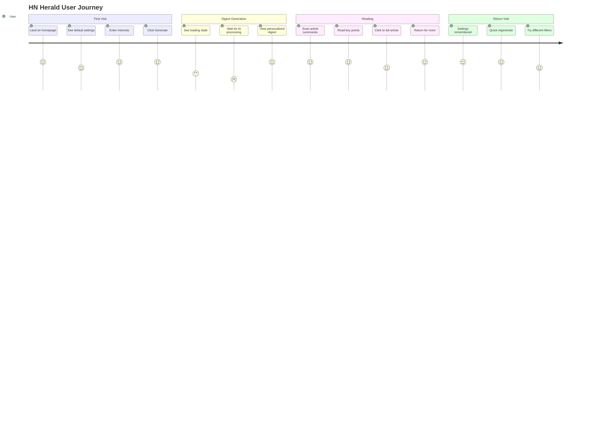

# HN Herald - Product Requirements Document

## Vision

A personalized HackerNews digest that fetches top stories, summarizes articles using AI, scores relevance to your interests, and delivers a curated reading experience—all through a fast, mobile-first web interface.

## Problem Statement

- HackerNews has 500+ stories daily; most readers miss relevant content
- Article summaries require clicking through; wastes time on irrelevant content
- No personalization; everyone sees the same ranking
- Mobile experience is suboptimal

## Target Users

- **Primary**: Developers, tech professionals, startup enthusiasts
- **Secondary**: Researchers, tech journalists, curious learners
- **Behavior**: Check HN 1-3x daily, limited time, specific interests

---

## MVP Features (Phase 1)

### F1: Interest Profile

- Set interests via simple text input (e.g., "AI, Python, startups")
- Set disinterests to filter out (e.g., "crypto, blockchain")
- Configure minimum HN score threshold
- Configure max articles in digest
- **Storage**: Browser localStorage + cookie

### F2: Story Fetching

- Fetch from HN API (top, new, best, ask, show, job)
- Parallel fetching of story metadata
- Filter by minimum score before processing
- Configurable fetch count (10-50 stories)

### F3: Article Extraction

- Extract article content from URLs
- Skip problematic domains (Twitter, Reddit, YouTube, PDFs)
- Handle paywalls gracefully (mark as unavailable)
- Truncate to ~8K chars for LLM processing

### F4: AI Summarization

- 2-3 sentence summaries focused on key insights
- Extract 3 key points per article
- Generate tech tags for categorization
- Batch processing for efficiency

### F5: Relevance Scoring

- Score 0-1 based on user interests match
- Provide relevance reason explanation
- Composite final score: 70% relevance + 30% HN popularity
- Rank by final score

### F6: Digest Display

- Mobile-first responsive design
- Article cards with: title, summary, key points, scores
- Links to original article and HN comments
- Generation timestamp and stats
- Pull-to-refresh pattern

### F7: Generation Controls

- Select story type (top/new/best/ask/show/job)
- Adjust article count
- Real-time generation status
- Error display for failed articles

---

## Roadmap Features

```mermaid
gantt
    title HN Herald Development Roadmap
    dateFormat YYYY-MM
    axisFormat %b

    section MVP
    Core Pipeline           :done, mvp1, 2025-01, 2w
    FastAPI + HTMX UI       :done, mvp2, after mvp1, 1w
    Mobile-First Design     :done, mvp3, after mvp2, 1w

    section Phase 2
    Comment Fetching        :p2a, after mvp3, 1w
    Sentiment Analysis      :p2b, after p2a, 1w
    Discussion Quality      :p2c, after p2b, 1w

    section Phase 3
    Click Tracking          :p3a, after p2c, 1w
    Interest Learning       :p3b, after p3a, 2w
    Embedding System        :p3c, after p3b, 1w

    section Phase 4
    Vector Database         :p4a, after p3c, 1w
    Semantic Search         :p4b, after p4a, 2w

    section Phase 5
    Reddit Integration      :p5a, after p4b, 1w
    Lobsters Integration    :p5b, after p5a, 1w
    Deduplication           :p5c, after p5b, 1w

    section Phase 6
    Email Delivery          :p6a, after p5c, 1w
    RSS Feeds               :p6b, after p6a, 1w
```

### Phase 2: Comment Analysis

- Fetch top comments from HN API
- Analyze discussion sentiment (positive/negative/mixed)
- Score discussion quality (high/medium/low)
- Extract key perspectives from comments
- Display discussion summary in digest

### Phase 3: Learning Preferences

- Track which articles user reads (click tracking)
- Update interest weights based on behavior
- Use embeddings for semantic similarity
- Improve recommendations over time

### Phase 4: Semantic Search

- Embed all generated summaries
- Store in vector database
- Query: "articles about Rust async"
- Search across historical digests

### Phase 5: Multi-Source

- Add Reddit /r/programming
- Add Lobsters
- Add dev.to
- Deduplicate across sources
- Unified relevance scoring

### Phase 6: Advanced Delivery

- Email digest delivery (scheduled)
- RSS feed generation
- Webhook notifications

---

## User Journey



---

## User Stories (MVP)

### US1: Configure Interests

**As a** tech professional
**I want to** set my interests and disinterests
**So that** I get personalized article recommendations

**Acceptance Criteria:**

- Can enter comma-separated interests
- Can enter comma-separated disinterests
- Can set minimum HN score (default: 20)
- Can set max articles (default: 10)
- Settings persist across sessions

### US2: Generate Digest

**As a** busy developer
**I want to** generate a digest of top HN stories
**So that** I can quickly catch up on relevant news

**Acceptance Criteria:**

- One-click digest generation
- Shows loading state during generation
- Displays articles ranked by relevance
- Shows generation stats (fetched, filtered, final)

### US3: Read Summary

**As a** time-constrained reader
**I want to** read AI-generated summaries
**So that** I can decide which articles to read fully

**Acceptance Criteria:**

- 2-3 sentence summary per article
- 3 key points per article
- Relevance score with explanation
- HN score and comment count
- Links to article and HN discussion

### US4: Filter by Type

**As a** user with specific interests
**I want to** filter by story type
**So that** I can focus on Ask HN, Show HN, etc.

**Acceptance Criteria:**

- Dropdown to select story type
- Options: top, new, best, ask, show, job
- Default: top stories

### US5: Mobile Experience

**As a** mobile user
**I want** a touch-friendly interface
**So that** I can use the app on my phone

**Acceptance Criteria:**

- Touch targets minimum 48px
- Readable on small screens
- Fast load times (<3s on 3G)
- No horizontal scrolling

---

## Success Metrics

### Engagement

- Time to first digest: <30 seconds
- Articles read per session: >3
- Return rate: >50% weekly

### Performance

- Page load: <1s (cached), <3s (cold)
- Digest generation: <60s for 10 articles
- Mobile Lighthouse score: >90

### Quality

- Summary accuracy: >90% user satisfaction
- Relevance accuracy: >80% match user interests
- Error rate: <5% articles failed

---

## Non-Functional Requirements

### Performance

- Async operations throughout
- Parallel fetching and processing
- Response streaming for long operations

### Reliability

- Graceful degradation on LLM failures
- Retry logic with exponential backoff
- Clear error messages

### Security

- No sensitive data stored
- API keys server-side only
- Input sanitization

### Accessibility

- WCAG 2.1 AA compliance
- Screen reader friendly
- Keyboard navigation
