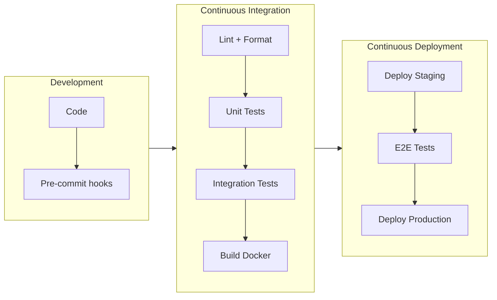
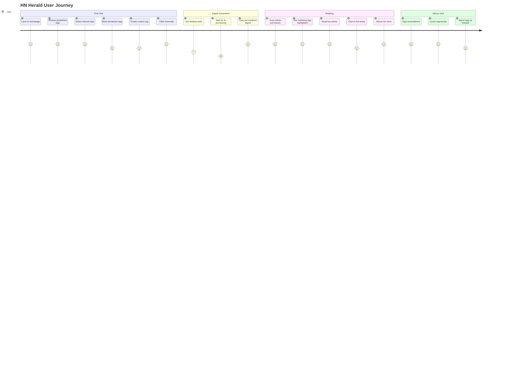

# HN Herald - Product Requirements Document

## Vision

A **privacy-first**, personalized HackerNews digest that fetches top stories, summarizes articles using AI, scores relevance to your interests, and delivers a curated reading experience—all through a fast, mobile-first web interface.

### Privacy-First Principles

- **No Account Required**: Use immediately without signup or login - **Implemented**
- **Local-First Storage**: All preferences stored in browser (localStorage) - **Implemented**
- **No Tracking**: No analytics, no cookies for tracking, no user behavior logging - **Implemented**
- **No Server-Side Storage**: User profiles never leave the browser - **Implemented** (profiles sent to API for processing but not stored)
- **Ephemeral Processing**: Article content processed in real-time, never stored - **Implemented**
- **Transparent Data Flow**: User can see exactly what data is sent to AI - **Partial** (visible in browser console, no UI for this)
- **Export/Delete**: Users can export or delete their local data anytime - **Not implemented** (users can manually clear localStorage)
- **Global Rate Limiting**: Rate limits are global, not per-user, to avoid tracking - **Implemented** (30 req/60s)

## Problem Statement

- HackerNews has 500+ stories daily; most readers miss relevant content
- Article summaries require clicking through; wastes time on irrelevant content
- No personalization; everyone sees the same ranking
- Mobile experience is suboptimal

## Target Users

- **Primary**: Developers, tech professionals, startup enthusiasts
- **Secondary**: Researchers, tech journalists, curious learners
- **Behavior**: Check HN 1-3x daily, limited time, specific interests

---

## MVP Features (Phase 1)

### F1: Tag-Based Interest Profile

- **Predefined Tags**: Curated list of common tech topics for quick selection
- **Custom Tags**: Users can create new tags beyond predefined options
- **Interest Tags**: Select tags for topics you want to see (e.g., `AI`, `Python`, `Startups`)
- **Disinterest Tags**: Select tags for topics to filter out (e.g., `Crypto`, `Blockchain`)
- Configure minimum relevance score threshold (0-1 range, default: 0.3)
- Configure max articles in digest (default: 10)
- Configure fetch count from HN API (10-100, default: 30)
- **Storage**: Browser localStorage only (no cookies)

#### Predefined Tag Categories (Implemented)

| Category | Tags |
|----------|------|
| Development | `python`, `javascript`, `rust`, `go`, `typescript` |
| AI/ML | `ai`, `machine-learning`, `llm`, `deep-learning`, `nlp` |
| Business | `startups`, `investing`, `product`, `engineering-management` |
| Avoid (Disinterests) | `crypto`, `blockchain`, `nft`, `web3` |

> **Note**: The full tag list from the original PRD is aspirational. Current implementation has a smaller curated set. Additional categories (Infrastructure, Data, Culture) are not yet implemented in the UI.

#### Custom Tag Creation

- Users can type new tags not in predefined list
- Minimum 2 characters required for custom tags
- Custom tags persist in user profile via localStorage
- Popular custom tags may be promoted to predefined list (future - not yet implemented)

### F2: Story Fetching

- Fetch from HN API (top, new, best, ask, show)
  - **Note**: Job stories endpoint implemented in backend but not exposed in UI dropdown
- Parallel fetching of story metadata (max 10 concurrent requests)
- Filter by minimum HN score before processing (configurable)
- Configurable fetch count (10-100 stories, default: 30)
- Retry logic with exponential backoff for transient failures
- 30-second timeout per request

### F3: Article Extraction

- Extract article content from URLs using BeautifulSoup
- Skip problematic domains including:
  - Social media: Twitter/X, Reddit, Facebook, Instagram, TikTok
  - Video platforms: YouTube, Vimeo
  - Code hosting: GitHub, GitLab, Bitbucket
  - Paywalled sites: Medium, Bloomberg, WSJ, NYTimes, FT, Economist, WaPo
  - Auth-required: LinkedIn, Google Docs/Drive/Sheets
- Skip binary file types: PDF, DOC, images, videos, archives
- Handle paywalls gracefully (marked as SKIPPED with reason)
- Truncate to 8,000 characters for LLM processing (configurable via `max_content_length`)
- 15-second timeout per article fetch
- Max 10 concurrent article extractions

### F4: AI Summarization

- 2-3 sentence summaries focused on key insights (20-500 characters)
- Extract 1-5 key points per article (configurable, typically 3)
- Generate up to 10 tech/topic tags for categorization
- Batch processing: 5 articles per LLM call (configurable via `summary_batch_size`)
- Model: Claude 3.5 Haiku (`claude-3-5-haiku-20241022`)
- Temperature: 0.0 for consistent output
- Max tokens: 8,192 per batch request
- Retry logic with exponential backoff on rate limits
- **Note**: LLM response caching is defined in config but not yet implemented

### F5: Relevance Scoring

- Relevance score (0-1) based on user interests match:
  - **Disinterest match**: 0.1 (penalized)
  - **Interest match**: 0.5-1.0 (scaled by proportion of matched tags)
  - **No match**: 0.5 (neutral)
  - **No preferences**: 0.5 (neutral)
- Provide relevance reason explanation (e.g., "Matches interests: python, ai")
- Composite final score: 70% relevance + 30% HN popularity
- HN popularity normalized to 0-1 using relative scaling within batch (or capped at 500 points)
- Rank by final score descending
- Filter by minimum score threshold (default: 0.0)

### F6: Digest Display

- HackerNews-inspired minimal design with theme support (HN orange, Ocean, Dark)
- Article cards with: title, summary, key points, tags, relevance score, HN score
- Links to original article and HN discussion
- Pipeline statistics dashboard showing:
  - Processing funnel (stories fetched → extracted → summarized → scored → returned)
  - Performance metrics (total time, avg time per article)
  - Quality metrics (extraction rate, score pass rate, errors)
- Generation timestamp
- **Not yet implemented**: Pull-to-refresh pattern, true mobile-first responsive breakpoints

### F7: Generation Controls

- Select story type (top/new/best/ask/show) - job type backend-only
- Adjust fetch count (10-100) and result limit (1-50)
- Real-time generation status via Server-Sent Events (SSE)
  - Pipeline stages: starting → fetch → extract → filter → summarize → score → rank → format → complete
- Cancel button to abort in-progress generation
- Error display with detailed messages
- HN Fun Facts displayed during loading (rotates every 5 seconds)
- Rate limiting: 30 requests per 60 seconds (global, privacy-first)

---

## Roadmap Features

### XP Development Approach

We follow **Extreme Programming (XP)** principles with continuous integration and deployment:

- **Small Releases**: Each iteration delivers working, deployable software
- **Continuous Integration**: All code merged to main daily with automated tests
- **Test-Driven Development**: Tests written before implementation
- **Simple Design**: Build only what's needed now, refactor as we learn
- **Pair Programming**: Complex features developed collaboratively
- **Collective Ownership**: Any team member can modify any code
- **Sustainable Pace**: Consistent velocity without burnout

### Session Plan

Each session delivers a shippable increment:

| Session | Deliverable | User Value | Status |
|---------|-------------|------------|--------|
| **MVP-1** | HN API client + basic fetch | Can fetch stories | ✅ Complete |
| **MVP-2** | Article extraction | Can read article content | ✅ Complete |
| **MVP-3** | LLM summarization | Get AI summaries | ✅ Complete |
| **MVP-4** | Relevance scoring | Personalized ranking | ✅ Complete |
| **MVP-5** | FastAPI endpoints | API is callable | ✅ Complete |
| **MVP-6** | Jinja2 templates + SSE | Usable web UI | ✅ Complete |
| **MVP-7** | Tag system UI | Can select interests | ✅ Complete |
| **MVP-8** | Mobile polish | Works on phones | ⏳ Partial (basic responsiveness only) |
| **2.1** | Comment fetching | See discussions | ❌ Not started |
| **2.2** | Sentiment analysis | Discussion quality | ❌ Not started |
| **3.1** | Click tracking | Usage analytics | ❌ Not started (conflicts with privacy-first) |
| **3.2** | Interest learning | Smarter recommendations | ❌ Not started |
| **4.1** | Vector storage | Searchable history | ❌ Not started |
| **4.2** | Semantic search | Find past articles | ❌ Not started |
| **5.1** | Reddit source | More content | ❌ Not started |
| **5.2** | Deduplication | No repeats | ❌ Not started |
| **6.1** | Email delivery | Inbox digests | ❌ Not started |
| **6.2** | RSS feeds | Feed readers | ❌ Not started |

> **Note**: Phases 2-6 are roadmap features not yet implemented. Phase 3 (click tracking, interest learning) may conflict with privacy-first design principles and should be reconsidered.

### CI/CD Pipeline

### Definition of Done

Every iteration must pass before merge:

- [ ] All tests passing (unit, integration, E2E)
- [ ] Code reviewed and approved
- [ ] No decrease in test coverage
- [ ] Lighthouse performance score ≥90
- [ ] Documentation updated
- [ ] Docker image builds successfully
- [ ] Deploys to staging without errors
- [ ] Manual QA verification on mobile

### Phase 2: Comment Analysis

- Fetch top comments from HN API
- Analyze discussion sentiment (positive/negative/mixed)
- Score discussion quality (high/medium/low)
- Extract key perspectives from comments
- Display discussion summary in digest

### Phase 3: Learning Preferences

- Track which articles user reads (click tracking)
- Update interest weights based on behavior
- Use embeddings for semantic similarity
- Improve recommendations over time

### Phase 4: Semantic Search

- Embed all generated summaries
- Store in vector database
- Query: "articles about Rust async"
- Search across historical digests

### Phase 5: Multi-Source

- Add Reddit /r/programming
- Add Lobsters
- Add dev.to
- Deduplicate across sources
- Unified relevance scoring

### Phase 6: Advanced Delivery

- Email digest delivery (scheduled)
- RSS feed generation
- Webhook notifications

---

## User Journey

---

## User Stories (MVP)

### US1: Configure Interests with Tags

**As a** tech professional
**I want to** select interest and disinterest tags
**So that** I get personalized article recommendations

**Acceptance Criteria:**

- [x] Can select from predefined tag categories (3 categories implemented)
- [x] Can create custom tags beyond predefined list
- [x] Tags are displayed as clickable links with remove option
- [ ] Can toggle tags between interest/disinterest/neutral - **Partial**: separate sections for interest/disinterest, no neutral toggle
- [x] Can set minimum relevance score (default: 0.3, not HN score)
- [x] Can set max articles (default: 10)
- [x] Settings persist across sessions via localStorage
- [ ] Mobile-friendly tag selection (touch targets ≥48px) - **Not verified**

### US2: Generate Digest

**As a** busy developer
**I want to** generate a digest of top HN stories
**So that** I can quickly catch up on relevant news

**Acceptance Criteria:**

- [x] One-click digest generation
- [x] Shows loading state during generation with pipeline stage updates
- [x] Displays articles ranked by relevance (final_score)
- [x] Shows generation stats (fetched, extracted, summarized, scored, returned, errors, time)

### US3: Read Summary

**As a** time-constrained reader
**I want to** read AI-generated summaries
**So that** I can decide which articles to read fully

**Acceptance Criteria:**

- [x] 2-3 sentence summary per article
- [x] 1-5 key points per article (typically 3)
- [x] Relevance score with explanation
- [x] HN score displayed
- [ ] HN comment count - **Not displayed** (available in data but not shown in UI)
- [x] Links to article and HN discussion

### US4: Filter by Type

**As a** user with specific interests
**I want to** filter by story type
**So that** I can focus on Ask HN, Show HN, etc.

**Acceptance Criteria:**

- [x] Dropdown to select story type
- [ ] Options: top, new, best, ask, show, job - **Partial**: job not in UI dropdown (backend supports it)
- [x] Default: top stories

### US5: Mobile Experience

**As a** mobile user
**I want** a touch-friendly interface
**So that** I can use the app on my phone

**Acceptance Criteria:**

- [ ] Touch targets minimum 48px - **Not verified**
- [ ] Readable on small screens - **Partial**: basic responsiveness, not optimized
- [ ] Fast load times (<3s on 3G) - **Not verified**
- [ ] No horizontal scrolling - **Not verified**

> **Note**: Mobile experience is marked as MVP-8 in roadmap but mobile-specific optimizations have not been fully implemented or tested.

---

## Success Metrics

### Engagement

- Time to first digest: <30 seconds - **Aspirational** (typical: 60-120 seconds for 10 articles)
- Articles read per session: >3 - **Not tracked** (no analytics per privacy-first design)
- Return rate: >50% weekly - **Not tracked** (no analytics per privacy-first design)

### Performance

- Page load: <1s (cached), <3s (cold) - **Not measured**
- Digest generation: <60s for 10 articles - **Realistic**: 60-120 seconds typical (UI shows "1-2 minutes")
- Mobile Lighthouse score: >90 - **Not verified**

### Quality

- Summary accuracy: >90% user satisfaction - **Not measured** (no feedback collection)
- Relevance accuracy: >80% match user interests - **Not measured**
- Error rate: <5% articles failed - **Tracked**: displayed in pipeline statistics

> **Note**: Due to privacy-first design (no analytics, no user tracking), most engagement and quality metrics cannot be measured. Consider these as design goals rather than tracked KPIs.

---

## Non-Functional Requirements

### Performance

- [x] Async operations throughout (asyncio, httpx, LangGraph)
- [x] Parallel fetching and processing (max 10 concurrent)
- [x] Response streaming for long operations (SSE for digest generation)

### Reliability

- [x] Graceful degradation on LLM failures (returns partial results with error status)
- [x] Retry logic with exponential backoff (tenacity library, 3 retries)
- [x] Clear error messages (displayed in UI with error type)
- [x] Request cancellation support (abort controller in frontend)

### Security & Privacy

- [x] No user accounts or authentication
- [x] No server-side user data storage
- [x] API keys server-side only (Anthropic API key in .env)
- [x] Input sanitization (Pydantic validation)
- [x] No third-party analytics or tracking
- [x] All processing ephemeral (stateless)
- [x] CORS configured (permissive in dev, restricted in prod)

### Accessibility

- [ ] WCAG 2.1 AA compliance - **Not verified**
- [ ] Screen reader friendly - **Partial** (semantic HTML, ARIA labels in some components)
- [ ] Keyboard navigation - **Not fully implemented**

> **Note**: Accessibility features are partially implemented but have not been formally audited.
