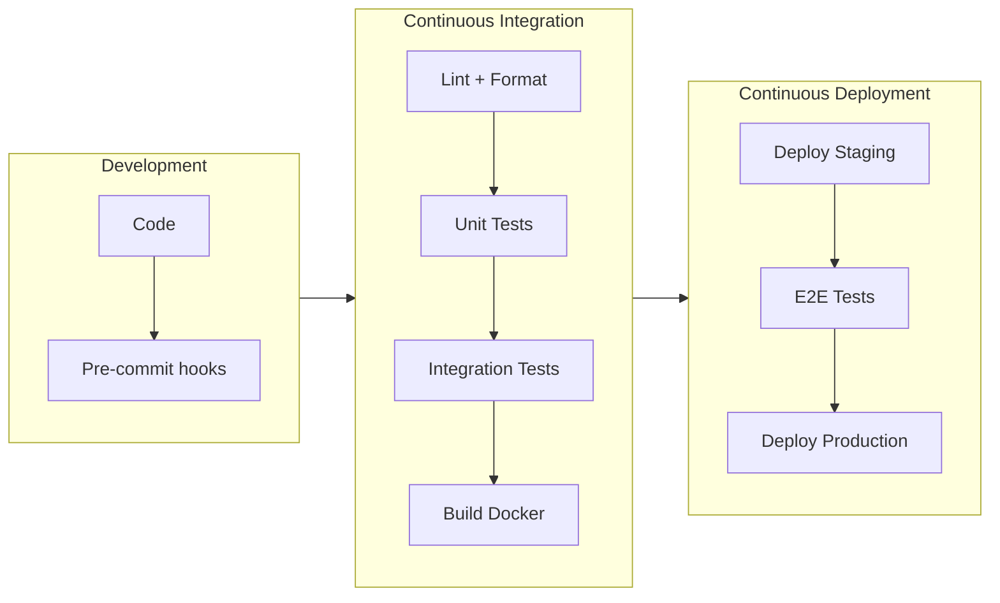
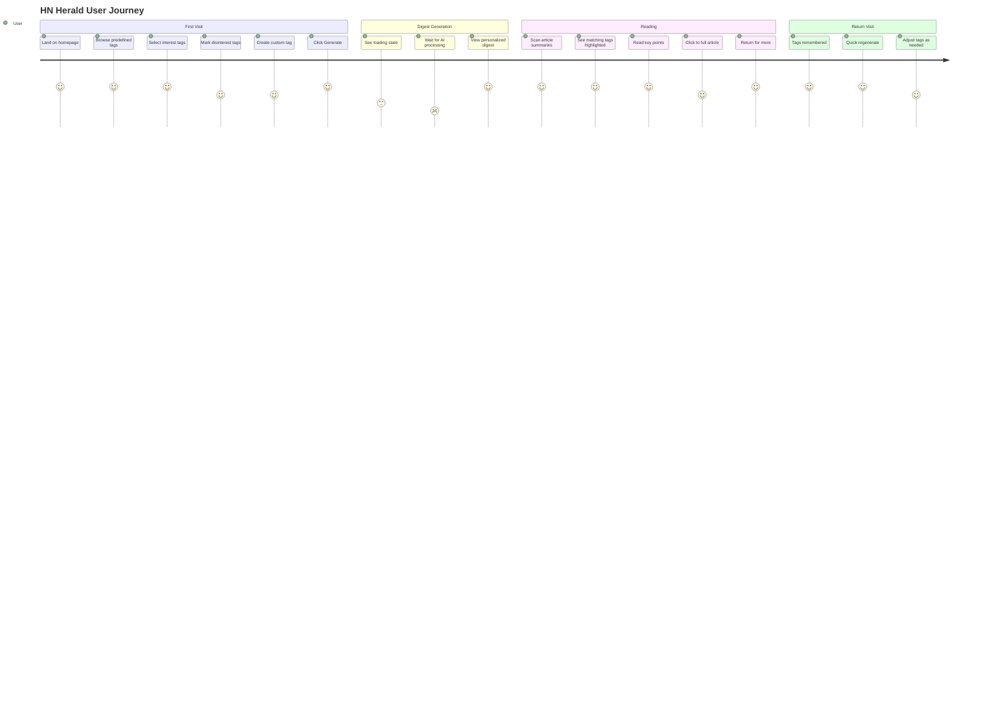

# HN Herald - Product Requirements Document

## Vision

A **privacy-first**, personalized HackerNews digest that fetches top stories, summarizes articles using AI, scores relevance to your interests, and delivers a curated reading experience—all through a fast, mobile-first web interface.

### Privacy-First Principles

- **No Account Required**: Use immediately without signup or login
- **Local-First Storage**: All preferences stored in browser (localStorage)
- **No Tracking**: No analytics, no cookies for tracking, no user behavior logging
- **No Server-Side Storage**: User profiles never leave the browser
- **Ephemeral Processing**: Article content processed in real-time, never stored
- **Transparent Data Flow**: User can see exactly what data is sent to AI
- **Export/Delete**: Users can export or delete their local data anytime

## Problem Statement

- HackerNews has 500+ stories daily; most readers miss relevant content
- Article summaries require clicking through; wastes time on irrelevant content
- No personalization; everyone sees the same ranking
- Mobile experience is suboptimal

## Target Users

- **Primary**: Developers, tech professionals, startup enthusiasts
- **Secondary**: Researchers, tech journalists, curious learners
- **Behavior**: Check HN 1-3x daily, limited time, specific interests

---

## MVP Features (Phase 1)

### F1: Tag-Based Interest Profile

- **Predefined Tags**: Curated list of common tech topics for quick selection
- **Custom Tags**: Users can create new tags beyond predefined options
- **Interest Tags**: Select tags for topics you want to see (e.g., `AI`, `Python`, `Startups`)
- **Disinterest Tags**: Select tags for topics to filter out (e.g., `Crypto`, `Blockchain`)
- Configure minimum HN score threshold
- Configure max articles in digest
- **Storage**: Browser localStorage + cookie

#### Predefined Tag Categories

| Category | Tags |
|----------|------|
| Languages | `Python`, `JavaScript`, `TypeScript`, `Rust`, `Go`, `Java`, `C++`, `Ruby`, `Elixir`, `Zig` |
| AI/ML | `AI`, `Machine Learning`, `LLM`, `GPT`, `Deep Learning`, `Computer Vision`, `NLP` |
| Web | `Frontend`, `Backend`, `React`, `Vue`, `HTMX`, `Node.js`, `Django`, `FastAPI`, `Rails` |
| Infrastructure | `DevOps`, `Kubernetes`, `Docker`, `AWS`, `Cloud`, `Linux`, `Networking`, `Security` |
| Data | `Databases`, `PostgreSQL`, `Redis`, `Data Engineering`, `Analytics`, `SQL` |
| Business | `Startups`, `Fundraising`, `YC`, `Entrepreneurship`, `Product`, `Growth` |
| Culture | `Remote Work`, `Career`, `Hiring`, `Open Source`, `Side Projects`, `Indie Hacker` |
| Avoid | `Crypto`, `Blockchain`, `NFT`, `Web3`, `Politics`, `Drama` |

#### Custom Tag Creation

- Users can type new tags not in predefined list
- Custom tags are validated (alphanumeric, 2-30 chars)
- Custom tags persist in user profile
- Popular custom tags may be promoted to predefined list (future)

### F2: Story Fetching

- Fetch from HN API (top, new, best, ask, show, job)
- Parallel fetching of story metadata
- Filter by minimum score before processing
- Configurable fetch count (10-50 stories)

### F3: Article Extraction

- Extract article content from URLs
- Skip problematic domains (Twitter, Reddit, YouTube, PDFs)
- Handle paywalls gracefully (mark as unavailable)
- Truncate to ~8K chars for LLM processing

### F4: AI Summarization

- 2-3 sentence summaries focused on key insights
- Extract 3 key points per article
- Generate tech tags for categorization
- Batch processing for efficiency

### F5: Relevance Scoring

- Score 0-1 based on user interests match
- Provide relevance reason explanation
- Composite final score: 70% relevance + 30% HN popularity
- Rank by final score

### F6: Digest Display

- Mobile-first responsive design
- Article cards with: title, summary, key points, scores
- Links to original article and HN comments
- Generation timestamp and stats
- Pull-to-refresh pattern

### F7: Generation Controls

- Select story type (top/new/best/ask/show/job)
- Adjust article count
- Real-time generation status
- Error display for failed articles

---

## Roadmap Features

### XP Development Approach

We follow **Extreme Programming (XP)** principles with continuous integration and deployment:

- **Small Releases**: Each iteration delivers working, deployable software
- **Continuous Integration**: All code merged to main daily with automated tests
- **Test-Driven Development**: Tests written before implementation
- **Simple Design**: Build only what's needed now, refactor as we learn
- **Pair Programming**: Complex features developed collaboratively
- **Collective Ownership**: Any team member can modify any code
- **Sustainable Pace**: Consistent velocity without burnout

### Session Plan

Each session delivers a shippable increment:

| Session | Deliverable | User Value | CI/CD Gate |
|---------|-------------|------------|------------|
| **MVP-1** | HN API client + basic fetch | Can fetch stories | ✅ Complete |
| **MVP-2** | Article extraction | Can read article content | ✅ Complete |
| **MVP-3** | LLM summarization | Get AI summaries | 🔄 In Progress |
| **MVP-4** | Relevance scoring | Personalized ranking | ✅ Scoring accuracy |
| **MVP-5** | FastAPI endpoints | API is callable | ✅ API contract tests |
| **MVP-6** | HTMX templates | Usable web UI | ✅ E2E smoke tests |
| **MVP-7** | Tag system UI | Can select interests | ✅ Component tests |
| **MVP-8** | Mobile polish | Works on phones | ✅ Lighthouse >90 |
| **2.1** | Comment fetching | See discussions | ✅ API tests |
| **2.2** | Sentiment analysis | Discussion quality | ✅ Accuracy tests |
| **3.1** | Click tracking | Usage analytics | ✅ Privacy audit |
| **3.2** | Interest learning | Smarter recommendations | ✅ ML validation |
| **4.1** | Vector storage | Searchable history | ✅ Query tests |
| **4.2** | Semantic search | Find past articles | ✅ Relevance tests |
| **5.1** | Reddit source | More content | ✅ Source tests |
| **5.2** | Deduplication | No repeats | ✅ Dedupe accuracy |
| **6.1** | Email delivery | Inbox digests | ✅ Delivery tests |
| **6.2** | RSS feeds | Feed readers | ✅ Feed validation |

### CI/CD Pipeline

### Definition of Done

Every iteration must pass before merge:

- [ ] All tests passing (unit, integration, E2E)
- [ ] Code reviewed and approved
- [ ] No decrease in test coverage
- [ ] Lighthouse performance score ≥90
- [ ] Documentation updated
- [ ] Docker image builds successfully
- [ ] Deploys to staging without errors
- [ ] Manual QA verification on mobile

### Phase 2: Comment Analysis

- Fetch top comments from HN API
- Analyze discussion sentiment (positive/negative/mixed)
- Score discussion quality (high/medium/low)
- Extract key perspectives from comments
- Display discussion summary in digest

### Phase 3: Learning Preferences

- Track which articles user reads (click tracking)
- Update interest weights based on behavior
- Use embeddings for semantic similarity
- Improve recommendations over time

### Phase 4: Semantic Search

- Embed all generated summaries
- Store in vector database
- Query: "articles about Rust async"
- Search across historical digests

### Phase 5: Multi-Source

- Add Reddit /r/programming
- Add Lobsters
- Add dev.to
- Deduplicate across sources
- Unified relevance scoring

### Phase 6: Advanced Delivery

- Email digest delivery (scheduled)
- RSS feed generation
- Webhook notifications

---

## User Journey

---

## User Stories (MVP)

### US1: Configure Interests with Tags

**As a** tech professional
**I want to** select interest and disinterest tags
**So that** I get personalized article recommendations

**Acceptance Criteria:**

- Can select from predefined tag categories
- Can create custom tags beyond predefined list
- Tags are displayed as clickable chips/pills
- Can toggle tags between interest/disinterest/neutral
- Can set minimum HN score (default: 20)
- Can set max articles (default: 10)
- Settings persist across sessions
- Mobile-friendly tag selection (touch targets ≥48px)

### US2: Generate Digest

**As a** busy developer
**I want to** generate a digest of top HN stories
**So that** I can quickly catch up on relevant news

**Acceptance Criteria:**

- One-click digest generation
- Shows loading state during generation
- Displays articles ranked by relevance
- Shows generation stats (fetched, filtered, final)

### US3: Read Summary

**As a** time-constrained reader
**I want to** read AI-generated summaries
**So that** I can decide which articles to read fully

**Acceptance Criteria:**

- 2-3 sentence summary per article
- 3 key points per article
- Relevance score with explanation
- HN score and comment count
- Links to article and HN discussion

### US4: Filter by Type

**As a** user with specific interests
**I want to** filter by story type
**So that** I can focus on Ask HN, Show HN, etc.

**Acceptance Criteria:**

- Dropdown to select story type
- Options: top, new, best, ask, show, job
- Default: top stories

### US5: Mobile Experience

**As a** mobile user
**I want** a touch-friendly interface
**So that** I can use the app on my phone

**Acceptance Criteria:**

- Touch targets minimum 48px
- Readable on small screens
- Fast load times (<3s on 3G)
- No horizontal scrolling

---

## Success Metrics

### Engagement

- Time to first digest: <30 seconds
- Articles read per session: >3
- Return rate: >50% weekly

### Performance

- Page load: <1s (cached), <3s (cold)
- Digest generation: <60s for 10 articles
- Mobile Lighthouse score: >90

### Quality

- Summary accuracy: >90% user satisfaction
- Relevance accuracy: >80% match user interests
- Error rate: <5% articles failed

---

## Non-Functional Requirements

### Performance

- Async operations throughout
- Parallel fetching and processing
- Response streaming for long operations

### Reliability

- Graceful degradation on LLM failures
- Retry logic with exponential backoff
- Clear error messages

### Security & Privacy

- No user accounts or authentication
- No server-side user data storage
- API keys server-side only
- Input sanitization
- No third-party analytics or tracking
- All processing ephemeral (stateless)

### Accessibility

- WCAG 2.1 AA compliance
- Screen reader friendly
- Keyboard navigation
